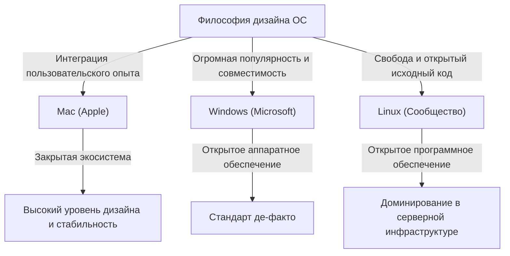

# Введение: Почему ОС стали «религией»

В процессе эволюции компьютеров от гигантских машин для немногих специалистов до персональных устройств, помещающихся в наших карманах, всегда присутствовала «операционная система (ОС)». Связывая аппаратное и программное обеспечение и определяя основы пользовательского опыта, ОС вышла за рамки простого инструмента и превратилась в нечто, символизирующее идентичность людей и технологическую философию.

Этот феномен в конечном итоге стал известен как «религиозные войны ОС» (OS Holy Wars). Подавляющая популярность и прагматизм Windows, утонченный дизайн и ориентированная на пользователя философия Mac, а также идеалы свободы и открытого исходного кода Linux. Это выходит за рамки простого превосходства в функциях и ставит фундаментальный вопрос о том, «как мы должны относиться к технологиям».

В этой статье мы раскроем историю этой бесконечной борьбы и глубоко погрузимся в то, как родилась, развивалась и влияла друг на друга каждая ОС.

## Глава 1: Начало трехсторонней борьбы и их философии

История ОС началась в конце 1970-х и 1980-х годах, когда компьютеры превратились в персональные устройства. Каждая ОС родилась с совершенно разными предпосылками и философией.

### 1.1 Mac: На пересечении технологий и искусства
В 1984 году Apple представила первый Macintosh. Философия Стива Джобса заключалась в том, чтобы «отдать компьютеры в руки каждого». В то время компьютеры со сложными интерфейсами командной строки были нормой, но Mac популяризировал графический пользовательский интерфейс (GUI) и мышь среди широкой публики.

В основе Apple лежат «контроль» и «идеальная интеграция пользовательского опыта». Проектируя аппаратное и программное обеспечение внутри компании, они предоставляют пользователям бесшовный и интуитивно понятный опыт. Хотя это иногда критикуют как «закрытость», это также создает непревзойденную красоту и стабильность.

### 1.2 Windows: ПК на каждом столе
В то время как Apple продемонстрировала потенциал GUI, Билл Гейтс из Microsoft применил другой подход. Следуя видению «компьютер на каждом столе и в каждом доме», Microsoft решила лицензировать свою ОС производителям оборудования.

Философия Windows — «совместимость» и «распространение». Они создали экосистему, которая работает на любом оборудовании и позволяет разработчикам свободно создавать приложения. В результате Windows завоевала подавляющую долю рынка и стала де-факто мировым стандартом, от бизнеса до дома.

### 1.3 Linux: Кристаллизация свободы и хакерской культуры
Созданный в 1991 году Линусом Торвальдсом, финским студентом, Linux возник в совершенно ином контексте. Будучи потомком Unix, Linux воплощает философию «открытого исходного кода», где исходный код открыт для всех и может свободно изменяться и распространяться.

Философия Linux — «свобода» и «совместное создание сообществом». Вместо того чтобы управляться одной компанией, тысячи разработчиков по всему миру сотрудничают для создания системы. Изначально этот подход считался подходящим только для хакеров и гиков, но со временем он охватил весь мир как основа серверной инфраструктуры, поддерживающей интернет, суперкомпьютеров и платформы Android.

## Глава 2: История столкновений (1990-е – 2000-е годы)

В период с 1990-х по 2000-е годы борьба за долю на рынке ОС была крайне ожесточенной. События этого периода стали важными поворотными моментами, определившими расстановку сил в современной технологической индустрии.

### 2.1 Влияние и подавляющее доминирование Windows 95
Выпущенная в 1995 году Windows 95 стала социальным феноменом. Здесь были заложены основы современных ПК: полноценный GUI, возможность подключения к интернету (позже Internet Explorer) и функция Plug and Play. Благодаря успеху Windows 95 Microsoft установила абсолютную монополию на рынке ПК.

Столкнувшись с этим подавляющим доминированием, Apple на время оказалась в глубоком финансовом кризисе. Однако с возвращением Стива Джобса в 1997 году и последующим успехом «iMac» Apple возродилась в своей уникальной нише, ориентированной на дизайн и образ жизни.

### 2.2 Война браузеров и подъем Web
Главное поле битвы в войнах ОС в конечном итоге переместилось в интернет-пространство. Первая война браузеров между Netscape и Internet Explorer переопределила ценность ОС как платформы. Microsoft получила преимущество, интегрировав IE в Windows, но это также привело к антимонопольным судебным искам.

### 2.3 Тихая революция на рынке серверов
Пока Windows и Mac боролись на рынке десктопов, Linux неуклонно набирал силу в мире бэкендов (серверов), поддерживающих интернет. В сочетании с программами с открытым исходным кодом, такими как Apache HTTP Server (стек LAMP), он служил дешевой и надежной инфраструктурой для стартапов во время бума доткомов.

## Глава 3: Конфликт идеологий (Закрытость против Открытости)

Суть религиозных войн ОС заключается не просто в сравнении спецификаций или функций, а в конфликте идеологий о том, какими должны быть технологии.

### 3.1 Свет и тень ориентированности на пользователя (Mac)
Подход Mac (и iOS) заключается в строгом управлении системой, чтобы гарантировать наилучшие результаты для пользователей. Красивый интерфейс, последовательность действий и высокая безопасность достигаются за счет «закрытой экосистемы» (огороженный сад) Apple. Однако это также лишает пользователей глубокого уровня настройки и свободы.

### 3.2 Дилемма чемпиона платформ (Windows)
Windows долгое время уделяла приоритетное внимание обратной совместимости. Тот факт, что программное обеспечение 20-летней давности все еще может работать на новейшей ОС, является абсолютным преимуществом для бизнеса. Однако накопление этого огромного устаревшего кода привело к раздуванию системы, уязвимостям безопасности и потере согласованности пользовательского интерфейса.

### 3.3 Идеалы и реальность открытого исходного кода (Linux)
Программное обеспечение с открытым исходным кодом, включая Linux, основано на хакерской этике, гласящей, что «информация должна быть свободной». Любой может проверить код, изменить его и создать свой собственный дистрибутив. Существует множество вариантов, таких как Ubuntu, Fedora и Arch Linux. Однако это «разнообразие» также вызвало «фрагментацию», повысив барьер входа для обычных пользователей.

## Глава 4: Конец войны и новая парадигма (С 2010-х годов)

Долгое время длившаяся религиозная война ОС сильно изменилась в 2010-х годах. С мобильной революцией и подъемом облачных технологий сам вопрос «какую настольную ОС вы используете» потерял свой смысл.

### 4.1 Переход к мобильным устройствам и новая биполярная система
С появлением iPhone (iOS) и Android центр вычислений для людей сместился с ПК на смартфоны. По иронии судьбы, в мобильном мире повторилась та же историческая картина: закрытый подход Apple (iOS) и открытый подход Google (Android на базе Linux).

### 4.2 Повсеместное распространение облачных и веб-приложений
Благодаря улучшению производительности браузеров и развитию облачных вычислений многие задачи теперь могут выполняться в веб-браузере независимо от ОС. Microsoft Office был заменен Google Workspace, а современные инструменты, такие как Slack и Figma, работают одинаково в любой ОС. Мы живем в эпоху, когда даже говорят, что «ОС — это просто загрузчик для запуска браузера».

### 4.3 Трансформация Microsoft: «Microsoft ❤️ Linux»
Самым большим событием, символизирующим конец войн ОС, стала трансформация Microsoft. Компания, чей бывший генеральный директор Стив Балмер однажды назвал Linux «раком», в значительной степени приняла открытый исходный код под руководством Сатьи Наделлы. Windows Subsystem for Linux (WSL) позволяет среде Linux работать непосредственно в Windows, и большинство ОС, работающих в облаке Azure, теперь — Linux. Microsoft сейчас является одним из крупнейших в мире контрибьюторов в открытый исходный код.

## Глава 5: Роль ОС в будущем вычислений

В современном мире Windows, Mac и Linux больше не являются осями «религиозного» конфликта, а стали инструментами «для нужного человека и нужного места», которые можно выбирать в зависимости от целей и предпочтений.

- **Windows**: Непревзойденная игровая среда, совместимость с оборудованием VR/AR и универсальность, которая продолжает поддерживать корпоративные бэкофисы. С внедрением WSL она также стала привлекательной платформой для разработчиков.
- **Mac (macOS)**: С появлением Apple Silicon (чипы M1/M2/M3) интеграция аппаратного и программного обеспечения достигла совершенно нового уровня. Сочетая невероятную энергоэффективность и производительность, она завоевала огромную поддержку создателей контента и инженеров.
- **Linux**: Доминирует в мире за кулисами. В основе облачной инфраструктуры, суперкомпьютеров, устройств IoT и смартфонов он продолжает поддерживать цифровую основу современного общества.

### Заключение: Разнообразие — это движущая сила эволюции
«Религиозные войны ОС» часто порождали бесплодные споры. Однако именно потому, что системы с разными философиями конкурировали друг с другом и впитывали лучшее друг от друга, технологии смогли развиваться так стремительно.

Красивые шрифты и GUI Mac повлияли на Windows, совместимость и огромная экосистема Windows научили Apple важности стратегии платформы, а модель с открытым исходным кодом Linux стала основой разработки программного обеспечения для всех современных ИТ-гигантов.

Независимо от того, какую ОС мы выбираем, за ней стоит страсть и философия бесчисленных инженеров. Знание истории ОС — это не что иное, как понимание самой эволюции человеческого мышления по отношению к технологиям.
