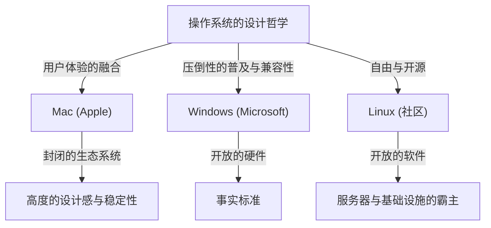
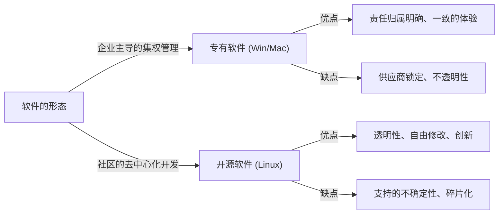

# 前言：为什么操作系统会变成一种“宗教”

在计算机从少数专家的庞大机器演变为装进我们口袋的个人设备的整个过程中，始终离不开“操作系统（OS）”的存在。连接硬件与软件、定义用户体验根基的操作系统，已经超越了单纯的工具，升华为象征人们身份认同与技术哲学的事物。

这种现象不知不觉中被称为“操作系统宗教战争（OS Holy Wars）”。Windows的压倒性普及与实用主义，Mac的精致设计与以用户为中心的设计哲学，以及Linux的自由与开源理念。这些早已超越了单纯功能的优劣，向我们抛出了一个根本性的问题：“我们究竟该如何面对技术”。

本文将揭开这场无休止斗争的历史，深入探讨各个操作系统是如何诞生、演变，并互相影响的。

## 第1章：三足鼎立的开端与各自的哲学

操作系统的历史，拉开于计算机向个人化转变的1970年代末至1980年代。每个操作系统都带着完全不同的背景与哲学诞生。

### 1.1 Mac：技术与艺术的交汇点
1984年，Apple发布了初代Macintosh。史蒂夫·乔布斯提出的哲学是“让所有人都能掌握计算机”。在当时的计算机还普遍使用难以理解的命令行操作时，Mac将图形用户界面（GUI）和鼠标推向了大众。

Apple的根基在于“控制”与“用户体验的完美融合”。通过在内部统一设计硬件和软件，为用户提供无缝且直观的体验。这有时会被批评为“封闭（Closed）”，但同时也创造了其他系统难以企及的美感与稳定性。

### 1.2 Windows：让每张办公桌上都有一台PC
在Apple展示GUI潜力的同时，Microsoft的比尔·盖茨采取了不同的方式。在“让每张办公桌和每个家庭都拥有一台计算机”的愿景下，Microsoft选择了将自家操作系统授权给硬件制造商的道路。

Windows的哲学是“兼容性”与“普及”。建立了一个无论在什么硬件上都能运行、所有软件开发者都能自由开发应用程序的生态系统。由此，Windows获得了压倒性的市场份额，从商业到家庭，成为了世界的事实标准。

### 1.3 Linux：自由与黑客文化的结晶
1991年，由芬兰学生林纳斯·托瓦兹（Linus Torvalds）创造的Linux，诞生于完全不同的背景中。继承Unix血统的Linux，体现了源代码向所有人公开、可以自由修改和重新分发的“开源”理念。

Linux的哲学是“自由”与“社区共创”。不是由一家企业控制，而是由全世界成千上万的开发者合作打造系统。这种方法初期被认为是面向黑客和极客的，但最终成为了支撑互联网的服务器基础设施、超级计算机以及Android的基础，覆盖了整个世界。

## 第2章：冲突的历史（1990年代〜2000年代）

在1990年代到2000年代，操作系统的市场份额争夺极其激烈。这一时期的事件，成为了决定现代科技行业势力图表的重要转折点。

### 2.1 Windows 95的冲击与压倒性统治
1995年发售的Windows 95引发了社会现象。真正的GUI、互联网连接功能（后来的Internet Explorer）以及即插即用等现代PC的基础在这里得以完成。凭借Windows 95的成功，Microsoft在PC市场建立起了绝对的垄断地位。

面对这种压倒性的统治，Apple一度陷入严重的经营危机。然而，随着1997年史蒂夫·乔布斯的回归，以及随后“iMac”的成功，Apple在重视设计与生活方式的独特细分市场中实现了复苏。

### 2.2 浏览器大战与Web的崛起
操作系统战争的主战场，不久便转移到了互联网空间。Netscape与Internet Explorer之间的第一次浏览器大战，重新定义了操作系统作为平台的价值。Microsoft通过在Windows中捆绑IE占据了优势，但这也引发了违反反垄断法的诉讼。

### 2.3 服务器市场中无声的革命
在桌面市场Windows和Mac争斗的背后，支撑互联网的后端（服务器）世界中，Linux正在稳步扩大势力。与Apache HTTP Server等开源软件的组合（LAMP架构），作为廉价且可靠的基础设施，支撑了互联网泡沫时期的初创企业。

## 第3章：思想的对立（封闭 vs 开放）

操作系统宗教战争的核心，不仅仅是规格和功能的比较，而在于“技术应有形态”的思想对立。

### 3.1 以用户为中心（Mac）的光与影
Mac（及iOS）的做法是，为了确保用户获得最佳结果，对系统进行严格管理。美观的界面、一致的操作感、高度的安全性，都是通过Apple将生态系统“围起来（围墙花园）”来实现的。然而，这也意味着剥夺了用户在深层次上的可定制性和自由。

### 3.2 平台霸主（Windows）的困境
多年来，Windows一直重视向后兼容性。20年前的软件在最新的操作系统上也能运行，这在商业用途中是绝对的优势。然而，这种庞大遗留代码的积累，导致了系统的臃肿和安全漏洞，也成为破坏UI一致性的原因。

### 3.3 开源（Linux）的理想与现实
以Linux为首的开源软件，基于“信息应该是自由的”这一黑客伦理。任何人都可以审查代码、进行修改，并制作自己的发行版。存在着Ubuntu、Fedora、Arch Linux等多种选择。然而，这种“多样性”同时也引发了“碎片化（Fragmentation）”，提高了普通用户的门槛。

## 第4章：战争的终结与新范式（2010年代及以后）

长期持续的操作系统宗教战争，进入2010年代后其面貌发生了巨大变化。随着移动革命和云计算的崛起，“你正在使用哪个桌面操作系统”这个问题的意义本身已变得淡薄。

### 4.1 向移动端转移与新两极体制
随着iPhone（iOS）和Android的出现，人们计算的中心从PC转移到了智能手机。奇妙的是，在移动世界中，Apple的封闭式方法（iOS）与Google主导的开放式方法（基于Linux的Android），再次形成了重复过去历史的格局。

### 4.2 云计算与Web应用程序的普及
随着浏览器性能的提升和云计算的发展，许多工作已经可以不依赖于操作系统，直接在Web浏览器上完成。Microsoft Office也被Google Workspace所替代，Slack、Figma等现代工具在任何操作系统上都能同样运行。时代已经变成了甚至可以说“操作系统只不过是用来运行浏览器的引导程序”的程度。

### 4.3 Microsoft的变革：“Microsoft ❤️ Linux”
象征操作系统战争终结的最大事件，莫过于Microsoft的蜕变。曾经说出“Linux是癌症”的Microsoft CEO史蒂夫·鲍尔默，在萨提亚·纳德拉的体制下，Microsoft大力拥抱了开源。通过Windows Subsystem for Linux (WSL)，Linux环境可以直接在Windows上运行，并且在Azure云上运行的操作系统中，超过半数是Linux。Microsoft如今已是全球最大的开源贡献者之一。

## 第5章：未来计算中操作系统的角色

在现代，Windows、Mac、Linux不再是“宗教性”的对立轴，而是根据目的和喜好来选择的“适材适用”的工具。

- **Windows**: 压倒性的游戏环境、与VR/AR硬件的亲和力，以及持续支撑企业后台的通用性。通过引入WSL，对于开发者来说也演变成了具有吸引力的平台。
- **Mac (macOS)**: 随着Apple Silicon（M1/M2/M3芯片）的登场，硬件和软件的融合达到了异次元的水平。实现了惊人的能效与性能兼顾，获得了创作者和工程师的极大支持。
- **Linux**: 在看不见的地方统治着世界。在云基础设施、超级计算机、IoT设备以及智能手机的底层，持续支撑着现代社会的数字基石。

### 总结：多样性才是进化的原动力
“操作系统宗教战争”经常引发毫无结果的争论。然而，正因为拥有不同哲学的系统相互竞争，并吸收彼此的优点，技术才能如此快速地发展。

Mac优美的字体和GUI影响了Windows，Windows的兼容性和庞大生态系统教会了Apple平台战略的重要性，而Linux的开源模式则成为了现今所有大型IT企业软件开发的基础。

无论我们选择哪种操作系统，其背后都息息相通着无数工程师们的热情与哲学。了解操作系统的历史，本身就是了解人类对技术思考的进化过程。
