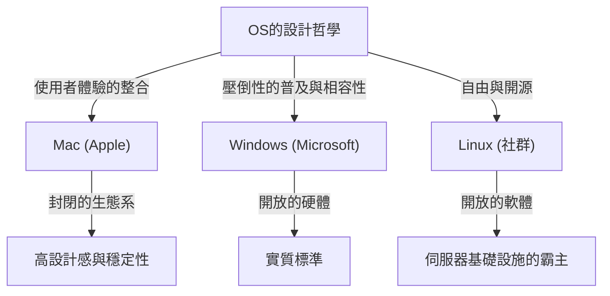
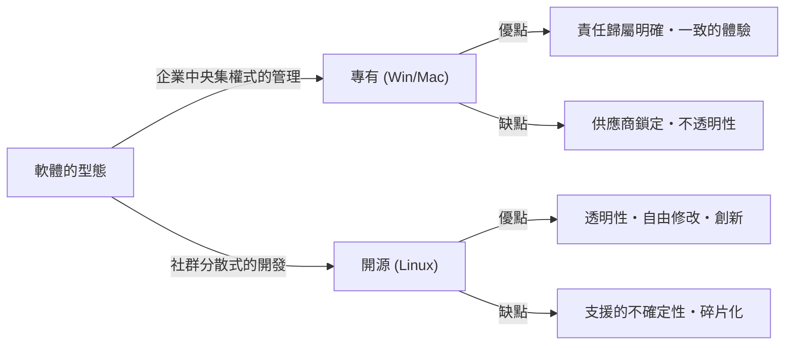

# 前言：為什麼OS會變成「宗教」？

在電腦從少數專家的龐大機器，演變成能放進我們口袋的個人裝置的過程中，「作業系統（OS）」始終存在。作為連接硬體與軟體、定義使用者體驗核心的OS，超越了單純的工具，昇華為人們認同感與技術哲學的象徵。

這個現象不知不覺被稱為「OS宗教戰爭（OS Holy Wars）」。Windows的壓倒性普及與實用主義、Mac洗鍊的設計與以使用者為中心的設計哲學，以及Linux自由與開源的理念。這些不單純只是功能的優劣，更向我們拋出了一個根本的問題：「我們該如何面對科技？」。

本文將解開這場無盡鬥爭的歷史，徹底深入探討各個OS是如何誕生、進化，並如何相互影響。

## 第1章：三足鼎立的開端與各自的哲學

OS的歷史在1970年代後半到1980年代，電腦逐漸蛻變為個人用品的時期揭開了序幕。每一個OS都帶著完全不同的背景與哲學誕生。

### 1.1 Mac：技術與藝術的交會點
1984年，Apple發表了第一代Macintosh。史蒂夫·賈伯斯（Steve Jobs）提出的哲學是：「將電腦交到所有人的手中」。當時的電腦理所當然是透過命令列進行艱澀的操作，而Mac則將圖形使用者介面（GUI）與滑鼠普及到了大眾之中。

Apple的根本在於「控制」與「使用者體驗的完美整合」。透過自社一貫地設計硬體與軟體，提供使用者無縫且直覺的體驗。這有時會被批評為「封閉（Closed）」，但同時也創造了無人能及的美感與穩定性。

### 1.2 Windows：讓每張書桌上都有台PC
在Apple展示了GUI的可能性的同時，Microsoft的比爾·蓋茲（Bill Gates）採取了不同的途徑。在「讓每一張書桌、每一個家庭都有電腦」的願景下，Microsoft選擇了將自家的OS授權給硬體製造商的道路。

Windows的哲學是「相容性」與「普及」。他們建立了一個無論什麼硬體都能運作，且所有軟體開發者都能自由開發應用程式的生態系。這讓Windows獲得了壓倒性的市占率，從商業到家庭，成為了世界的實質標準（De facto standard）。

### 1.3 Linux：自由與駭客文化的結晶
1991年，由芬蘭學生林納斯·托瓦茲（Linus Torvalds）所創造的Linux，誕生於完全不同的脈絡。承襲Unix體系的Linux，體現了原始碼向所有人公開、可自由修改與重新發布的「開源」理念。

Linux的哲學是「自由」與「社群共創」。它不是由單一企業所控制，而是由全世界數千名開發者合作打造出系統。這種方法在初期被認為是駭客與極客（Geek）專屬，但最終它作為支撐網際網路的伺服器基礎設施、超級電腦，以及Android的基礎，覆蓋了整個世界。

## 第2章：衝突的歷史（1990年代〜2000年代）

從1990年代到2000年代，OS的市占率之爭達到了白熱化。這個時期的事件成為了決定現代科技業界勢力版圖的重要轉捩點。

### 2.1 Windows 95的衝擊與壓倒性的統治
1995年發售的Windows 95引發了社會現象。真正的GUI、連接網際網路的功能（後來的Internet Explorer），以及隨插即用（Plug and Play）等，現代PC的基礎在此確立。隨著Windows 95的成功，Microsoft在PC市場築起了絕對的壟斷地位。

面對這種壓倒性的統治，Apple一度陷入了嚴重的經營危機。然而，隨著1997年[史蒂夫·賈伯斯](/zh-tw/p/biography-steve-jobs/)的回歸，以及隨後「iMac」的成功，Apple在重視設計與生活風格的獨特利基市場中成功復甦。

### 2.2 瀏覽器大戰與Web的崛起
OS戰爭的主戰場，不久便轉移到了網際網路空間。Netscape與Internet Explorer之間的第一次瀏覽器大戰，重新定義了OS作為平台的價值。Microsoft透過在Windows中綑綁IE而取得優勢，但這也引發了違反反壟斷法的訴訟。

### 2.3 伺服器市場中寧靜的革命
在桌面市場Windows與Mac爭奪不休的背後，支撐網際網路的後端（伺服器）世界裡，Linux正穩步擴張勢力。它與Apache HTTP Server等開源軟體的組合（LAMP堆疊），作為廉價且高可靠性的基礎設施，支撐了網路泡沫時期的許多新創企業。

## 第3章：思想的對立（封閉 vs 開放）

OS宗教戰爭的核心，不是單純規格或功能的比較，而是科技應該是什麼樣子的思想對立。

### 3.1 以使用者為中心（Mac）的光與影
Mac（以及iOS）的方法是為了保證給使用者帶來最好的結果，而嚴格地管理系統。美麗的介面、一致的操作感、高安全性，是透過Apple將生態系「圈起（Walled Garden）」來實現的。然而，這同時也剝奪了使用者深層次的客製化與自由。

### 3.2 平台霸主（Windows）的困境
Windows長年以來一直重視向後相容性。20年前的軟體在最新的OS上也能運作，這這在商業用途上是絕對的優勢。但這龐大遺留程式碼（Legacy code）的積累，導致了系統的臃腫與安全漏洞，同時也成為破壞UI一致性的原因。

### 3.3 開源（Linux）的理想與現實
以Linux為首的開源軟體，基於「資訊應該是自由的」駭客倫理。任何人都可以審查、修改程式碼，並建立自己的發行版（Distribution）。存在著Ubuntu、Fedora、Arch Linux等多樣的選擇。然而，這種「多樣性」同時也引發了「碎片化（Fragmentation）」，拉高了一般使用者入門的門檻。

## 第4章：戰爭的終結與新典範（2010年代以降）

長久持續的OS宗教戰爭，進入2010年代後其樣貌發生了巨大的變化。隨著[行動革命](/zh-tw/p/history-of-iphone/)與雲端的崛起，「使用哪個桌面OS」這個問題本身的意義變淡了。

### 4.1 轉向行動裝置與新的兩極體制
隨著iPhone（iOS）與Android的登場，人們運算的核心從PC轉移到了智慧型手機。巧合的是，在行動世界裡也出現了Apple封閉的做法（iOS）與Google主導的開放做法（基於Linux的Android），這種彷彿歷史重演的格局。

### 4.2 雲端與Web應用程式的普及
隨著瀏覽器效能的提升與雲端運算的發展，許多工作已經不需要依賴OS，而是可以在Web瀏覽器上完成。Microsoft Office也被Google Workspace所替代，Slack、Figma等現代工具在任何OS上都能以相同方式運作。現在已經進入了一個甚至會說「OS不過是用來執行瀏覽器的開機程式」的時代。

### 4.3 Microsoft的變革：「Microsoft ❤️ Linux」
象徵OS戰爭終結的最大事件，或許就是Microsoft的轉變。過去執行長史蒂夫·巴爾默（Steve Ballmer）曾說過「Linux是癌症」，但Microsoft在薩蒂亞·納德拉（Satya Nadella）的體制下大幅度地擁抱了開源。藉由Windows Subsystem for Linux (WSL)，在Windows上可以直接執行Linux環境，且在Azure雲端上運作的OS過半數是Linux。Microsoft現在已是世界最大的開源貢獻者之一。

## 第5章：未來運算中OS的角色

在現代，Windows、Mac、Linux已不再是「宗教性」的對立軸，而是根據目的或喜好來選擇「適材適所」的工具。

- **Windows**：壓倒性的遊戲環境、與VR/AR硬體的親和性，以及持續支撐企業後勤辦公室的通用性。隨著WSL的導入，對開發者來說也進化成了極具吸引力的平台。
- **Mac (macOS)**：隨著Apple Silicon（M1/M2/M3晶片）的登場，硬體與軟體的整合達到了不同次元的境界。兼顧了驚人的電力效率與效能，獲得了創作者與工程師的極大支持。
- **Linux**：在看不見的地方統治著世界。在雲端基礎設施、超級電腦、IoT裝置以及智慧型手機的底層，持續支撐著現代社會的數位基礎。

### 總結：多樣性才是進化的原動力
「OS宗教戰爭」時常引發無意義的爭吵。但正是因為擁有不同哲學的系統互相競爭，吸收彼此的優點，科技才能如此快速地發展。

Mac美麗的字體與GUI影響了Windows，Windows的相容性與龐大生態系教會了Apple平台策略的重要性，而Linux的開源模式成為了現在所有大型IT企業軟體開發的基礎。

無論我們選擇哪一個OS，其背後都蘊含著無數工程師的熱情與哲學。了解OS的歷史，就等同於了解人類對於科技思考的進化本身。
