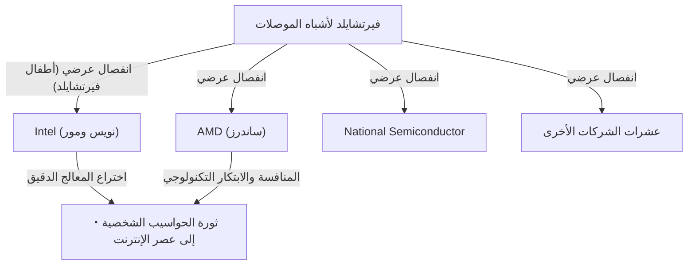

## 1. مقدمة: "الخيانة" التي غيرت العالم

في عالمنا المعاصر، تعتبر "أشباه الموصلات" الأساس الذي يرتكز عليه كل شيء من التكنولوجيا مثل الهواتف الذكية وأجهزة الكمبيوتر والإنترنت والذكاء الاصطناعي. ومركز صناعة أشباه الموصلات هذه، والملاذ الابتكاري الذي يطمح إليه رواد الأعمال في جميع أنحاء العالم، هو "وادي السيليكون (Silicon Valley)" الواقع في شمال ولاية كاليفورنيا.

هذا المكان الذي يغص بشركات التكنولوجيا العملاقة مثل جوجل (Google)، وآبل (Apple)، وميتا (Meta) (فيسبوك سابقًا)، ونتفليكس (Netflix)، لم يكن شكله هكذا منذ البداية. في الماضي، كان مجرد منطقة زراعية هادئة تنتشر فيها بساتين الفاكهة تُعرف باسم "وادي سانتا كلارا". فكيف تحول إلى أعظم مركز تكنولوجي في العالم؟

يمكن القول إن البداية لكل ذلك كانت حادثة "خيانة" واحدة وقعت في عام 1957. ثمانية مهندسين شباب موهوبين تجمعوا حول عالم عبقري واحد، تركوه وأسسوا شركتهم الخاصة. وفي وقت لاحق، سيُعرفون باسم **"الخونة الثمانية (Traitorous Eight)"**.

في هذا المقال، سنتعمق في الدراما التاريخية الملحمية لكيفية التقاء هؤلاء الثمانية، ولماذا اتخذوا قرار الخيانة، وكيف وضعوا أسس وادي السيليكون الحديث.

## 2. الخلفية التاريخية: اختراع الترانزستور و"العبقري" ويليام شوكلي

تعود نقطة البداية للقصة إلى شتاء عام 1947. في مختبرات بيل بولاية نيوجيرسي الأمريكية، قام ثلاثة علماء هم ويليام شوكلي، وجون باردين، ووالتر براتين باختراع "الترانزستور"، وهو مكون إلكتروني ثوري حل محل الأنابيب المفرغة. فتح هذا الاكتشاف الطريق لتقليص حجم أجهزة الكمبيوتر الضخمة وتسريعها، وحصل الثلاثة على جائزة نوبل في الفيزياء عام 1956.

ومع ذلك، لم يكن ويليام شوكلي، أحد المخترعين المشاركين للترانزستور، راضيًا عن هذا الإنجاز. كان يحلم بتسويق الترانزستور بنفسه وبناء ثروة هائلة. كما أنه كان شخصًا يسعى بشدة لفت الانتباه، ولم يشك أبدًا في كونه عبقريًا فريدًا من نوعه.

غادر شوكلي مختبرات بيل، وفي عام 1956، أسس "مختبر شوكلي لأشباه الموصلات (Shockley Semiconductor Laboratory)" في مسقط رأسه بالو ألتو بكاليفورنيا (بالقرب من جامعة ستانفورد). في ذلك الوقت، كان مركز صناعة أشباه الموصلات حول بوسطن على الساحل الشرقي للولايات المتحدة، لكن السبب الذي جعل شوكلي يختار بالو ألتو كان ليكون بالقرب من والدته المريضة. كان هذا الاختيار الشخصي للموقع هو المصادفة الأولى التي أدت لاحقًا إلى إنشاء التجمع الصناعي الضخم المعروف باسم وادي السيليكون.

## 3. تجمع العباقرة الشباب

استغل شوكلي شهرته الهائلة وجاذبيته كحائز على جائزة نوبل (تم إعلان الجائزة بعد وقت قصير من التأسيس) لتوظيف علماء ومهندسين شباب يتمتعون بأعلى مستوى من المواهب من جميع أنحاء الولايات المتحدة. من جمعهم كانوا شبابًا في أواخر العشرينيات وأوائل الثلاثينيات من العمر، ورغم أنهم كانوا غير معروفين بعد، إلا أنهم كانوا يمتلكون ذكاءً وإمكانات هائلة.

من بينهم كان الثمانية التالية أسماؤهم، والذين سيُعرفون لاحقًا باسم "الخونة الثمانية":

1. **روبرت نويس (Robert Noyce)**: فيزيائي ذو قيادة كاريزمية. أسس لاحقًا شركة إنتل (Intel) ولُقب بـ "عمدة وادي السيليكون".
2. **جوردون مور (Gordon Moore)**: كيميائي صامت ومفكر. صاحب "قانون مور" الشهير، وأسس شركة إنتل مع نويس.
3. **جان هورني (Jean Hoerni)**: فيزيائي نظري من أصل سويسري. اخترع لاحقًا "التقنية المستوية (Planar process)" الضرورية لتصنيع الدوائر المتكاملة (IC).
4. **يوجين كلاينر (Eugene Kleiner)**: مهندس ميكانيكي من أصل نمساوي. أسس لاحقًا شركة رأس المال الاستثماري الرائدة في وادي السيليكون "كلاينر بيركنز".
5. **جوليوس بلانك (Julius Blank)**: صديق كلاينر ومهندس ميكانيكي بارع.
6. **جاي لاست (Jay Last)**: فيزيائي.
7. **فيكتور جرينيتش (Victor Grinich)**: مهندس كهربائي.
8. **شيلدون روبرتس (Sheldon Roberts)**: عالم معادن.

كانوا مليئين بالأمل في قدرتهم على تطوير التكنولوجيا المتطورة للترانزستور بأيديهم، وانتقلوا من الساحل الشرقي إلى بلدة البساتين على الساحل الغربي.

## 4. العد التنازلي للانهيار: الإدارة المصابة بجنون الارتياب للعبقري

بدا أن مختبر شوكلي لأشباه الموصلات قد بدأ بداية موفقة بتجمع العقول اللامعة، لكن سرعان ما واجه الداخل مشاكل خطيرة. كان السبب في ذلك هو شخصية شوكلي نفسه وأسلوب إدارته.

كان شوكلي عالمًا بارزًا، لكنه كان يعاني من عيوب قاتلة كمدير وقائد. كان يتدخل في أدق التفاصيل (Micro-manager) ولم يثق بمرؤوسيه على الإطلاق.
وتُروى الأحداث التالية الخارجة عن المألوف كأمثلة محددة:

- **إدخال جهاز كشف الكذب**: عندما حدث خطأ بسيط في المختبر (مثل وخز إبهام السكرتيرة بدبوس ضغط)، اشتبه في أنها مؤامرة من قبل شخص ما، وحاول إجبار جميع الموظفين على الخضوع لفحص جهاز كشف الكذب (البوليجراف).
- **تغيير المسار بشكل تعسفي**: أوقف فجأة تطوير ترانزستور السيليكون الذي كان السوق يطلبه، وركز الموارد على تطوير جهاز معقد يصعب تصنيعه ابتكره بنفسه يسمى "صمام شوكلي الرباعي الطبقات (Shockley diode)".
- **المراقبة الصارمة**: كان من المعتاد التنصت على محادثات الموظفين، أو تقديم أفكار مرؤوسيه على أنها إنجازاته الخاصة.

تحت هذا النظام الاستبدادي المصاب بجنون الارتياب (البارانويا)، وصل استياء المهندسين الشباب إلى حدوده القصوى. قام أعضاء بقيادة نويس ومور بتقديم التماس مباشر إلى الشركة الأم، بيكمان إنسترومنتس، لإقالة شوكلي والسماح لهم بإدارة المختبر، لكن أمام هيبة شوكلي الحائز على جائزة نوبل، تم رفض التماسهم.

## 5. القرار: ولادة "الخونة الثمانية"

في صيف عام 1957، اتخذوا أخيرًا قرارهم. تركوا شوكلي وأسسوا شركتهم الخاصة.

في ذلك الوقت، كان يُعتبر ترك شركة لتأسيس شركة جديدة منافسة بمثابة "خيانة (Treason)" اجتماعيًا. كان التوظيف مدى الحياة أمرًا شائعًا، ولم تكن ثقافة ريادة الأعمال المستقلة موجودة. أدانهم شوكلي بشدة وأطلق عليهم اسم **"الخونة الثمانية (Traitorous Eight)"**. ومع ذلك، فإن هذه التسمية بالذات ستتحول لاحقًا إلى لقب فخور يرمز إلى روح ريادة الأعمال في وادي السيليكون.

عندما استقلوا، لعب **آرثر روك (Arthur Rock)**، المصرفي الاستثماري الذي كان أحد معارف والد يوجين كلاينر، دورًا مهمًا. رأى روك إمكانات هائلة في مواهب الثمانية وبذل جهودًا كبيرة لجمع التمويل لهم.
في ذلك الوقت، كانت "العقد" المبرم بين روك والثمانية مجرد توقيع الجميع على ورقة نقدية من فئة 1 دولار. أصبحت هذه الخطوة التاريخية الأولى لاستثمار الشركات الناشئة من قبل "رأس المال الاستثماري (Venture Capital)" على طريقة وادي السيليكون المعاصرة.

في النهاية، نجحوا في الحصول على استثمار بقيمة 1.5 مليون دولار من شيرمان فيرتشايلد، وهو رجل أعمال حقق ثروته من معدات التصوير الفوتوغرافي وغيرها، وفي أكتوبر 1957، أسسوا **"فيرتشايلد لأشباه الموصلات (Fairchild Semiconductor)"**.

## 6. قفزة فيرتشايلد لأشباه الموصلات والابتكار التكنولوجي

حققت شركة فيرتشايلد لأشباه الموصلات نجاحًا ملحوظًا فور تأسيسها. بدءًا من طلبية ضخمة من شركة IBM، حققوا نموًا بسرعة هائلة.

لم يكن سبب نجاحهم يقتصر على تجمع العقول اللامعة فحسب. بل هم أنفسهم من خلقوا في ذلك الوقت **"ثقافة الشركة على طريقة وادي السيليكون"** التي نعتبرها اليوم من المسلمات، مثل الهيكل التنظيمي المسطح، ومشاركة الأرباح من خلال خيارات الأسهم (Stock options)، والعمل بملابس غير رسمية بدلاً من البدلات الرسمية.

علاوة على ذلك، من الناحية التكنولوجية، قدموا اختراعين حاسمين غيرا تاريخ العالم.

1. **اختراع التقنية المستوية (جان هورني)**:
   تقنية لتغطية سطح شبه الموصل بفيلم أكسيد وتشكيل دائرة في حالة مسطحة (مستوية). أدى هذا إلى تحقيق الإنتاج الضخم وتحسين موثوقية الترانزستورات، وأصبح معيارًا لتصنيع أشباه الموصلات.

2. **تسويق الدوائر المتكاملة (IC) (روبرت نويس)**:
   في نفس الوقت تقريبًا مع جاك كيلبي من شركة تكساس إنسترومنتس، طبق نويس تقنية هورني المستوية لابتكار "الدائرة المتكاملة (IC)" التي تدمج العديد من الترانزستورات والمكونات الإلكترونية في شريحة سيليكون واحدة. كانت طريقة نويس مناسبة للغاية للإنتاج الضخم، وأصبحت هذه الطريقة النموذج الأولي لجميع الرقائق الدقيقة الحديثة.

## 7. تكاثر "أطفال فيرتشايلد" واكتمال النظام البيئي

حققت شركة فيرتشايلد لأشباه الموصلات نجاحًا كبيرًا، لكنها بدأت تعاني من صراعات مع الشركة الأم وأمراض الشركات الكبرى المرتبطة بالنمو. بعد ذلك، تمامًا كما هربوا من شوكلي في الماضي، بدأ موظفو فيرتشايلد في الانفصال (العرضي) واحدًا تلو الآخر لتأسيس شركات جديدة.

أُطلق على الشركات التي أسسها هؤلاء الخريجون من فيرتشايلد اسم **"أطفال فيرتشايلد (Fairchildren)"**، مشبهين إياهم بالأطفال الذين يتركون عش والديهم.
أشهر مثال على ذلك هو شركة **إنتل (Intel)**، التي أسسها روبرت نويس وجوردون مور في عام 1968. وفي العام التالي، تم تأسيس شركة **AMD (Advanced Micro Devices)** من قبل جيري ساندرز وآخرين من خريجي فيرتشايلد. وإلى جانب ذلك، تفرعت العديد من شركات أشباه الموصلات الأخرى من فيرتشايلد، مثل ناشيونال سيميكونداكتور.

كما تحول يوجين كلاينر إلى مستثمر وأسس "كلاينر بيركنز". وقام باستثمارات مبكرة في أمازون وجوجل وغيرهما. كما نقل آرثر روك، الذي ساعد في جمع التمويل، قاعدته إلى وادي السيليكون وأصبح صاحب رأس مال استثماري أسطوري ساعد في تأسيس إنتل وآبل.

وبهذه الطريقة، فإن جميع قطع النظام البيئي التي تشكل وادي السيليكون الحديث - **"روح ريادة الأعمال المتمردة"**، و**"الحوافز من خلال خيارات الأسهم"**، و**"توفير أموال المخاطرة من قبل رأس المال الاستثماري"**، و**"ثقافة تنظيمية مسطحة"** - قد وُلدت من "الخونة الثمانية" وشبكتهم.

## 8. الخاتمة: إرثهم الحقيقي

لولا البيئة القمعية التي خلقها عبقري واحد هو ويليام شوكلي، لما اتحد "الخونة الثمانية" ليخرجوا. ولولا تأسيسهم لشركة فيرتشايلد لأشباه الموصلات وولادة العديد من "أطفال فيرتشايلد" منها، لما سُمي وادي سانتا كلارا بـ "وادي السيليكون".

تسببت أفعالهم، التي بدأت بكلمة سلبية هي "الخيانة"، في سلسلة من الثورات التكنولوجية التي غيرت بشكل أساسي حياة الناس في جميع أنحاء العالم.
الروح المتمثلة في عدم الرضا عن الوضع الراهن، وعدم الخوف من السلطة، وتحمل المخاطر لتحقيق رؤيتهم الخاصة. هذا بالتحديد هو أعظم إرث تركه "الخونة الثمانية" لوادي السيليكون الحديث.
