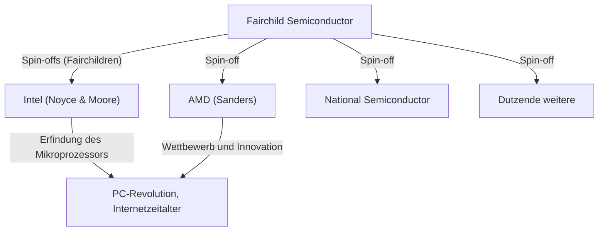

## 1. Einführung: Der "Verrat", der die Welt veränderte

In der modernen Welt sind "Halbleiter" die Grundlage aller Technologien wie Smartphones, Computer, Internet und KI. Und das Zentrum dieser Halbleiterindustrie, das Innovations-Mekka, nach dem sich Unternehmer auf der ganzen Welt sehnen, ist das "Silicon Valley" im Norden Kaliforniens.

Dieses Gebiet, in dem sich riesige Technologieunternehmen wie Google, Apple, Meta (ehemals Facebook) und Netflix drängen, sah nicht von Anfang an so aus. Früher war es nur eine ruhige, von Obstgärten geprägte landwirtschaftliche Gegend, das "Santa Clara Valley". Warum hat es sich in das weltweit führende Technologiezentrum verwandelt?

Der Ursprung von all dem kann als ein "Verrats"-Vorfall im Jahr 1957 bezeichnet werden. Acht junge, brillante Ingenieure, die sich um einen genialen Wissenschaftler versammelt hatten, verließen ihn und gründeten ihr eigenes Unternehmen. Sie wurden später als die **"Acht Verräter (Traitorous Eight)"** bekannt.

In diesem Artikel werden wir tief in das gewaltige historische Drama eintauchen: wie sich diese acht trafen, warum sie sich zum Verrat entschlossen und wie sie den Grundstein für das heutige Silicon Valley legten.

## 2. Historischer Hintergrund: Die Erfindung des Transistors und das "Genie" William Shockley

Der Ursprung der Geschichte reicht bis in den Winter 1947 zurück. In den Bell Laboratories in New Jersey, USA, erfanden drei Wissenschaftler – William Shockley, John Bardeen und Walter Brattain – den "Transistor", eine revolutionäre elektronische Komponente, die die Vakuumröhre ersetzen sollte. Dies ebnete den Weg für die Miniaturisierung und Beschleunigung der riesigen Computer und die drei erhielten 1956 den Nobelpreis für Physik.

William Shockley, einer der Miterfinder des Transistors, war jedoch mit diesem Erfolg nicht zufrieden. Er träumte davon, den Transistor selbst zu kommerzialisieren und ein riesiges Vermögen anzuhäufen. Er war zudem eine Person mit einem starken Geltungsbedürfnis, der fest daran glaubte, ein einzigartiges Genie zu sein.

Nachdem Shockley die Bell Laboratories verlassen hatte, gründete er 1956 das "Shockley Semiconductor Laboratory" in seiner Heimatstadt Palo Alto, Kalifornien (in der Nähe der Stanford University). Zu dieser Zeit lag das Zentrum der Halbleiterindustrie an der Ostküste der USA um Boston, aber Shockley wählte Palo Alto, um in der Nähe seiner kranken Mutter zu sein. Diese Standortwahl aus persönlichen Gründen wurde der erste Zufall, der später die riesige Industrieansammlung namens Silicon Valley hervorbringen sollte.

## 3. Die Versammlung junger Genies

Shockley nutzte seine immense Bekanntheit und sein Charisma als Nobelpreisträger (die Auszeichnung wurde kurz nach der Gründung bekannt gegeben), um junge Wissenschaftler und Ingenieure mit dem höchsten Talentniveau aus den gesamten USA zu rekrutieren. Er versammelte junge Menschen Ende 20 bis Anfang 30, die noch unbekannt waren, aber über eine überwältigende Intelligenz und Potenzial verfügten.

Unter ihnen befanden sich die folgenden acht Personen, die später die "Acht Verräter" genannt werden sollten:

1. **Robert Noyce**: Ein Physiker mit charismatischer Führungspersönlichkeit. Später gründete er Intel und wurde der "Bürgermeister des Silicon Valley" genannt.
2. **Gordon Moore**: Ein ruhiger und nachdenklicher Chemiker. Der Erfinder des berühmten "Mooreschen Gesetzes", der zusammen mit Noyce Intel gründete.
3. **Jean Hoerni**: Ein theoretischer Physiker aus der Schweiz. Er erfand später die "Planartechnologie", die für die Herstellung integrierter Schaltkreise (IC) unerlässlich ist.
4. **Eugene Kleiner**: Ein Maschinenbauingenieur aus Österreich. Später gründete er "Kleiner Perkins", eine der führenden Risikokapitalgesellschaften im Silicon Valley.
5. **Julius Blank**: Ein Freund von Kleiner und ausgezeichneter Maschinenbauingenieur.
6. **Jay Last**: Ein Physiker.
7. **Victor Grinich**: Ein Elektroingenieur.
8. **Sheldon Roberts**: Ein Metallurg.

Sie zogen von der Ostküste in die Obstgartenstadt an der Westküste voller Erwartungen, die hochmoderne Technologie des Transistors mit ihren eigenen Händen weiterentwickeln zu können.

## 4. Countdown zum Zusammenbruch: Das paranoide Management eines Genies

Das Shockley Semiconductor Laboratory, in dem sich exzellente Köpfe versammelt hatten, schien zunächst einen reibungslosen Start zu haben, doch im Inneren stieß es bald auf ernsthafte Probleme. Der Grund dafür war nichts anderes als Shockleys eigene Persönlichkeit und sein Managementstil.

Obwohl Shockley ein herausragender Wissenschaftler war, hatte er tödliche Fehler als Manager und Führungskraft. Er war ein extremer Mikromanager und vertraute seinen Untergebenen überhaupt nicht.
Folgende verrückte Handlungen sind als konkrete Episoden überliefert:

- **Einführung von Lügendetektoren**: Wenn im Labor ein kleiner Fehler passierte (z. B. der Vorfall, bei dem sich eine Sekretärin eine Reißzwecke in den Daumen stach), vermutete er eine Verschwörung durch jemanden und versuchte, alle Mitarbeiter zu Tests mit einem Lügendetektor (Polygraph) zu zwingen.
- **Eigenmächtige Richtungsänderungen**: Er stoppte plötzlich die Entwicklung des vom Markt geforderten Siliziumtransistors und konzentrierte die Ressourcen auf die Entwicklung eines von ihm erfundenen komplexen und schwer herzustellenden Bauteils namens "Vierschichtdiode (Shockley-Diode)".
- **Gründliche Überwachung**: Es war normal, die Gespräche der Mitarbeiter abzuhören oder die Ideen der Untergebenen als seine eigenen Errungenschaften zu präsentieren.

Unter diesem paranoiden (verfolgungswahnhaften) Kontrollsystem erreichte die Unzufriedenheit der jungen Ingenieure ihren Höhepunkt. Die Mitglieder um Noyce und Moore wandten sich direkt an die Muttergesellschaft Beckman Instruments und forderten die Entlassung von Shockley und die Übergabe der Leitung des Labors an sie, aber angesichts des Ansehens des Nobelpreisträgers Shockley wurde ihr Appell abgelehnt.

## 5. Die Entscheidung: Die Geburt der "Acht Verräter"

Im Sommer 1957 trafen sie schließlich ihre Entscheidung. Sie verließen Shockley und gründeten ihr eigenes Unternehmen.

Damals galt es gesellschaftlich als "Verrat (Treason)", ein Unternehmen zu verlassen und eine konkurrierende neue Firma zu gründen. Eine lebenslange Anstellung war üblich und eine Kultur der unabhängigen Unternehmensgründung existierte nicht. Shockley verurteilte sie scharf und nannte sie die **"Acht Verräter (Traitorous Eight)"**. Genau dieses Etikett sollte sich jedoch später in einen stolzen Titel verwandeln, der den Unternehmergeist des Silicon Valley symbolisiert.

Als sie unabhängig wurden, spielte der Investmentbanker **Arthur Rock**, ein Bekannter von Eugene Kleiners Vater, eine wichtige Rolle. Rock erkannte das überwältigende Potenzial im Talent der Acht und bemühte sich, Gelder für sie zu beschaffen.
Der "Vertrag", den Rock und die Acht zu dieser Zeit austauschten, bestand lediglich aus einem 1-Dollar-Schein, den alle unterschrieben hatten. Dies wurde der historische erste Schritt in der Start-up-Investition durch "Risikokapital" im modernen Silicon Valley-Stil.

Schließlich gelang es ihnen, eine Investition von 1,5 Millionen Dollar von dem Geschäftsmann Sherman Fairchild zu sichern, der mit Fotoausrüstung ein Vermögen gemacht hatte, und im Oktober 1957 gründeten sie **"Fairchild Semiconductor"**.

## 6. Der Aufstieg von Fairchild Semiconductor und die technologische Innovation

Fairchild Semiconductor erzielte unmittelbar nach seiner Gründung bemerkenswerte Erfolge. Angefangen mit einem Großauftrag von IBM wuchsen sie mit überwältigender Geschwindigkeit.

Der Grund für ihren Erfolg lag nicht nur darin, dass brillante Köpfe versammelt waren. Sie selbst schufen zu dieser Zeit die **"Unternehmenskultur des Silicon Valley"**, die heute als selbstverständlich gilt, wie etwa eine flache Organisationsstruktur, die Gewinnbeteiligung durch Aktienoptionen und das Arbeiten in Freizeitkleidung anstelle von Anzügen.

Darüber hinaus brachten sie auf technologischer Ebene zwei entscheidende Erfindungen hervor, die die Weltgeschichte verändern sollten.

1. **Die Erfindung der Planartechnologie (Jean Hoerni)**:
   Eine Technologie, bei der die Oberfläche des Halbleiters mit einem Oxidfilm bedeckt und der Schaltkreis in einem flachen (planaren) Zustand gebildet wird. Dies ermöglichte die Massenproduktion und die Verbesserung der Zuverlässigkeit von Transistoren und wurde zum Standard in der Halbleiterherstellung.

2. **Die praktische Umsetzung des integrierten Schaltkreises (IC) (Robert Noyce)**:
   Etwa zur gleichen Zeit wie Jack Kilby von Texas Instruments wendete Noyce die Planartechnologie von Hoerni an und erfand den "integrierten Schaltkreis (IC)", bei dem mehrere Transistoren und elektronische Komponenten auf einem einzigen Siliziumchip integriert werden. Noyces Methode war sehr gut für die Massenproduktion geeignet und wurde zum Prototyp für alle modernen Mikrochips.

## 7. Die Vermehrung der "Fairchildren" und die Vollendung des Ökosystems

Fairchild Semiconductor war ein großer Erfolg, litt aber bald unter Konflikten mit der Muttergesellschaft und der durch das Wachstum bedingten "Großunternehmens-Krankheit". Wie sie damals Shockley verlassen hatten, begannen auch die Mitarbeiter von Fairchild, sich nach und nach abzuspalten (Spin-off) und neue Unternehmen zu gründen.

Die von diesen ehemaligen Fairchild-Mitarbeitern gegründeten Unternehmen wurden, verglichen mit Kindern, die das Nest verlassen, **"Fairchildren"** genannt.
Das berühmteste Beispiel dafür ist **Intel**, das 1968 von Robert Noyce und Gordon Moore gegründet wurde. Im darauffolgenden Jahr wurde **AMD (Advanced Micro Devices)** von Jerry Sanders und anderen ehemaligen Fairchild-Mitarbeitern gegründet. Viele weitere Halbleiterunternehmen, wie National Semiconductor, gingen aus Fairchild hervor.

Auch Eugene Kleiner wurde Investor und gründete Kleiner Perkins. Er tätigte Frühphaseninvestitionen in Amazon, Google und andere. Arthur Rock, der bei der Mittelbeschaffung geholfen hatte, verlegte ebenfalls seinen Sitz ins Silicon Valley und wurde zu einem legendären Risikokapitalgeber, der die Gründung von Intel und Apple unterstützte.

Auf diese Weise wurden alle Bausteine des Ökosystems, das das heutige Silicon Valley formt – **"rebellischer Unternehmergeist", "Anreize durch Aktienoptionen", "Bereitstellung von Risikokapital" und "flache Organisationskultur"** – durch die "Acht Verräter" und ihr Netzwerk geschaffen.

## 8. Fazit: Ihr wahres Erbe

Ohne das von dem einzigen Genie William Shockley geschaffene unterdrückerische Umfeld hätten sich die "Acht Verräter" niemals zusammengeschlossen und wären nicht gegangen. Und wenn sie nicht Fairchild Semiconductor gegründet hätten und daraus nicht so viele "Fairchildren" hervorgegangen wären, würde das Santa Clara Valley heute nicht "Silicon Valley" genannt werden.

Ihre Handlungen, die mit dem negativen Wort "Verrat" begannen, lösten eine Kettenreaktion der technologischen Revolution aus, die das Leben von Menschen auf der ganzen Welt grundlegend veränderte.
Der Geist, sich nicht mit dem Status quo zufrieden zu geben, keine Angst vor Autorität zu haben, Risiken einzugehen und die eigene Vision zu verwirklichen – das ist das größte Erbe, das die "Acht Verräter" dem heutigen Silicon Valley hinterlassen haben.
