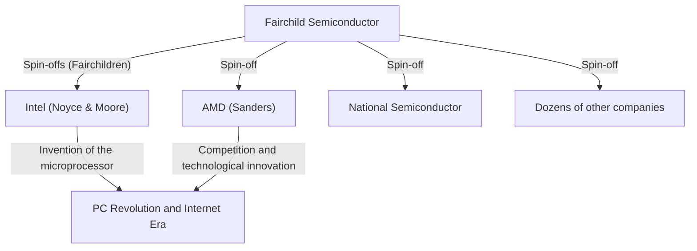

## 1. Introduction: The "Betrayal" that Changed the World

In the modern world, "semiconductors" support the foundation of every technology, such as smartphones, computers, the Internet, and AI. The center of this semiconductor industry, and the innovation mecca admired by entrepreneurs worldwide, is "Silicon Valley," located in northern California.

This place, crowded with giant technology companies like Google, Apple, Meta (formerly Facebook), and Netflix, did not look like it does today from the start. Once, it was merely the "Santa Clara Valley," a quiet agricultural area filled with orchards. Why did it transform into the world's premier technology hub?

The beginning of it all can be traced back to a single "betrayal" incident in 1957. Eight young, brilliant engineers who had gathered under a genius scientist left him to start their own company. They would later be called the **"Traitorous Eight."**

In this article, we will delve deeply into the epic historical drama of how these eight individuals met, why they made the decision to betray, and how they laid the foundation for modern Silicon Valley.

## 2. Historical Background: The Invention of the Transistor and the "Genius" William Shockley

The origin of the story goes back to the winter of 1947. At Bell Labs in New Jersey, USA, three scientists—William Shockley, John Bardeen, and Walter Brattain—invented the "transistor," a groundbreaking electronic component that replaced vacuum tubes. This opened the path to making massive computers smaller and faster, and the three of them would win the Nobel Prize in Physics in 1956.

However, William Shockley, one of the co-inventors of the transistor, was not satisfied with that achievement. He dreamed of commercializing the transistor himself and amassing a vast fortune. Furthermore, he had a very strong desire for recognition and firmly believed himself to be an unparalleled genius.

After leaving Bell Labs, Shockley established the "Shockley Semiconductor Laboratory" in 1956 in his hometown of Palo Alto, California (near Stanford University). At the time, the center of the semiconductor industry was around Boston on the East Coast of the US, but Shockley chose Palo Alto to be near his sick mother. This location choice for a personal reason became the first coincidence that would later give birth to the massive industrial cluster known as Silicon Valley.

## 3. The Gathering of Young Geniuses

Leveraging his massive fame and charisma as a Nobel laureate (the award was decided right after the founding), Shockley scouted young scientists and engineers with top-tier talent from all over the United States. The people he gathered were mostly in their late 20s and early 30s—unknowns who harbored overwhelming intelligence and potential.

Among them were the following eight individuals, who would later be called the "Traitorous Eight."

1. **Robert Noyce**: A physicist with charismatic leadership. He later founded Intel and was called the "Mayor of Silicon Valley."
2. **Gordon Moore**: A quiet and thoughtful chemist. The proponent of the famous "Moore's Law," he co-founded Intel with Noyce.
3. **Jean Hoerni**: A theoretical physicist from Switzerland. He later invented the "planar process," essential for manufacturing integrated circuits (ICs).
4. **Eugene Kleiner**: A mechanical engineer from Austria. He later established "Kleiner Perkins," a representative venture capital firm of Silicon Valley.
5. **Julius Blank**: A brilliant mechanical engineer and friend of Kleiner.
6. **Jay Last**: A physicist.
7. **Victor Grinich**: An electrical engineer.
8. **Sheldon Roberts**: A metallurgist.

Filled with the expectation that they could develop the cutting-edge technology of transistors with their own hands, they moved from the East Coast to the orchard town on the West Coast.

## 4. Countdown to Collapse: The Paranoiac Management of a Genius

The Shockley Semiconductor Laboratory seemed to be off to a smooth start with an assembly of brilliant minds, but internally, it soon faced severe problems. The cause was none other than Shockley's own personality and management style.

While Shockley was an outstanding scientist, he had fatal flaws as a manager and leader. He was an extreme micromanager and did not trust his subordinates at all.
The following eccentric behaviors have been handed down as specific episodes:

- **Introduction of lie detectors**: When a minor mistake occurred in the lab (such as a secretary piercing her thumb with a thumbtack), he suspected it was a conspiracy by someone and tried to force all employees to undergo polygraph tests.
- **Dogmatic policy shifts**: He suddenly stopped the development of silicon transistors that the market demanded, and focused resources on developing a complex and difficult-to-manufacture device he had devised, the "4-layer diode (Shockley diode)."
- **Thorough surveillance**: It became commonplace for him to wiretap employees' conversations or announce his subordinates' ideas as his own achievements.

Under such a paranoiac (paranoid) control regime, the young engineers' dissatisfaction reached its limit. Members centered around Noyce and Moore appealed directly to Beckman Instruments, the parent company, asking them to dismiss Shockley and let them run the lab, but their appeal was rejected in the face of Shockley's prestige as a Nobel laureate.

## 5. The Decision: Birth of the "Traitorous Eight"

In the summer of 1957, they finally made a decision: to leave Shockley and establish their own company.

At the time, leaving a company to start a new competing business was socially regarded as "Treason." Lifetime employment was common, and a culture of independent entrepreneurship did not exist. Shockley fiercely condemned them, calling them the **"Traitorous Eight."** However, this label would later transform into a proud title symbolizing the entrepreneurial spirit of Silicon Valley.

When they became independent, an investment banker named **Arthur Rock**, who was an acquaintance of Eugene Kleiner's father, played a crucial role. Rock saw overwhelming potential in the talent of the eight and worked tirelessly to raise funds for them.
The "contract" exchanged between Rock and the eight at this time was simply signed by all of them on a one-dollar bill. This became the historical first step in modern Silicon Valley-style "venture capital" startup investment.

Ultimately, they successfully secured a $1.5 million investment from Sherman Fairchild, a businessman who had made his fortune in photographic equipment, and in October 1957, they established **"Fairchild Semiconductor."**

## 6. The Leap and Technological Innovation of Fairchild Semiconductor

Fairchild Semiconductor achieved remarkable success right after its establishment. Starting with a large order from IBM, they grew at an overwhelming speed.

The cause of their success was not merely because brilliant minds had gathered. A flat organizational structure, profit-sharing through stock options, and working in casual clothes rather than suits—they themselves created the **"Silicon Valley corporate culture"** that is taken for granted today.

Furthermore, on the technological front, they brought about two decisive inventions that changed world history.

1. **Invention of the Planar Process (Jean Hoerni)**:
   A technique to form circuits on a flat (planar) surface by covering the semiconductor surface with an oxide film. This realized mass production and improved reliability of transistors, becoming the standard for semiconductor manufacturing.

2. **Practical Application of the Integrated Circuit (IC) (Robert Noyce)**:
   Around the same time as Jack Kilby of Texas Instruments, Noyce applied Hoerni's planar process to invent the "Integrated Circuit (IC)," which integrated multiple transistors and electronic components onto a single silicon chip. Noyce's method was extremely suited for mass production, and this became the prototype for all modern microchips.

## 7. The Proliferation of "Fairchildren" and the Completion of the Ecosystem

Although Fairchild Semiconductor achieved massive success, it began to suffer from conflicts with its parent company and big business disease that came with growth. Then, just as they had once left Shockley, Fairchild employees successively spun off (became independent) and launched new companies.

The companies founded by these Fairchild alumni were called **"Fairchildren,"** likened to children leaving the nest of their parent bird.
The most famous example is **Intel**, founded by Robert Noyce and Gordon Moore in 1968. Furthermore, the following year, **AMD (Advanced Micro Devices)** was founded by Jerry Sanders and others, also Fairchild alumni. Many other semiconductor companies, such as National Semiconductor, spun off from Fairchild.

In addition, Eugene Kleiner transitioned into an investor and founded Kleiner Perkins, making early investments in companies like Amazon and Google. Arthur Rock, who helped with the funding, also moved his base to Silicon Valley and became a legendary venture capitalist who supported the founding of Intel and Apple.

Thus, every piece of the ecosystem that shapes modern Silicon Valley—**"rebellious entrepreneurial spirit," "incentives through stock options," "supply of risk money by venture capital," and "a flat organizational culture"**—was born from the "Traitorous Eight" and their network.

## 8. Conclusion: The True Legacy They Left Behind

If not for the oppressive environment created by a single genius, William Shockley, the "Traitorous Eight" would never have united and broken away. And if they had not established Fairchild Semiconductor, and from there given birth to numerous "Fairchildren," the Santa Clara Valley would probably never have been called "Silicon Valley."

Their action, which started with the negative word "betrayal," ultimately triggered a chain of technological revolutions that fundamentally changed the lives of people around the world.
A spirit that is never satisfied with the status quo, does not fear authority, takes risks, and strives to realize its own vision. This is the greatest legacy the "Traitorous Eight" left to modern Silicon Valley.
