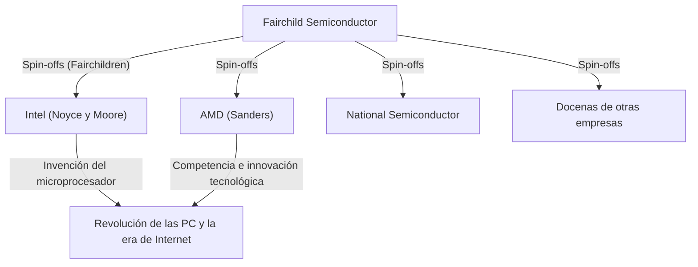

## 1. Introducción: La "traición" que cambió el mundo

En el mundo moderno, la "tecnología de semiconductores" es la base de tecnologías como los teléfonos inteligentes, las computadoras, Internet y la IA. Y el centro de esta industria de semiconductores, la meca de la innovación que los emprendedores de todo el mundo anhelan, es "Silicon Valley", ubicado en el norte de California.

Este lugar, donde se concentran gigantes tecnológicos como Google, Apple, Meta (anteriormente Facebook) y Netflix, no siempre fue como es hoy. Alguna vez fue solo una zona agrícola tranquila llena de huertos, el "Valle de Santa Clara". ¿Por qué se transformó en el centro tecnológico más grande del mundo?

Se puede decir que todo comenzó con un incidente de "traición" en 1957. Ocho jóvenes ingenieros brillantes, que se habían reunido en torno a un científico genio, lo dejaron para fundar su propia empresa. Más tarde serían conocidos como los **"Ocho Traidores" (Traitorous Eight)**.

En este artículo, profundizaremos en el drama épico de cómo estos ocho se conocieron, por qué tomaron la decisión de traicionar y cómo sentaron las bases del Silicon Valley moderno.

## 2. Contexto histórico: La invención del transistor y el "genio" William Shockley

El origen de la historia se remonta al invierno de 1947. En los Laboratorios Bell en Nueva Jersey, EE. UU., tres científicos, William Shockley, John Bardeen y Walter Brattain, inventaron el "transistor", un componente electrónico revolucionario que reemplazaría al tubo de vacío. Esto allanó el camino para computadoras más pequeñas y rápidas, y los tres recibieron el Premio Nobel de Física en 1956.

Sin embargo, William Shockley, uno de los co-inventores del transistor, no estaba satisfecho con su logro. Soñaba con comercializar el transistor él mismo y amasar una enorme fortuna. Además, tenía un fuerte deseo de reconocimiento y creía firmemente que era un genio sin igual.

Al dejar los Laboratorios Bell, Shockley fundó el "Laboratorio de Semiconductores Shockley" (Shockley Semiconductor Laboratory) en 1956 en Palo Alto, California (cerca de la Universidad de Stanford), su ciudad natal. En ese momento, el centro de la industria de semiconductores era Boston y sus alrededores en la costa este de los EE. UU., pero Shockley eligió Palo Alto para estar cerca de su madre enferma. Esta elección de ubicación por motivos personales fue la primera coincidencia que luego crearía el enorme centro industrial de Silicon Valley.

## 3. La reunión de jóvenes genios

Aprovechando su fama y carisma como ganador del Premio Nobel (decidido poco después de la fundación de la empresa), Shockley reclutó a jóvenes científicos e ingenieros brillantes de todo Estados Unidos. Reunió a jóvenes, en su mayoría en la veintena y la treintena, que aún eran desconocidos pero poseían una inteligencia y un potencial abrumadores.

Entre ellos estaban los siguientes ocho que luego serían llamados los "Ocho Traidores":

1. **Robert Noyce**: Un físico con un liderazgo carismático. Más tarde fundó Intel y fue llamado el "Alcalde de Silicon Valley".
2. **Gordon Moore**: Un químico tranquilo y reflexivo. Proponente de la famosa "Ley de Moore" y fundador de Intel junto a Noyce.
3. **Jean Hoerni**: Un físico teórico de Suiza. Más tarde inventó el "proceso planar", que es esencial para la fabricación de circuitos integrados (CI).
4. **Eugene Kleiner**: Un ingeniero mecánico de Austria. Más tarde fundó "Kleiner Perkins", una firma de capital de riesgo representativa en Silicon Valley.
5. **Julius Blank**: Amigo de Kleiner y un excelente ingeniero mecánico.
6. **Jay Last**: Físico.
7. **Victor Grinich**: Ingeniero eléctrico.
8. **Sheldon Roberts**: Metalúrgico.

Con la esperanza de desarrollar tecnología de transistores de vanguardia con sus propias manos, se mudaron desde la costa este al pueblo de los huertos de la costa oeste.

## 4. Cuenta regresiva hacia el colapso: La gestión paranoica de un genio

A pesar de haber reunido mentes brillantes y parecer tener un comienzo prometedor, el Laboratorio de Semiconductores Shockley pronto enfrentó serios problemas internos. La causa fue nada menos que la personalidad y el estilo de gestión del propio Shockley.

Aunque Shockley era un científico destacado, tenía defectos fatales como gerente y líder. Era un microgerente extremo y no confiaba en absoluto en sus subordinados.
Como ejemplos concretos, se han transmitido los siguientes comportamientos excéntricos:

- **Introducción de un detector de mentiras**: Cuando ocurría un pequeño error en el laboratorio (como cuando una secretaria se pinchaba el pulgar con una chincheta), sospechaba que era una conspiración e intentaba obligar a todos los empleados a someterse a una prueba de polígrafo.
- **Cambios de dirección arbitrarios**: De repente detuvo el desarrollo de transistores de silicio, que el mercado demandaba, y concentró los recursos en el desarrollo del "diodo de cuatro capas (diodo Shockley)", un dispositivo complejo que él mismo había ideado y que era difícil de fabricar.
- **Vigilancia extrema**: Era común que espiara las conversaciones de los empleados y se atribuyera el mérito de las ideas de sus subordinados.

Bajo este sistema de control paranoico, la frustración de los jóvenes ingenieros llegó a su límite. Noyce, Moore y otros miembros clave apelaron directamente a la empresa matriz, Beckman Instruments, para que despidiera a Shockley y les permitiera dirigir el laboratorio, pero su solicitud fue rechazada frente a la autoridad de un ganador del Premio Nobel.

## 5. La decisión: El nacimiento de los "Ocho Traidores"

En el verano de 1957, finalmente tomaron una decisión. Dejar a Shockley y fundar su propia empresa.

En ese momento, dejar una empresa para fundar un competidor se consideraba socialmente una "traición" (Treason). El empleo de por vida era común y no existía la cultura del emprendimiento independiente. Shockley los criticó duramente y los llamó los **"Ocho Traidores" (Traitorous Eight)**. Sin embargo, esta misma etiqueta más tarde se convertiría en un título de honor que simboliza el espíritu emprendedor de Silicon Valley.

**Arthur Rock**, un banquero de inversión que era conocido del padre de Eugene Kleiner, jugó un papel importante en su independencia. Rock vio el potencial abrumador en el talento de los ocho e hizo grandes esfuerzos para recaudar fondos para ellos.
El "contrato" firmado entre Rock y los ocho en ese momento era simplemente firmas en un billete de un dólar. Este fue el primer paso histórico hacia la inversión en startups por parte de firmas de "capital de riesgo" estilo Silicon Valley.

Finalmente, lograron asegurar una inversión de 1,5 millones de dólares del empresario Sherman Fairchild, que había hecho su fortuna con equipos fotográficos, y en octubre de 1957 fundaron **"Fairchild Semiconductor"**.

## 6. El salto y la innovación tecnológica de Fairchild Semiconductor

Fairchild Semiconductor logró un éxito notable desde el principio. Comenzando con un gran pedido de IBM, crecieron a una velocidad abrumadora.

La razón de su éxito no fue solo que habían reunido mentes brillantes. Ellos mismos crearon la **"cultura corporativa de Silicon Valley"** que hoy damos por sentada, como una estructura organizativa plana, compartir ganancias a través de opciones sobre acciones y trabajar con ropa informal en lugar de trajes.

Además, aportaron dos inventos cruciales que cambiarían la historia del mundo en el aspecto tecnológico.

1. **Invención del proceso planar (Jean Hoerni)**:
   Una tecnología que cubre la superficie del semiconductor con una película de óxido y forma circuitos en un estado plano (planar). Esto permitió la producción en masa y mejoró la confiabilidad de los transistores, convirtiéndose en el estándar para la fabricación de semiconductores.

2. **Aplicación práctica del circuito integrado (CI) (Robert Noyce)**:
   Casi al mismo tiempo que Jack Kilby de Texas Instruments, Noyce aplicó el proceso planar de Hoerni para idear un "circuito integrado (CI)" que integra múltiples transistores y componentes electrónicos en un solo chip de silicio. El método de Noyce era muy adecuado para la producción en masa y se convirtió en el prototipo de todos los microchips modernos.

## 7. La proliferación de los "Fairchildren" y la finalización del ecosistema

Fairchild Semiconductor fue un gran éxito, pero comenzó a sufrir conflictos con su empresa matriz y la enfermedad de las grandes corporaciones a medida que crecía. Luego, al igual que cuando dejaron a Shockley, los empleados de Fairchild comenzaron a independizarse uno tras otro y fundar nuevas empresas.

Las empresas fundadas por estos ex alumnos de Fairchild fueron llamadas **"Fairchildren"**, comparadas con niños que abandonan el nido de sus padres.
El ejemplo más famoso es **Intel**, fundada en 1968 por Robert Noyce y Gordon Moore. Al año siguiente, **AMD (Advanced Micro Devices)** fue fundada por Jerry Sanders y otros, también provenientes de Fairchild. Además, numerosas empresas de semiconductores, como National Semiconductor, se derivaron de Fairchild.

Además, Eugene Kleiner se convirtió en inversor y fundó Kleiner Perkins, realizando inversiones iniciales en empresas como Amazon y Google. Arthur Rock, que ayudó a recaudar fondos, también se mudó a Silicon Valley y se convirtió en un legendario capitalista de riesgo que apoyó la fundación de Intel y Apple.

Así, todas las piezas del ecosistema que conforman el Silicon Valley moderno: **"espíritu emprendedor rebelde", "incentivos a través de opciones sobre acciones", "suministro de capital de riesgo por firmas de capital de riesgo" y "cultura organizativa plana"**, nacieron de los "Ocho Traidores" y su red.

## 8. Conclusión: Su verdadero legado

Si no fuera por el ambiente opresivo creado por el genio William Shockley, los "Ocho Traidores" no se habrían unido para irse. Y si no hubieran fundado Fairchild Semiconductor, de la cual nacieron muchos "Fairchildren", el Valle de Santa Clara probablemente nunca habría sido llamado "Silicon Valley".

Sus acciones, que comenzaron con la palabra negativa "traición", desencadenaron una reacción en cadena de revoluciones tecnológicas que cambiaron fundamentalmente las vidas de personas en todo el mundo.
El espíritu de no estar satisfechos con el status quo, no temer a la autoridad y tomar riesgos para lograr su visión. Este es el mayor legado que los "Ocho Traidores" dejaron en el moderno Silicon Valley.
