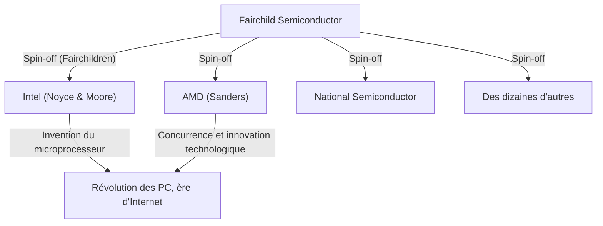

## 1. Introduction : La "trahison" qui a changé le monde

Dans le monde moderne, les "semi-conducteurs" sont à la base de toutes les technologies, telles que les smartphones, les ordinateurs, Internet et l'IA. Le centre de cette industrie des semi-conducteurs et le sanctuaire de l'innovation dont rêvent les entrepreneurs du monde entier est la "Silicon Valley", située au nord de la Californie.

Cet endroit, grouillant de géants de la technologie comme Google, Apple, Meta (anciennement Facebook) et Netflix, n'a pas toujours été ce qu'il est aujourd'hui. C'était autrefois une paisible région agricole parsemée de vergers, connue sous le nom de "Santa Clara Valley". Comment s'est-elle transformée en le plus grand pôle technologique du monde ?

On peut dire que tout a commencé par un incident de "trahison" en 1957. Huit jeunes et brillants ingénieurs réunis sous l'égide d'un scientifique de génie l'ont quitté pour fonder leur propre entreprise. Ils seront plus tard appelés les **"Huit Traîtres" (Traitorous Eight)**.

Cet article plonge dans le drame historique épique de la façon dont ces huit se sont rencontrés, pourquoi ils ont pris la décision de trahir et comment ils ont jeté les bases de la Silicon Valley moderne.

## 2. Contexte historique : L'invention du transistor et le "génie" William Shockley

L'origine de cette histoire remonte à l'hiver 1947. Aux Laboratoires Bell dans le New Jersey, aux États-Unis, trois scientifiques : William Shockley, John Bardeen et Walter Brattain ont inventé le "transistor", un composant électronique révolutionnaire destiné à remplacer les tubes à vide. Cela a ouvert la voie à la miniaturisation et à l'accélération des ordinateurs, jusqu'alors massifs, et les trois ont reçu le prix Nobel de physique en 1956.

Cependant, William Shockley, l'un des co-inventeurs du transistor, n'était pas satisfait de cette réalisation. Il rêvait de commercialiser le transistor de ses propres mains et de bâtir une immense fortune. Il avait également un fort désir d'être reconnu et croyait fermement qu'il était un génie unique.

Après avoir quitté les Laboratoires Bell, Shockley a fondé en 1956 le "Shockley Semiconductor Laboratory" dans sa ville natale de Palo Alto, en Californie (près de l'Université de Stanford). À l'époque, le centre de l'industrie des semi-conducteurs se trouvait autour de Boston sur la côte est des États-Unis, mais Shockley a choisi Palo Alto pour être près de sa mère malade. Ce choix d'emplacement, dicté par une raison personnelle, deviendra la première coïncidence qui donnera naissance à l'énorme concentration industrielle de la Silicon Valley.

## 3. Le rassemblement des jeunes génies

Tirant parti de sa renommée et de son charisme en tant que lauréat du prix Nobel (dont l'attribution a été décidée peu après la fondation), Shockley a recruté de jeunes scientifiques et ingénieurs du plus haut niveau à travers les États-Unis. Ceux qu'il a rassemblés étaient des jeunes de la fin de la vingtaine au début de la trentaine, encore inconnus, mais dotés d'une intelligence et d'un potentiel écrasants.

Parmi eux figuraient les huit personnes suivantes, qui seront plus tard connues sous le nom de "Huit Traîtres" :

1. **Robert Noyce** : Un physicien doté d'un leadership charismatique. Il fondra plus tard Intel et sera appelé le "Maire de la Silicon Valley".
2. **Gordon Moore** : Un chimiste taciturne et réfléchi. Inventeur de la célèbre "Loi de Moore", il a fondé Intel avec Noyce.
3. **Jean Hoerni** : Un physicien théoricien d'origine suisse. Il inventera plus tard le "procédé planaire", indispensable à la fabrication des circuits intégrés (CI).
4. **Eugene Kleiner** : Un ingénieur en mécanique d'origine autrichienne. Il fondera plus tard "Kleiner Perkins", l'une des principales sociétés de capital-risque de la Silicon Valley.
5. **Julius Blank** : L'ami de Kleiner et un brillant ingénieur en mécanique.
6. **Jay Last** : Un physicien.
7. **Victor Grinich** : Un ingénieur électricien.
8. **Sheldon Roberts** : Un métallurgiste.

Pleins d'espoir à l'idée de développer eux-mêmes la technologie de pointe du transistor, ils ont quitté la côte est pour s'installer dans cette ville de vergers sur la côte ouest.

## 4. Compte à rebours vers l'effondrement : La gestion paranoïaque d'un génie

Bien que le Shockley Semiconductor Laboratory semblait avoir pris un bon départ avec un regroupement de cerveaux brillants, il a rapidement fait face à de graves problèmes internes. La cause n'était autre que la personnalité et le style de gestion de Shockley lui-même.

Shockley était un scientifique exceptionnel, mais il avait des défauts fatals en tant que manager et leader. Il était un micro-manager extrême et ne faisait pas du tout confiance à ses subordonnés.
Des anecdotes spécifiques racontent son comportement erratique :

- **L'introduction du détecteur de mensonges** : Lorsqu'une erreur mineure se produisait dans le laboratoire (comme une secrétaire se piquant le pouce avec une punaise), il soupçonnait un complot et tentait de forcer tous les employés à passer un test au détecteur de mensonges (polygraphe).
- **Changement de cap arbitraire** : Il a soudainement arrêté le développement des transistors en silicium, que le marché demandait, pour concentrer les ressources sur le développement d'un dispositif complexe et difficile à fabriquer qu'il avait conçu, appelé la "diode à quatre couches (diode Shockley)".
- **Surveillance stricte** : Il était courant pour lui de mettre sur écoute les conversations entre employés ou de s'approprier les idées de ses subordonnés en les présentant comme les siennes.

Sous ce régime de contrôle paranoïaque, la frustration des jeunes ingénieurs a atteint ses limites. Les membres, menés par Noyce et Moore, ont fait appel à la société mère, Beckman Instruments, pour destituer Shockley et leur laisser la direction du laboratoire, mais face à l'autorité de Shockley, lauréat du prix Nobel, leur appel a été rejeté.

## 5. La décision : La naissance des "Huit Traîtres"

À l'été 1957, ils ont finalement pris une décision. Quitter Shockley et fonder leur propre entreprise.

À l'époque, quitter une entreprise pour créer une entreprise concurrente était socialement considéré comme une "trahison" (Treason). L'emploi à vie était la norme, et la culture de l'entrepreneuriat indépendant n'existait pas. Shockley les a violemment critiqués et les a qualifiés de **"Huit Traîtres" (Traitorous Eight)**. Cependant, cette étiquette est devenue plus tard un titre de fierté symbolisant l'esprit d'entreprise de la Silicon Valley.

Le banquier d'investissement **Arthur Rock**, une connaissance du père d'Eugene Kleiner, a joué un rôle important lors de leur départ. Rock a reconnu le potentiel écrasant du talent de ces huit personnes et a travaillé sans relâche pour leur obtenir des financements.
À cette époque, le "contrat" signé par Rock et les huit n'était qu'un simple billet d'un dollar sur lequel ils avaient tous apposé leur signature. Ce fut la première étape historique de l'investissement dans les start-ups par le "capital-risque" à la manière de la Silicon Valley moderne.

Finalement, ils ont réussi à obtenir un investissement de 1,5 million de dollars de l'homme d'affaires Sherman Fairchild, qui avait fait fortune dans le matériel photographique, et en octobre 1957, ils ont fondé **"Fairchild Semiconductor"**.

## 6. L'essor et l'innovation technologique de Fairchild Semiconductor

Fairchild Semiconductor a connu un succès remarquable dès sa création. Commençant par une commande importante d'IBM, ils ont connu une croissance à une vitesse fulgurante.

La raison de leur succès n'était pas seulement la présence de cerveaux brillants. Une structure organisationnelle horizontale, le partage des bénéfices grâce aux options d'achat d'actions et le travail en tenue décontractée plutôt qu'en costume ; ils ont eux-mêmes créé la **"culture d'entreprise de la Silicon Valley"**, qui est désormais considérée comme allant de soi.

De plus, sur le plan technologique, ils ont apporté deux inventions décisives qui ont changé l'histoire du monde :

1. **L'invention du procédé planaire (Jean Hoerni)** :
   Une technologie consistant à recouvrir la surface du semi-conducteur d'une couche d'oxyde et à former des circuits sur une surface plane (planaire). Cela a permis la production de masse et l'amélioration de la fiabilité des transistors, devenant la norme pour la fabrication de semi-conducteurs.

2. **L'application pratique du circuit intégré (CI) (Robert Noyce)** :
   Presque en même temps que Jack Kilby de Texas Instruments, Noyce a appliqué la technologie planaire de Hoerni pour concevoir le "circuit intégré (CI)", qui intègre plusieurs transistors et composants électroniques sur une seule puce de silicium. La méthode de Noyce était très adaptée à la production de masse, devenant le prototype de toutes les micropuces modernes.

## 7. La prolifération des "Fairchildren" et l'achèvement de l'écosystème

Fairchild Semiconductor a connu un grand succès, mais a commencé à souffrir de conflits avec la société mère et de la maladie des grandes entreprises associée à la croissance. En conséquence, tout comme lorsqu'ils avaient quitté Shockley, les employés de Fairchild ont également essaimé (spin-off) les uns après les autres pour créer de nouvelles entreprises.

Les entreprises fondées par ces anciens de Fairchild étaient appelées les **"Fairchildren"**, les comparant à des enfants quittant le nid parental.
L'exemple le plus célèbre est **Intel**, fondée par Robert Noyce et Gordon Moore en 1968. L'année suivante, **AMD (Advanced Micro Devices)** a été fondée par Jerry Sanders et d'autres anciens de Fairchild. De nombreuses autres entreprises de semi-conducteurs, telles que National Semiconductor, sont dérivées de Fairchild.

Eugene Kleiner s'est également transformé en investisseur, fondant Kleiner Perkins, et a réalisé des investissements initiaux dans Amazon et Google. Arthur Rock, qui avait aidé à la recherche de financements, a également déménagé dans la Silicon Valley et est devenu un investisseur en capital-risque légendaire, soutenant la création d'Intel et d'Apple.

Ainsi, toutes les pièces de l'écosystème qui forme la Silicon Valley moderne – **"un esprit d'entreprise rebelle", "des incitations par le biais d'options d'achat d'actions", "la fourniture de capital-risque" et "une culture organisationnelle horizontale"** – ont été créées par les "Huit Traîtres" et leur réseau.

## 8. Conclusion : Leur véritable héritage

S'il n'y avait pas eu l'environnement oppressif créé par le seul génie William Shockley, les "Huit Traîtres" ne se seraient pas unis pour partir. Et s'ils n'avaient pas fondé Fairchild Semiconductor, qui a donné naissance à de nombreux "Fairchildren", la vallée de Santa Clara n'aurait probablement jamais été appelée la "Silicon Valley".

Leurs actions, qui ont commencé par le mot négatif de "trahison", ont finalement déclenché une chaîne de révolutions technologiques qui ont fondamentalement changé la vie des gens du monde entier.
L'esprit de ne pas se contenter du statu quo, de ne pas craindre l'autorité et de prendre des risques pour réaliser sa propre vision. C'est l'héritage le plus grand laissé par les "Huit Traîtres" à la Silicon Valley moderne.
