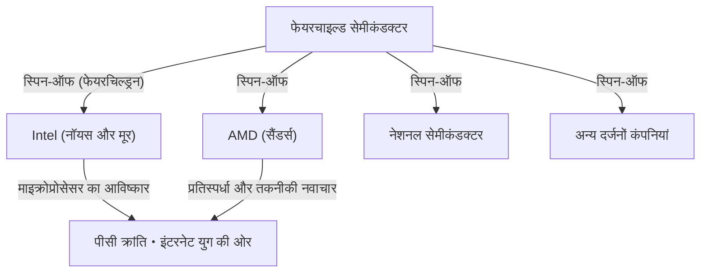

## 1. परिचय: दुनिया को बदलने वाली "गद्दारी"

आधुनिक दुनिया में, स्मार्टफोन, कंप्यूटर, इंटरनेट और AI जैसी हर तकनीक का आधार "सेमीकंडक्टर (अर्धचालक)" है। और इस सेमीकंडक्टर उद्योग का केंद्र, और दुनिया भर के उद्यमियों के लिए इनोवेशन की पवित्र भूमि, उत्तरी कैलिफ़ोर्निया में स्थित "सिलिकॉन वैली (Silicon Valley)" है।

Google, Apple, Meta (पूर्व में Facebook), और Netflix जैसी दिग्गज तकनीकी कंपनियों से भरी यह जगह हमेशा से ऐसी नहीं थी। कभी यह फलोद्यानों से भरा एक शांत कृषि क्षेत्र, "सांता क्लारा वैली" हुआ करता था। यह दुनिया के शीर्ष तकनीकी हब में कैसे बदल गया?

इस सब की शुरुआत 1957 में हुई एक "गद्दारी" की घटना को कहा जा सकता है। एक प्रतिभाशाली वैज्ञानिक के पास इकट्ठा हुए 8 युवा और उत्कृष्ट इंजीनियरों ने उसका साथ छोड़ दिया और अपनी खुद की कंपनी शुरू की। उन्हें बाद में **"8 गद्दार (Traitorous Eight)"** के रूप में जाना जाने लगा।

इस लेख में, हम इस बात की गहराई में जाएंगे कि कैसे ये 8 लोग मिले, उन्होंने गद्दारी का फैसला क्यों किया, और उन्होंने आधुनिक सिलिकॉन वैली की नींव कैसे रखी - इसके ऐतिहासिक नाटक की गहराई से पड़ताल करेंगे।

## 2. ऐतिहासिक पृष्ठभूमि: ट्रांजिस्टर का आविष्कार और "जीनियस" विलियम शॉकली

कहानी की जड़ें 1947 की सर्दियों तक जाती हैं। अमेरिका के न्यू जर्सी में बेल लैब्स में, तीन वैज्ञानिकों - विलियम शॉकली, जॉन बार्डीन, और वाल्टर ब्रैटन - ने "ट्रांजिस्टर" का आविष्कार किया, जो वैक्यूम ट्यूब की जगह लेने वाला एक क्रांतिकारी इलेक्ट्रॉनिक घटक था। इसने विशाल कंप्यूटरों को छोटा और तेज बनाने का मार्ग प्रशस्त किया, और इन तीनों ने 1956 में भौतिकी का नोबेल पुरस्कार जीता।

हालांकि, ट्रांजिस्टर के सह-आविष्कारकों में से एक, विलियम शॉकली इस उपलब्धि से संतुष्ट नहीं थे। उन्होंने खुद ट्रांजिस्टर का व्यावसायीकरण करके अपार धन कमाने का सपना देखा। इसके अलावा, वह बहुत ही आत्म-प्रचारक व्यक्ति थे और उनका दृढ़ विश्वास था कि वह एकमात्र और अद्वितीय प्रतिभाशाली व्यक्ति हैं।

बेल लैब्स छोड़ने के बाद, शॉकली ने 1956 में कैलिफ़ोर्निया के पालो ऑल्टो (स्टैनफोर्ड यूनिवर्सिटी के पास), जो उनका गृहनगर भी था, में "शॉकली सेमीकंडक्टर लेबोरेटरी (Shockley Semiconductor Laboratory)" की स्थापना की। उस समय, सेमीकंडक्टर उद्योग का केंद्र अमेरिका के पूर्वी तट पर बोस्टन के आसपास था, लेकिन शॉकली ने पालो ऑल्टो को चुना क्योंकि वह अपनी बीमार माँ के करीब रहना चाहते थे। व्यक्तिगत कारणों से चुनी गई यह जगह सिलिकॉन वैली नामक विशाल औद्योगिक क्लस्टर बनाने वाला पहला संयोग बन गई।

## 3. युवा प्रतिभाओं का जमावड़ा

शॉकली ने नोबेल पुरस्कार विजेता (स्थापना के तुरंत बाद सम्मानित) के रूप में अपनी अपार प्रसिद्धि और करिश्मे का उपयोग करते हुए, पूरे अमेरिका से उच्चतम स्तर की प्रतिभा वाले युवा वैज्ञानिकों और इंजीनियरों की भर्ती की। उन्होंने जिन लोगों को इकट्ठा किया वे 20 के दशक के अंत से 30 के दशक की शुरुआत के युवा थे, जो अभी तक अज्ञात थे लेकिन उनमें अपार बुद्धिमत्ता और क्षमता छिपी थी।

इनमें निम्नलिखित 8 लोग शामिल थे, जिन्हें बाद में "8 गद्दार" के रूप में जाना जाने लगा:

1. **रॉबर्ट नॉयस (Robert Noyce)**: करिश्माई नेतृत्व वाले भौतिक विज्ञानी। उन्होंने बाद में इंटेल (Intel) की स्थापना की और उन्हें "सिलिकॉन वैली का मेयर" कहा गया।
2. **गॉर्डन मूर (Gordon Moore)**: एक शांत और विचारशील रसायनज्ञ। वे प्रसिद्ध "मूर के नियम (Moore's Law)" के प्रस्तावक थे और नॉयस के साथ मिलकर इंटेल की स्थापना की।
3. **जीन होर्नी (Jean Hoerni)**: स्विट्जरलैंड के एक सैद्धांतिक भौतिक विज्ञानी। उन्होंने बाद में "प्लानर प्रक्रिया (Planar process)" का आविष्कार किया, जो इंटीग्रेटेड सर्किट (IC) के निर्माण के लिए आवश्यक है।
4. **यूजीन क्लेनर (Eugene Kleiner)**: ऑस्ट्रिया के एक मैकेनिकल इंजीनियर। उन्होंने बाद में सिलिकॉन वैली की एक प्रमुख वेंचर कैपिटल फर्म "क्लेनर पर्किन्स (Kleiner Perkins)" की स्थापना की।
5. **जूलियस ब्लैंक (Julius Blank)**: क्लेनर के मित्र और एक उत्कृष्ट मैकेनिकल इंजीनियर।
6. **जे लास्ट (Jay Last)**: एक भौतिक विज्ञानी।
7. **विक्टर ग्रिनिच (Victor Grinich)**: एक इलेक्ट्रिकल इंजीनियर।
8. **शेल्डन रॉबर्ट्स (Sheldon Roberts)**: एक धातुविज्ञानी (metallurgist)।

वे इस उम्मीद से भरे हुए थे कि वे ट्रांजिस्टर नामक अत्याधुनिक तकनीक को अपने हाथों से विकसित कर पाएंगे, और वे पूर्वी तट से पश्चिमी तट के एक फलोद्यान वाले शहर में चले आए।

## 4. पतन की उल्टी गिनती: प्रतिभाशाली व्यक्ति का पागलपन भरा प्रबंधन

शॉकली सेमीकंडक्टर लेबोरेटरी, जो बेहतरीन दिमागों को इकट्ठा करने के साथ सुचारू रूप से शुरू होती हुई दिख रही थी, जल्द ही आंतरिक रूप से गंभीर समस्याओं का सामना करने लगी। इसका कारण कोई और नहीं बल्कि खुद शॉकली का व्यक्तित्व और प्रबंधन शैली थी।

शॉकली एक उत्कृष्ट वैज्ञानिक थे, लेकिन एक प्रबंधक और नेता के रूप में उनमें गंभीर खामियां थीं। वह एक अत्यधिक माइक्रो-मैनेजर थे और अपने अधीनस्थों पर बिल्कुल भरोसा नहीं करते थे।
एक विशिष्ट किस्से के रूप में, निम्नलिखित असामान्य व्यवहार के बारे में बताया जाता है:

- **लाई डिटेक्टर (झूठ पकड़ने वाली मशीन) की शुरूआत**: जब प्रयोगशाला में कोई छोटी सी भी गलती होती थी (जैसे कि एक सचिव के अंगूठे में थंबटैक चुभना), तो उसे किसी की साजिश होने का संदेह होता था, और उन्होंने सभी कर्मचारियों को लाई डिटेक्टर (पॉलीग्राफ) टेस्ट देने के लिए मजबूर करने की कोशिश की।
- **मनमाना नीति परिवर्तन**: उन्होंने सिलिकॉन ट्रांजिस्टर के विकास को अचानक रोक दिया जिसकी बाजार में मांग थी, और अपना सारा संसाधन "4-लेयर डायोड (शॉकली डायोड)" नामक एक जटिल और मुश्किल-से-निर्मित डिवाइस के विकास पर केंद्रित कर दिया जो उन्होंने खुद ईजाद किया था।
- **कड़ी निगरानी**: कर्मचारियों के बीच बातचीत की छिपकर बातें सुनना और अधीनस्थों के विचारों को अपनी उपलब्धि के रूप में प्रस्तुत करना आम बात हो गई थी।

इस तरह के पागलपन वाले नियंत्रण के तहत, युवा इंजीनियरों का असंतोष अपनी सीमा तक पहुंच गया। नॉयस और मूर के नेतृत्व वाले सदस्यों ने मूल कंपनी, बेकमैन इंस्ट्रूमेंट्स (Beckman Instruments) से शॉकली को बर्खास्त करने और उन्हें प्रयोगशाला चलाने की अनुमति देने की सीधे अपील की, लेकिन नोबेल पुरस्कार विजेता शॉकली के अधिकार के सामने उनकी अपील खारिज कर दी गई।

## 5. निर्णय: "8 गद्दारों" का जन्म

1957 की गर्मियों में, उन्होंने आखिरकार एक निर्णय लिया। वे शॉकली को छोड़ देंगे और अपनी खुद की कंपनी स्थापित करेंगे।

उस समय, किसी कंपनी को छोड़कर एक नई प्रतिस्पर्धी कंपनी शुरू करना सामाजिक रूप से "गद्दारी (Treason)" माना जाता था। आजीवन रोजगार आम था, और स्वतंत्र उद्यमिता की कोई संस्कृति मौजूद नहीं थी। शॉकली ने उनकी कड़ी निंदा की और उन्हें **"8 गद्दार (Traitorous Eight)"** कहा। हालांकि, यह लेबल ही बाद में सिलिकॉन वैली की उद्यमशीलता की भावना का प्रतीक, एक गौरवपूर्ण उपाधि बन गया।

उनके स्वतंत्र होने में एक महत्वपूर्ण भूमिका **आर्थर रॉक (Arthur Rock)** ने निभाई, जो एक निवेश बैंकर थे और यूजीन क्लेनर के पिता के परिचित थे। रॉक ने इन 8 लोगों की प्रतिभा में अपार क्षमता देखी और उनके लिए धन जुटाने के लिए कड़ी मेहनत की।
उस समय रॉक और 8 लोगों के बीच जिस "अनुबंध" का आदान-प्रदान हुआ था, वह वास्तव में सिर्फ एक डॉलर के बिल पर सभी का हस्ताक्षर था। यह आधुनिक सिलिकॉन वैली-शैली के "वेंचर कैपिटल" द्वारा स्टार्टअप निवेश में एक ऐतिहासिक पहला कदम बन गया।

अंततः, वे फोटोग्राफिक उपकरणों से अपना भाग्य बनाने वाले एक व्यवसायी शर्मन फेयरचाइल्ड से 1.5 मिलियन डॉलर का निवेश हासिल करने में सफल रहे, और अक्टूबर 1957 में, उन्होंने **"फेयरचाइल्ड सेमीकंडक्टर (Fairchild Semiconductor)"** की स्थापना की।

## 6. फेयरचाइल्ड सेमीकंडक्टर की छलांग और तकनीकी नवाचार

फेयरचाइल्ड सेमीकंडक्टर ने अपनी स्थापना के तुरंत बाद उल्लेखनीय सफलता हासिल की। IBM से बड़े ऑर्डर के साथ शुरुआत करते हुए, वे अत्यधिक गति से बढ़े।

उनकी सफलता का कारण केवल यह नहीं था कि वहां उत्कृष्ट दिमाग एकत्र हुए थे। एक सपाट संगठनात्मक ढांचा, स्टॉक विकल्पों (कंपनी के शेयर खरीदने का अधिकार) के माध्यम से लाभ साझा करना, और सूट के बजाय अनौपचारिक कपड़ों में काम करना - जिसे अब एक आदर्श माना जाता है - उन्होंने उस समय ही इस **"सिलिकॉन वैली जैसी कॉर्पोरेट संस्कृति"** का निर्माण किया।

इसके अलावा, उन्होंने तकनीकी मोर्चे पर भी दो महत्वपूर्ण आविष्कार किए जिन्होंने दुनिया का इतिहास बदल दिया।

1. **प्लानर तकनीक का आविष्कार (जीन होर्नी)**:
   अर्धचालक की सतह को एक ऑक्साइड फिल्म से ढकने और एक सपाट (Planar) अवस्था में एक सर्किट बनाने की तकनीक। इसके परिणामस्वरूप ट्रांजिस्टर का बड़े पैमाने पर उत्पादन और बेहतर विश्वसनीयता हुई, और यह अर्धचालक निर्माण का मानक बन गया।

2. **इंटीग्रेटेड सर्किट (IC) का व्यावहारिक अनुप्रयोग (रॉबर्ट नॉयस)**:
   टेक्सास इंस्ट्रूमेंट्स के जैक किल्बी के लगभग उसी समय, नॉयस ने होर्नी की प्लानर तकनीक को लागू किया और "इंटीग्रेटेड सर्किट (IC)" का आविष्कार किया, जो कई ट्रांजिस्टर और इलेक्ट्रॉनिक घटकों को एक सिंगल सिलिकॉन चिप पर एकीकृत करता था। नॉयस का तरीका बड़े पैमाने पर उत्पादन के लिए बहुत उपयुक्त था, और यह आज के सभी माइक्रोचिप्स का प्रोटोटाइप बन गया।

## 7. "फेयरचिल्ड्रन" का प्रसार और पारिस्थितिकी तंत्र का पूर्ण होना

फेयरचाइल्ड सेमीकंडक्टर एक बड़ी सफलता थी, लेकिन यह मूल कंपनी के साथ संघर्ष और विकास से जुड़ी बड़ी कॉर्पोरेट बीमारियों से ग्रस्त होने लगी। फिर, ठीक उसी तरह जब उन्होंने शॉकली को छोड़ दिया था, फेयरचाइल्ड के कर्मचारी एक के बाद एक अलग (स्पिन-ऑफ) हो गए और नई कंपनियां शुरू कीं।

फेयरचाइल्ड के पूर्व छात्रों द्वारा स्थापित कंपनियों को **"फेयरचिल्ड्रन (Fairchildren)"** कहा जाता था, जिसकी तुलना उन बच्चों से की जाती है जो अपने माता-पिता के घोंसले से बाहर निकलते हैं।
इसका सबसे प्रसिद्ध उदाहरण **इंटेल (Intel)** है, जिसे 1968 में रॉबर्ट नॉयस और गॉर्डन मूर द्वारा स्थापित किया गया था। अगले वर्ष, **AMD (एडवांस्ड माइक्रो डिवाइसेज)** की स्थापना फेयरचाइल्ड के एक अन्य पूर्व छात्र जेरी सैंडर्स और अन्य लोगों ने की। नेशनल सेमीकंडक्टर सहित कई अन्य सेमीकंडक्टर कंपनियां फेयरचाइल्ड से उत्पन्न हुईं।

इसके अलावा, यूजीन क्लेनर एक निवेशक बन गए और क्लेनर पर्किन्स की स्थापना की। उन्होंने अमेज़ॅन और गूगल जैसी कंपनियों में शुरुआती निवेश किया। आर्थर रॉक, जिन्होंने धन जुटाने में मदद की थी, भी सिलिकॉन वैली चले गए और इंटेल और ऐप्पल की स्थापना का समर्थन करने वाले एक प्रसिद्ध वेंचर कैपिटलिस्ट बन गए।

इस तरह, आधुनिक सिलिकॉन वैली को आकार देने वाले पारिस्थितिकी तंत्र के सभी टुकड़े—**"विद्रोही उद्यमशीलता की भावना," "स्टॉक विकल्पों के माध्यम से प्रोत्साहन," "वेंचर कैपिटल के माध्यम से जोखिम वाले धन की आपूर्ति," और "एक सपाट संगठनात्मक संस्कृति"**— "8 गद्दारों" और उनके नेटवर्क से पैदा हुए थे।

## 8. निष्कर्ष: उनकी छोड़ी गई सच्ची विरासत

विलियम शॉकली नामक एक प्रतिभा द्वारा बनाए गए दमनकारी वातावरण के बिना, "8 गद्दार" एकजुट होकर कभी बाहर नहीं निकलते। और यदि उन्होंने फेयरचाइल्ड सेमीकंडक्टर की स्थापना नहीं की होती, और यदि वहां से कई "फेयरचिल्ड्रन" पैदा नहीं हुए होते, तो सांता क्लारा वैली को कभी "सिलिकॉन वैली" नहीं कहा जाता।

उनकी हरकतें, जो "गद्दारी" जैसे नकारात्मक शब्द से शुरू हुईं, के परिणामस्वरूप तकनीकी क्रांति की एक श्रृंखला शुरू हुई जिसने दुनिया भर में लोगों के जीवन को मौलिक रूप से बदल दिया।
यथास्थिति से संतुष्ट न होने, अधिकार (सत्ता) से न डरने और अपनी दृष्टि (विज़न) को साकार करने के लिए जोखिम उठाने की भावना। यही सबसे बड़ी विरासत है जिसे "8 गद्दारों" ने आधुनिक सिलिकॉन वैली के लिए पीछे छोड़ा है。
