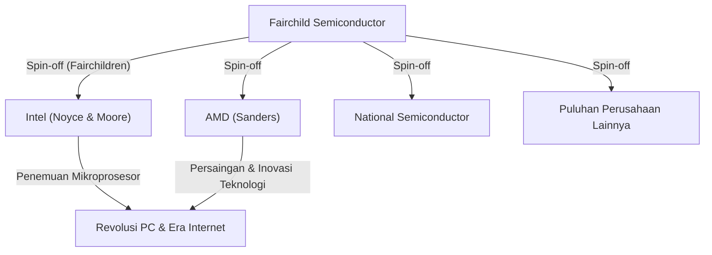

## 1. Pendahuluan: "Pengkhianatan" yang Mengubah Dunia

Di dunia modern, "semikonduktor" adalah fondasi yang menopang semua teknologi seperti ponsel cerdas, komputer, internet, dan AI. Dan pusat dari industri semikonduktor ini, sekaligus tanah suci inovasi yang diidam-idamkan para wirausahawan di seluruh dunia, adalah "Lembah Silikon" (Silicon Valley) yang terletak di California Utara.

Tempat yang dipenuhi perusahaan teknologi raksasa seperti Google, Apple, Meta (sebelumnya Facebook), dan Netflix ini tidak memiliki bentuk seperti sekarang sejak awal. Dahulu, tempat ini hanyalah daerah pertanian yang tenang dengan kebun buah-buahan, dikenal sebagai "Lembah Santa Clara". Mengapa tempat ini bisa berubah menjadi pusat teknologi terbaik di dunia?

Awal dari semua itu dapat dikatakan berasal dari sebuah insiden "pengkhianatan" yang terjadi pada tahun 1957. Delapan insinyur muda dan brilian yang berkumpul di bawah seorang ilmuwan jenius memutuskan untuk meninggalkannya dan mendirikan perusahaan mereka sendiri. Mereka kemudian dikenal sebagai **"Delapan Pengkhianat" (Traitorous Eight)**.

Dalam artikel ini, kita akan menggali lebih dalam tentang drama sejarah epik ini: bagaimana kedelapan orang ini bertemu, mengapa mereka membuat keputusan untuk berkhianat, dan bagaimana mereka meletakkan dasar bagi Lembah Silikon modern.

## 2. Latar Belakang Era: Penemuan Transistor dan William Shockley yang "Jenius"

Titik awal cerita ini kembali ke musim dingin tahun 1947. Di Bell Labs, New Jersey, Amerika Serikat, tiga ilmuwan—William Shockley, John Bardeen, dan Walter Brattain—menemukan "transistor", sebuah komponen elektronik inovatif untuk menggantikan tabung vakum. Penemuan ini membuka jalan untuk miniaturisasi dan peningkatan kecepatan komputer yang dulunya berukuran sangat besar. Ketiganya kemudian menerima Penghargaan Nobel Fisika pada tahun 1956.

Namun, salah satu penemu bersama transistor, William Shockley, tidak puas dengan pencapaian tersebut. Ia bermimpi untuk mengkomersialkan transistor dengan tangannya sendiri dan mengumpulkan kekayaan yang sangat besar. Selain itu, ia memiliki keinginan yang kuat untuk memamerkan dirinya dan sangat yakin bahwa ia adalah seorang jenius yang tak tertandingi.

Setelah meninggalkan Bell Labs, pada tahun 1956, Shockley mendirikan "Shockley Semiconductor Laboratory" di kampung halamannya di Palo Alto, California (dekat Universitas Stanford). Pada saat itu, pusat industri semikonduktor berada di sekitar Boston di Pantai Timur AS. Alasan Shockley memilih Palo Alto adalah agar ia bisa berada di dekat ibunya yang sedang sakit. Pemilihan lokasi karena alasan pribadi ini kelak menjadi kebetulan pertama yang melahirkan aglomerasi industri raksasa bernama Lembah Silikon.

## 3. Berkumpulnya Para Jenius Muda

Shockley, memanfaatkan ketenaran dan karisma yang luar biasa sebagai penerima Hadiah Nobel (yang diumumkan tak lama setelah pendirian laboratoriumnya), merekrut para ilmuwan dan insinyur muda dengan tingkat bakat tertinggi dari seluruh Amerika. Orang-orang yang ia kumpulkan adalah para pemuda berusia akhir 20-an hingga awal 30-an yang, meskipun belum terkenal, memiliki kecerdasan dan potensi yang luar biasa.

Di antara mereka, terdapat delapan orang berikut yang nantinya akan disebut sebagai "Delapan Pengkhianat":

1. **Robert Noyce**: Seorang fisikawan dengan kepemimpinan yang karismatik. Ia kelak mendirikan Intel dan dijuluki "Wali Kota Lembah Silikon".
2. **Gordon Moore**: Seorang ahli kimia yang pendiam dan bijaksana. Ia adalah penggagas "Hukum Moore" yang terkenal dan ikut mendirikan Intel bersama Noyce.
3. **Jean Hoerni**: Fisikawan teoretis asal Swiss. Ia kemudian menemukan "teknologi planar", yang sangat penting untuk pembuatan sirkuit terpadu (IC).
4. **Eugene Kleiner**: Insinyur mesin asal Austria. Ia kelak mendirikan "Kleiner Perkins", perusahaan modal ventura terkemuka di Lembah Silikon.
5. **Julius Blank**: Teman Kleiner dan insinyur mesin yang brilian.
6. **Jay Last**: Fisikawan.
7. **Victor Grinich**: Insinyur listrik.
8. **Sheldon Roberts**: Ahli metalurgi.

Dengan harapan yang tinggi bahwa mereka dapat mengembangkan sendiri teknologi mutakhir yang disebut transistor, mereka pindah dari Pantai Timur ke Pantai Barat, ke sebuah kota perkebunan.

## 4. Hitung Mundur Menuju Kehancuran: Manajemen Paranoid Sang Jenius

Meskipun otak-otak brilian telah berkumpul dan Shockley Semiconductor Laboratory tampak dimulai dengan lancar, masalah serius segera muncul di dalam perusahaan. Penyebabnya tak lain adalah kepribadian dan gaya manajemen Shockley sendiri.

Meskipun Shockley adalah seorang ilmuwan terkemuka, ia memiliki kelemahan fatal sebagai manajer dan pemimpin. Ia adalah seorang manajer mikro (micromanager) ekstrem dan sama sekali tidak mempercayai bawahannya.
Secara spesifik, perilaku gila berikut ini telah diturunkan sebagai anekdot:

- **Pengenalan Mesin Pendeteksi Kebohongan**: Ketika kesalahan sepele terjadi di laboratorium (seperti paku payung menusuk ibu jari sekretaris), ia mencurigai itu sebagai konspirasi seseorang dan mencoba memaksa semua karyawan untuk menjalani tes pendeteksi kebohongan (poligraf).
- **Perubahan Arah yang Sewenang-wenang**: Ia tiba-tiba menghentikan pengembangan transistor silikon yang saat itu sedang dicari pasar, dan memusatkan sumber daya pada pengembangan "diode 4 lapis" (diode Shockley), sebuah perangkat kompleks yang sulit diproduksi, yang ia rancang sendiri.
- **Pengawasan Menyeluruh**: Menyadap percakapan antar karyawan atau mengklaim ide bawahan sebagai miliknya merupakan hal yang biasa dilakukan.

Di bawah sistem kontrol paranoid seperti itu, ketidakpuasan para insinyur muda pun mencapai puncaknya. Anggota yang dipimpin oleh Noyce dan Moore memohon kepada perusahaan induk, Beckman Instruments, untuk memecat Shockley dan membiarkan mereka menjalankan laboratorium. Namun, menghadapi prestise Shockley sebagai peraih Hadiah Nobel, tuntutan itu ditolak.

## 5. Keputusan: Kelahiran "Delapan Pengkhianat"

Pada musim panas tahun 1957, mereka akhirnya membuat keputusan. Mereka akan meninggalkan Shockley dan mendirikan perusahaan mereka sendiri.

Pada masa itu, berhenti dari sebuah perusahaan dan memulai perusahaan saingan yang baru dianggap secara sosial sebagai sebuah "pengkhianatan" (Treason). Pekerjaan seumur hidup merupakan hal yang umum, dan budaya kewirausahaan mandiri belum ada. Shockley mengkritik mereka dengan keras dan menjuluki mereka **"Delapan Pengkhianat" (Traitorous Eight)**. Namun, cap ini justru berubah menjadi gelar kebanggaan yang kemudian melambangkan semangat kewirausahaan di Lembah Silikon.

Saat mereka mandiri, orang yang memainkan peran penting adalah **Arthur Rock**, seorang bankir investasi yang merupakan kenalan ayah Eugene Kleiner. Rock melihat potensi luar biasa dalam bakat mereka berdelapan dan bekerja keras untuk mengumpulkan dana bagi mereka.
Pada saat itu, "kontrak" yang ditandatangani oleh Rock dan kedelapan orang tersebut hanyalah tanda tangan mereka semua di atas lembaran uang kertas 1 dolar. Ini menjadi langkah bersejarah pertama dalam investasi startup oleh "modal ventura" gaya Lembah Silikon di era modern.

Pada akhirnya, mereka berhasil mendapatkan investasi sebesar 1,5 juta dolar dari Sherman Fairchild, seorang pengusaha sukses di bidang peralatan fotografi, dan pada bulan Oktober 1957, mereka mendirikan **"Fairchild Semiconductor"**.

## 6. Lompatan Maju dan Inovasi Teknologi Fairchild Semiconductor

Fairchild Semiconductor meraih kesuksesan yang luar biasa segera setelah didirikan. Dimulai dengan pesanan besar dari IBM, mereka tumbuh dengan kecepatan yang mengejutkan.

Faktor kesuksesan mereka bukan hanya karena mereka mengumpulkan otak-otak yang brilian. Struktur organisasi yang datar, pembagian keuntungan melalui opsi saham (hak beli saham perusahaan), dan bekerja dengan pakaian kasual alih-alih jas—**"Budaya perusahaan gaya Lembah Silikon"** yang saat ini dianggap wajar, diciptakan oleh mereka sendiri pada saat itu.

Lebih jauh lagi, di sisi teknologi, mereka menghasilkan dua penemuan penting yang mengubah sejarah dunia:

1. **Penemuan Teknologi Planar (Jean Hoerni)**:
   Teknologi untuk menutupi permukaan semikonduktor dengan lapisan oksida dan membentuk sirkuit dalam keadaan datar (planar). Hal ini memungkinkan produksi massal dan peningkatan keandalan transistor, dan menjadi standar untuk pembuatan semikonduktor.

2. **Komersialisasi Sirkuit Terpadu (IC) (Robert Noyce)**:
   Hampir bersamaan dengan Jack Kilby dari Texas Instruments, Noyce menerapkan teknologi planar Hoerni untuk merancang "Sirkuit Terpadu" (IC), yang mengintegrasikan beberapa transistor dan komponen elektronik ke dalam sebuah cip silikon tunggal. Metode Noyce sangat cocok untuk produksi massal, dan ini menjadi prototipe bagi semua cip mikro modern.

## 7. Proliferasi para "Fairchildren" dan Penyelesaian Ekosistem

Fairchild Semiconductor meraih kesuksesan besar, tetapi kemudian mulai menderita karena konflik dengan perusahaan induk dan penyakit perusahaan besar (birokrasi) yang menyertai pertumbuhannya. Akibatnya, seperti ketika mereka melarikan diri dari Shockley dahulu, para karyawan Fairchild pun mulai melepaskan diri satu demi satu (spin-off) dan mendirikan perusahaan baru.

Perusahaan-perusahaan yang didirikan oleh mantan karyawan Fairchild ini disebut **"Fairchildren"**, diibaratkan seperti anak burung yang meninggalkan sarang induknya.
Contoh paling terkenal adalah **Intel**, yang didirikan oleh Robert Noyce dan Gordon Moore pada tahun 1968. Pada tahun berikutnya, **AMD (Advanced Micro Devices)** didirikan oleh Jerry Sanders dan rekan-rekannya, yang juga merupakan mantan karyawan Fairchild. Selain itu, banyak perusahaan semikonduktor lainnya seperti National Semiconductor muncul sebagai percabangan dari Fairchild.

Eugene Kleiner juga beralih menjadi investor dan mendirikan Kleiner Perkins. Perusahaan ini melakukan investasi awal pada perusahaan seperti Amazon dan Google. Arthur Rock, yang membantu pengumpulan dana, juga memindahkan basisnya ke Lembah Silikon dan menjadi pemodal ventura legendaris yang mendukung pendirian Intel dan Apple.

Dengan cara ini, semua kepingan ekosistem yang membentuk Lembah Silikon modern—**"Semangat wirausaha yang memberontak", "Insentif melalui opsi saham", "Penyediaan uang berisiko oleh modal ventura", dan "Budaya organisasi yang datar"**—lahir dari "Delapan Pengkhianat" dan jaringan mereka.

## 8. Penutup: Warisan Sejati yang Mereka Tinggalkan

Tanpa lingkungan opresif yang diciptakan oleh seorang jenius bernama William Shockley, "Delapan Pengkhianat" mungkin tidak akan pernah bersatu dan pergi. Dan jika mereka tidak mendirikan Fairchild Semiconductor, dan jika begitu banyak "Fairchildren" tidak lahir dari sana, maka Lembah Santa Clara mungkin tidak akan pernah disebut "Lembah Silikon".

Tindakan mereka, yang dimulai dengan kata negatif "pengkhianatan", pada akhirnya memicu serangkaian revolusi teknologi yang secara fundamental mengubah kehidupan orang-orang di seluruh dunia.
Semangat untuk tidak puas dengan status quo, tidak takut pada otoritas, dan mengambil risiko untuk mewujudkan visi mereka sendiri. Inilah warisan terbesar yang ditinggalkan "Delapan Pengkhianat" bagi Lembah Silikon modern.
