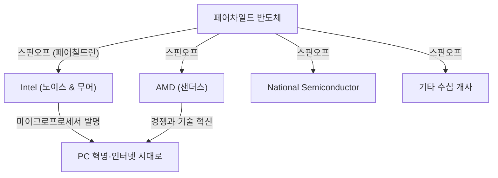

## 1. 시작하며: 세상을 바꾼 '반역'

현대 사회에서 스마트폰, 컴퓨터, 인터넷, AI 등 모든 기술의 근간을 지탱하는 것이 바로 '반도체'입니다. 그리고 그 반도체 산업의 중심지이자 전 세계 창업가들이 동경하는 혁신의 성지가 된 곳이 캘리포니아 북부에 위치한 '실리콘 밸리(Silicon Valley)'입니다.

Google, Apple, Meta(구 Facebook), Netflix 등 거대 기술 기업이 즐비한 이곳이 처음부터 지금과 같은 모습이었던 것은 아닙니다. 과거에는 과수원이 펼쳐진 조용한 농업 지대인 '산타클라라 밸리'에 불과했습니다. 그렇다면 왜 세계 최고 수준의 기술 허브로 변모하게 된 것일까요?

그 모든 것의 시작이라고 할 수 있는 것이 1957년에 일어난 하나의 '반역' 사건이었습니다. 한 천재 과학자 밑에 모였던 8명의 젊고 유능한 엔지니어들이 그를 떠나 자신들의 회사를 설립한 것입니다. 이들은 훗날 **'8인의 반역자(Traitorous Eight)'**라고 불리게 됩니다.

본 기사에서는 이 8명이 어떻게 만나고, 왜 반역을 결심했으며, 또 어떻게 현대 실리콘 밸리의 초석을 다지게 되었는지, 그 장대한 역사의 드라마를 깊이 파헤쳐 보겠습니다.

## 2. 시대적 배경: 트랜지스터의 발명과 '천재' 윌리엄 쇼클리

이야기의 원점은 1947년 겨울로 거슬러 올라갑니다. 미국 뉴저지주에 있는 벨 연구소에서 윌리엄 쇼클리, 존 바딘, 월터 브래튼 등 3명의 과학자가 진공관을 대체할 획기적인 전자 부품인 '트랜지스터'를 발명했습니다. 이로써 거대했던 컴퓨터의 소형화 및 고속화의 길이 열렸고, 이들 세 사람은 1956년 노벨 물리학상을 수상하게 됩니다.

하지만 트랜지스터의 공동 발명자 중 한 명인 윌리엄 쇼클리는 그 공적에 만족하지 않았습니다. 그는 자신의 손으로 직접 트랜지스터를 상업화하여 막대한 부를 쌓기를 꿈꿨습니다. 또한 그는 자기 과시욕이 매우 강했고, 스스로를 유일무이한 천재라고 굳게 믿는 인물이기도 했습니다.

벨 연구소를 떠난 쇼클리는 1956년, 자신의 고향이기도 한 캘리포니아주 팔로알토(스탠퍼드 대학교 인근)에 '쇼클리 반도체 연구소(Shockley Semiconductor Laboratory)'를 설립했습니다. 당시 반도체 산업의 중심지는 미국 동부 해안의 보스턴 주변이었지만, 쇼클리가 팔로알토를 선택한 이유는 병든 어머니 곁에 있기 위해서였습니다. 이 개인적인 이유로 인한 위치 선정이 훗날 실리콘 밸리라는 거대한 산업 집적지를 탄생시키는 첫 번째 우연이 됩니다.

## 3. 젊은 천재들의 집결

쇼클리는 노벨상 수상자(설립 직후 수상 결정)라는 절대적인 인지도와 카리스마를 활용하여 미국 전역에서 최고 수준의 재능을 가진 젊은 과학자와 엔지니어들을 스카우트했습니다. 그가 모은 사람들은 아직 무명이지만 압도적인 지능과 잠재력을 품은 20대 후반에서 30대 초반의 젊은이들이었습니다.

그중에는 훗날 '8인의 반역자'로 불리게 될 다음 8명이 포함되어 있었습니다.

1. **로버트 노이스(Robert Noyce)**: 카리스마적인 리더십을 가진 물리학자. 훗날 인텔을 창업하고 '실리콘 밸리의 시장'으로 불림.
2. **고든 무어(Gordon Moore)**: 과묵하고 사려 깊은 화학자. 유명한 '무어의 법칙' 창안자이며, 노이스와 함께 인텔을 창업.
3. **장 호에르니(Jean Hoerni)**: 스위스 출신의 이론 물리학자. 집적 회로(IC) 제조에 필수적인 '플래나 기술'을 훗날 발명.
4. **유진 클라이너(Eugene Kleiner)**: 오스트리아 출신의 기계 엔지니어. 훗날 실리콘 밸리를 대표하는 벤처 캐피털 '클라이너 퍼킨스'를 설립.
5. **줄리어스 블랭크(Julius Blank)**: 클라이너의 친구이자 유능한 기계 엔지니어.
6. **제이 라스트(Jay Last)**: 물리학자.
7. **빅터 그리니치(Victor Grinich)**: 전기 공학자.
8. **셸던 로버츠(Sheldon Roberts)**: 야금학자.

이들은 트랜지스터라는 최첨단 기술을 자신의 손으로 발전시킬 수 있다는 기대에 부풀어 동부 해안에서 서부 해안의 과수원 마을로 이주했습니다.

## 4. 붕괴를 향한 카운트다운: 천재의 편집증적인 경영

우수한 두뇌들이 모여 순조롭게 출발한 것처럼 보였던 쇼클리 반도체 연구소였지만, 내부는 곧 심각한 문제에 직면하게 됩니다. 그 원인은 다름 아닌 쇼클리 자신의 성격과 경영 방식에 있었습니다.

쇼클리는 뛰어난 과학자였지만, 경영자나 리더로서는 치명적인 결함을 안고 있었습니다. 그는 극단적인 마이크로 매니저였으며, 부하 직원을 전혀 신뢰하지 않았습니다.
구체적인 일화로 다음과 같은 비정상적인 행동들이 전해져 내려옵니다.

- **거짓말 탐지기 도입**: 연구소 내에서 사소한 실수(비서의 엄지손가락에 압정이 찔린 사건 등)가 발생하면, 이를 누군가의 음모로 의심하고 모든 직원에게 거짓말 탐지기(폴리그래프) 검사를 강요하려 했습니다.
- **독단적인 방침 변경**: 시장이 원하던 실리콘 트랜지스터 개발을 돌연 중단하고, 자신이 고안한 '4층 다이오드(쇼클리 다이오드)'라는 복잡하고 제조하기 어려운 장치 개발에 자원을 집중시켰습니다.
- **철저한 감시**: 직원들 간의 대화를 도청하거나, 부하 직원의 아이디어를 자신의 공적인 것처럼 발표하는 일이 일상화되어 있었습니다.

이러한 편집증적(파라노이악)인 지배 체제 아래에서 젊은 엔지니어들의 불만은 한계에 달했습니다. 노이스와 무어를 중심으로 한 멤버들은 쇼클리를 해임하고 자신들이 연구소를 운영하게 해달라고 모회사인 벡만 인스트루먼츠에 직소했지만, 노벨상 수상자인 쇼클리의 위광 앞에 그 호소는 기각되었습니다.

## 5. 결단: '8인의 반역자'의 탄생

1957년 여름, 마침내 그들은 결단을 내립니다. 쇼클리의 곁을 떠나 자신들만의 회사를 설립하는 것입니다.

당시 기업을 그만두고 경쟁이 되는 새로운 회사를 세우는 것은 사회적으로 '반역(Treason)'으로 여겨지던 시대였습니다. 종신 고용이 일반적이었으며, 독립 창업의 문화 따위는 존재하지 않았습니다. 쇼클리는 그들을 맹렬히 비난하며, **'8인의 반역자(Traitorous Eight)'**라고 불렀습니다. 하지만 이 낙인이야말로 훗날 실리콘 밸리의 기업가 정신을 상징하는 자랑스러운 칭호로 변하게 됩니다.

이들이 독립할 때 중요한 역할을 한 사람이 바로 유진 클라이너 아버지의 지인이었던 투자 은행가, **아서 록**입니다. 록은 이들 8명의 재능에서 압도적인 잠재력을 발견하고, 이들을 위한 자금 조달에 동분서주했습니다.
이때 록과 8명이 주고받은 '계약서'는 놀랍게도 1달러 지폐에 모두가 서명한 것이 전부였습니다. 이것이 현대 실리콘 밸리식 '벤처 캐피털'에 의한 스타트업 투자의 역사적인 첫걸음이 되었습니다.

최종적으로, 사진 기자재 등으로 부를 축적한 실업가 셔먼 페어차일드로부터 150만 달러의 투자를 유치하는 데 성공하여, 1957년 10월 그들은 **'페어차일드 반도체(Fairchild Semiconductor)'**를 설립했습니다.

## 6. 페어차일드 반도체의 도약과 기술 혁신

페어차일드 반도체는 설립 직후부터 눈부신 성공을 거둡니다. IBM으로부터의 대규모 수주를 시작으로, 그들은 압도적인 속도로 성장을 이룩했습니다.

그들의 성공 요인은 단순히 우수한 두뇌들이 모여 있었기 때문만은 아닙니다. 수평적인 조직 구조, 스톡옵션(자사주 매입권)을 통한 이익 공유, 정장이 아닌 캐주얼한 복장으로의 근무 등, 현재는 당연하게 여겨지는 **'실리콘 밸리적인 기업 문화'**를 그들 스스로가 이때 만들어낸 것입니다.

또한 기술적인 면에서도 세계 역사를 바꿀 두 가지 결정적인 발명을 이뤄냈습니다.

1. **플래나 기술의 발명(장 호에르니)**:
   반도체 표면을 산화막으로 덮어 평탄(플래나)한 상태에서 회로를 형성하는 기술. 이로써 트랜지스터의 대량 생산과 신뢰성 향상이 실현되었고, 반도체 제조의 표준이 되었습니다.

2. **집적 회로(IC)의 실용화(로버트 노이스)**:
   텍사스 인스트루먼츠의 잭 킬비와 거의 같은 시기에, 노이스는 호에르니의 플래나 기술을 응용하여 여러 개의 트랜지스터와 전자 부품을 하나의 실리콘 칩 위에 통합하는 '집적 회로(IC)'를 고안했습니다. 노이스의 방식은 양산에 매우 적합했으며, 이것이 현대의 모든 마이크로칩의 원형이 되었습니다.

## 7. '페어칠드런'들의 증식과 생태계의 완성

페어차일드 반도체는 큰 성공을 거두었지만, 모회사와의 대립과 성장에 따른 대기업병에 시달리게 됩니다. 그러자 과거 쇼클리를 뛰쳐나왔을 때와 마찬가지로, 페어차일드의 직원들도 차례차례 스핀오프(독립)하여 새로운 기업을 설립해 나갔습니다.

이들 페어차일드 출신들이 설립한 기업은 둥지를 떠나는 새끼 새들에 비유되어 **'페어칠드런(Fairchildren)'**이라고 불렸습니다.
그 가장 유명한 예가 1968년에 로버트 노이스와 고든 무어가 설립한 **인텔(Intel)**입니다. 그리고 그 이듬해, 마찬가지로 페어차일드 출신인 제리 샌더스 등에 의해 **AMD(Advanced Micro Devices)**가 설립되었습니다. 그 밖에도 내셔널 세미컨덕터 등 수많은 반도체 기업들이 페어차일드에서 파생되어 나갔습니다.

또한, 유진 클라이너는 투자자로 변신하여 클라이너 퍼킨스를 설립했습니다. 아마존과 구글 등에 대한 초기 투자를 진행했습니다. 자금 조달을 도왔던 아서 록 역시 실리콘 밸리로 거점을 옮겨 인텔과 애플의 창업을 지원하는 전설적인 벤처 캐피탈리스트가 되었습니다.

이렇게 하여 **'반역적인 기업가 정신', '스톡옵션을 통한 인센티브', '벤처 캐피털에 의한 위험 자금 공급', '수평적인 조직 문화'**라는 현대의 실리콘 밸리를 형성하는 생태계의 모든 퍼즐 조각이 '8인의 반역자'와 그 네트워크에서 만들어진 것입니다.

## 8. 맺음말: 그들이 남긴 진정한 유산

윌리엄 쇼클리라는 한 천재에 의한 억압적인 환경이 없었다면, '8인의 반역자'가 결속하여 뛰쳐나오는 일은 없었을 것입니다. 그리고 그들이 페어차일드 반도체를 설립하고 그곳에서 수많은 '페어칠드런'이 탄생하지 않았다면, 산타클라라 밸리가 '실리콘 밸리'로 불리는 일도 없었을 것입니다.

'반역'이라는 부정적인 단어로 시작된 그들의 행동은 결과적으로 전 세계 사람들의 삶을 근본적으로 바꾸는 기술 혁명의 연쇄를 일으켰습니다.
현실에 안주하지 않고, 권위를 두려워하지 않으며, 위험을 감수하고 자신의 비전을 실현하려는 정신. 이것이야말로 '8인의 반역자'가 현대 실리콘 밸리에 남긴 가장 위대한 유산입니다.
