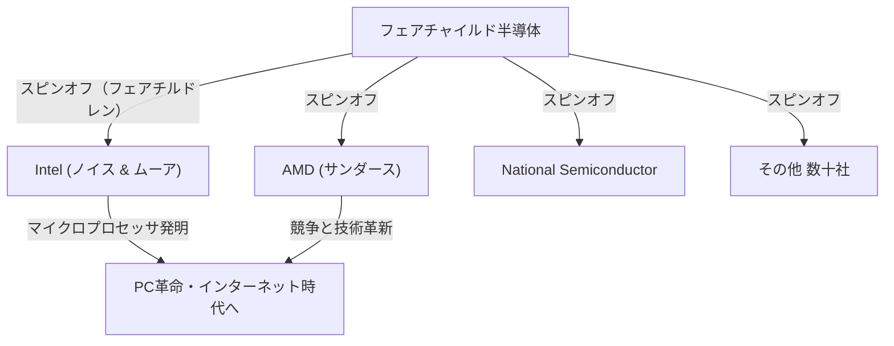

## 1. はじめに：世界を変えた「裏切り」

現代の世界において、スマートフォン、コンピューター、インターネット、AIといったあらゆるテクノロジーの根幹を支えているのが「半導体」です。そして、その半導体産業の中心地であり、世界中の起業家たちが憧れるイノベーションの聖地となっているのが、カリフォルニア州北部に位置する「シリコンバレー（Silicon Valley）」です。

Google、Apple、[Meta](/p/history-of-meta-facebook/)（[旧Facebook](/p/history-of-meta-facebook/)）、Netflixといった巨大テクノロジー企業がひしめくこの場所は、最初から現在のような姿をしていたわけではありません。かつては果樹園が広がる静かな農業地帯「サンタクララ・バレー」に過ぎませんでした。それがなぜ、世界最高峰のテクノロジーハブへと変貌を遂げたのでしょうか。

そのすべての始まりと言えるのが、1957年に起きた一つの「裏切り」事件でした。一人の天才科学者のもとに集まった8人の若き優秀なエンジニアたちが、彼のもとを去り、自らの会社を立ち上げたのです。彼らは後に**「8人の裏切り者（Traitorous Eight）」**と呼ばれることになります。

本記事では、この8人がどのようにして出会い、なぜ裏切りの決断を下し、そしてどのようにして現代のシリコンバレーの礎を築き上げたのか、その壮大な歴史のドラマを深く掘り下げていきます。

## 2. 時代背景：トランジスタの発明と「天才」ウィリアム・ショックレー

物語の原点は、1947年の冬に遡ります。アメリカのニュージャージー州にあるベル研究所で、ウィリアム・ショックレー、ジョン・バーディーン、ウォルター・ブラッテンの3人の科学者が、真空管に代わる画期的な電子部品「トランジスタ」を発明しました。これにより、巨大だったコンピューターの小型化・高速化の道が開かれ、彼ら3人は1956年にノーベル物理学賞を受賞することになります。

しかし、トランジスタの共同発明者の一人であるウィリアム・ショックレーは、その功績に満足していませんでした。彼は自らの手でトランジスタを商業化し、巨万の富を築くことを夢見ていました。また、彼は非常に自己顕示欲が強く、自らが唯一無二の天才であると信じて疑わない人物でもありました。

ベル研究所を去ったショックレーは、1956年、自身の故郷でもあるカリフォルニア州パロアルト（スタンフォード大学の近く）に「ショックレー半導体研究所（Shockley Semiconductor Laboratory）」を設立しました。当時、半導体産業の中心地はアメリカ東海岸のボストン周辺でしたが、ショックレーがパロアルトを選んだ理由は、病気の母親のそばにいるためでした。この個人的な理由によるロケーション選択が、後にシリコンバレーという巨大産業集積地を生み出す最初の偶然となります。

## 3. 若き天才たちの集結

ショックレーは、ノーベル賞受賞者（設立直後に受賞が決定）という絶大な知名度とカリスマ性を活かし、全米から最高レベルの才能を持つ若き科学者やエンジニアをスカウトしました。彼が集めたのは、まだ無名ながらも圧倒的な知能とポテンシャルを秘めた20代後半から30代前半の若者たちでした。

その中に、後に「8人の裏切り者」と呼ばれることになる以下の8人が含まれていました。

1. **ロバート・ノイス（Robert Noyce）**：カリスマ的リーダーシップを持つ物理学者。後にインテルを創業し、「シリコンバレーの市長」と呼ばれる。
2. **ゴードン・ムーア（Gordon Moore）**：寡黙で思慮深い化学者。有名な「[ムーアの法則](/p/business-moores-law/)」の提唱者であり、ノイスと共にインテルを創業。
3. **ジャン・ヘルニ（Jean Hoerni）**：スイス出身の理論物理学者。集積回路（IC）の製造に不可欠な「プレーナー技術」を後に発明。
4. **ユージーン・クライナー（Eugene Kleiner）**：オーストリア出身の機械エンジニア。後にシリコンバレーを代表するベンチャーキャピタル「クライナー・パーキンス」を設立。
5. **ジュリアス・ブランク（Julius Blank）**：クライナーの友人で優秀な機械エンジニア。
6. **ジェイ・ラスト（Jay Last）**：物理学者。
7. **ヴィクター・グリニッチ（Victor Grinich）**：電気工学者。
8. **シェルドン・ロバーツ（Sheldon Roberts）**：冶金学者。

彼らは、トランジスタという最先端の技術を自らの手で発展させられるという期待に胸を膨らませ、東海岸から西海岸の果樹園の町へと移り住みました。

## 4. 崩壊へのカウントダウン：天才の偏執狂的なマネジメント

優秀な頭脳が集結し、順風満帆にスタートしたかに見えたショックレー半導体研究所でしたが、内部はすぐに深刻な問題に直面します。その原因は、他ならぬショックレー自身の性格とマネジメント手法にありました。

ショックレーは傑出した科学者でしたが、経営者やリーダーとしては致命的な欠陥を抱えていました。彼は極度のマイクロマネージャーであり、部下を一切信用しませんでした。
具体的なエピソードとして、次のような常軌を逸した行動が語り継がれています。

- **嘘発見器の導入**：研究所内で些細なミス（秘書の親指に画鋲が刺さった事件など）が起きると、それを何者かの陰謀だと疑い、全社員に嘘発見器（ポリグラフ）による検査を強要しようとしました。
- **独断的な方針転換**：市場が求めていたシリコン・トランジスタの開発を突然中止し、自身が考案した「4層ダイオード（ショックレー・ダイオード）」という複雑で製造が難しいデバイスの開発にリソースを集中させました。
- **徹底的な監視**：社員同士の会話を盗聴したり、部下のアイデアを自分の手柄として発表したりすることが常態化していました。

このような偏執狂的（パラノイアック）な支配体制のもとで、若きエンジニアたちの不満は限界に達していきました。ノイスやムーアを中心とするメンバーは、ショックレーを解任して自分たちに研究所を運営させてほしいと親会社であるベックマン・インスツルメンツに直訴しましたが、ノーベル賞受賞者であるショックレーの威光を前に、その訴えは退けられました。

## 5. 決断：「8人の裏切り者」の誕生

1957年の夏、ついに彼らは決断を下します。ショックレーのもとを離れ、自分たち自身の会社を設立することです。

当時、企業を辞めて競合となる新しい会社を立ち上げることは、社会的に「裏切り（Treason）」と見なされる時代でした。終身雇用が一般的であり、独立起業の文化など存在しませんでした。ショックレーは彼らを激しく非難し、**「8人の裏切り者（Traitorous Eight）」**と呼びました。しかし、このレッテルこそが、後にシリコンバレーの起業家精神を象徴する誇り高き称号へと変わっていくのです。

彼らが独立する際、重要な役割を果たしたのが、ユージーン・クライナーの父親の知人であった投資銀行家、**アーサー・ロック**です。ロックは、彼ら8人の才能に圧倒的なポテンシャルを見出し、彼らのための資金調達に奔走しました。
この時、ロックと8人が交わした「契約書」は、なんと1ドル紙幣に全員がサインをしただけのものでした。これが、現代におけるシリコンバレー式「ベンチャーキャピタル」によるスタートアップ投資の歴史的な第一歩となりました。

最終的に、写真機材などで財を成した実業家シャーマン・フェアチャイルドから150万ドルの出資を取り付けることに成功し、1957年10月、彼らは**「フェアチャイルド半導体（Fairchild Semiconductor）」**を設立しました。

## 6. フェアチャイルド半導体の飛躍と技術革新

フェアチャイルド半導体は、設立直後から目覚ましい成功を収めます。IBMからの大型受注を皮切りに、彼らは圧倒的なスピードで成長を遂げました。

彼らの成功の要因は、単に優秀な頭脳が集まっていたからというだけではありません。フラットな組織構造、ストックオプション（自社株購入権）による利益の共有、スーツではなくカジュアルな服装での勤務など、現在では当たり前となっている**「シリコンバレー的な企業文化」**を彼ら自身がこの時に作り上げたのです。

さらに、技術面でも世界の歴史を変える2つの決定的な発明をもたらしました。

1. **プレーナー技術の発明（ジャン・ヘルニ）**：
   半導体の表面を酸化膜で覆い、平坦（プレーナー）な状態で回路を形成する技術。これにより、トランジスタの大量生産と信頼性の向上が実現し、半導体製造の標準となりました。

2. **集積回路（IC）の実用化（ロバート・ノイス）**：
   テキサス・インスツルメンツのジャック・キルビーとほぼ同時期に、ノイスはヘルニのプレーナー技術を応用し、複数のトランジスタや電子部品を1つのシリコンチップの上に統合する「集積回路（IC）」を考案しました。ノイスの方式は量産に非常に適しており、これが現代のすべてのマイクロチップの原型となりました。

## 7. 「フェアチルドレン」たちの増殖とエコシステムの完成

フェアチャイルド半導体は大成功を収めましたが、親会社との対立や、成長に伴う大企業病に悩まされるようになります。すると、かつてショックレーを飛び出した時と同じように、フェアチャイルドの社員たちも次々とスピンオフ（独立）し、新たな企業を立ち上げていきました。

彼らフェアチャイルド出身者たちが設立した企業は、親鳥から巣立つ子供たちに例えて**「フェアチルドレン（Fairchildren）」**と呼ばれました。
その最も有名な例が、1968年にロバート・ノイスとゴードン・ムーアが設立した**インテル（Intel）**です。さらにその翌年、同じくフェアチャイルド出身のジェリー・サンダースらによって**AMD（Advanced Micro Devices）**が設立されました。他にも、ナショナル セミコンダクターなど、数多くの半導体企業がフェアチャイルドから派生していきました。

また、ユージーン・クライナーは投資家へと転身し、クライナー・パーキンスを設立。アマゾンやグーグルなどへの初期投資を行いました。資金調達を手伝ったアーサー・ロックもシリコンバレーに拠点を移し、インテルやアップルの創業を支援する伝説的なベンチャーキャピタリストとなりました。

こうして、**「反逆的な起業家精神」「ストックオプションによるインセンティブ」「ベンチャーキャピタルによるリスクマネーの供給」「フラットな組織文化」**という、現代のシリコンバレーを形作るエコシステムのすべてのピースが、「8人の裏切り者」とそのネットワークから生み出されたのです。

## 8. おわりに：彼らが残した真の遺産

ウィリアム・ショックレーという一人の天才による抑圧的な環境がなければ、「8人の裏切り者」が結束して飛び出すことはなかったでしょう。そして、彼らがフェアチャイルド半導体を設立し、そこから数多の「フェアチルドレン」が生まれなければ、サンタクララ・バレーが「シリコンバレー」と呼ばれることもなかったはずです。

「裏切り」というネガティブな言葉で始まった彼らの行動は、結果として世界中の人々の生活を根本から変える技術革命の連鎖を引き起こしました。
現状に満足せず、権威を恐れず、リスクを取って自らのビジョンを実現しようとするスピリット。これこそが、「8人の裏切り者」が現代のシリコンバレーに残した最も偉大なる遺産なのです。
