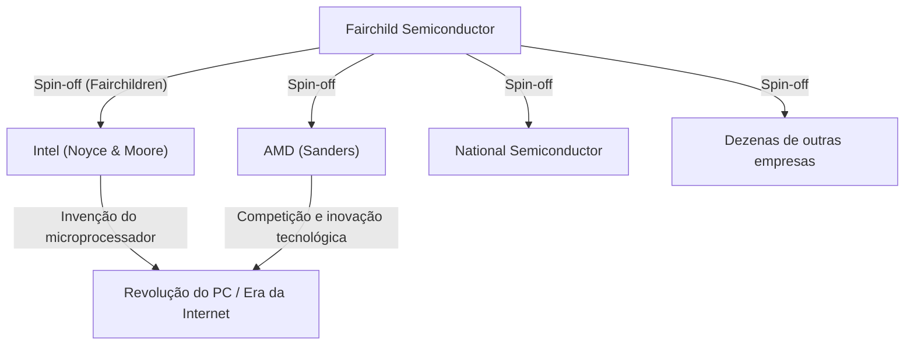

## 1. Introdução: A "Traição" que Mudou o Mundo

No mundo moderno, os "semicondutores" são a espinha dorsal de todas as tecnologias, como smartphones, computadores, internet e IA. E o centro dessa indústria de semicondutores, o santuário da inovação desejado por empreendedores de todo o mundo, é o "Vale do Silício" (Silicon Valley), localizado no norte da Califórnia.

Este lugar, onde gigantes da tecnologia como Google, Apple, Meta (anteriormente Facebook) e Netflix se aglomeram, não era assim desde o início. Antes, não passava de uma pacata região agrícola repleta de pomares, o "Vale de Santa Clara". Por que se transformou no maior polo de tecnologia do mundo?

Tudo começou com um incidente de "traição" que ocorreu em 1957. Oito jovens e brilhantes engenheiros, reunidos sob o comando de um genial cientista, o abandonaram para fundar sua própria empresa. Mais tarde, eles seriam conhecidos como os **"Oito Traidores" (Traitorous Eight)**.

Neste artigo, exploraremos a fundo o drama épico de como esses oito se conheceram, por que decidiram trair e como construíram as bases do moderno Vale do Silício.

## 2. Contexto Histórico: A Invenção do Transistor e o "Gênio" William Shockley

A origem da história remonta ao inverno de 1947. Nos Laboratórios Bell, em Nova Jersey, EUA, três cientistas - William Shockley, John Bardeen e Walter Brattain - inventaram o "transistor", um componente eletrônico revolucionário para substituir as válvulas termiônicas. Isso abriu caminho para a miniaturização e aceleração de computadores gigantescos, e os três receberam o Prêmio Nobel de Física em 1956.

No entanto, William Shockley, um dos coinventores do transistor, não estava satisfeito com essa conquista. Ele sonhava em comercializar o transistor por conta própria e construir uma enorme fortuna. Além disso, ele tinha um forte desejo de reconhecimento e acreditava firmemente ser um gênio incomparável.

Depois de deixar os Laboratórios Bell, Shockley fundou o "Laboratório de Semicondutores Shockley" (Shockley Semiconductor Laboratory) em 1956 em Palo Alto, Califórnia (perto da Universidade de Stanford), sua cidade natal. Na época, o centro da indústria de semicondutores ficava perto de Boston, na costa leste dos EUA, mas Shockley escolheu Palo Alto para ficar perto de sua mãe doente. Essa escolha de local por motivos pessoais seria o primeiro acaso a dar origem ao enorme aglomerado industrial conhecido como Vale do Silício.

## 3. O Encontro de Jovens Gênios

Aproveitando sua enorme fama e carisma como ganhador do Prêmio Nobel (concedido logo após a fundação), Shockley recrutou jovens cientistas e engenheiros de ponta de todos os Estados Unidos. Os recrutados eram jovens entre o final dos 20 e início dos 30 anos, ainda desconhecidos, mas com inteligência e potencial esmagadores.

Entre eles estavam os oito seguintes, que mais tarde seriam chamados de "Oito Traidores":

1. **Robert Noyce**: Um físico com liderança carismática. Mais tarde, fundou a Intel e foi chamado de "o prefeito do Vale do Silício".
2. **Gordon Moore**: Um químico quieto e pensativo. O proponente da famosa "Lei de Moore" e cofundador da Intel com Noyce.
3. **Jean Hoerni**: Um físico teórico da Suíça. Mais tarde, inventou o processo planar, essencial para a fabricação de circuitos integrados (CIs).
4. **Eugene Kleiner**: Um engenheiro mecânico nascido na Áustria. Mais tarde, fundou a "Kleiner Perkins", uma firma de capital de risco representativa do Vale do Silício.
5. **Julius Blank**: Amigo de Kleiner e um excelente engenheiro mecânico.
6. **Jay Last**: Físico.
7. **Victor Grinich**: Engenheiro elétrico.
8. **Sheldon Roberts**: Metalúrgico.

Cheios de expectativa por poderem desenvolver a tecnologia de ponta do transistor com as próprias mãos, eles se mudaram da costa leste para a cidade dos pomares na costa oeste.

## 4. Contagem Regressiva para o Colapso: A Gestão Paranoica de um Gênio

O Laboratório de Semicondutores Shockley, que parecia ter tido um início tranquilo com a reunião de mentes brilhantes, logo enfrentou problemas sérios internamente. A causa era, sem dúvida, a própria personalidade de Shockley e seu estilo de gestão.

Embora Shockley fosse um cientista notável, ele tinha falhas fatais como gerente e líder. Ele era um microgerenciador extremo e não confiava em seus subordinados.
Como exemplos específicos, as seguintes ações insanas foram transmitidas:

- **Introdução de detectores de mentiras**: Quando ocorria um pequeno erro no laboratório (como a secretária espetar o polegar em uma tachinha), ele suspeitava de uma conspiração e tentava forçar todos os funcionários a fazer testes de polígrafo.
- **Mudança arbitrária de direção**: Ele repentinamente interrompeu o desenvolvimento de transistores de silício, que o mercado exigia, e concentrou recursos no desenvolvimento de um dispositivo complexo e difícil de fabricar que ele havia inventado, o "diodo de quatro camadas (diodo Shockley)".
- **Vigilância implacável**: Tornou-se comum grampear conversas entre funcionários ou assumir o crédito pelas ideias de subordinados.

Sob esse regime de domínio paranoico, a insatisfação dos jovens engenheiros atingiu o limite. Os membros, liderados por Noyce e Moore, apelaram diretamente para a Beckman Instruments, a empresa controladora, para demitir Shockley e deixá-los administrar o laboratório, mas o apelo foi rejeitado diante da autoridade de Shockley como ganhador do Prêmio Nobel.

## 5. A Decisão: O Nascimento dos "Oito Traidores"

No verão de 1957, eles finalmente tomaram uma decisão: deixar Shockley e fundar sua própria empresa.

Naquela época, deixar uma empresa para fundar uma concorrente era visto socialmente como uma "traição" (Treason). O emprego vitalício era comum e não havia cultura de empreendedorismo independente. Shockley os condenou duramente, chamando-os de **"Oito Traidores" (Traitorous Eight)**. No entanto, esse mesmo rótulo se transformaria mais tarde em um título orgulhoso que simboliza o espírito empreendedor do Vale do Silício.

Quando se tornaram independentes, um papel importante foi desempenhado por **Arthur Rock**, um banqueiro de investimentos que era conhecido do pai de Eugene Kleiner. Rock viu um potencial avassalador no talento dos oito e trabalhou incansavelmente para levantar fundos para eles.
Nesta época, o "contrato" entre Rock e os oito era apenas um acordo assinado por todos em uma nota de 1 dólar. Este se tornou o primeiro passo histórico no investimento de startups por "capital de risco" no estilo do Vale do Silício moderno.

Finalmente, com sucesso na obtenção de um investimento de 1,5 milhão de dólares de Sherman Fairchild, um empresário que construiu sua fortuna em equipamentos fotográficos, eles fundaram a **"Fairchild Semiconductor"** em outubro de 1957.

## 6. O Salto da Fairchild Semiconductor e a Inovação Tecnológica

A Fairchild Semiconductor obteve sucesso notável logo após sua fundação. Começando com um grande pedido da IBM, eles cresceram a uma velocidade incrível.

O fator por trás do seu sucesso não foi apenas o fato de terem reunido mentes brilhantes. Eles mesmos criaram a **"cultura corporativa do Vale do Silício"** que agora é dada como certa: uma estrutura organizacional horizontal, divisão de lucros por meio de opções de ações e trabalhar com roupas casuais em vez de ternos.

Além disso, trouxeram duas invenções cruciais no campo da tecnologia que mudaram a história do mundo.

1. **Invenção do Processo Planar (Jean Hoerni)**:
   A tecnologia para cobrir a superfície de um semicondutor com um filme de óxido e formar um circuito em um estado plano (planar). Isso permitiu a produção em massa e maior confiabilidade de transistores, tornando-se o padrão para a fabricação de semicondutores.

2. **Uso prático de Circuitos Integrados (CI) (Robert Noyce)**:
   Quase na mesma época que Jack Kilby da Texas Instruments, Noyce aplicou o processo planar de Hoerni para criar um "circuito integrado (CI)", que integrava vários transistores e componentes eletrônicos em um único chip de silício. O método de Noyce era altamente adequado para produção em massa e tornou-se o protótipo de todos os microchips modernos.

## 7. A Multiplicação dos "Fairchildren" e a Conclusão do Ecossistema

A Fairchild Semiconductor teve um enorme sucesso, mas passou a sofrer com conflitos com a empresa controladora e a doença das grandes empresas que acompanhou o crescimento. Então, assim como quando deixaram Shockley no passado, os funcionários da Fairchild começaram a fazer spin-offs (se tornar independentes) um após o outro, criando novas empresas.

Essas empresas fundadas por ex-funcionários da Fairchild foram chamadas de **"Fairchildren"**, assemelhando-se a filhotes deixando o ninho de sua mãe.
O exemplo mais famoso é a **Intel**, fundada por Robert Noyce e Gordon Moore em 1968. No ano seguinte, a **AMD (Advanced Micro Devices)** foi fundada por Jerry Sanders e outros que também vieram da Fairchild. Muitas outras empresas de semicondutores, como a National Semiconductor, se originaram da Fairchild.

Eugene Kleiner também se tornou um investidor e fundou a Kleiner Perkins, fazendo investimentos iniciais na Amazon, Google, etc. Arthur Rock, que ajudou na captação de recursos, também se mudou para o Vale do Silício e se tornou um lendário capitalista de risco que apoiou a fundação da Intel e da Apple.

Assim, todas as peças do ecossistema que formam o Vale do Silício moderno - o **"espírito empreendedor rebelde"**, **"incentivos por meio de opções de ações"**, **"fornecimento de capital de risco por empresas de capital de risco"** e uma **"cultura organizacional horizontal"** - nasceram dos "Oito Traidores" e de sua rede.

## 8. Conclusão: O Verdadeiro Legado Que Deixaram

Se não fosse pelo ambiente opressivo criado por um gênio chamado William Shockley, os "Oito Traidores" nunca teriam se unido e partido. E se eles não tivessem fundado a Fairchild Semiconductor e os muitos "Fairchildren" não tivessem nascido dela, o Vale de Santa Clara não seria chamado de "Vale do Silício".

Suas ações, que começaram com a palavra negativa "traição", resultaram em uma cadeia de revoluções tecnológicas que mudaram fundamentalmente a vida de pessoas em todo o mundo.
O espírito de não se contentar com o status quo, de não temer a autoridade e de assumir riscos para realizar a própria visão: este é, de fato, o maior legado deixado pelos "Oito Traidores" no Vale do Silício moderno.
