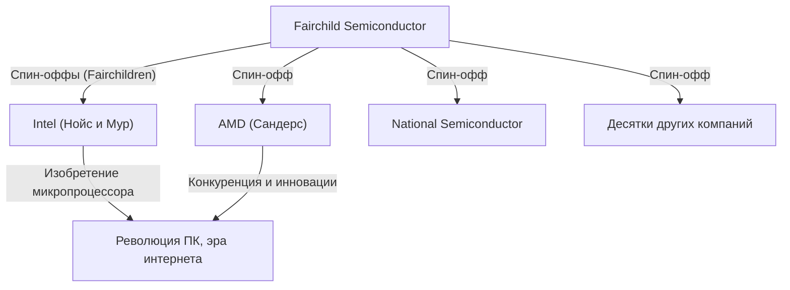

## 1. Введение: "Предательство", изменившее мир

Полупроводники — это основа всех технологий в современном мире, включая смартфоны, компьютеры, интернет и ИИ. Центром полупроводниковой промышленности и священным местом инноваций, к которому стремятся предприниматели со всего мира, является Кремниевая долина (Silicon Valley), расположенная в Северной Калифорнии.

Это место, где сейчас теснятся такие гиганты технологий, как Google, Apple, Meta (ранее Facebook) и Netflix, не всегда выглядело так. Когда-то это был просто тихий сельскохозяйственный район долины Санта-Клара, усеянный фруктовыми садами. Как же он превратился в главный технологический хаб мира?

Все началось с одного "предательства" в 1957 году. Восемь молодых и талантливых инженеров, собравшихся вокруг одного гениального ученого, покинули его и основали собственную компанию. Позже их назовут **"Вероломной восьмеркой" (Traitorous Eight)**.

В этой статье мы углубимся в грандиозную историческую драму: как встретились эти 8 человек, почему они решились на предательство, и как они заложили основы современной Кремниевой долины.

## 2. Исторический контекст: изобретение транзистора и "гений" Уильям Шокли

Истоки истории уходят в зиму 1947 года. В Лабораториях Белла (Bell Labs) в Нью-Джерси трое ученых — Уильям Шокли, Джон Бардин и Уолтер Браттейн — изобрели "транзистор", революционный электронный компонент, пришедший на смену вакуумным лампам. Это открыло путь к миниатюризации и ускорению огромных компьютеров, и в 1956 году эта троица получила Нобелевскую премию по физике.

Однако Уильям Шокли, один из соавторов изобретения транзистора, не был удовлетворен этим достижением. Он мечтал лично коммерциализировать транзистор и сколотить огромное состояние. Кроме того, он обладал сильной жаждой самоутверждения и непоколебимо верил, что он — единственный и неповторимый гений.

Покинув Лаборатории Белла в 1956 году, Шокли основал "Лабораторию полупроводников Шокли" (Shockley Semiconductor Laboratory) в своем родном городе Пало-Альто (недалеко от Стэнфордского университета) в Калифорнии. В то время центром полупроводниковой промышленности были окрестности Бостона на Восточном побережье, но Шокли выбрал Пало-Альто, чтобы быть рядом с больной матерью. Этот выбор местоположения по личным причинам стал первой случайностью, которая позже породила гигантский промышленный кластер Кремниевой долины.

## 3. Сбор молодых гениев

Используя свою огромную известность и харизму лауреата Нобелевской премии (полученной вскоре после основания лаборатории), Шокли набрал молодых ученых и инженеров высочайшего уровня со всей страны. Это были молодые люди в возрасте от 20 до 35 лет, еще неизвестные, но обладающие невероятным интеллектом и потенциалом.

Среди них были следующие 8 человек, которых позже назовут "Вероломной восьмеркой":

1. **Роберт Нойс (Robert Noyce)**: физик с харизматичным лидерством. Позже он основал Intel и был прозван "мэром Кремниевой долины".
2. **Гордон Мур (Gordon Moore)**: немногословный и вдумчивый химик. Автор знаменитого "закона Мура", он вместе с Нойсом основал Intel.
3. **Жан Эрни (Jean Hoerni)**: физик-теоретик из Швейцарии. Позже он изобрел "планарную технологию", необходимую для производства интегральных схем (ИС).
4. **Юджин Клейнер (Eugene Kleiner)**: инженер-механик австрийского происхождения. Позже он основал Kleiner Perkins — одну из ведущих венчурных фирм Кремниевой долины.
5. **Джулиус Бланк (Julius Blank)**: друг Клейнера и отличный инженер-механик.
6. **Джей Ласт (Jay Last)**: физик.
7. **Виктор Гринич (Victor Grinich)**: инженер-электрик.
8. **Шелдон Робертс (Sheldon Roberts)**: металлург.

В предвкушении возможности своими руками развивать передовую технологию транзисторов, они переехали с Восточного побережья в город фруктовых садов на Западном побережье.

## 4. Обратный отсчет до краха: параноидальный менеджмент гения

Казалось бы, Лаборатория полупроводников Шокли успешно стартовала, собрав выдающиеся умы, но внутри нее вскоре возникли серьезные проблемы. Причиной стал характер и методы управления самого Шокли.

Шокли был выдающимся ученым, но у него были фатальные недостатки как у менеджера и лидера. Он был крайним микроменеджером и совершенно не доверял своим подчиненным.
Сохранились истории о следующих его эксцентричных поступках:

- **Внедрение детектора лжи**: когда в лаборатории происходила мелкая оплошность (например, секретарша уколола большой палец канцелярской кнопкой), он подозревал в этом чей-то заговор и пытался заставить всех сотрудников пройти проверку на полиграфе.
- **Самовольная смена курса**: он внезапно прекратил разработку кремниевых транзисторов, которые требовались рынку, и сосредоточил ресурсы на разработке сложного и трудно производимого устройства — "четырехслойного диода" (диода Шокли), который он сам придумал.
- **Тотальная слежка**: прослушивание разговоров между сотрудниками и выдача идей подчиненных за свои собственные стали нормой.

В условиях такого параноидального контроля недовольство молодых инженеров достигло предела. Группа во главе с Нойсом и Муром обратилась напрямую в материнскую компанию Beckman Instruments с просьбой отстранить Шокли и позволить им самим управлять лабораторией, но перед авторитетом лауреата Нобелевской премии их апелляция была отклонена.

## 5. Решение: рождение "Вероломной восьмерки"

Летом 1957 года они наконец приняли решение: уйти от Шокли и основать собственную компанию.

В то время уход из компании для создания конкурента социально считался "предательством" (Treason). Пожизненный найм был нормой, а культуры независимого предпринимательства не существовало. Шокли яростно осудил их и назвал **"Вероломной восьмеркой" (Traitorous Eight)**. Однако этот ярлык в конечном итоге превратился в почетное звание, символизирующее предпринимательский дух Кремниевой долины.

Важную роль в их уходе сыграл **Артур Рок (Arthur Rock)**, инвестиционный банкир, знакомый отца Юджина Клейнера. Рок увидел в их талантах колоссальный потенциал и приложил все усилия, чтобы привлечь для них финансирование.
"Контракт", подписанный Роком и восьмеркой в тот раз, представлял собой просто 1-долларовую купюру, на которой все поставили свои подписи. Это стало первым историческим шагом в стартовых инвестициях со стороны венчурного капитала в стиле современной Кремниевой долины.

В итоге им удалось привлечь 1,5 миллиона долларов от Шермана Фэрчайлда (Sherman Fairchild), бизнесмена, сколотившего состояние на фотооборудовании, и в октябре 1957 года они основали **Fairchild Semiconductor**.

## 6. Взлет Fairchild Semiconductor и технологические инновации

Сразу после основания Fairchild Semiconductor добилась поразительного успеха. Начав с крупного заказа от IBM, они росли с невероятной скоростью.

Причиной их успеха было не только собрание блестящих умов. Плоская организационная структура, распределение прибыли через опционы на акции и повседневная (casual) одежда на работе вместо костюмов — **корпоративная культура в стиле Кремниевой долины**, которая сегодня стала нормой, была создана ими самими именно тогда.

Кроме того, в технологическом плане они совершили два решающих изобретения, изменивших мировую историю.

1. **Изобретение планарной технологии (Жан Эрни)**:
   Технология, при которой поверхность полупроводника покрывается оксидной пленкой, и схема формируется в плоском (планарном) состоянии. Это позволило наладить массовое производство транзисторов и повысить их надежность, став стандартом в производстве полупроводников.

2. **Практическое применение интегральных схем (ИС) (Роберт Нойс)**:
   Примерно в то же время, что и Джек Килби из Texas Instruments, Нойс применил планарную технологию Эрни и придумал "интегральную схему" (ИС), объединяющую несколько транзисторов и электронных компонентов на одном кремниевом чипе. Метод Нойса был очень удобен для массового производства, и именно он стал прототипом всех современных микрочипов.

## 7. Распространение "детей Фэрчайлда" и завершение создания экосистемы

Fairchild Semiconductor добилась огромного успеха, но со временем начала страдать от конфликтов с материнской компанией и "болезни крупной корпорации", связанной с ростом. В результате, так же, как когда-то они ушли от Шокли, сотрудники Fairchild один за другим стали уходить (spin-off) и создавать новые компании.

Компании, основанные выходцами из Fairchild, стали называть **"детьми Фэрчайлда" (Fairchildren)**, сравнивая их с птенцами, покидающими гнездо.
Самым известным примером является **Intel**, основанная Робертом Нойсом и Гордоном Муром в 1968 году. На следующий год Джерри Сандерс и другие выходцы из Fairchild основали **AMD (Advanced Micro Devices)**. Кроме того, от Fairchild отделилось множество других полупроводниковых компаний, таких как National Semiconductor.

Юджин Клейнер стал инвестором и основал Kleiner Perkins, компанию, которая позже сделала ранние инвестиции в Amazon, Google и другие. Артур Рок, который помог привлечь финансирование, также перенес свою базу в Кремниевую долину и стал легендарным венчурным капиталистом, поддержавшим создание Intel и Apple.

Таким образом, все элементы экосистемы, формирующей современную Кремниевую долину — **"бунтарский дух предпринимательства", "стимулы в виде опционов на акции", "предоставление рискового капитала венчурными фондами" и "плоская организационная культура"** — родились из "Вероломной восьмерки" и ее сети.

## 8. Заключение: их истинное наследие

Если бы не деспотичная атмосфера, созданная одним гением, Уильямом Шокли, "Вероломная восьмерка" никогда бы не объединилась и не ушла. А если бы они не основали Fairchild Semiconductor, из которой вышло множество "детей Фэрчайлда", долина Санта-Клара, скорее всего, никогда бы не получила название "Кремниевая долина".

Их действия, начавшиеся с негативного слова "предательство", в итоге вызвали цепную реакцию технологической революции, которая в корне изменила жизнь людей по всему миру.
Дух, не удовлетворяющийся статус-кво, не боящийся авторитетов, готовый рисковать для реализации собственного видения. Именно это и есть величайшее наследие, которое "Вероломная восьмерка" оставила современной Кремниевой долине.
