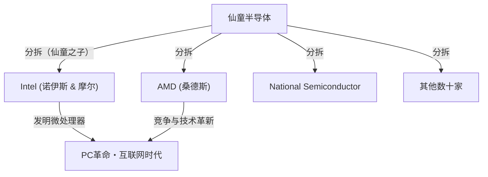

## 1. 引言：改变世界的“背叛”

在现代世界中，支撑智能手机、计算机、互联网和人工智能等所有技术根基的是“半导体”。而作为这个半导体产业的中心，并成为全世界创业者向往的创新圣地，正是位于加利福尼亚州北部的“硅谷”（Silicon Valley）。

谷歌（Google）、苹果（Apple）、[Meta](/zh-cn/p/history-of-meta-facebook/)（原Facebook）、奈飞（Netflix）等巨头科技企业云集的这个地方，并非从一开始就是如今的模样。这里曾经只是一个遍布果园的宁静农业区——“圣克拉拉谷”（Santa Clara Valley）。那么，它为什么会蜕变成为世界顶级的科技枢纽呢？

这一切的开端，可以说是发生在1957年的一起“背叛”事件。聚集在一位天才科学家手下的8位年轻优秀的工程师，离开了他并创立了自己的公司。他们后来被称为**“八叛逆”（Traitorous Eight）**。

本文将深入探讨这8人是如何相遇的，为什么会做出背叛的决定，以及他们是如何奠定现代硅谷基础的，带您深入了解这段宏大的历史故事。

## 2. 时代背景：晶体管的发明与“天才”威廉·肖克利

故事的原点可以追溯到1947年的冬天。在美国新泽西州的贝尔实验室，威廉·肖克利（William Shockley）、约翰·巴丁（John Bardeen）和沃尔特·布拉顿（Walter Brattain）三位科学家发明了取代真空管的革命性电子元件“晶体管”。这为曾经庞大的计算机实现小型化和高速化开辟了道路，这三人也因此在1956年获得了诺贝尔物理学奖。

然而，作为晶体管的共同发明者之一，威廉·肖克利对这一成就并不满足。他梦想着亲手将晶体管商业化，积累巨额财富。此外，他有着极强的表现欲，并且坚信自己是独一无二的天才。

离开贝尔实验室后，肖克利于1956年在自己的故乡，即加利福尼亚州帕洛阿尔托（斯坦福大学附近），成立了“肖克利半导体实验室”（Shockley Semiconductor Laboratory）。当时，半导体产业的中心还是在美国东海岸波士顿周边，肖克利选择帕洛阿尔托的原因是为了陪伴生病的母亲。这个出于个人原因的地点选择，成为了后来催生出硅谷这一巨大产业聚集地的最初偶然。

## 3. 年轻天才们的集结

肖克利利用诺贝尔奖获得者（成立后不久确定获奖）这一极高的知名度和感召力，从全美招募了拥有最高水平天赋的年轻科学家和工程师。他召集的是一群虽然当时默默无闻，但却蕴藏着惊人智慧和潜力的二三十岁的年轻人。

其中，就包括后来被称为“八叛逆”的以下8人：

1. **罗伯特·诺伊斯（Robert Noyce）**：具有超凡领导力的物理学家。后来创立了英特尔（Intel），被称为“硅谷市长”。
2. **戈登·摩尔（Gordon Moore）**：沉默寡言、深思熟虑的化学家。著名的“[摩尔定律](/zh-cn/p/business-moores-law/)”提出者，与诺伊斯共同创立了英特尔。
3. **让·霍尔尼（Jean Hoerni）**：出生于瑞士的理论物理学家。后来发明了集成电路（IC）制造中不可或缺的“平面工艺”。
4. **尤金·克莱纳（Eugene Kleiner）**：出生于奥地利的机械工程师。后来创立了代表硅谷的风险投资公司“凯鹏华盈”（Kleiner Perkins）。
5. **朱利叶斯·布兰克（Julius Blank）**：克莱纳的朋友，优秀的机械工程师。
6. **杰伊·拉斯特（Jay Last）**：物理学家。
7. **维克托·格里尼奇（Victor Grinich）**：电气工程师。
8. **谢尔顿·罗伯茨（Sheldon Roberts）**：冶金学家。

他们怀揣着能亲手发展晶体管这一最尖端技术的期待，从东海岸搬到了西海岸的果园小镇。

## 4. 走向崩溃的倒计时：天才偏执狂的管理

优秀的大脑集结于此，肖克利半导体实验室看似起步顺利，但内部很快就面临了严重的问题。其原因不是别的，正是肖克利本人的性格和管理方式。

肖克利是一位杰出的科学家，但作为经营者和领导者却有着致命的缺陷。他是一个极度的微观管理者，完全不信任下属。
作为具体的例子，以下这些反常的行为被流传至今：

- **引入测谎仪**：实验室里发生微小的失误（如秘书的大拇指被图钉扎到）时，他就会怀疑是某人的阴谋，并试图强迫所有员工接受测谎仪测试。
- **独断专行的方针转变**：他突然中止了市场需求的硅晶体管的开发，将资源集中于开发自己构想的名为“四层二极管（肖克利二极管）”的复杂且难以制造的器件。
- **彻底的监视**：窃听员工之间的对话、把下属的想法当作自己的功劳发表，这些都成了家常便饭。

在这种偏执狂（Paranoiac）般的统治体制下，年轻工程师们的不满达到了极限。以诺伊斯和摩尔为核心的成员向母公司贝克曼仪器（Beckman Instruments）直接上诉，要求解雇肖克利并让他们自己运营实验室，但在诺贝尔奖获得者肖克利的威望面前，这一诉求被驳回了。

## 5. 决定：“八叛逆”的诞生

1957年的夏天，他们终于做出了决定。离开肖克利，成立自己的公司。

在当时，辞去工作并创立具有竞争关系的新公司，在社会上被视为一种“背叛”（Treason）。终身雇佣制是普遍现象，根本不存在独立创业的文化。肖克利强烈谴责他们，并称他们为**“八叛逆”（Traitorous Eight）**。然而，正是这个标签，后来变成了象征硅谷企业家精神的引以为豪的称号。

在他们独立时，发挥重要作用的是尤金·克莱纳父亲的熟人——投资银行家**阿瑟·洛克（Arthur Rock）**。洛克在他们8人的才华中看到了惊人的潜力，并为他们四处奔走筹集资金。
当时，洛克与8人签订的“合同”，竟然只是所有人都在一张1美元纸币上签了名。这成为了现代硅谷式“风险投资”对初创企业投资的历史性第一步。

最终，他们成功从靠摄影器材等发家的实业家谢尔曼·费尔柴尔德（Sherman Fairchild）那里获得了150万美元的投资，并于1957年10月成立了<strong>“仙童半导体”（Fairchild Semiconductor）</strong>。

## 6. 仙童半导体的飞跃与技术革新

仙童半导体成立后不久便取得了显著的成功。以获得IBM的大型订单为开端，他们以惊人的速度实现了增长。

他们成功的因素不仅仅是因为聚集了优秀的大脑。扁平化的组织结构、通过股票期权分享利润、穿着休闲服装而不是西装上班等，如今被视为理所当然的<strong>“硅谷式企业文化”</strong>，正是由他们自己在那时创造出来的。

此外，在技术方面，他们也带来了改变世界历史的两项决定性发明。

1. **平面工艺的发明（让·霍尔尼）**：
   在半导体表面覆盖氧化膜，并在平坦（平面）状态下形成电路的技术。这实现了晶体管的大规模生产并提高了可靠性，成为了半导体制造的标准。

2. **集成电路（IC）的实用化（罗伯特·诺伊斯）**：
   几乎与德州仪器（Texas Instruments）的杰克·基尔比（Jack Kilby）同一时期，诺伊斯应用霍尔尼的平面工艺，构想出了将多个晶体管和电子元件集成在单个硅片上的“集成电路（IC）”。诺伊斯的方法非常适合量产，这成为了现代所有微芯片的雏形。

## 7. “仙童之子”的繁衍与生态系统的完成

仙童半导体取得了巨大的成功，但后来开始受到与母公司冲突以及伴随增长而来的大企业病的困扰。于是，就像曾经离开肖克利一样，仙童的员工们也纷纷分拆（独立）出去，成立了新的企业。

这些由仙童前员工创立的企业，被比作离开母鸟巢穴的孩子，被称为**“仙童之子”（Fairchildren）**。
其中最著名的例子就是1968年由罗伯特·诺伊斯和戈登·摩尔创立的**英特尔（Intel）**。而在第二年，同样出身仙童的杰里·桑德斯（Jerry Sanders）等人创立了**AMD（Advanced Micro Devices）**。此外，还有国家半导体（National Semiconductor）等众多半导体企业从仙童派生出来。

同时，尤金·克莱纳转型成为投资人，成立了凯鹏华盈（Kleiner Perkins），并对亚马逊和谷歌等进行了早期投资。曾协助筹集资金的阿瑟·洛克也把基地转移到了硅谷，成为支持英特尔和苹果创业的传奇风险投资家。

就这样，**“反叛的企业家精神”、“通过股票期权的激励机制”、“风险投资提供风险资金”、“扁平化的组织文化”**——构成现代硅谷生态系统的所有拼图，都是由“八叛逆”及其网络孕育而生的。

## 8. 结语：他们留下的真正遗产

如果没有威廉·肖克利这样一个天才所造成的压抑环境，“八叛逆”就不会团结一致地出走。如果他们没有创立仙童半导体，也就不会有无数的“仙童之子”诞生，圣克拉拉谷也许永远不会被称为“硅谷”。

他们以“背叛”这个消极词汇开头的行动，最终引发了一场从根本上改变全世界人们生活的技术革命连锁反应。
不满足于现状、不畏惧权威、敢于承担风险以实现自己愿景的精神。这正是“八叛逆”留给现代硅谷最伟大的遗产。
