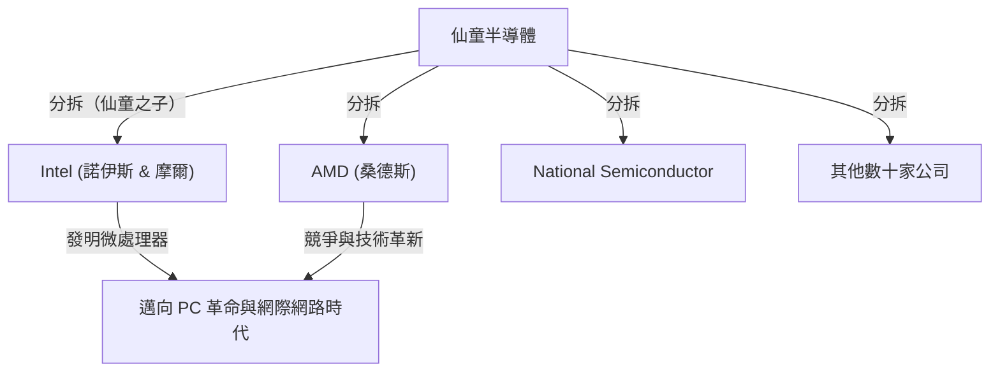

## 1. 前言：改變世界的「背叛」

在現代世界中，支撐智慧型手機、電腦、網際網路、AI 等所有科技根基的正是「半導體」。而作為半導體產業的中心地，並成為全世界創業者所嚮往的創新聖地的，正是位於加州北部的「矽谷（Silicon Valley）」。

這個擠滿了 Google、Apple、Meta（原 Facebook）、Netflix 等巨大科技公司的地方，並非從一開始就是現在的樣貌。過去這裡不過是果園綿延、寧靜的農業地帶「聖塔克拉拉谷（Santa Clara Valley）」。那為什麼它會蛻變為世界最頂尖的科技樞紐呢？

可以說一切的開端，都源自 1957 年發生的一起「背叛」事件。聚集在一位天才科學家麾下的 8 位年輕優秀工程師，離開了他並創立了自己的公司。他們後來被稱為**「八叛逆（Traitorous Eight）」**。

本文將深入探討這 8 人是如何相遇、為何做出背叛的決定，以及他們是如何奠定現代矽谷的基礎，為您解開這段壯闊的歷史戲劇。

## 2. 時代背景：電晶體的發明與「天才」威廉·蕭克利

故事的原點要追溯到 1947 年的冬天。在美國紐澤西州的貝爾實驗室中，威廉·蕭克利（William Shockley）、約翰·巴丁（John Bardeen）與沃爾特·布拉頓（Walter Brattain）這 3 位科學家，發明了取代真空管的劃時代電子元件「電晶體」。這開啟了原本巨大的電腦走向小型化、高速化的道路，他們 3 人也因此於 1956 年獲得了諾貝爾物理學獎。

然而，作為電晶體共同發明人之一的威廉·蕭克利，並不滿足於這項功績。他夢想著能親手將電晶體商業化，建立起龐大的財富。同時，他也是個展現慾極強、堅信自己是獨一無二的天才的人。

離開貝爾實驗室後，蕭克利於 1956 年在自己的故鄉，加州帕羅奧圖（史丹佛大學附近）設立了「蕭克利半導體實驗室（Shockley Semiconductor Laboratory）」。當時半導體產業的中心地在美國東岸的波士頓周邊，但蕭克利選擇帕羅奧圖的原因，是為了陪伴生病的母親。這個基於個人理由的地點選擇，成為了後來孕育出矽谷這個巨大產業聚落的第一個偶然。

## 3. 年輕天才們的集結

蕭克利活用了諾貝爾獎得主（設立後不久確定獲獎）的極高知名度與領袖魅力，從全美各地挖角了擁有最高水準才華的年輕科學家與工程師。他所招募的，是當時雖然默默無名，卻隱藏著壓倒性智慧與潛力的 20 歲後半到 30 歲前半的年輕人們。

其中，包含了後來被稱為「八叛逆」的以下 8 人：

1. **羅伯特·諾伊斯（Robert Noyce）**：擁有非凡領導力的物理學家。後來創立了 Intel，被稱為「矽谷的市長」。
2. **高登·摩爾（Gordon Moore）**：沉默寡言且深思熟慮的化學家。著名的「摩爾定律」提出者，與諾伊斯共同創立 Intel。
3. **金·赫爾尼（Jean Hoerni）**：瑞士出身的理論物理學家。後來發明了製造積體電路（IC）不可或缺的「平面工藝（Planar process）」。
4. **尤金·克萊納（Eugene Kleiner）**：奧地利出身的機械工程師。後來設立了代表矽谷的創投公司「克萊納·珀金斯（Kleiner Perkins）」。
5. **朱利亞斯·布蘭克（Julius Blank）**：克萊納的朋友，優秀的機械工程師。
6. **傑·拉斯特（Jay Last）**：物理學家。
7. **維克多·格里尼奇（Victor Grinich）**：電機工程師。
8. **謝爾頓·羅伯茨（Sheldon Roberts）**：冶金學家。

他們滿懷著能親手發展電晶體這項最尖端技術的期待，從東岸搬遷到了西岸的果園小鎮。

## 4. 崩壞的倒數計時：天才偏執狂般的管理

優秀的頭腦集結，看似一帆風順起步的蕭克利半導體實驗室，內部卻很快地面臨了嚴重的問題。其原因無他，正是蕭克利本身的性格與管理手法。

蕭克利雖然是傑出的科學家，但作為經營者和領導者卻有著致命的缺陷。他是個極度的微觀管理者（Micromanager），完全不信任部下。
具體來說，流傳著以下這些脫離常軌的行為：

- **導入測謊機**：實驗室內只要發生微小的失誤（例如秘書的大拇指被圖釘刺到等事件），他就會懷疑是某人的陰謀，並企圖強迫全體員工接受測謊機（Polygraph）的檢查。
- **獨斷的方針轉換**：突然中止開發市場需求的矽電晶體，將資源集中於開發自己構思的「四層二極體（蕭克利二極體）」這種複雜且難以製造的元件上。
- **徹底的監視**：經常竊聽員工之間的對話，或是將部下的點子作為自己的功勞發表。

在這樣偏執狂（Paranoiac）般的統治體制下，年輕工程師們的不滿達到了極限。以諾伊斯與摩爾為中心的成員，曾直接向母公司貝克曼儀器（Beckman Instruments）請願，希望解雇蕭克利並讓他們來營運實驗室，但在諾貝爾獎得主蕭克利的威光前，這項訴求被駁回了。

## 5. 決斷：「八叛逆」的誕生

1957 年夏天，他們終於下定了決心。那就是離開蕭克利，設立屬於他們自己的公司。

在當時，辭去企業職務並成立競爭對手的新公司，在社會上被視為一種「背叛（Treason）」。那是一個終身僱用制普遍的時代，根本不存在獨立創業的文化。蕭克利嚴厲地譴責了他們，並稱他們為**「八叛逆（Traitorous Eight）」**。然而，這個標籤後來卻變成了象徵矽谷企業家精神、引以為傲的稱號。

在他們獨立時，扮演著重要角色的是尤金·克萊納父親的熟人，投資銀行家**亞瑟·洛克（Arthur Rock）**。洛克在他們 8 人的才華中看見了壓倒性的潛力，為了他們到處奔走籌集資金。
當時，洛克與這 8 人所交換的「合約」，竟然只是所有人都在一張 1 美元紙鈔上簽名而已。這成為了現代矽谷式「創投公司」進行新創投資的歷史性第一步。

最終，他們成功從靠攝影器材等致富的實業家謝爾曼·費爾柴爾德（Sherman Fairchild）那裡獲得了 150 萬美元的出資，並於 1957 年 10 月設立了**「仙童半導體（Fairchild Semiconductor）」**。

## 6. 仙童半導體的飛躍與技術革新

仙童半導體在設立後不久便取得了驚人的成功。以來自 IBM 的大型訂單為開端，他們以壓倒性的速度實現了成長。

他們成功的因素，不僅僅是因為聚集了優秀的頭腦。扁平的組織結構、透過員工認股權（Stock Option）共享利潤、穿著休閒服裝而非西裝上班等，這些現在看來理所當然的**「矽谷式企業文化」**，正是由他們自己在那個時候創造出來的。

此外，在技術層面上，他們也帶來了兩項改變世界歷史的決定性發明。

1. **平面工藝的發明（金·赫爾尼）**：
   這是一種用氧化膜覆蓋半導體表面，在平坦（Planar）的狀態下形成電路的技術。這實現了電晶體的大量生產與可靠性的提升，成為了半導體製造的標準。

2. **積體電路（IC）的實用化（羅伯特·諾伊斯）**：
   幾乎與德州儀器（Texas Instruments）的傑克·基爾比（Jack Kilby）同一時期，諾伊斯應用了赫爾尼的平面工藝，構思出了將多個電晶體與電子元件整合在一個矽晶片上的「積體電路（IC）」。諾伊斯的方法非常適合量產，這成為了現代所有微晶片的雛形。

## 7. 「仙童之子」們的增生與生態系統的完成

仙童半導體雖然取得了巨大的成功，但也開始苦於與母公司的對立以及伴隨成長而來的大企業病。於是，就像過去逃離蕭克利時一樣，仙童的員工們也陸續分拆（Spin-off）獨立，成立了新的企業。

這些由仙童出身者所設立的企業，被比喻為從母鳥離巢的孩子們，稱為**「仙童之子（Fairchildren）」**。
其中最著名的例子，就是 1968 年由羅伯特·諾伊斯與高登·摩爾所設立的 **Intel**。緊接著在隔年，同樣是仙童出身的傑瑞·桑德斯（Jerry Sanders）等人設立了 **AMD（Advanced Micro Devices）**。此外還有國家半導體（National Semiconductor）等，有許多半導體企業都是從仙童衍生出來的。

另外，尤金·克萊納轉型為投資者，設立了克萊納·珀金斯，對亞馬遜（Amazon）和 Google 等進行了早期投資。協助籌集資金的亞瑟·洛克也將據點移至矽谷，成為了支援 Intel 和蘋果（Apple）創業的傳奇創投家。

就這樣，**「反叛的企業家精神」、「透過員工認股權的激勵」、「由創投公司提供風險資金」、「扁平的組織文化」**等，構成現代矽谷生態系統的所有拼圖，都是由「八叛逆」及其網路所孕育出來的。

## 8. 結語：他們留下的真正遺產

如果沒有威廉·蕭克利這位天才所帶來的高壓環境，「八叛逆」就不會團結起來出走。如果他們沒有設立仙童半導體，並從那裡誕生出無數的「仙童之子」，聖塔克拉拉谷或許永遠都不會被稱為「矽谷」。

他們以「背叛」這個負面詞彙為開端的行動，結果引發了從根本改變全世界人們生活的技術革命連鎖效應。
不滿足於現狀、不畏懼權威，勇於承擔風險以實現自身願景的精神。這正是「八叛逆」留給現代矽谷最偉大的遺產。
