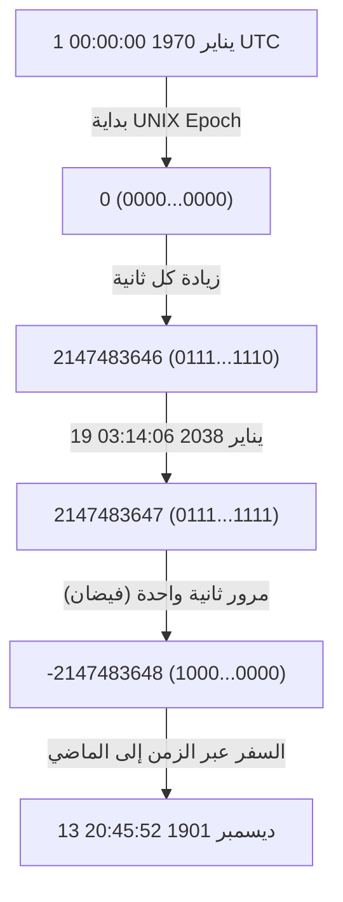
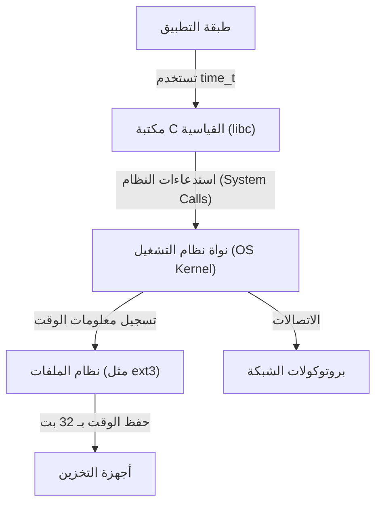

# مقدمة: ساعة نهاية العالم الرقمي الزاحفة

يدعم مجتمعنا الحديث عدد لا يحصى من أنظمة الكمبيوتر. معاملات المؤسسات المالية، وأنظمة إدارة الرحلات الجوية، واتصالات الهواتف الذكية، وأجهزة إنترنت الأشياء (IoT) التي تملأ محيطنا. تعمل جميع هذه الأنظمة بناءً على المفهوم المشترك لـ "الوقت". ولكن ماذا لو انهارت الآلية الأساسية للوقت فجأة في يوم من الأيام؟

هذه هي "مشكلة عام 2038" (Y2K38) التي تقترب بهدوء ولكن بثبات من وقتها المحدد في صناعة تكنولوجيا المعلومات. بالنسبة لنا، بعد أن تغلبنا على مشكلة عام 2000 (Y2K)، تقف مشكلة 2038 كالتحدي الكبير التالي. في هذه المقالة، سنشرح بالتفصيل، مع التعمق التقني، آليات مشكلة عام 2038، والخلفية التاريخية لسبب تصميمها بهذا الشكل، وكيف يواجه المهندسون المعاصرون هذه المشكلة.

# آلية وقت يونكس (UNIX Time أو Epoch Time)

لفهم مشكلة عام 2038، يجب أن نعرف أولاً "كيف تفهم أجهزة الكمبيوتر الوقت". مفهوم "السنة، الشهر، اليوم، الساعة، الدقيقة، الثانية" الذي نستخدمه عادةً سهل الفهم للغاية بالنسبة للبشر، ولكنه تنسيق يصعب على أجهزة الكمبيوتر التعامل معه. وذلك بسبب وجود العديد من العوامل التي تعقد العمليات الحسابية، مثل السنوات الكبيسة، والأشهر الطويلة والقصيرة، والمناطق الزمنية.

لذلك، تعتمد العديد من أنظمة الكمبيوتر، خاصة أنظمة التشغيل المستندة إلى UNIX، مفهومًا بسيطًا للغاية يسمى "وقت UNIX (أو ثواني Epoch)". وقت UNIX هو نظام يستمر في حساب عدد الثواني التي مرت منذ نقطة البداية (Epoch) وهي "1 يناير 1970 الساعة 00:00:00 بالتوقيت العالمي المنسق (UTC)" كمجرد "عدد صحيح" (integer).

على سبيل المثال، في 1 يناير 1970 الساعة 00:01:00 UTC، سيكون وقت UNIX هو "60". بفضل هذا التمثيل العددي الصحيح البسيط، أصبحت عمليات الجمع والطرح والمقارنة للوقت سريعة وسهلة للغاية.

# حدود الأعداد الصحيحة ذات الإشارة 32 بت والفيضان (Overflow)

في أوائل السبعينيات عندما تم تطوير أنظمة UNIX، كانت موارد الكمبيوتر محدودة للغاية مقارنة باليوم. نظرًا لأن الذاكرة والتخزين كانا باهظي الثمن، كان تمثيل البيانات بأصغر حجم ممكن ضرورة قصوى.

لذلك، تم تعريف المتغير المستخدم لتمثيل وقت UNIX (النوع `time_t` في لغة C) على أنه "عدد صحيح ذو إشارة بحجم 32 بت" (32-bit signed integer). يمكن لحجم البيانات البالغ 32 بت (4 بايت) أن يمثل 2 أس 32، أي `4,294,967,296` قيمة عددية. نظرًا لأنه عدد صحيح ذو إشارة، يتم تخصيص نصف القيم الموجبة والسالبة، وبالتالي فإن القيمة القصوى التي يمكن تمثيلها هي `2,147,483,647`. (تُستخدم القيم السالبة لتمثيل الوقت قبل عام 1970).

هذا الوقت البالغ `2,147,483,647` ثانية هو السبب الجذري لمشكلة عام 2038.

بعد `2,147,483,647` ثانية من 1 يناير 1970. بالحساب، يصبح التاريخ والوقت كالتالي:

**التوقيت العالمي المنسق (UTC): 19 يناير 2038 الساعة 03:14:07**
(بتوقيت اليابان القياسي: 19 يناير 2038 الساعة 12:14:07)

بمجرد تجاوز هذا الوقت ولو بثانية واحدة، سيحاول العداد داخل الكمبيوتر أن يصبح `2,147,483,648`، ولكن نظرًا لأنه يتجاوز القيمة القصوى لعدد صحيح ذي إشارة بحجم 32 بت، يحدث "فيضان" (Overflow). في عالم الأرقام الثنائية، ينعكس البت الأكثر أهمية (البت الذي يمثل الإشارة)، ويبدأ النظام فجأة في تفسير الوقت على أنه "سالب".

نتيجة لذلك، يخطئ النظام في فهم الوقت الحالي على النحو التالي:

**سالب 2,147,483,648 ثانية = 13 ديسمبر 1901 الساعة 20:45:52 UTC**

# التأثيرات الكارثية التي يسببها الفيضان

إذا بدأ النظام فجأة في إدراك أن "العام الحالي هو 1901"، فماذا ستكون التأثيرات؟ لا يقتصر التأثير على مجرد عرض غير صحيح في تطبيق التقويم.

1. **انهيار الأمان والاتصالات المشفرة**
   شهادات SSL/TLS المستخدمة في اتصالات HTTPS لها تاريخ انتهاء صلاحية. الأنظمة التي تدرك أن "العام الحالي هو 1901" ستعتبر جميع الشهادات "من المستقبل" أو "منتهية الصلاحية"، وقد ترفض تمامًا جميع الاتصالات الآمنة. سيؤدي هذا إلى شل تصفح الويب، واتصالات API، والمعاملات المالية.
2. **تلف البيانات في قواعد البيانات**
   تسجل قواعد البيانات وقت إنشاء البيانات ووقت تحديثها. مع رجوع الوقت إلى الوراء، ستحدث تناقضات خطيرة في البيانات، مثل معاملة البيانات الجديدة على أنها بيانات قديمة، أو التخلص الفوري من السجلات التي لها تاريخ انتهاء صلاحية (مثل معلومات الجلسة).
3. **أعطال في البنية التحتية والأنظمة المدمجة**
   في "الأنظمة المدمجة" التي غالبًا ما لا يتم تحديثها لعقود بمجرد نشرها، مثل أنظمة التحكم في المصانع، والأجهزة الطبية، وأنظمة مراقبة الحركة الجوية، هناك خطر حدوث إنهاء غير طبيعي (انهيار) أو سلوك غير متوقع بسبب رجوع الوقت.
4. **إدارة تراخيص البرمجيات**
   قد تُعتبر اشتراكات وتراخيص البرامج "منتهية الصلاحية"، وقد تتوقف عن العمل في وقت واحد.

# التفاعل المتسلسل في بنية الأنظمة

مشكلة 2038 ليست مشكلة تطبيق واحد، بل هي مشكلة عميقة الجذور تؤثر هرميًا من نظام التشغيل إلى بروتوكولات الشبكة.

حتى لو كان التطبيق يستطيع التعامل بشكل مستقل مع وقت 64 بت، إذا كانت مكتبة C القياسية أو نواة نظام التشغيل الأساسية تستخدم `time_t` بحجم 32 بت، فستظل معلومات الوقت التي يتم تمريرها من خلال استدعاءات النظام بحجم 32 بت. بالإضافة إلى ذلك، قد تقوم أنظمة الملفات (مثل ext3 القديم أو FAT) أيضًا بحفظ الطوابع الزمنية كبيانات وصفية (metadata) بحجم 32 بت، مما يؤدي إلى مشكلة عدم قدرة البيانات على القرص نفسها من تمثيل ما بعد عام 2038.

# الخلفية التاريخية: لماذا 32 بت؟

عند النظر بعيون معتادة على الموارد الوفيرة الحديثة، قد تتساءل، "لماذا لم يجعلوها 64 بت منذ البداية؟" ومع ذلك، في عصر أجهزة الكمبيوتر المركزية (Mainframes) وأجهزة الكمبيوتر الصغيرة (Minicomputers) في السبعينيات عندما وُلد UNIX، كان توفير بضعة بايتات من الذاكرة يحدد أداء النظام.

في إصدارات UNIX المبكرة، كان يتم إدارة الوقت فعليًا كـ "عدد صحيح 32 بت بوحدة 1/60 من الثانية". لكن هذا كان سيفيض بعد حوالي 2.5 سنة فقط. لذلك تم تغيير الوحدة إلى "ثانية واحدة"، وتم تمديد العمر إلى حوالي 68 عامًا (من 1970 إلى 2038). بالنسبة للمطورين في ذلك الوقت، كان من غير المتصور أن يستمر استخدام النظام الذي صمموه بعد 68 عامًا. في الواقع، صرح كين تومسون، أحد مطوري UNIX: "لم أكن أعتقد أن UNIX سيستمر استخدامه لفترة طويلة".

# تدابير مواجهة مشكلة 2038 والوضع الحالي

الحل الأكيد لهذه القنبلة الموقوتة هو "توسيع المتغير الذي يمثل الوقت إلى عدد صحيح 64 بت". الحد الأقصى لعدد الثواني التي يمكن تمثيلها بعدد صحيح ذي إشارة بحجم 64 بت هو حوالي 292 مليار سنة. هذا أطول من عمر الكون (عشرات المليارات إلى تريليونات السنين)، لذلك لم يعد هناك داعٍ للقلق بشأن الفيضان فعليًا إلى الأبد.

حاليًا، يتم التقدم في التدابير التالية في بنيات الأنظمة الرئيسية:

1. **الانتقال الكامل إلى أنظمة تشغيل 64 بت**
   العديد من أجهزة الكمبيوتر الشخصية، والخوادم، والهواتف الذكية الحديثة مجهزة بالفعل بمعالجات 64 بت وتقوم بتشغيل أنظمة تشغيل 64 بت (Windows, macOS، وإصدارات 64 بت من Linux). في هذه البيئات، تم توسيع نوع `time_t` بشكل طبيعي إلى 64 بت، وتم حل مشكلة 2038 على مستوى نظام التشغيل.
2. **تعديل دعم أنظمة 32 بت في نواة Linux**
   التحدي الأكبر هو "إصدارات 32 بت من Linux" المثبتة في أجهزة إنترنت الأشياء (IoT) وغيرها. في مجتمع نواة Linux، تم إجراء تعديل ضخم في إصدار النواة 5.6 (الذي تم إصداره في عام 2020) لدعم `time_t` بحجم 64 بت حتى على البنيات ذات الـ 32 بت. بفضل هذا، أصبح من الممكن تجاوز حاجز عام 2038 حتى على الأجهزة ذات 32 بت إذا تم استخدام أحدث نواة.
3. **تحديث أنظمة الملفات**
   تدعم أنظمة الملفات الحديثة مثل ext4 و XFS و ZFS بالفعل الطوابع الزمنية لما بعد عام 2038. ومع ذلك، يجب توخي الحذر إذا ظلت أنظمة ملفات ext3 القديمة التي لم تتم ترقيتها من الأنظمة القديمة موجودة.

# التحديات المتبقية: الأنظمة القديمة (Legacy Systems) وقابلية التشغيل البيني

على الرغم من توفر الحلول التقنية، فإن الرعب الحقيقي لمشكلة 2038 يكمن في "الأنظمة القديمة الكامنة في الأماكن غير المرئية".

- **الأجهزة المدمجة التي لا يتم تحديثها**: هناك عدد لا يحصى من الأجهزة حول العالم التي لا يمكن تحديث برامجها بسهولة لأسباب مادية أو تشغيلية، مثل أجهزة إعادة إرسال الكابلات البحرية، والأقمار الصناعية، ولوحات تحكم المصانع القديمة.
- **تنسيقات البيانات والبروتوكولات**: البروتوكولات القديمة التي تتبادل معلومات الوقت كبيانات ثنائية 32 بت عبر الشبكات (مثل بعض تنسيقات حزم NTP والتفريغ الثنائي لقواعد البيانات) ستتوقف عن العمل ما لم يتم تحديث كل من المرسل والمستقبل.
- **الرموز الثابتة (Hardcoded) في التطبيقات**: لن يتم إصلاح تعليمات التطبيق البرمجية التي تحزم وتُسلسل (serialize) الوقت بشكل مستقل في صندوق 32 بت، حتى لو قمت بتحديث نظام التشغيل. يجب على المطورين تعديل الكود المصدري يدويًا وإعادة ترجمته.

# الخاتمة: دروس لمهندسي المستقبل

مشكلة 2038 ليست مجرد "خطأ برمجي" (bug)، بل هي ذروة "الدَّيْن التقني" (Technical Debt) حيث تجسد حل وسط لتقييد الموارد في الماضي وأصبح واضحًا بمرور الوقت.

في مشكلة عام 2000 (Y2K)، بذل المهندسون حول العالم جهودًا هائلة لتعديل الأنظمة، مما منع حدوث ذعر واسع النطاق. ومع ذلك، فإن مشكلة 2038 أعمق من Y2K وتتغلغل في قلب النظام (نظام التشغيل والنواة ونظام الملفات) أعمق بكثير من طبقة التطبيقات.

بينما نتجه نحو 19 يناير 2038، نحتاج إلى تحديد الأنظمة القديمة، ووضع خطط الترحيل، وتحديث الأنظمة بشكل مطرد. بالإضافة إلى ذلك، عندما يصمم المهندسون الحاليون البرامج، يُطلب منهم بناء بنيات بهامش كافٍ، مع أخذ وجهة نظر متواضعة في الاعتبار وهي أن "هذا النظام قد يستمر لفترة أطول بكثير مما أتخيل".
