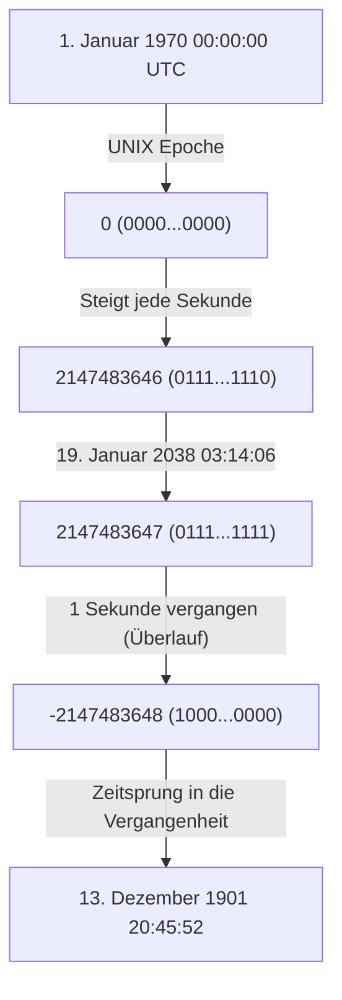
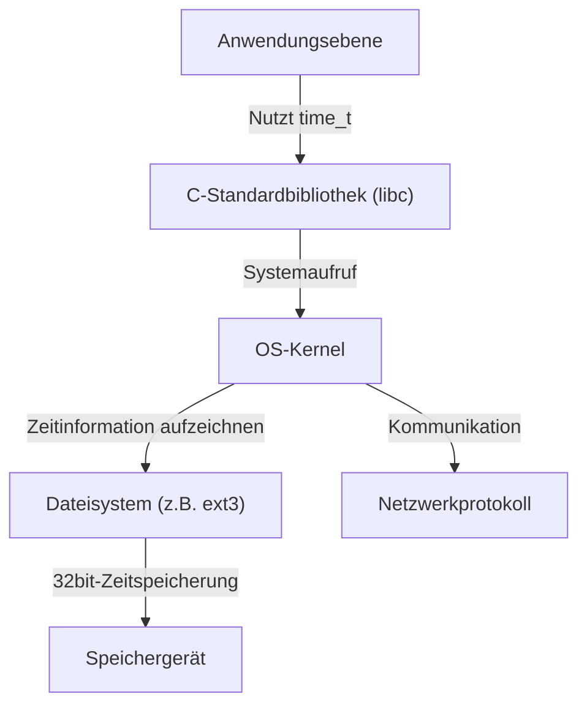

# Einführung: Die schleichende Weltuntergangsuhr der digitalen Welt

Unsere moderne Gesellschaft wird von zahllosen Computersystemen gestützt. Finanzielle Transaktionen von Banken, Flugkontrollsysteme, Smartphone-Kommunikation und IoT-Geräte überall um uns herum. All diese Systeme arbeiten auf Basis des gemeinsamen Konzepts der „Zeit“. Aber was würde passieren, wenn der zugrunde liegende Mechanismus dieser Zeit eines Tages plötzlich zusammenbrechen würde?

Das ist das „Jahr-2038-Problem (Y2K38)“, dessen Frist in der IT-Branche leise, aber sicher näher rückt. Für uns, die wir das Jahr-2000-Problem (Y2K) überstanden haben, steht das Jahr-2038-Problem als die nächste große Prüfung bevor. In diesem Artikel erklären wir die Mechanismen des Jahr-2038-Problems im Detail, den historischen Hintergrund, warum es so konzipiert wurde, und wie moderne Ingenieure dieses Problem angehen, untermauert durch technische Details.

# Wie die UNIX-Zeit (Epoch Time) funktioniert

Um das Jahr-2038-Problem zu verstehen, müssen wir zunächst wissen, „wie Computer die Zeit verstehen“. Das Konzept von „Jahr, Monat, Tag, Stunde, Minute, Sekunde“, das wir normalerweise verwenden, ist für Menschen sehr leicht verständlich, aber für Computer ein schwer zu handhabendes Format. Das liegt daran, dass es zu viele Elemente wie Schaltjahre, große und kleine Monate und Zeitzonen gibt, die Berechnungen komplizieren.

Daher haben viele Computersysteme, insbesondere UNIX-ähnliche Betriebssysteme, ein sehr einfaches Konzept namens „UNIX-Zeit (oder Epochensekunden)“ übernommen. Die UNIX-Zeit beginnt am „1. Januar 1970, 00:00:00 UTC (Koordinierte Weltzeit)“ als Startpunkt (Epoche) und zählt die vergangenen Sekunden ab diesem Zeitpunkt kontinuierlich als einfache „Ganzzahl“.

Zum Beispiel ist am 1. Januar 1970, 00:01:00 UTC, die UNIX-Zeit „60“. Diese einfache Darstellung als Ganzzahl macht Addition, Subtraktion und Vergleiche der Zeit extrem schnell und einfach.

# Die Grenzen vorzeichenbehafteter 32-Bit-Ganzzahlen und der Überlauf

Als UNIX-Systeme in den frühen 1970er Jahren entwickelt wurden, waren die Computerressourcen weitaus begrenzter als heute. Da sowohl Speicher als auch Festplatten sehr teuer waren, bestand das oberste Ziel darin, Daten so klein wie möglich darzustellen.

Deshalb wurde die Variable zur Darstellung der UNIX-Zeit (der Typ `time_t` in der Sprache C) als „vorzeichenbehaftete 32-Bit-Ganzzahl (32-bit signed integer)“ definiert. Eine Datenmenge von 32 Bits (4 Bytes) kann 2 hoch 32, also `4.294.967.296` numerische Werte darstellen. Da es sich um eine vorzeichenbehaftete Ganzzahl handelt, ist die Hälfte für positive und die andere Hälfte für negative Werte reserviert, was den maximal darstellbaren Wert auf `2.147.483.647` begrenzt. (Negative Werte werden verwendet, um Zeiten vor 1970 darzustellen).

Diese Zeit von `2.147.483.647` Sekunden ist die Ursache des gesamten Jahr-2038-Problems.

Nach `2.147.483.647` Sekunden ab dem 1. Januar 1970 ergibt die Berechnung das folgende Datum und die folgende Uhrzeit:

**Koordinierte Weltzeit (UTC): 19. Januar 2038, 03:14:07**
(Japanische Standardzeit: 19. Januar 2038, 12:14:07)

Wenn diese Zeit auch nur um eine Sekunde überschritten wird, versucht der interne Zähler des Computers zu `2.147.483.648` zu werden, überschreitet aber den Maximalwert einer vorzeichenbehafteten 32-Bit-Ganzzahl, was einen „Überlauf (overflow)“ verursacht. In der binären Welt wird das höchstwertige Bit (das Bit, das das Vorzeichen darstellt) invertiert, und das System beginnt plötzlich, die Zeit als „negativ“ zu interpretieren.

Infolgedessen missversteht das System die aktuelle Zeit wie folgt:

**Minus 2.147.483.648 Sekunden = 13. Dezember 1901, 20:45:52 UTC**

# Die katastrophalen Auswirkungen des Überlaufs

Wenn ein System plötzlich anfängt zu glauben, dass „es das Jahr 1901 ist“, welche Auswirkungen wird das haben? Diese Auswirkungen gehen weit darüber hinaus, dass nur das Display einer Kalender-App verrücktspielt.

1. **Zusammenbruch von Sicherheit und verschlüsselter Kommunikation**
   SSL/TLS-Zertifikate, die für HTTPS-Kommunikation usw. verwendet werden, haben ein Ablaufdatum. Ein System, das „aktuell ist das Jahr 1901“ erkennt, wird alle Zertifikate als „aus der Zukunft“ oder „abgelaufen“ beurteilen und könnte jegliche sichere Kommunikation ablehnen. Dies wird das Surfen im Internet, API-Kommunikation und finanzielle Transaktionen lahmlegen.
2. **Datenzerstörung in Datenbanken**
   Datenbanken zeichnen das Erstellungs- und Änderungsdatum von Daten auf. Durch den Rückschritt in der Zeit entstehen ernsthafte Dateninkonsistenzen, wie z.B., dass neue Daten als alte Daten behandelt werden oder Datensätze mit Ablaufdaten (wie Sitzungsinformationen) sofort verworfen werden.
3. **Fehlfunktionen von Infrastruktur und eingebetteten Systemen**
   In „eingebetteten Systemen“, die oft jahrzehntelang nicht aktualisiert werden, sobald sie einmal eingesetzt sind, wie z.B. Fabriksteuerungssysteme, medizinische Geräte und Flugsicherungssysteme, besteht die Gefahr, dass ein Zurückdrehen der Zeit abnormale Beendigungen (Abstürze) oder unerwartetes Verhalten verursacht.
4. **Software-Lizenzverwaltung**
   Software-Abonnements und Lizenzen könnten als „abgelaufen“ angesehen werden, was dazu führt, dass sie massenhaft nicht mehr starten.

# Kettenreaktion der Systemarchitektur

Das Jahr-2038-Problem ist kein Problem einer einzelnen Anwendung, sondern ein tief verwurzeltes Problem, das kaskadierende Auswirkungen von Betriebssystemen bis hin zu Netzwerkprotokollen hat.

Selbst wenn eine Anwendung intern 64-Bit-Zeiten verarbeiten könnte, wenn die zugrunde liegende C-Standardbibliothek oder der OS-Kernel das 32-Bit-`time_t` verwenden, bleiben die über Systemaufrufe übergebenen Zeitinformationen weiterhin 32-Bit. Auch Dateisysteme (wie alte ext3 oder FAT) können Zeitstempel als 32-Bit-Metadaten speichern, was zu dem Problem führt, dass die Daten auf der Festplatte selbst nach dem Jahr 2038 nicht mehr dargestellt werden können.

# Historischer Hintergrund: Warum war es 32-Bit?

Aus der Perspektive unserer modernen, ressourcenreichen Umgebung könnte man sich fragen: „Warum hat man es nicht von Anfang an als 64-Bit gemacht?“ In der Ära der Mainframes und Minicomputer in den 1970er Jahren, als UNIX geboren wurde, bestimmte jedoch das Einsparen von wenigen Bytes Speicher die Leistung des Systems.

Im frühen UNIX wurde die Zeit tatsächlich als „32-Bit-Ganzzahl in Einheiten von 1/60 Sekunde“ verwaltet. Allerdings würde dies in nur etwa 2,5 Jahren überlaufen. Daher wurde die Einheit in „1 Sekunde“ geändert, was die Lebensdauer auf etwa 68 Jahre (von 1970 bis 2038) verlängerte. Für die damaligen Entwickler war es unvorstellbar, dass das von ihnen entworfene System auch nach 68 Jahren noch genutzt werden würde. Tatsächlich sagte Ken Thompson, einer der Entwickler von UNIX: „Ich hätte nie gedacht, dass UNIX so lange überleben würde.“

# Gegenmaßnahmen und aktueller Stand des Jahr-2038-Problems

Die zuverlässigste Lösung für diese Zeitbombe ist, „die Variable zur Darstellung der Zeit auf eine 64-Bit-Ganzzahl zu erweitern“. Die maximale Anzahl von Sekunden, die eine vorzeichenbehaftete 64-Bit-Ganzzahl darstellen kann, entspricht etwa 292 Milliarden Jahren in der Zukunft. Da dies länger ist als die Lebensdauer des Universums (zig Milliarden bis Billionen Jahre), gibt es im Grunde keine Notwendigkeit mehr, sich Sorgen über Überläufe zu machen.

Derzeit schreiten bei den großen Systemarchitekturen folgende Maßnahmen voran:

1. **Vollständiger Übergang zu 64-Bit-Betriebssystemen**
   Viele moderne PCs, Server und Smartphones sind bereits mit 64-Bit-Prozessoren ausgestattet und führen 64-Bit-Betriebssysteme (Windows, macOS, 64-Bit-Linux) aus. In diesen Umgebungen wurde der Typ `time_t` natürlicherweise auf 64 Bit erweitert, wodurch das Jahr-2038-Problem auf OS-Ebene gelöst ist.
2. **Überarbeitung des 32-Bit-Systemsupports im Linux-Kernel**
   Die größte Herausforderung ist das „32-Bit-Linux“, das in IoT-Geräten und Ähnlichem installiert ist. In der Linux-Kernel-Community wurde in der Kernel-Version 5.6 (veröffentlicht 2020) ein massives Update durchgeführt, um das 64-Bit-`time_t` auch auf 32-Bit-Architekturen zu unterstützen. Dies ermöglicht es, mit den neuesten Kerneln die Barriere von 2038 selbst auf 32-Bit-Hardware zu überwinden.
3. **Aktualisierung von Dateisystemen**
   Moderne Dateisysteme wie ext4, XFS und ZFS unterstützen bereits Zeitstempel nach dem Jahr 2038. Vorsicht ist jedoch geboten, wenn noch alte ext3-Dateisysteme vorhanden sind, die nicht von älteren Systemen aktualisiert wurden.

# Verbleibende Herausforderungen: Legacy-Systeme und Interoperabilität

Obwohl technische Lösungen verfügbar sind, liegt der wahre Schrecken des Jahr-2038-Problems in „Legacy-Systemen, die an unsichtbaren Orten lauern“.

- **Nicht aktualisierte eingebettete Geräte**: Es gibt unzählige Geräte auf der Welt, wie Relais für Unterseekabel, Satelliten und alte Fabrikbedienfelder, deren Software aus physischen oder betrieblichen Gründen nicht einfach aktualisiert werden kann.
- **Datenformate und Protokolle**: Alte Protokolle, die Zeitinformationen als 32-Bit-Binärdaten über Netzwerke austauschen (wie einige NTP-Paketformate oder binäre Datenbank-Dumps), funktionieren nur, wenn sowohl der Sender als auch der Empfänger aktualisiert werden.
- **Hardcodierung innerhalb von Anwendungen**: Der Code von Anwendungen, die ihre eigenen Zeiten proprietär in 32-Bit-Container packen und serialisieren, wird nicht durch ein OS-Update behoben. Entwickler müssen den Quellcode manuell anpassen und neu kompilieren.

# Fazit: Eine Lektion für zukünftige Ingenieure

Das Jahr-2038-Problem ist kein einfacher „Bug“, sondern der Inbegriff von „technischen Schulden“, bei denen Kompromisse, die aufgrund vergangener Ressourcenbeschränkungen gemacht wurden, im Laufe der Zeit zum Vorschein kamen.

Beim Jahr-2000-Problem (Y2K) haben Ingenieure auf der ganzen Welt enorme Anstrengungen unternommen, um Systeme anzupassen und großflächige Panik zu verhindern. Das Jahr-2038-Problem ist jedoch tiefgreifender als Y2K und greift viel tiefer in den Kern des Systems (OS, Kernel, Dateisysteme) ein als auf Anwendungsebene.

Auf dem Weg zum 19. Januar 2038 müssen wir alte Systeme identifizieren, Migrationspläne erstellen und unsere Systeme schrittweise modernisieren. Und wenn heutige Ingenieure Software entwerfen, wird von ihnen verlangt, eine bescheidene Perspektive einzunehmen, dass „dieses System viel länger überleben könnte, als ich mir vorstelle“, und Architekturen mit ausreichenden Margen zu bauen.
