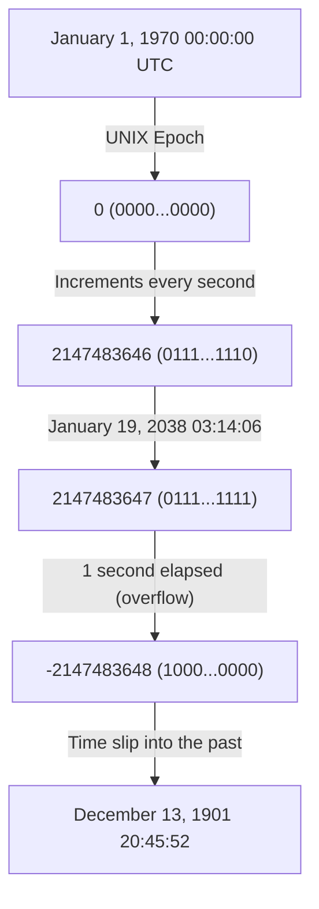
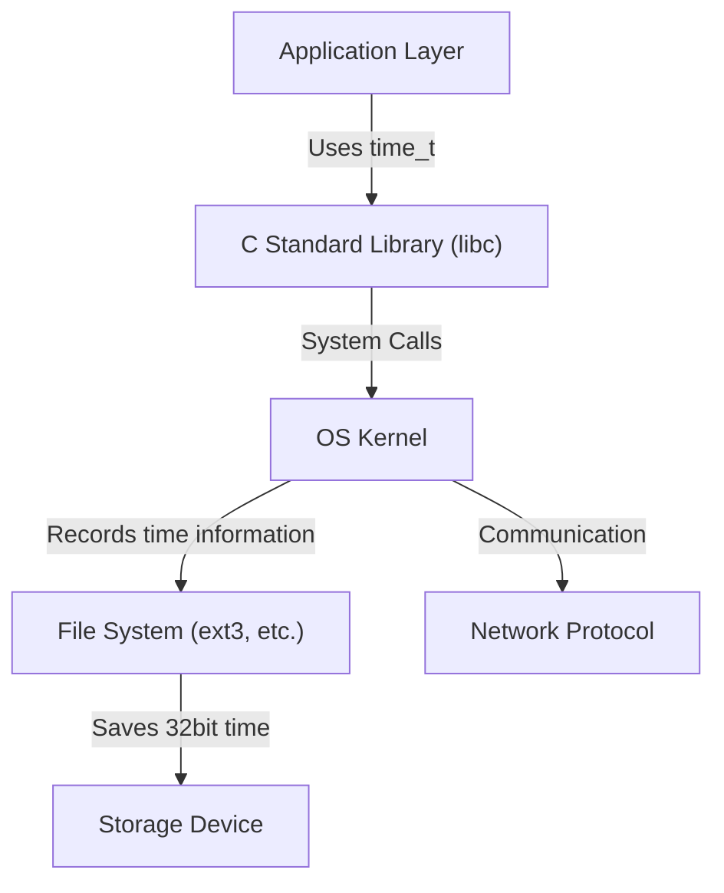

# Introduction: The Creeping Doomsday Clock of the Digital World

Our modern society is supported by countless computer systems. Financial institution transactions, aircraft flight management systems, smartphone communications, and the IoT devices that fill our surroundings. All these systems operate based on the common concept of "time". But what if the underlying mechanism of that time suddenly broke down one day?

That is the "2038 Problem" (Y2K38), which is quietly but steadily approaching its time limit in the IT industry today. For us who survived the Year 2000 problem (Y2K), the 2038 problem stands as the next major trial. In this article, we will explain in detail the mechanism of this 2038 problem, the historical background of why it was designed that way, and how modern engineers are confronting this issue, along with deep technical dives.

# The Mechanism of UNIX Time (Epoch Time)

To understand the 2038 problem, we must first know "how computers understand time." The concepts of "year, month, day, hour, minute, and second" that we normally use are very easy for humans to understand, but they are a cumbersome format for computers to handle. This is because there are too many elements that complicate calculations, such as leap years, months with different numbers of days, and time zones.

Therefore, many computer systems, especially UNIX-based operating systems, use a very simple concept called "UNIX time (or epoch seconds)." UNIX time is a mechanism that uses "January 1, 1970, 00:00:00 UTC (Coordinated Universal Time)" as the starting point (epoch) and continues to count the elapsed seconds from there simply as an "integer."

For example, on January 1, 1970, 00:01:00 UTC, the UNIX time would be "60". This simple integer representation has made time additions, subtractions, and comparisons extremely fast and easy.

# The Limits of 32-bit Signed Integers and Overflow

In the early 1970s when UNIX systems were developed, computer resources were incredibly limited compared to today. Since both memory and storage were extremely expensive, it was a top priority to represent data in the smallest possible size.

Therefore, the variable used to represent UNIX time (the `time_t` type in the C language) was defined as a "32-bit signed integer". A 32-bit (4-byte) data size can represent 2 to the 32nd power, or `4,294,967,296` different numerical values. Because it is a signed integer, half of the values are allocated to positive numbers and half to negative numbers, making the maximum representable value `2,147,483,647`. (Negative values are used to represent time before 1970).

This time of `2,147,483,647` seconds is the root cause of the entire 2038 problem.

`2,147,483,647` seconds after January 1, 1970. Calculating this gives the following date and time:

**Coordinated Universal Time (UTC): January 19, 2038, 03:14:07**
(Japan Standard Time: January 19, 2038, 12:14:07)

When this time passes by even 1 second, the computer's internal counter tries to become `2,147,483,648`, but because it exceeds the maximum value of a 32-bit signed integer, an "overflow" occurs. In the binary world, the most significant bit (the bit representing the sign) flips, and suddenly the system starts interpreting the time as a "negative" value.

As a result, the system misidentifies the current time as follows:

**Minus 2,147,483,648 seconds = December 13, 1901, 20:45:52 UTC**

# The Catastrophic Impact of Overflow

If a system suddenly begins to recognize that "the current year is 1901," what kind of impact will there be? The impact goes far beyond just a calendar app displaying things strangely.

1. **Collapse of Security and Encrypted Communications**
   SSL/TLS certificates used in HTTPS communications have expiration dates. A system that recognizes "the current year is 1901" will judge all certificates as being "from the future" or "expired," and will likely reject all secure communications. This will paralyze web browsing, API communications, and financial transactions.
2. **Database Data Corruption**
   Databases record the creation and update times of data. With time reversing, serious data inconsistencies will occur, such as new data being treated as old data, or records with set expiration times (like session information) being immediately discarded.
3. **Malfunction of Infrastructure and Embedded Systems**
   In "embedded systems" such as factory control systems, medical equipment, and air traffic control systems, which are often not updated for decades once deployed, a reversal of time poses the danger of causing abnormal terminations (crashes) or unexpected behavior.
4. **Software License Management**
   Software subscriptions and licenses could be considered "expired" and stop launching all at once.

# Chain Reaction of System Architecture

The 2038 problem is not an issue with a single application, but a deep-rooted problem that affects everything hierarchically, from the OS down to network protocols.

Even if an application can handle 64-bit time independently, if the underlying C standard library or OS kernel uses a 32-bit `time_t`, the time information passed through system calls will still be 32-bit. Furthermore, file systems (like older ext3 or FAT) may also save timestamps as 32-bit metadata, leading to the problem that the data on the disk itself cannot represent anything beyond the year 2038.

# Historical Background: Why 32-bit?

Looking through the lens of today's abundant resources, one might wonder, "Why didn't they just make it 64-bit from the start?" However, in the era of mainframes and minicomputers in the 1970s when UNIX was born, saving a few bytes of memory determined system performance.

In early UNIX, time was actually managed as a "32-bit integer in units of 1/60th of a second." But this would overflow in only about 2.5 years. Therefore, the unit was changed to "1 second," extending its lifespan to about 68 years (from 1970 to 2038). For the developers at the time, it was unimaginable that the system they designed would continue to be used 68 years later. In fact, Ken Thompson, one of the creators of UNIX, stated, "I didn't think UNIX would be used for this long."

# Countermeasures for the 2038 Problem and the Current Situation

The most definitive solution to this time bomb is to "expand the variable representing time to a 64-bit integer." The maximum number of seconds a 64-bit signed integer can represent is about 292 billion years into the future. Since this is longer than the lifespan of the universe (tens of billions to trillions of years), there is essentially no need to ever worry about overflow again.

Currently, major system architectures are taking the following actions:

1. **Complete Transition to 64-bit OS**
   Many modern PCs, servers, and smartphones are already equipped with 64-bit processors and run 64-bit OSs (Windows, macOS, 64-bit versions of Linux). In these environments, the `time_t` type naturally expands to 64 bits, and the 2038 problem at the OS level has already been resolved.
2. **Modifications to 32-bit System Support in the Linux Kernel**
   The biggest challenge lies in the "32-bit versions of Linux" installed in IoT devices and the like. In the Linux kernel community, a massive overhaul was made in kernel version 5.6 (released in 2020) to support a 64-bit `time_t` even on 32-bit architectures. As a result, using the latest kernel allows even 32-bit hardware to overcome the 2038 barrier.
3. **File System Updates**
   Modern file systems like ext4, XFS, and ZFS already support timestamps beyond the year 2038. However, caution is required if older file systems like ext3, which have not been upgraded from older systems, remain in use.

# Remaining Challenges: Legacy Systems and Interoperability

Although technical solutions have been prepared, the true terror of the 2038 problem lies in "legacy systems lurking out of sight."

- **Un-updated Embedded Devices**: There are countless devices around the world, such as submarine cable repeaters, satellites, and old factory control panels, whose software cannot be easily updated for physical or operational reasons.
- **Data Formats and Protocols**: Older protocols that exchange time information as 32-bit binaries over networks (such as some NTP packet formats or database binary dumps) will cease to function unless both the sending and receiving sides are updated.
- **Hardcoding in Applications**: Application code that uniquely packs time into a 32-bit box and serializes it will not be fixed just by updating the OS. Developers must manually modify and recompile the source code.

# Conclusion: Lessons for Future Engineers

The 2038 problem is not just a "bug," but the extreme of "technical debt"—a compromise resulting from past resource constraints that has manifested over time.

During the Year 2000 problem (Y2K), engineers around the world put immense effort into upgrading systems, successfully preventing large-scale panic. However, the 2038 problem is deeper-rooted than Y2K, eating into the core of the system (OS, kernel, file system) far deeper than the application layer.

As we head toward January 19, 2038, we need to identify old systems, devise migration plans, and steadily modernize our systems. Furthermore, when current engineers design software, they are expected to adopt a humble perspective—that "this system might survive much longer than I imagine"—and to construct architectures with sufficient margins.
