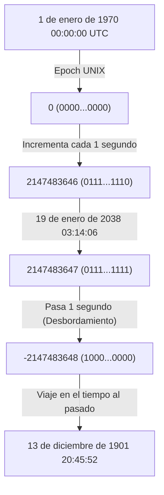
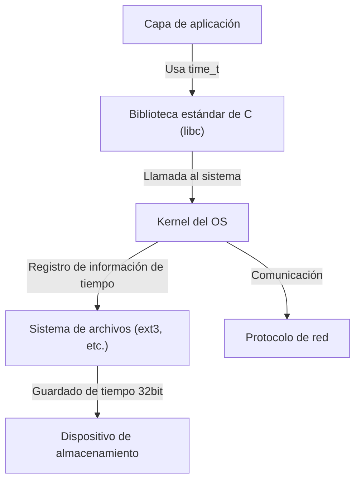

# Introducción: El reloj del fin del mundo que se acerca al mundo digital

Nuestra sociedad moderna está sustentada por innumerables sistemas informáticos. Transacciones de instituciones financieras, sistemas de gestión de operaciones de aeronaves, comunicaciones de teléfonos inteligentes, y los dispositivos IoT que abundan a nuestro alrededor. Todos estos sistemas operan basándose en el concepto común del "tiempo". Pero, ¿qué pasaría si el mecanismo subyacente de ese tiempo se colapsara de repente un día?

Ese es el "Problema del Año 2038 (Y2K38)", que actualmente se acerca de manera silenciosa pero segura a su límite de tiempo en la industria de TI. Para nosotros que superamos el problema del año 2000 (Y2K), el problema de 2038 se presenta como la próxima gran prueba. En este artículo, explicaremos en detalle, incluyendo un análisis técnico profundo, el mecanismo de este problema de 2038, el contexto histórico de por qué se diseñó de esa manera, y cómo los ingenieros modernos se están enfrentando a este problema.

# El mecanismo del Tiempo UNIX (Epoch Time)

Para entender el problema de 2038, primero es necesario saber "cómo entienden el tiempo las computadoras". El concepto de "año, mes, día, hora, minuto, segundo" que solemos usar es muy fácil de entender para los humanos, pero es un formato difícil de manejar para las computadoras. Esto se debe a que hay demasiados factores que complican los cálculos, como años bisiestos, meses largos y cortos, zonas horarias, etc.

Por lo tanto, muchos sistemas informáticos, especialmente los sistemas operativos basados en UNIX, adoptan un concepto muy simple llamado "Tiempo UNIX (o segundos Epoch)". El Tiempo UNIX es un mecanismo que toma el "1 de enero de 1970 a las 00:00:00 UTC (Tiempo Universal Coordinado)" como punto de partida (Epoch), y continúa contando los segundos que han pasado desde entonces como un simple "entero".

Por ejemplo, el 1 de enero de 1970 a las 00:01:00 UTC, el Tiempo UNIX sería "60". Mediante esta simple representación entera, las sumas, restas y comparaciones de tiempo se volvieron muy rápidas y fáciles de realizar.

# Los límites y el desbordamiento de los enteros con signo de 32 bits

A principios de la década de 1970, cuando se desarrollaron los sistemas UNIX, los recursos informáticos estaban incomparablemente más limitados que en la actualidad. Dado que tanto la memoria como el almacenamiento eran muy caros, la tarea suprema era representar los datos en el tamaño más pequeño posible.

Por ello, la variable para representar el tiempo UNIX (tipo `time_t` en lenguaje C) se definió como un "entero con signo de 32 bits (32-bit signed integer)". La cantidad de datos de 32 bits (4 bytes) puede representar 2 a la 32ª potencia, es decir, `4,294,967,296` valores numéricos diferentes. Como es un entero con signo, los valores positivos y negativos se asignan a partes iguales, y el valor máximo representable es `2,147,483,647`. (Los valores negativos se utilizan para representar el tiempo anterior a 1970).

Este tiempo de `2,147,483,647` segundos es el causante de todos los problemas de 2038.

`2,147,483,647` segundos después del 1 de enero de 1970. Calculándolo, resulta en la siguiente fecha y hora.

**Tiempo Universal Coordinado (UTC): 19 de enero de 2038, 03:14:07**
(En hora estándar de Japón, 19 de enero de 2038, 12:14:07)

Si pasa siquiera 1 segundo después de esta hora, el contador interno de la computadora intentará convertirse en `2,147,483,648`, pero dado que supera el valor máximo de un entero con signo de 32 bits, se producirá un "desbordamiento (overflow)". En el mundo binario, el bit más significativo (el bit que representa el signo) se invierte, y de repente el sistema comienza a interpretar el tiempo como "negativo".

Como resultado, el sistema malinterpreta la hora actual de la siguiente manera.

**Menos 2,147,483,648 segundos = 13 de diciembre de 1901, 20:45:52 UTC**

# Los impactos catastróficos causados por el desbordamiento

Si el sistema de repente comienza a reconocer que "actualmente es el año 1901", ¿qué impacto tendría? Ese impacto no se limitará a que la visualización de la aplicación del calendario se vea extraña.

1. **Colapso de la seguridad y las comunicaciones cifradas**
   Los certificados SSL/TLS utilizados para comunicaciones HTTPS y otras tienen una fecha de caducidad. Un sistema que reconoce que "actualmente es 1901" podría juzgar que todos los certificados son "del futuro" o están "caducados", y negarse a realizar cualquier comunicación segura. Esto paralizará la navegación web, las comunicaciones API y las transacciones financieras.
2. **Destrucción de datos en bases de datos**
   En las bases de datos se registran las fechas y horas de creación y actualización de los datos. Como el tiempo retrocedió, los datos nuevos podrían tratarse como datos antiguos, y los registros con fechas de caducidad establecidas (como información de sesión) se descartarían de inmediato, causando graves inconsistencias de datos.
3. **Mal funcionamiento de la infraestructura y sistemas integrados**
   En "sistemas integrados" como sistemas de control de fábricas, equipos médicos y sistemas de control de tráfico aéreo, que a menudo no se actualizan durante décadas una vez implementados, el retroceso del tiempo podría causar terminaciones anormales (bloqueos) o comportamientos inesperados.
4. **Gestión de licencias de software**
   Las suscripciones de software y las licencias podrían considerarse "caducadas" y dejar de iniciarse todas a la vez.

# Reacción en cadena de la arquitectura del sistema

El problema de 2038 no es un problema de una sola aplicación, sino un problema profundamente arraigado que afecta jerárquicamente desde el sistema operativo hasta los protocolos de red.

Incluso si una aplicación pudiera manejar por sí misma el tiempo de 64 bits, si la biblioteca estándar de C subyacente y el kernel del SO utilizan el `time_t` de 32 bits, la información de tiempo que se pasa a través de las llamadas al sistema seguirá siendo de 32 bits. Además, los sistemas de archivos (como los antiguos ext3 o FAT) también pueden guardar marcas de tiempo en 32 bits como metadatos, enfrentándose al problema de que los propios datos en el disco no podrán representar fechas posteriores a 2038.

# Contexto histórico: ¿Por qué eran 32 bits?

Mirando con ojos acostumbrados a los abundantes recursos modernos, podrías preguntarte: "¿Por qué no lo hicieron de 64 bits desde el principio?". Sin embargo, en la era de los mainframes y minicomputadoras de la década de 1970, cuando nació UNIX, ahorrar unos pocos bytes de memoria determinaba el rendimiento del sistema.

En el UNIX temprano, el tiempo se gestionaba en realidad como un "entero de 32 bits en unidades de 1/60 de segundo". Pero con esto se desbordaría en solo unos 2,5 años. Por lo tanto, se cambió la unidad a "1 segundo", extendiendo la vida útil a unos 68 años (de 1970 a 2038). Para los desarrolladores de esa época, era inimaginable que los sistemas que diseñaron siguieran utilizándose 68 años después. De hecho, uno de los desarrolladores de UNIX, Ken Thompson, también dijo: "Nunca pensé que UNIX se utilizaría durante tanto tiempo".

# Medidas y estado actual del Problema del Año 2038

La solución más segura para esta bomba de tiempo es "expandir la variable que representa el tiempo a un entero de 64 bits". El número máximo de segundos que un entero con signo de 64 bits puede representar abarca unos 292 mil millones de años. Como esto es más largo que la vida del universo (decenas de miles de millones a billones de años), prácticamente ya no será necesario preocuparse por los desbordamientos jamás.

Actualmente, las principales arquitecturas de sistemas están avanzando con las siguientes medidas.

1. **Transición completa a SO de 64 bits**
   La mayoría de las PC, servidores y teléfonos inteligentes modernos ya están equipados con procesadores de 64 bits y ejecutan sistemas operativos de 64 bits (Windows, macOS, versiones de 64 bits de Linux). En estos entornos, el tipo `time_t` también se ha expandido naturalmente a 64 bits, y el problema del año 2038 a nivel de sistema operativo ya se ha resuelto.
2. **Modificación del soporte de sistemas de 32 bits en el kernel de Linux**
   El desafío más grande son las versiones de "Linux de 32 bits" instaladas en dispositivos IoT y similares. En la comunidad del kernel de Linux, se realizó una enorme modificación en la versión 5.6 del kernel (lanzada en 2020) para admitir un `time_t` de 64 bits incluso en arquitecturas de 32 bits. Con esto, si se utiliza el kernel más reciente, incluso el hardware de 32 bits puede superar la barrera de 2038.
3. **Actualización del sistema de archivos**
   Los sistemas de archivos modernos como ext4, XFS y ZFS ya son compatibles con las marcas de tiempo posteriores a 2038. Sin embargo, hay que tener cuidado si quedan antiguos sistemas de archivos ext3 o similares que no se hayan actualizado desde sistemas antiguos.

# Desafíos restantes: Sistemas heredados e interoperabilidad

Aunque se han preparado soluciones técnicas, el verdadero terror del problema del año 2038 radica en los "sistemas heredados que acechan en lugares invisibles".

- **Dispositivos integrados que no se actualizan**: Hay innumerables dispositivos en todo el mundo cuyo software no se puede actualizar fácilmente por razones físicas u operativas, como repetidores de cables submarinos, satélites y paneles de control de fábricas antiguas.
- **Formatos de datos y protocolos**: Los protocolos antiguos que intercambian información de tiempo como binarios de 32 bits a través de redes (como algunos formatos de paquetes NTP y volcados binarios de bases de datos) dejarán de funcionar a menos que se actualicen tanto el lado emisor como el receptor.
- **Codificación en duro dentro de las aplicaciones**: El código de las aplicaciones que independientemente empaqueta y serializa el tiempo en una caja de 32 bits no se arreglará incluso si se actualiza el sistema operativo. Los desarrolladores deberán modificar manualmente el código fuente y recompilar.

# Conclusión: Una lección para los ingenieros del futuro

El problema del año 2038 no es un simple "error (bug)", sino la cúspide de la "deuda técnica", en la que el producto de los compromisos debidos a las limitaciones de recursos del pasado se ha manifestado con el tiempo.

En el problema del año 2000 (Y2K), los ingenieros de todo el mundo hicieron un gran esfuerzo para modificar los sistemas y evitar un pánico a gran escala. Sin embargo, el problema del año 2038 es más profundo que el Y2K, penetrando en el núcleo de los sistemas (SO, kernel, sistemas de archivos) de manera mucho más profunda que la capa de aplicación.

A medida que nos acercamos al 19 de enero de 2038, necesitamos identificar los sistemas antiguos, planificar estrategias de migración y modernizar constantemente nuestros sistemas. Además, cuando los ingenieros actuales diseñen software, se les exige que tengan una perspectiva humilde de que "este sistema podría sobrevivir mucho más tiempo del que imagino" y que construyan una arquitectura con un margen suficiente.
