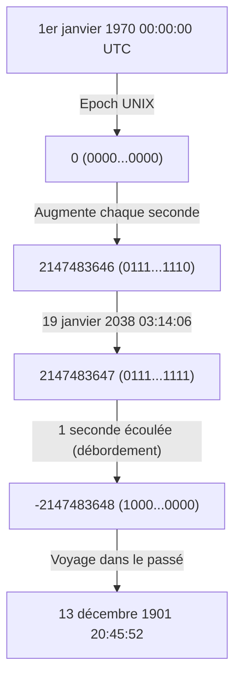
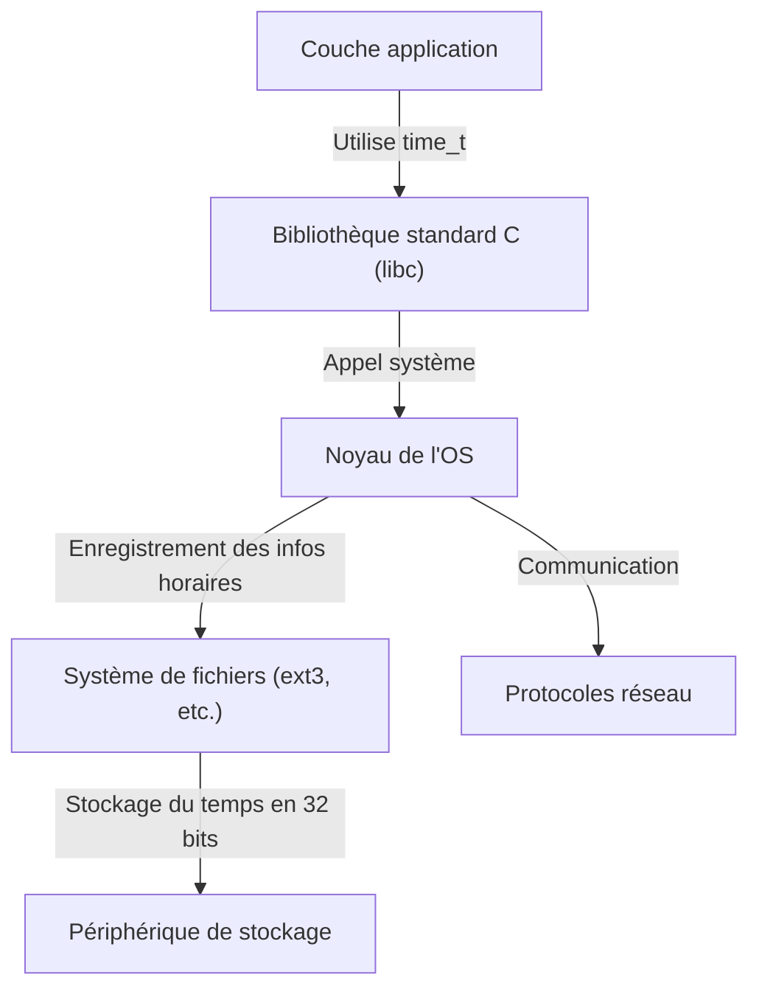

# Introduction : l'horloge de la fin du monde numérique qui s'approche furtivement

Notre société moderne est soutenue par d'innombrables systèmes informatiques. Les transactions des institutions financières, les systèmes de gestion des vols des avions, les communications par smartphone et les appareils IoT qui abondent autour de nous. Tous ces systèmes fonctionnent sur la base du concept commun de "temps". Mais que se passerait-il si le mécanisme à la base de ce temps tombait soudainement en panne un jour ?

C'est le "problème de l'an 2038 (Y2K38)", dont la date limite approche silencieusement mais sûrement dans l'industrie informatique aujourd'hui. Pour nous qui avons surmonté le bogue de l'an 2000 (Y2K), le problème de l'an 2038 se dresse comme la prochaine grande épreuve. Dans cet article, nous expliquerons en détail, avec des approfondissements techniques, le mécanisme de ce problème de l'an 2038, le contexte historique expliquant pourquoi une telle conception a été adoptée, et comment les ingénieurs modernes font face à ce problème.

# Le fonctionnement du temps UNIX (Epoch Time)

Pour comprendre le problème de l'an 2038, nous devons d'abord savoir "comment les ordinateurs comprennent le temps". Le concept "année, mois, jour, heure, minute, seconde" que nous utilisons habituellement est très facile à comprendre pour les humains, mais c'est un format difficile à manipuler pour les ordinateurs. C'est parce qu'il y a trop d'éléments qui compliquent les calculs, comme les années bissextiles, les mois de différentes longueurs et les fuseaux horaires.

Par conséquent, de nombreux systèmes informatiques, en particulier les systèmes d'exploitation de type UNIX, ont adopté un concept très simple appelé "temps UNIX (ou secondes Epoch)". Le temps UNIX est un mécanisme qui utilise "le 1er janvier 1970 à 00:00:00 UTC (Temps Universel Coordonné)" comme point de départ (epoch) et continue de compter le nombre de secondes écoulées depuis lors comme un simple "entier".

Par exemple, le 1er janvier 1970 à 00:01:00 UTC, le temps UNIX serait "60". Cette simple représentation par des entiers a rendu l'addition, la soustraction et la comparaison des temps extrêmement rapides et faciles.

# Les limites et le débordement des entiers signés de 32 bits

Au début des années 1970, lorsque le système UNIX a été développé, les ressources informatiques étaient incomparablement plus limitées qu'aujourd'hui. La mémoire et le stockage étant extrêmement coûteux, il était impératif de représenter les données dans la taille la plus petite possible.

Pour cette raison, la variable pour représenter le temps UNIX (le type `time_t` en langage C) a été définie comme un "entier signé de 32 bits (32-bit signed integer)". Une quantité de données de 32 bits (4 octets) peut représenter 2 à la puissance 32, soit `4,294,967,296` valeurs numériques. Puisqu'il s'agit d'un entier signé, il est divisé en deux moitiés de valeurs positives et négatives, et la valeur maximale pouvant être représentée est `2,147,483,647`. (Les valeurs négatives sont utilisées pour représenter les temps avant 1970).

Ce temps de `2,147,483,647` secondes est la cause première de tout le problème de l'an 2038.

`2,147,483,647` secondes après le 1er janvier 1970. Si l'on calcule, cela correspond à la date et l'heure suivantes.

**Temps Universel Coordonné (UTC) : 19 janvier 2038 à 03:14:07**
(Heure standard du Japon : 19 janvier 2038 à 12:14:07)

Dès que cette heure est dépassée d'une seconde, le compteur interne de l'ordinateur tente de devenir `2,147,483,648`, mais parce qu'il dépasse la valeur maximale d'un entier signé de 32 bits, un "débordement (overflow)" se produit. Dans le monde binaire, le bit de poids fort (le bit représentant le signe) s'inverse, et le système commence soudainement à interpréter le temps comme "négatif".

En conséquence, le système se méprend sur l'heure actuelle de la manière suivante.

**Moins 2,147,483,648 secondes = 13 décembre 1901 à 20:45:52 UTC**

# Les effets catastrophiques causés par le débordement

Quelles seraient les conséquences si le système commençait soudainement à reconnaître que "nous sommes actuellement en 1901" ? L'impact ne se limite pas à un simple dysfonctionnement de l'affichage de l'application calendrier.

1. **Effondrement de la sécurité et des communications cryptées**
   Les certificats SSL/TLS utilisés pour les communications HTTPS, etc., ont une date d'expiration. Un système qui reconnaît "nous sommes actuellement en 1901" peut juger tous les certificats comme "du futur" ou "expirés", refusant ainsi complètement toute communication sécurisée. Cela paralyserait la navigation sur le web, les communications d'API et les transactions financières.
2. **Corruption des données dans les bases de données**
   Les bases de données enregistrent la date et l'heure de création et de mise à jour des données. Le recul dans le temps entraîne de graves incohérences des données, telles que les nouvelles données étant traitées comme des données anciennes, ou les enregistrements avec des dates d'expiration définies (telles que les informations de session) étant immédiatement supprimés.
3. **Dysfonctionnements des infrastructures et des systèmes embarqués**
   Dans les "systèmes embarqués" qui ne sont souvent pas mis à jour pendant des décennies une fois déployés, tels que les systèmes de contrôle d'usine, les équipements médicaux et les systèmes de contrôle du trafic aérien, l'inversion du temps risque de provoquer des arrêts anormaux (plantages) et des comportements inattendus.
4. **Gestion des licences logicielles**
   Les abonnements logiciels et les licences peuvent être considérés comme "expirés" et cesser de démarrer tous en même temps.

# Réaction en chaîne de l'architecture du système

Le problème de l'an 2038 n'est pas un problème d'application unique, c'est un problème profondément enraciné qui affecte hiérarchiquement du système d'exploitation jusqu'aux protocoles réseau.

Même si l'application elle-même peut gérer le temps sur 64 bits, si la bibliothèque standard C ou le noyau de l'OS en arrière-plan utilise un `time_t` de 32 bits, les informations horaires transmises via les appels système restent en 32 bits. De plus, les systèmes de fichiers (anciens ext3, FAT, etc.) peuvent également stocker les horodatages sous forme de métadonnées en 32 bits, nous confrontant au problème que les données sur le disque elles-mêmes ne peuvent pas représenter l'année 2038 et au-delà.

# Contexte historique : Pourquoi 32 bits ?

Vu avec nos yeux habitués aux ressources abondantes d'aujourd'hui, on peut se demander : "Pourquoi ne l'ont-ils pas fait en 64 bits dès le début ?". Cependant, à l'ère des ordinateurs centraux et des mini-ordinateurs des années 1970, lorsque UNIX est né, l'économie de quelques octets de mémoire dictait les performances du système.

Dans les premiers UNIX, le temps était en fait géré comme un "entier de 32 bits en unités de 1/60ème de seconde". Mais cela déborderait en seulement environ 2,5 ans. Par conséquent, l'unité a été modifiée à "1 seconde", prolongeant la durée de vie à environ 68 ans (de 1970 à 2038). Pour les développeurs de l'époque, il était inimaginable que le système qu'ils avaient conçu continuerait à être utilisé 68 ans plus tard. En fait, Ken Thompson, l'un des développeurs d'UNIX, a également déclaré : "Je ne pensais pas qu'UNIX serait utilisé pendant si longtemps".

# Contre-mesures et situation actuelle concernant le problème de l'an 2038

La solution la plus fiable à cette bombe à retardement est "d'étendre la variable représentant le temps à un entier de 64 bits". Le nombre maximum de secondes qu'un entier signé de 64 bits peut représenter est d'environ 292 milliards d'années dans le futur. Comme c'est plus long que la durée de vie de l'univers (des dizaines de milliards à des billions d'années), il n'y a pratiquement plus besoin de s'inquiéter des débordements pour l'éternité.

Actuellement, les mesures suivantes sont prises dans les principales architectures de systèmes.

1. **Migration complète vers les OS 64 bits**
   La plupart des PC, serveurs et smartphones modernes sont déjà équipés de processeurs 64 bits et exécutent des OS 64 bits (Windows, macOS, versions 64 bits de Linux). Dans ces environnements, le type `time_t` est naturellement étendu à 64 bits, et le problème de l'an 2038 au niveau de l'OS a déjà été résolu.
2. **Refonte de la prise en charge des systèmes 32 bits dans le noyau Linux**
   Le plus grand défi est la "version 32 bits de Linux" installée dans les appareils IoT et autres. Dans la communauté du noyau Linux, une modification massive a été apportée dans la version 5.6 du noyau (publiée en 2020) pour prendre en charge le `time_t` 64 bits même sur les architectures 32 bits. Par conséquent, en utilisant le dernier noyau, même le matériel 32 bits peut surmonter le mur de 2038.
3. **Mise à jour des systèmes de fichiers**
   Les systèmes de fichiers modernes tels que ext4, XFS et ZFS prennent déjà en charge les horodatages au-delà de 2038. Cependant, la prudence est de mise si de vieux systèmes de fichiers ext3 qui n'ont pas été mis à niveau depuis d'anciens systèmes subsistent.

# Les défis restants : Les systèmes hérités et l'interopérabilité

Même si des solutions techniques ont été préparées, la véritable terreur du problème de l'an 2038 réside dans les "systèmes hérités qui se cachent hors de vue".

- **Équipements embarqués non mis à jour** : Il existe d'innombrables appareils dans le monde, tels que les répéteurs de câbles sous-marins, les satellites artificiels et les panneaux de contrôle d'anciennes usines, dont les logiciels ne peuvent pas être facilement mis à jour pour des raisons physiques ou opérationnelles.
- **Formats de données et protocoles** : Les anciens protocoles (tels que certains formats de paquets NTP ou des vidages binaires de bases de données) qui échangent des informations horaires sous forme de binaires 32 bits sur un réseau cesseront de fonctionner à moins que l'expéditeur et le destinataire ne soient tous deux mis à jour.
- **Codage en dur dans les applications** : Le code d'application qui regroupe indépendamment le temps dans une boîte de 32 bits et le sérialise ne sera pas corrigé même si le système d'exploitation est mis à jour. Les développeurs doivent modifier manuellement le code source et le recompiler.

# Conclusion : Une leçon pour les futurs ingénieurs

Le problème de l'an 2038 n'est pas un simple "bogue", mais l'ultime "dette technique", un produit de compromis dus aux contraintes de ressources passées qui s'est manifesté au fil du temps.

Lors du bogue de l'an 2000 (Y2K), les ingénieurs du monde entier ont déployé d'énormes efforts pour modifier les systèmes, empêchant ainsi une panique à grande échelle. Cependant, le problème de l'an 2038 est plus profond que le bogue de l'an 2000, rongeant le cœur du système (OS, noyau, systèmes de fichiers) bien plus profondément que la couche d'application.

À l'approche du 19 janvier 2038, nous devons identifier les anciens systèmes, formuler des plans de migration et moderniser régulièrement nos systèmes. De plus, lorsque les ingénieurs actuels conçoivent des logiciels, ils doivent avoir la perspective humble que "ce système pourrait survivre beaucoup plus longtemps que je ne l'imagine" et construire des architectures avec des marges suffisantes.
