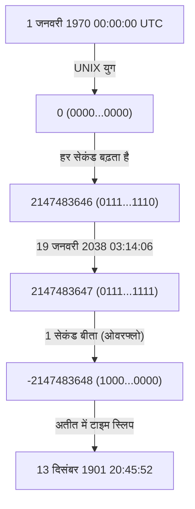
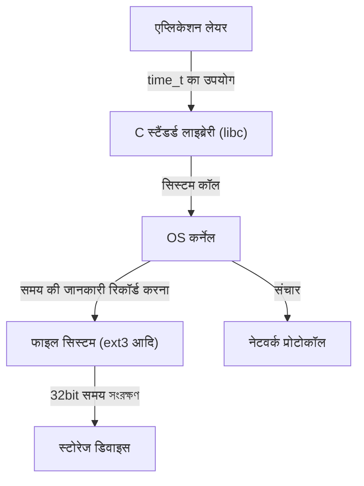

# प्रस्तावना: डिजिटल दुनिया की धीरे-धीरे आती हुई प्रलय की घड़ी

हमारा आधुनिक समाज अनगिनत कंप्यूटर सिस्टम द्वारा समर्थित है। वित्तीय संस्थानों के लेन-देन, विमान उड़ान प्रबंधन प्रणाली, स्मार्टफोन संचार, और हमारे आसपास के IoT उपकरण। ये सभी सिस्टम "समय" की सामान्य अवधारणा के आधार पर काम करते हैं। लेकिन क्या होगा अगर वह समय तंत्र अचानक एक दिन विफल हो जाए?

यही "2038 की समस्या (Y2K38)" है, जो वर्तमान में IT उद्योग में चुपचाप लेकिन निश्चित रूप से अपनी समय सीमा के करीब पहुंच रही है। 2000 की समस्या (Y2K) पर विजय प्राप्त करने वाले हमारे लिए, 2038 की समस्या अगली बड़ी परीक्षा के रूप में खड़ी है। इस लेख में, हम 2038 की समस्या के तंत्र, ऐतिहासिक पृष्ठभूमि कि इसे इस तरह क्यों डिजाइन किया गया था, और आधुनिक इंजीनियर तकनीकी गहराई के साथ इस समस्या का सामना कैसे कर रहे हैं, इसके बारे में विस्तार से बताएंगे।

# UNIX समय (Epoch Time) कैसे काम करता है

2038 की समस्या को समझने के लिए, सबसे पहले यह जानना आवश्यक है कि "कंप्यूटर समय को कैसे समझते हैं"। "वर्ष, माह, दिन, घंटे, मिनट, सेकंड" की अवधारणा, जिसका हम आमतौर पर उपयोग करते हैं, मनुष्यों के लिए समझना बहुत आसान है, लेकिन कंप्यूटर के लिए इसे संभालना एक कठिन प्रारूप है। लीप वर्ष, बड़े और छोटे महीने और समय क्षेत्र जैसे बहुत सारे कारक हैं जो गणनाओं को जटिल बनाते हैं।

इसलिए, कई कंप्यूटर सिस्टम, विशेष रूप से UNIX ऑपरेटिंग सिस्टम, एक बहुत ही सरल अवधारणा का उपयोग करते हैं जिसे "UNIX समय (या युग सेकंड)" कहा जाता है। UNIX समय "1 जनवरी 1970 00:00:00 UTC (समन्वित सार्वभौमिक समय)" को अपने शुरुआती बिंदु (युग) के रूप में उपयोग करता है और उस समय से बीत चुके सेकंड की संख्या को केवल एक "पूर्णांक" के रूप में गिनता रहता है।

उदाहरण के लिए, 1 जनवरी 1970 00:01:00 UTC पर, UNIX समय "60" होगा। यह सरल पूर्णांक प्रतिनिधित्व समय को जोड़ना, घटाना और तुलना करना बहुत तेज़ और आसान बनाता है।

# 32-बिट हस्ताक्षरित पूर्णांक (32-bit signed integer) की सीमाएं और ओवरफ्लो

1970 के दशक की शुरुआत में जब UNIX सिस्टम विकसित किए गए थे, तब कंप्यूटर संसाधन आज की तुलना में बहुत सीमित थे। मेमोरी और स्टोरेज बहुत महंगे थे, इसलिए डेटा को यथासंभव छोटे आकार में प्रदर्शित करना अत्यंत महत्वपूर्ण था।

इसलिए, UNIX समय (C भाषा में `time_t` प्रकार) को प्रदर्शित करने के लिए उपयोग किया जाने वाला चर "32-बिट हस्ताक्षरित पूर्णांक (32-bit signed integer)" के रूप में परिभाषित किया गया था। 32 बिट्स (4 बाइट्स) का डेटा आकार 2 की घात 32, या `4,294,967,296` संभावित मानों का प्रतिनिधित्व कर सकता है। चूंकि यह एक हस्ताक्षरित पूर्णांक है, यह आधे सकारात्मक मानों और आधे नकारात्मक मानों को आवंटित करता है, और प्रतिनिधित्व किया जा सकने वाला अधिकतम मान `2,147,483,647` है। (नकारात्मक मान 1970 से पहले के समय का प्रतिनिधित्व करने के लिए उपयोग किए जाते हैं)।

यह `2,147,483,647` सेकंड का समय 2038 की समस्या का मूल कारण है।

1 जनवरी 1970 से `2,147,483,647` सेकंड बाद। गणना करने पर यह निम्नलिखित तिथि और समय होगा:

**समन्वित सार्वभौमिक समय (UTC): 19 जनवरी 2038 03:14:07**
(भारतीय मानक समय के अनुसार 19 जनवरी 2038 08:44:07)

जैसे ही यह समय 1 सेकंड भी आगे बढ़ता है, कंप्यूटर के अंदर का काउंटर `2,147,483,648` होने का प्रयास करेगा, लेकिन यह 32-बिट हस्ताक्षरित पूर्णांक के अधिकतम मान से अधिक हो जाता है, जिससे "ओवरफ्लो (overflow)" होता है। बाइनरी दुनिया में, सबसे महत्वपूर्ण बिट (चिह्न का प्रतिनिधित्व करने वाला बिट) उलट जाता है, और सिस्टम अचानक समय को "नकारात्मक" के रूप में व्याख्या करना शुरू कर देता है।

नतीजतन, सिस्टम वर्तमान समय को निम्नानुसार गलत पहचान लेगा:

**माइनस 2,147,483,648 सेकंड = 13 दिसंबर 1901 20:45:52 UTC**

# ओवरफ्लो के विनाशकारी प्रभाव

यदि सिस्टम अचानक यह पहचानना शुरू कर देता है कि "वर्तमान वर्ष 1901 है", तो इसका क्या प्रभाव होगा? इसका प्रभाव केवल कैलेंडर ऐप के गलत प्रदर्शन तक सीमित नहीं होगा।

1. **सुरक्षा और एन्क्रिप्टेड संचार का पतन**
   HTTPS संचार के लिए उपयोग किए जाने वाले SSL/TLS प्रमाणपत्रों की समाप्ति तिथि होती है। जो सिस्टम मानता है कि "वर्तमान वर्ष 1901 है", वह सभी प्रमाणपत्रों को "भविष्य के" या "समाप्त" के रूप में आंक सकता है, और सुरक्षित संचार को पूरी तरह से अस्वीकार कर सकता है। इससे वेब ब्राउज़िंग, API संचार और वित्तीय लेनदेन ठप हो जाएंगे।
2. **डेटाबेस में डेटा विनाश**
   डेटाबेस डेटा निर्माण और अपडेट तिथि रिकॉर्ड करते हैं। समय में पीछे जाने से नई जानकारी को पुरानी जानकारी के रूप में माना जा सकता है, या समाप्ति तिथियों वाले रिकॉर्ड (जैसे सत्र जानकारी) को तुरंत हटा दिया जा सकता है, जिससे गंभीर डेटा असंगति पैदा हो सकती है।
3. **बुनियादी ढांचा और एम्बेडेड सिस्टम की खराबी**
   फैक्ट्री नियंत्रण प्रणाली, चिकित्सा उपकरण और वायु यातायात नियंत्रण प्रणाली जैसे "एम्बेडेड सिस्टम" जिन्हें एक बार तैनात किए जाने के बाद दशकों तक अपडेट नहीं किया जा सकता है, समय के उलटने के कारण असामान्य समाप्ति (क्रैश) या अप्रत्याशित व्यवहार का जोखिम उठाते हैं।
4. **सॉफ़्टवेयर लाइसेंस प्रबंधन**
   सॉफ़्टवेयर सब्सक्रिप्शन और लाइसेंस को "समाप्त" माना जा सकता है, जिससे वे सभी एक साथ काम करना बंद कर सकते हैं।

# सिस्टम आर्किटेक्चर की श्रृंखला प्रतिक्रिया

2038 की समस्या केवल एक एप्लिकेशन की समस्या नहीं है, बल्कि एक गहरी जड़ वाली समस्या है जो OS से लेकर नेटवर्क प्रोटोकॉल तक पदानुक्रमित (hierarchically) रूप से प्रभावित करती है।

भले ही एप्लिकेशन अपने आप 64-बिट समय को संभाल सके, अगर अंतर्निहित C स्टैंडर्ड लाइब्रेरी और OS कर्नेल 32-बिट `time_t` का उपयोग करते हैं, तो सिस्टम कॉल के माध्यम से पारित समय की जानकारी अभी भी 32-बिट होगी। इसके अलावा, फाइल सिस्टम (जैसे पुराने ext3 या FAT) भी मेटाडेटा के रूप में 32 बिट्स में टाइमस्टैम्प को सहेज सकते हैं, इसलिए आप इस समस्या का सामना कर सकते हैं कि डिस्क पर डेटा स्वयं 2038 के बाद का प्रतिनिधित्व नहीं कर सकता है।

# ऐतिहासिक पृष्ठभूमि: यह 32-बिट क्यों था?

आधुनिक संसाधनों के प्रचुर मात्रा में अभ्यस्त हमारी नज़र से, आप सोच सकते हैं, "शुरुआत से ही इसे 64-बिट क्यों नहीं बनाया गया?" हालांकि, 1970 के दशक में, जब UNIX का जन्म हुआ, मेनफ्रेम और मिनीकंप्यूटर के युग में, कुछ बाइट मेमोरी की बचत भी सिस्टम के प्रदर्शन को निर्धारित करती थी।

शुरुआती UNIX में, समय को वास्तव में "1/60 सेकंड की इकाइयों में 32-बिट पूर्णांक" के रूप में प्रबंधित किया जाता था। हालाँकि, यह केवल 2.5 वर्षों में ओवरफ्लो हो जाएगा। इसलिए, इकाई को "1 सेकंड" में बदल दिया गया, और जीवनकाल को लगभग 68 वर्ष (1970 से 2038) तक बढ़ा दिया गया। उस समय के डेवलपर्स के लिए, यह कल्पना करना असंभव था कि उनके द्वारा डिज़ाइन किया गया सिस्टम 68 साल बाद भी उपयोग किया जाएगा। वास्तव में, UNIX के डेवलपर्स में से एक, केन थॉम्पसन (Ken Thompson) ने कहा, "मुझे नहीं लगा था कि UNIX का उपयोग इतने लंबे समय तक किया जाएगा।"

# 2038 की समस्या और वर्तमान स्थिति का समाधान

इस टाइम बम का सबसे निश्चित समाधान "समय का प्रतिनिधित्व करने वाले चर को 64-बिट पूर्णांक तक विस्तारित करना" है। एक 64-बिट हस्ताक्षरित पूर्णांक अधिकतम सेकंड का प्रतिनिधित्व कर सकता है जो लगभग 292 बिलियन वर्ष भविष्य में है। यह ब्रह्मांड के जीवनकाल (दसियों अरबों से लेकर खरबों वर्षों) से भी लंबा है, इसलिए वस्तुतः हमेशा के लिए ओवरफ्लो के बारे में चिंता करने की कोई आवश्यकता नहीं है।

वर्तमान में, प्रमुख सिस्टम आर्किटेक्चर में निम्नलिखित उपाय किए जा रहे हैं।

1. **64-बिट OS में पूर्ण परिवर्तन**
   कई आधुनिक पीसी, सर्वर और स्मार्टफोन पहले से ही 64-बिट प्रोसेसर से लैस हैं और 64-बिट OS (विंडोज, मैकओएस, 64-बिट लिनक्स) चला रहे हैं। इन वातावरणों में, `time_t` प्रकार भी स्वाभाविक रूप से 64-बिट तक विस्तारित हो गया है, और OS स्तर पर 2038 की समस्या का समाधान पहले ही हो चुका है।
2. **लिनक्स कर्नेल में 32-बिट सिस्टम सपोर्ट में सुधार**
   सबसे बड़ी चुनौती "लिनक्स का 32-बिट संस्करण" है जो IoT उपकरणों में स्थापित है। लिनक्स कर्नेल समुदाय ने कर्नेल संस्करण 5.6 (2020 में जारी) में 32-बिट आर्किटेक्चर पर भी 64-बिट `time_t` का समर्थन करने के लिए बड़े बदलाव किए हैं। परिणामस्वरूप, 32-बिट हार्डवेयर पर भी नवीनतम कर्नेल का उपयोग करके 2038 की बाधा को पार किया जा सकता है।
3. **फाइल सिस्टम अपडेट**
   आधुनिक फाइल सिस्टम जैसे ext4, XFS और ZFS पहले से ही 2038 और उसके बाद के टाइमस्टैम्प का समर्थन करते हैं। हालाँकि, यदि पुराने ext3 फाइल सिस्टम जो पुराने सिस्टम से अपग्रेड नहीं किए गए हैं, अभी भी मौजूद हैं, तो सावधानी बरतने की आवश्यकता है।

# शेष चुनौतियाँ: विरासत (Legacy) सिस्टम और इंटरऑपरेबिलिटी

भले ही तकनीकी समाधान तैयार किए गए हों, 2038 की समस्या का असली डर "विरासत प्रणाली (Legacy systems) में छिपा हुआ है जिसे देखा नहीं जा सकता"।

- **एम्बेडेड उपकरण जो अपडेट नहीं किए गए हैं**: दुनिया भर में अनगिनत उपकरण हैं, जैसे पनडुब्बी केबल रिपीटर, कृत्रिम उपग्रह और पुराने कारखाने के नियंत्रण कक्ष, जिनके सॉफ़्टवेयर को भौतिक या परिचालन कारणों से आसानी से अपडेट नहीं किया जा सकता है।
- **डेटा स्वरूप और प्रोटोकॉल**: पुराने प्रोटोकॉल जो नेटवर्क पर 32-बिट बाइनरी के रूप में समय की जानकारी का आदान-प्रदान करते हैं (जैसे कुछ NTP पैकेट स्वरूप और डेटाबेस के बाइनरी डंप) तब तक काम नहीं करेंगे जब तक कि प्रेषक और रिसीवर दोनों अपडेट नहीं किए जाते।
- **एप्लिकेशन के भीतर हार्डकोडिंग**: ऐसे एप्लिकेशन के कोड जो स्वतंत्र रूप से 32-बिट बॉक्स में समय को भरते और क्रमित करते हैं, OS को अपडेट करने पर भी ठीक नहीं होंगे। डेवलपर्स को स्रोत कोड को मैन्युअल रूप से संशोधित और पुन: संकलित (recompile) करने की आवश्यकता है।

# निष्कर्ष: भविष्य के इंजीनियरों के लिए एक सबक

2038 की समस्या केवल एक "बग" नहीं है, बल्कि "तकनीकी ऋण (technical debt)" की चरम सीमा है जहां पिछले संसाधन की बाधाओं के समझौते समय के साथ स्पष्ट हो गए हैं।

2000 की समस्या (Y2K) में, दुनिया भर के इंजीनियरों ने सिस्टम को संशोधित करने और बड़े पैमाने पर दहशत को रोकने के लिए बहुत प्रयास किए। हालाँकि, 2038 की समस्या Y2K की तुलना में अधिक गहरी जड़ें जमाए हुए है, और यह एप्लिकेशन लेयर की तुलना में सिस्टम (OS, कर्नेल, फाइल सिस्टम) के मूल में बहुत गहरी पैठ बना चुकी है।

चूंकि हम 19 जनवरी 2038 की ओर बढ़ रहे हैं, हमें पुराने सिस्टम की पहचान करने, माइग्रेशन योजनाएँ तैयार करने और अपने सिस्टम को लगातार आधुनिक बनाने की आवश्यकता है। और, जब वर्तमान इंजीनियर सॉफ़्टवेयर डिज़ाइन करते हैं, तो उन्हें इस विनम्र दृष्टिकोण की आवश्यकता होती है कि "यह सिस्टम मेरी कल्पना से अधिक लंबे समय तक जीवित रह सकता है" और पर्याप्त मार्जिन वाले आर्किटेक्चर का निर्माण करना होगा।
