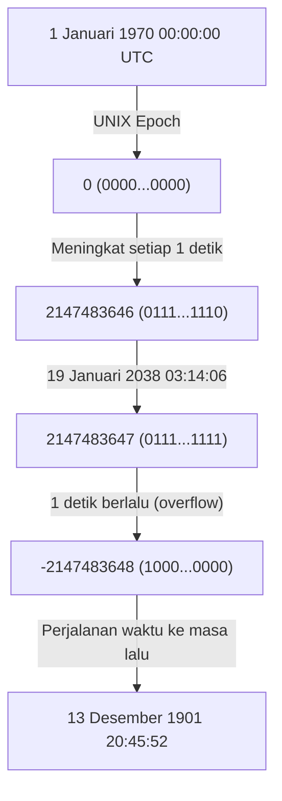
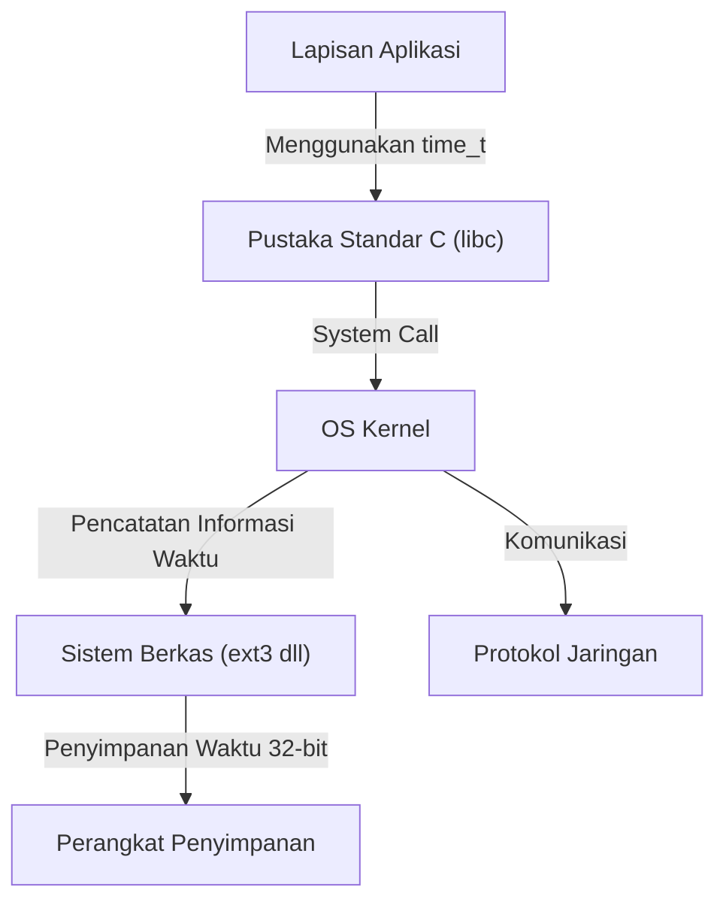

# Pengantar: Jam Kiamat Dunia Digital yang Mengintai

Masyarakat modern kita didukung oleh sistem komputer yang tak terhitung jumlahnya. Transaksi lembaga keuangan, sistem manajemen lalu lintas udara, komunikasi ponsel pintar, dan perangkat IoT yang melimpah di sekitar kita. Semua sistem ini beroperasi dengan dasar konsep umum yaitu "waktu". Namun, apa yang akan terjadi jika mekanisme yang mendasari waktu tersebut tiba-tiba rusak pada suatu hari?

Itulah "Masalah Tahun 2038 (Y2K38)", sebuah batas waktu yang secara diam-diam namun pasti sedang mendekat di industri TI saat ini. Bagi kita yang telah melewati masalah tahun 2000 (Y2K), masalah tahun 2038 berdiri sebagai ujian besar berikutnya. Dalam artikel ini, kita akan membahas secara mendetail, disertai pendalaman teknis, mengenai mekanisme masalah tahun 2038 ini, latar belakang sejarah mengapa desainnya dibuat seperti itu, dan bagaimana para insinyur modern menghadapi masalah ini.

# Mekanisme Waktu UNIX (Epoch Time)

Untuk memahami masalah tahun 2038, pertama-tama kita perlu mengetahui "bagaimana komputer memahami waktu". Konsep "tahun, bulan, hari, jam, menit, dan detik" yang biasa kita gunakan sangat mudah dipahami oleh manusia, tetapi ini adalah format yang sulit ditangani oleh komputer. Hal ini disebabkan terlalu banyak elemen yang membuat perhitungan menjadi rumit, seperti tahun kabisat, jumlah hari yang bervariasi dalam sebulan, zona waktu, dan sebagainya.

Oleh karena itu, banyak sistem komputer, terutama sistem operasi berbasis UNIX, mengadopsi konsep yang sangat sederhana yang disebut "Waktu UNIX (atau Detik Epoch)". Waktu UNIX adalah sistem yang menjadikan "1 Januari 1970 00:00:00 UTC (Waktu Universal Terkoordinasi)" sebagai titik awal (Epoch), dan terus menghitung berapa detik yang telah berlalu sejak saat itu sebagai "bilangan bulat" tunggal.

Sebagai contoh, pada 1 Januari 1970 00:01:00 UTC, waktu UNIX akan bernilai "60". Dengan representasi bilangan bulat sederhana ini, penambahan, pengurangan, dan perbandingan waktu dapat dilakukan dengan sangat cepat dan mudah.

# Batasan dan Luapan Bilangan Bulat Bertanda 32-Bit

Pada awal 1970-an ketika sistem UNIX dikembangkan, sumber daya komputer sangat terbatas dan tidak dapat dibandingkan dengan saat ini. Karena memori dan penyimpanan sangat mahal, menyajikan data dalam ukuran sekecil mungkin adalah tujuan utama.

Oleh karena itu, variabel untuk merepresentasikan waktu UNIX (tipe `time_t` dalam bahasa C) didefinisikan sebagai "bilangan bulat bertanda 32-bit (32-bit signed integer)". Jumlah data 32-bit (4 byte) dapat merepresentasikan 2 pangkat 32, atau `4,294,967,296` macam nilai numerik. Karena merupakan bilangan bulat bertanda, nilainya dibagi dua untuk nilai positif dan negatif, sehingga nilai maksimum yang dapat direpresentasikan adalah `2,147,483,647`. (Nilai negatif digunakan untuk merepresentasikan waktu sebelum tahun 1970).

Waktu selama `2,147,483,647` detik ini adalah sumber dari semua malapetaka masalah tahun 2038.

Setelah `2,147,483,647` detik berlalu dari 1 Januari 1970, jika dihitung, akan jatuh pada tanggal dan waktu berikut:

**Waktu Universal Terkoordinasi (UTC): 19 Januari 2038 03:14:07**
(Waktu Standar Jepang: 19 Januari 2038 12:14:07)

Ketika waktu ini berlalu bahkan hanya 1 detik saja, penghitung internal komputer akan mencoba menjadi `2,147,483,648`, tetapi karena melebihi nilai maksimum dari bilangan bulat bertanda 32-bit, "luapan (overflow)" akan terjadi. Dalam dunia biner, bit yang paling signifikan (bit yang merepresentasikan tanda) akan terbalik, dan tiba-tiba sistem akan mulai menerjemahkan waktu sebagai nilai "minus".

Akibatnya, sistem akan salah mengidentifikasi waktu saat ini menjadi seperti berikut:

**Minus 2,147,483,648 detik ＝ 13 Desember 1901 20:45:52 UTC**

# Dampak Bencana yang Ditimbulkan oleh Luapan

Jika sistem tiba-tiba mulai menganggap "saat ini adalah tahun 1901", dampak apa yang akan terjadi? Dampaknya tidak hanya sekadar tampilan aplikasi kalender yang menjadi aneh.

1. **Runtuhnya Keamanan dan Komunikasi Kriptografi**
   Sertifikat SSL/TLS yang digunakan untuk komunikasi HTTPS dan lainnya memiliki masa berlaku. Sistem yang menganggap "saat ini adalah tahun 1901" akan menilai semua sertifikat berasal dari "masa depan" atau "sudah kedaluwarsa", dan kemungkinan besar akan menolak semua komunikasi aman. Hal ini akan melumpuhkan penjelajahan web, komunikasi API, dan transaksi keuangan.
2. **Kerusakan Data pada Basis Data**
   Tanggal pembuatan dan pembaruan data dicatat dalam basis data. Dengan berjalannya waktu mundur, data baru mungkin diperlakukan sebagai data lama, atau rekam jejak yang memiliki batas waktu kedaluwarsa (seperti informasi sesi) akan langsung dibuang, menyebabkan inkonsistensi data yang parah.
3. **Malfungsi Sistem Infrastruktur dan Tertanam**
   Pada "sistem tertanam" seperti sistem kontrol pabrik, peralatan medis, atau sistem kontrol lalu lintas udara, yang sering kali tidak diperbarui selama puluhan tahun setelah diterjunkan, mundurnya waktu membawa risiko kegagalan (crash) atau perilaku tak terduga yang berbahaya.
4. **Manajemen Lisensi Perangkat Lunak**
   Langganan dan lisensi perangkat lunak kemungkinan akan dianggap "kedaluwarsa" dan tiba-tiba berhenti berfungsi.

# Reaksi Berantai pada Arsitektur Sistem

Masalah tahun 2038 bukan sekadar masalah aplikasi tunggal, melainkan masalah yang sangat mengakar yang memengaruhi sistem secara hierarkis, mulai dari sistem operasi hingga protokol jaringan.

Meskipun sebuah aplikasi dapat menangani waktu 64-bit secara mandiri, jika Pustaka Standar C (C Standard Library) atau OS kernel di belakangnya menggunakan `time_t` 32-bit, informasi waktu yang diteruskan melalui system call akan tetap dalam format 32-bit. Selain itu, sistem berkas (seperti ext3 atau FAT lama) mungkin juga menyimpan stempel waktu (timestamp) dalam format 32-bit sebagai metadata, sehingga data di dalam diska (disk) itu sendiri tidak akan bisa merepresentasikan waktu setelah tahun 2038.

# Latar Belakang Sejarah: Mengapa 32-Bit?

Dilihat dari sudut pandang saat ini, di mana sumber daya berlimpah, kita mungkin bertanya-tanya, "Mengapa tidak dibuat 64-bit sejak awal?" Namun, di era komputer mainframe dan komputer mini (minicomputer) tahun 1970-an ketika UNIX lahir, penghematan memori sebesar beberapa byte pun sangat menentukan kinerja sistem.

Faktanya, pada versi awal UNIX, waktu dikelola dalam "bilangan bulat 32-bit dengan satuan 1/60 detik". Namun, dengan format ini, nilai akan meluap (overflow) hanya dalam waktu sekitar 2,5 tahun. Oleh karena itu, satuan tersebut diubah menjadi "1 detik", yang memperpanjang usianya hingga sekitar 68 tahun (dari tahun 1970 hingga 2038). Bagi para pengembang pada masa itu, sulit membayangkan bahwa sistem yang mereka rancang akan terus digunakan hingga 68 tahun ke depan. Fakta menarik, Ken Thompson, salah satu pengembang UNIX, juga mengatakan, "Saya tidak pernah menyangka UNIX akan digunakan selama ini."

# Penanggulangan dan Status Saat Ini untuk Masalah Tahun 2038

Solusi paling pasti untuk bom waktu ini adalah "memperluas variabel yang merepresentasikan waktu menjadi bilangan bulat 64-bit". Jumlah detik maksimal yang dapat direpresentasikan oleh bilangan bulat bertanda 64-bit adalah sekitar 292 miliar tahun ke depan. Waktu ini lebih panjang daripada umur alam semesta (puluhan hingga ratusan miliar tahun), sehingga secara praktis kita tidak perlu lagi mengkhawatirkan terjadinya luapan (overflow) selamanya.

Saat ini, berbagai penanggulangan berikut sedang diterapkan pada arsitektur sistem-sistem utama.

1. **Transisi Penuh ke OS 64-Bit**
   Kebanyakan PC, peladen (server), dan ponsel pintar modern telah dilengkapi dengan prosesor 64-bit dan menjalankan OS 64-bit (Windows, macOS, Linux versi 64-bit). Di dalam lingkungan ini, tipe `time_t` secara alami diperluas menjadi 64-bit, sehingga masalah tahun 2038 pada tingkat sistem operasi telah terselesaikan.
2. **Perbaikan Dukungan Sistem 32-Bit pada Linux Kernel**
   Tantangan terbesar ada pada "Linux versi 32-bit" yang ditanamkan dalam perangkat IoT dan sejenisnya. Dalam komunitas Linux kernel, pada versi kernel 5.6 (dirilis tahun 2020), sebuah perbaikan besar dilakukan untuk mendukung `time_t` 64-bit bahkan pada arsitektur 32-bit. Berkat perbaikan ini, penggunaan kernel terbaru memungkinkan perangkat keras 32-bit untuk melewati batasan tahun 2038.
3. **Pembaruan Sistem Berkas**
   Sistem berkas modern seperti ext4, XFS, dan ZFS telah mendukung stempel waktu (timestamp) melewati tahun 2038. Namun, kita harus berhati-hati jika masih ada sistem berkas ext3 lama dan sistem sejenisnya yang belum diperbarui dari sistem sebelumnya.

# Tantangan yang Tersisa: Sistem Lawas dan Interoperabilitas

Meskipun solusi teknis telah disediakan, kengerian sebenarnya dari masalah tahun 2038 terletak pada "sistem lawas (legacy system) yang tersembunyi".

- **Perangkat Tertanam yang Tidak Diperbarui**: Terdapat tak terhitung banyaknya perangkat di seluruh dunia yang sulit diperbarui perangkat lunaknya karena alasan fisik atau operasional, seperti penguat sinyal pada kabel bawah laut, satelit buatan, atau panel kontrol pada pabrik-pabrik tua.
- **Format Data dan Protokol**: Protokol lama yang bertukar informasi waktu dalam bentuk biner 32-bit melalui jaringan (seperti beberapa format paket NTP atau pembuangan biner dari basis data) tidak akan berfungsi kecuali pihak pengirim dan penerima telah memperbaruinya.
- **Pengkodean Keras (Hardcode) dalam Aplikasi**: Kode aplikasi yang menyisipkan dan menyerialisasikan informasi waktu secara mandiri ke dalam wadah 32-bit tidak akan otomatis terperbaiki walau sistem operasinya diperbarui. Pengembang harus mengubah kode sumber (source code) secara manual dan melakukan kompilasi ulang.

# Kesimpulan: Pelajaran bagi Insinyur Masa Depan

Masalah tahun 2038 bukanlah sekadar "bug (kutu)", melainkan puncak dari "utang teknis (technical debt)" di mana kompromi akibat keterbatasan sumber daya pada masa lalu muncul seiring berjalannya waktu.

Pada masalah tahun 2000 (Y2K), para teknisi di seluruh dunia berupaya keras untuk memperbaiki sistem guna mencegah kepanikan massal. Namun, masalah tahun 2038 jauh lebih mengakar daripada Y2K, menyusup sangat dalam ke bagian inti sistem (sistem operasi, kernel, sistem berkas) melampaui lapisan aplikasi.

Menjelang tanggal 19 Januari 2038, kita harus menemukan sistem-sistem lama tersebut, menyusun rencana migrasi, dan secara bertahap memodernisasi sistem yang ada. Dan saat merancang perangkat lunak, para insinyur masa kini dituntut untuk memiliki pandangan yang rendah hati—mengingat bahwa "sistem ini mungkin akan bertahan lebih lama dari yang dapat dibayangkan"—dan membangun arsitektur dengan margin kapasitas yang cukup.
