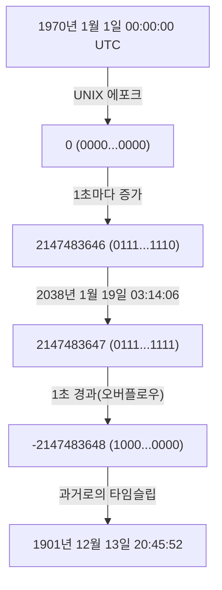
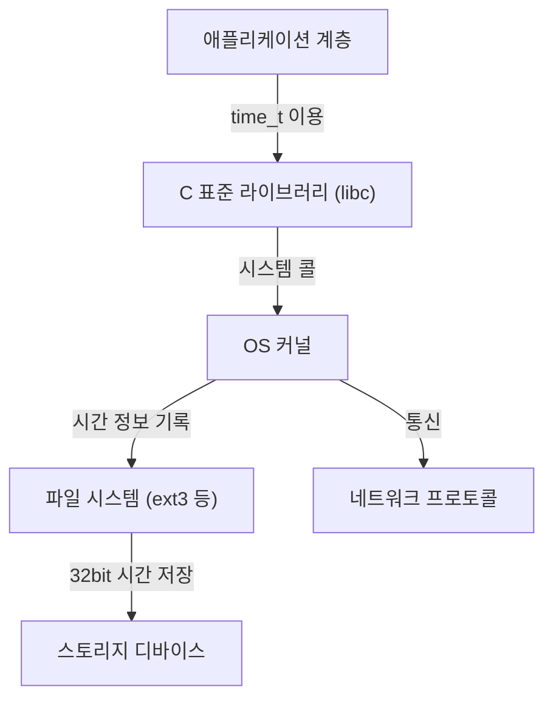

# 서론: 다가오는 디지털 세계의 종말 시계

우리의 현대 사회는 무수한 컴퓨터 시스템에 의해 지탱되고 있습니다. 금융 기관의 트랜잭션, 항공기 운항 관리 시스템, 스마트폰 통신, 그리고 우리 주변에 넘쳐나는 IoT 디바이스. 이들 시스템은 모두 '시간'이라는 공통된 개념을 기반으로 동작하고 있습니다. 하지만 그 시간의 근저에 있는 구조가 어느 날 갑자기 파탄난다면 어떻게 될까요?

그것이 바로 현재 IT 업계에서 조용하지만 확실하게 타임 리미트를 맞이하고 있는 '2038년 문제(Y2K38)'입니다. 2000년 문제(Y2K)를 극복한 우리에게 2038년 문제는 다음의 큰 시련으로 가로막고 있습니다. 본 기사에서는 이 2038년 문제의 메커니즘부터, 왜 그러한 설계가 되었는지에 대한 역사적 배경, 그리고 현대의 엔지니어들이 어떻게 이 문제에 맞서고 있는지를 기술적인 깊이와 함께 상세히 해설합니다.

# UNIX 시간(Epoch Time)의 구조

2038년 문제를 이해하기 위해서는 먼저 '컴퓨터가 어떻게 시간을 이해하고 있는가'를 알아야 합니다. 우리가 평소 사용하는 '연·월·일·시·분·초'라는 개념은 인간에게는 매우 알기 쉬운 것이지만, 컴퓨터에게는 다루기 까다로운 형식입니다. 윤년이나 크고 작은 달, 시간대 등 계산을 복잡하게 만드는 요소가 너무 많기 때문입니다.

그래서 많은 컴퓨터 시스템, 특히 UNIX 계열 운영 체제에서는 'UNIX 시간(또는 에포크 초)'이라는 매우 단순한 개념을 채택하고 있습니다. UNIX 시간은 '1970년 1월 1일 00:00:00 UTC(협정 세계시)'를 기점(에포크)으로 하여, 거기서부터 몇 초가 지났는지를 단순한 '정수'로 계속 세는 구조입니다.

예를 들어, 1970년 1월 1일 00:01:00 UTC라면 UNIX 시간은 '60'이 됩니다. 이 단순한 정수 표현 덕분에 시간의 가감산이나 비교가 매우 빠르고 쉽게 이루어질 수 있게 되었습니다.

# 32비트 부호 있는 정수의 한계와 오버플로우

UNIX 시스템이 개발된 1970년대 초반, 컴퓨터의 리소스는 현대와는 비교할 수 없을 정도로 제한되어 있었습니다. 메모리도 스토리지도 매우 비쌌기 때문에, 데이터를 가능한 한 작은 크기로 표현하는 것이 지상 과제였습니다.

따라서 UNIX 시간을 표현하기 위한 변수(C언어의 `time_t` 형)는 '32비트 부호 있는 정수(32-bit signed integer)'로 정의되었습니다. 32비트(4바이트)의 데이터 양은 2의 32제곱, 즉 `4,294,967,296` 가지의 수치를 표현할 수 있습니다. 부호 있는 정수이기 때문에 양수와 음수를 절반씩 할당하여, 표현할 수 있는 최댓값은 `2,147,483,647`이 됩니다. (음수 값은 1970년 이전의 시간을 나타내기 위해 사용됩니다).

이 `2,147,483,647` 초라는 시간이 2038년 문제의 모든 원흉입니다.

1970년 1월 1일로부터 `2,147,483,647` 초 후. 그것을 계산하면 다음과 같은 일시가 됩니다.

**협정 세계시(UTC): 2038년 1월 19일 03:14:07**
(한국 표준시로는 2038년 1월 19일 12:14:07)

이 시각을 1초라도 지나면, 컴퓨터 내부의 카운터는 `2,147,483,648`이 되려고 하지만, 32비트 부호 있는 정수의 최댓값을 넘어버리기 때문에 '오버플로우(자릿수 넘침)'가 발생합니다. 이진수의 세계에서는 최상위 비트(부호를 나타내는 비트)가 반전되어 버려서, 갑자기 시스템은 시각을 '마이너스'로 해석하기 시작합니다.

그 결과, 시스템은 현재 시각을 다음과 같이 오인하게 됩니다.

**마이너스 2,147,483,648초 ＝ 1901년 12월 13일 20:45:52 UTC**

# 오버플로우가 일으키는 파멸적인 영향

시스템이 갑자기 "현재는 1901년이다"라고 인식하기 시작했을 경우, 어떤 영향이 생길까요? 그 영향은 단순히 캘린더 앱의 표시가 이상해지는 것에 그치지 않습니다.

1. **보안과 암호 통신의 붕괴**
   HTTPS 통신 등에 사용되는 SSL/TLS 인증서에는 유효 기간이 있습니다. "현재는 1901년"이라고 인식한 시스템은 모든 인증서를 "미래의 것" 혹은 "만료된 것"으로 판단하고 안전한 통신을 일절 거부할 가능성이 있습니다. 이로 인해 웹 브라우징이나 API 통신, 금융 거래가 마비됩니다.
2. **데이터베이스의 데이터 파괴**
   데이터베이스에는 데이터의 생성 일시나 갱신 일시가 기록되어 있습니다. 시간이 역행함에 따라 새로운 데이터가 오래된 데이터로 취급되거나, 유효 기간이 설정된 레코드(세션 정보 등)가 즉각 폐기되는 등 심각한 데이터 불일치가 발생합니다.
3. **인프라 및 임베디드 시스템의 오작동**
   공장의 제어 시스템이나 의료 기기, 항공 관제 시스템 등, 한 번 배포되면 수십 년간 업데이트되지 않는 경우가 많은 '임베디드 시스템'에서는 시간의 역행으로 인해 비정상 종료(크래시)나 예기치 않은 동작을 일으킬 위험성이 있습니다.
4. **소프트웨어의 라이선스 관리**
   소프트웨어의 구독이나 라이선스가 "만료됨"으로 간주되어 일제히 실행되지 않게 될 가능성이 있습니다.

# 시스템 아키텍처의 연쇄 반응

2038년 문제는 단일 애플리케이션의 문제가 아니라, OS부터 네트워크 프로토콜에 이르기까지 계층적으로 영향을 미치는 뿌리 깊은 문제입니다.

애플리케이션이 독자적으로 64비트의 시간을 다룰 수 있다고 해도, 배후에 있는 C 표준 라이브러리나 OS 커널이 32비트의 `time_t`를 사용하고 있다면, 시스템 콜을 통해 전달되는 시간 정보는 여전히 32비트인 채로 남습니다. 또한, 파일 시스템(오래된 ext3나 FAT 등)도 메타데이터로서 32비트로 타임스탬프를 저장하고 있는 경우가 있어, 디스크 상의 데이터 자체가 2038년 이후를 표현할 수 없다는 문제에 직면합니다.

# 역사적 배경: 왜 32비트였는가?

현대의 풍부한 리소스에 익숙해진 눈으로 보면, "왜 처음부터 64비트로 해두지 않았을까?"하고 의문을 가질지도 모릅니다. 하지만 UNIX가 탄생한 1970년대의 메인프레임이나 미니컴퓨터 시대에는, 몇 바이트의 메모리 절약이 시스템의 성능을 좌우했습니다.

초기 UNIX에서는 사실 시간을 '60분의 1초 단위의 32비트 정수'로 관리하고 있었습니다. 하지만 이래서는 불과 약 2.5년 만에 오버플로우해 버립니다. 그래서 단위를 '1초'로 변경하고, 수명을 약 68년(1970년에서 2038년)까지 늘렸다는 배경이 있습니다. 당시의 개발자들에게 있어, 자신이 설계한 시스템이 68년 후에도 계속 사용될 것이라고는 상상도 할 수 없는 일이었습니다. 사실, UNIX의 개발자 중 한 명인 켄 톰슨도 "UNIX가 이렇게 오랫동안 사용될 줄은 몰랐다"고 말했습니다.

# 2038년 문제에 대한 대책과 현황

이 시한폭탄에 대한 가장 확실한 해결책은 '시간을 표현하는 변수를 64비트 정수로 확장하는 것'입니다. 64비트 부호 있는 정수가 표현할 수 있는 최대 초 수는 약 2,920억 년 후가 됩니다. 이는 우주의 수명(수백억 년 ~ 수조 년)보다 길기 때문에, 실질적으로 영원히 오버플로우를 걱정할 필요가 없어집니다.

현재, 주요 시스템 아키텍처에서는 다음과 같은 대응이 진행되고 있습니다.

1. **64비트 OS로의 완전 이행**
   현대의 PC나 서버, 스마트폰의 대부분은 이미 64비트 프로세서를 탑재하고, 64비트 OS(Windows, macOS, 64비트 버전 Linux)를 실행하고 있습니다. 이러한 환경에서는 `time_t` 형도 자연스럽게 64비트로 확장되어 있어, OS 레벨에서의 2038년 문제는 해결된 상태입니다.
2. **Linux 커널에서 32비트 시스템 지원의 개수**
   가장 큰 과제는 IoT 기기 등에 탑재되어 있는 '32비트 버전 Linux'입니다. Linux 커널 커뮤니티에서는 커널 버전 5.6(2020년 릴리스)에서, 32비트 아키텍처 상에서도 64비트의 `time_t`를 지원하는 거대한 개수가 이루어졌습니다. 이를 통해 최신 커널을 이용하면 32비트 하드웨어에서도 2038년의 장벽을 넘을 수 있게 되었습니다.
3. **파일 시스템의 업데이트**
   ext4, XFS, ZFS 등 모던 파일 시스템은 이미 2038년 이후의 타임스탬프를 지원하고 있습니다. 하지만 오래된 시스템에서 업그레이드되지 않은 기존 ext3 파일 시스템 등이 남아있는 경우에는 주의가 필요합니다.

# 남겨진 과제: 레거시 시스템과 상호 운용성

기술적인 해결책이 마련되었다고는 하나, 2038년 문제의 진정한 공포는 "보이지 않는 곳에 숨어있는 레거시 시스템"에 있습니다.

- **업데이트되지 않는 임베디드 기기**: 해저 케이블의 중계기나 인공위성, 오래된 공장의 제어반 등, 물리적 혹은 운용상의 이유로 쉽게 소프트웨어를 갱신할 수 없는 디바이스가 전 세계에는 별의 수만큼 존재합니다.
- **데이터 포맷과 프로토콜**: 시간 정보를 32비트 바이너리로 네트워크 너머로 주고받는 오래된 프로토콜(일부 NTP 패킷 형식이나 데이터베이스의 바이너리 덤프 등)은 송신 측과 수신 측 모두가 업데이트되지 않으면 기능하지 않게 됩니다.
- **애플리케이션 내의 하드코드**: 독자적으로 시간을 32비트의 상자에 담아 직렬화(Serialize)하고 있는 것 같은 애플리케이션의 코드는 OS를 업데이트해도 고쳐지지 않습니다. 개발자가 수작업으로 소스 코드를 수정하고, 다시 컴파일해야 합니다.

# 결론: 미래의 엔지니어를 위한 교훈

2038년 문제는 단순한 '버그'가 아니라, 과거의 리소스 제약이라는 타협의 산물이 시간이 지나면서 표면화된 '기술적 부채'의 극치입니다.

2000년 문제(Y2K)에서는 전 세계의 기술자들이 엄청난 노력을 들여 시스템 개수를 수행하고, 대규모 패닉을 미연에 방지했습니다. 그러나 2038년 문제는 Y2K보다 뿌리 깊으며, 애플리케이션 계층보다 훨씬 깊은 시스템의 핵심(OS나 커널, 파일 시스템)을 파고들고 있습니다.

우리는 2038년 1월 19일을 향해 오래된 시스템을 찾아내고, 이행 계획을 수립하며, 착실하게 시스템을 현대화해 나갈 필요가 있습니다. 그리고 현재의 엔지니어가 소프트웨어를 설계할 때에는, "이 시스템은 자신이 상상하는 것보다 훨씬 더 오래 살아남을지도 모른다"는 겸허한 시각을 갖고, 충분한 마진을 가진 아키텍처를 구축하는 것이 요구되고 있습니다.
