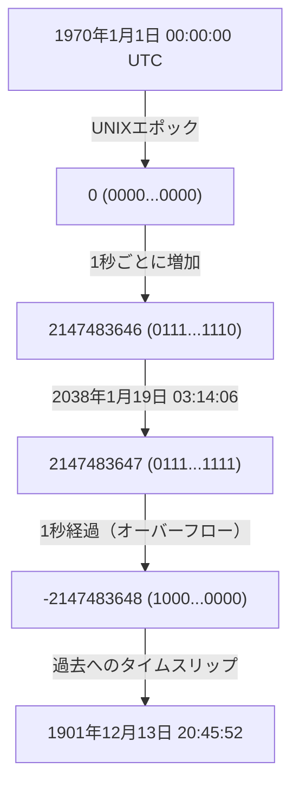
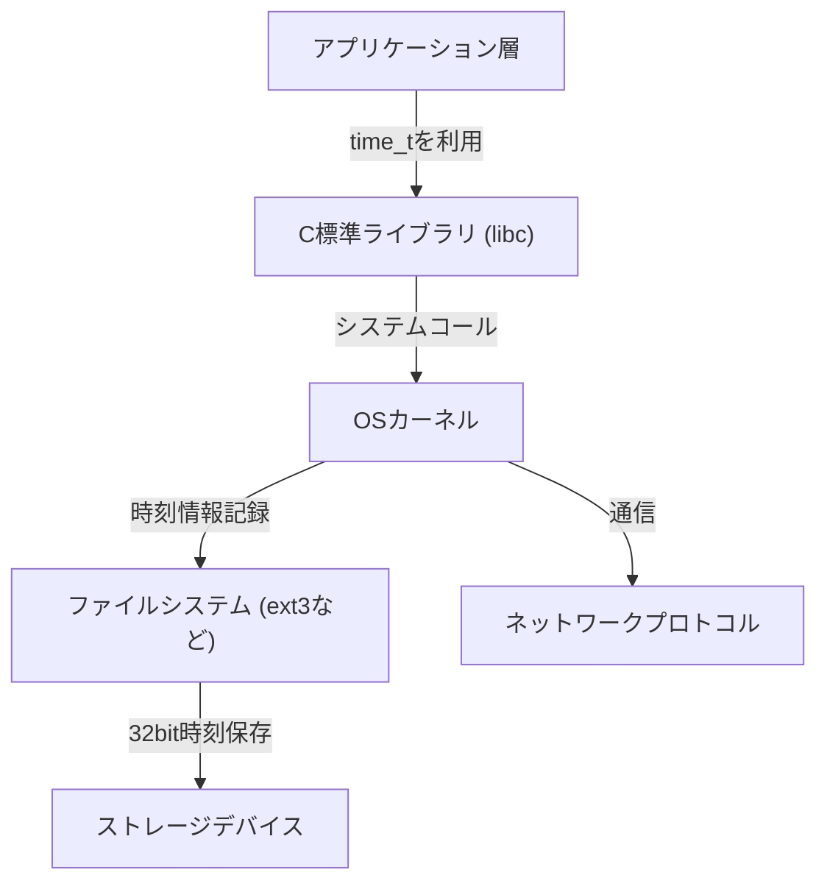

# 序論：忍び寄るデジタル世界の終末時計

私たちの現代社会は、無数のコンピュータシステムによって支えられています。金融機関のトランザクション、航空機の運行管理システム、スマートフォンの通信、そして私たちの身の回りにあふれるIoTデバイス。これらのシステムはすべて、「時間」という共通の概念を基盤にして動作しています。しかし、その時間の根底にある仕組みが、ある日突然破綻するとしたらどうなるでしょうか？

それが、現在IT業界で静かに、しかし確実にタイムリミットを迎えつつある「2038年問題（Y2K38）」です。2000年問題（Y2K）を乗り越えた私たちにとって、2038年問題は次なる大きな試練として立ちはだかっています。本記事では、この2038年問題のメカニズムから、なぜそのような設計になったのかという歴史的背景、そして現代のエンジニアたちがどのようにこの問題に立ち向かっているのかを、技術的な深掘りを交えて詳細に解説していきます。

# UNIX時間（Epoch Time）の仕組み

2038年問題を理解するためには、まず「コンピュータがどのように時間を理解しているのか」を知る必要があります。私たちが普段使っている「年・月・日・時・分・秒」という概念は、人間にとっては非常に分かりやすいものですが、コンピュータにとっては扱いづらい形式です。うるう年や大小の月、タイムゾーンなど、計算を複雑にする要素が多すぎるためです。

そこで、多くのコンピュータシステム、特にUNIX系オペレーティングシステムでは「UNIX時間（またはエポック秒）」という非常にシンプルな概念を採用しています。UNIX時間は、「1970年1月1日 00:00:00 UTC（協定世界時）」を起点（エポック）とし、そこから何秒経過したかを単なる「整数」としてカウントし続けるという仕組みです。

例えば、1970年1月1日 00:01:00 UTCであれば、UNIX時間は「60」になります。この単純な整数表現により、時間の加減算や比較が非常に高速かつ容易に行えるようになりました。

# 32ビット符号付き整数の限界とオーバーフロー

UNIXシステムが開発された1970年代初頭、コンピュータのリソースは現代とは比較にならないほど限られていました。メモリもストレージも非常に高価であったため、データをできるだけ小さなサイズで表現することが至上命題でした。

そのため、UNIX時間を表現するための変数（C言語における`time_t`型）は、「32ビットの符号付き整数（32-bit signed integer）」として定義されました。32ビット（4バイト）のデータ量は、2の32乗、すなわち `4,294,967,296` 通りの数値を表現できます。符号付き整数であるため、正の値と負の値を半分ずつ割り当てており、表現できる最大値は `2,147,483,647` となります。（負の値は1970年より前の時間を表すために使われます）。

この `2,147,483,647` 秒という時間が、2038年問題のすべての元凶です。

1970年1月1日から `2,147,483,647` 秒後。それは計算すると以下の日時になります。

**協定世界時（UTC）：2038年1月19日 03:14:07**
（日本標準時では 2038年1月19日 12:14:07）

この時刻を1秒でも過ぎると、コンピュータ内部のカウンターは `2,147,483,648` になろうとしますが、32ビット符号付き整数の最大値を超えてしまうため、「オーバーフロー（桁あふれ）」が発生します。二進数の世界では、最上位ビット（符号を表すビット）が反転してしまい、突然システムは時刻を「マイナス」として解釈し始めます。

その結果、システムは現在時刻を次のように誤認してしまいます。

**マイナス2,147,483,648秒 ＝ 1901年12月13日 20:45:52 UTC**

# オーバーフローが引き起こす破滅的な影響

システムが突然「現在は1901年である」と認識し始めた場合、どのような影響が出るでしょうか？その影響は単にカレンダーアプリの表示がおかしくなるだけにとどまりません。

1. **セキュリティと暗号通信の崩壊**
   HTTPS通信などに使われるSSL/TLS証明書には有効期限があります。「現在は1901年」と認識したシステムは、すべての証明書を「未来のもの」あるいは「期限切れ」と判断し、安全な通信を一切拒否する可能性があります。これにより、ウェブの閲覧やAPI通信、金融取引が麻痺します。
2. **データベースのデータ破壊**
   データベースにはデータの作成日時や更新日時が記録されています。時間が逆行したことで、新しいデータが古いデータとして扱われたり、有効期限が設定されたレコード（セッション情報など）が即座に破棄されたりするなど、深刻なデータ不整合が発生します。
3. **インフラ・組み込みシステムの誤動作**
   工場の制御システムや医療機器、航空管制システムなど、一度デプロイされたら数十年間アップデートされないことが多い「組み込みシステム」では、時間の逆行により異常終了（クラッシュ）や予期せぬ動作を引き起こす危険性があります。
4. **ソフトウェアのライセンス管理**
   ソフトウェアのサブスクリプションやライセンスが「期限切れ」と見なされ、一斉に起動しなくなる可能性があります。

# システムアーキテクチャの連鎖反応

2038年問題は単一のアプリケーションの問題ではなく、OSからネットワークプロトコルに至るまで、階層的に影響を及ぼす根深い問題です。

アプリケーションが独自に64ビットの時間を扱えたとしても、背後にあるC標準ライブラリやOSカーネルが32ビットの `time_t` を使っていれば、システムコールを通じて渡される時刻情報は依然として32ビットのままです。また、ファイルシステム（古いext3やFATなど）もメタデータとして32ビットでタイムスタンプを保存している場合があり、ディスク上のデータ自体が2038年以降を表現できないという問題に直面します。

# 歴史的背景：なぜ32ビットだったのか？

現代の潤沢なリソースに慣れた目で見ると、「なぜ最初から64ビットにしておかなかったのか？」と疑問に思うかもしれません。しかし、UNIXが誕生した1970年代のメインフレームやミニコンピュータの時代には、数バイトのメモリ節約がシステムの性能を左右しました。

初期のUNIXでは、実は時間を「60分の1秒単位の32ビット整数」で管理していました。しかしこれではたったの約2.5年でオーバーフローしてしまいます。そこで単位を「1秒」に変更し、寿命を約68年（1970年から2038年）まで延ばしたという経緯があります。当時の開発者たちにとって、自分が設計したシステムが68年後も使われ続けることは想像もつかないことでした。事実、UNIXの開発者の一人であるケン・トンプソンも、「UNIXがこんなに長く使われるとは思っていなかった」と語っています。

# 2038年問題への対策と現状

この時限爆弾に対する最も確実な解決策は、「時間を表現する変数を64ビット整数に拡張すること」です。64ビットの符号付き整数が表現できる最大秒数は約2,920億年後となります。これは宇宙の寿命（数百億年〜数兆年）よりも長いため、実質的に永遠にオーバーフローを気にする必要がなくなります。

現在、主要なシステムアーキテクチャでは以下の対応が進められています。

1. **64ビットOSへの完全移行**
   現代のPCやサーバー、スマートフォンの多くはすでに64ビットプロセッサを搭載し、64ビットOS（Windows, macOS, 64ビット版Linux）を実行しています。これらの環境では、`time_t` 型も自然と64ビットに拡張されており、OSレベルでの2038年問題は解決済みとなっています。
2. **Linuxカーネルでの32ビットシステムサポートの改修**
   最も大きな課題は、IoT機器などに搭載されている「32ビット版のLinux」です。Linuxカーネルのコミュニティでは、カーネルバージョン 5.6（2020年リリース）において、32ビットアーキテクチャ上でも64ビットの `time_t` をサポートする巨大な改修が行われました。これにより、最新のカーネルを利用すれば32ビットハードウェアでも2038年の壁を越えられるようになりました。
3. **ファイルシステムのアップデート**
   ext4、XFS、ZFSといったモダンなファイルシステムは、すでに2038年以降のタイムスタンプに対応しています。しかし、古いシステムからアップグレードされていない古いext3ファイルシステムなどが残存している場合は注意が必要です。

# 残された課題：レガシーシステムと相互運用性

技術的な解決策が用意されたとはいえ、2038年問題の真の恐怖は「見えないところに潜んでいるレガシーシステム」にあります。

- **アップデートされない組み込み機器**：海底ケーブルの中継器や人工衛星、古い工場の制御盤など、物理的あるいは運用上の理由で容易にソフトウェアを更新できないデバイスが世界中には星の数ほど存在します。
- **データフォーマットとプロトコル**：時刻情報を32ビットバイナリとしてネットワーク越しにやり取りする古いプロトコル（一部のNTPパケット形式やデータベースのバイナリダンプなど）は、送信側と受信側の両方がアップデートされなければ機能しなくなります。
- **アプリケーション内のハードコード**：独自に時刻を32ビットの箱に詰め込んでシリアライズしているようなアプリケーションのコードは、OSをアップデートしても直りません。開発者が手作業でソースコードを修正し、リコンパイルする必要があります。

# 結論：未来のエンジニアへの教訓

2038年問題は、単なる「バグ」ではなく、過去のリソース制約という妥協の産物が時間を経て顕在化した「技術的負債」の極致です。

2000年問題（Y2K）では、世界中の技術者が多大な労力をかけてシステムの改修を行い、大規模なパニックを未然に防ぎました。しかし、2038年問題はY2Kよりも根深く、アプリケーション層よりもはるかに深いシステムの中核（OSやカーネル、ファイルシステム）に食い込んでいます。

私たちは2038年1月19日に向けて、古いシステムを洗い出し、移行計画を立案し、着実にシステムをモダナイズしていく必要があります。そして、現在のエンジニアがソフトウェアを設計する際には、「このシステムは自分が想像するよりもはるかに長く生き残るかもしれない」という謙虚な視点を持ち、十分なマージンを持ったアーキテクチャを構築することが求められているのです。
