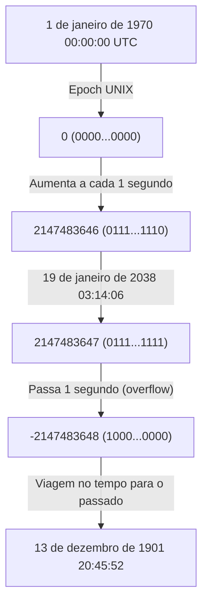
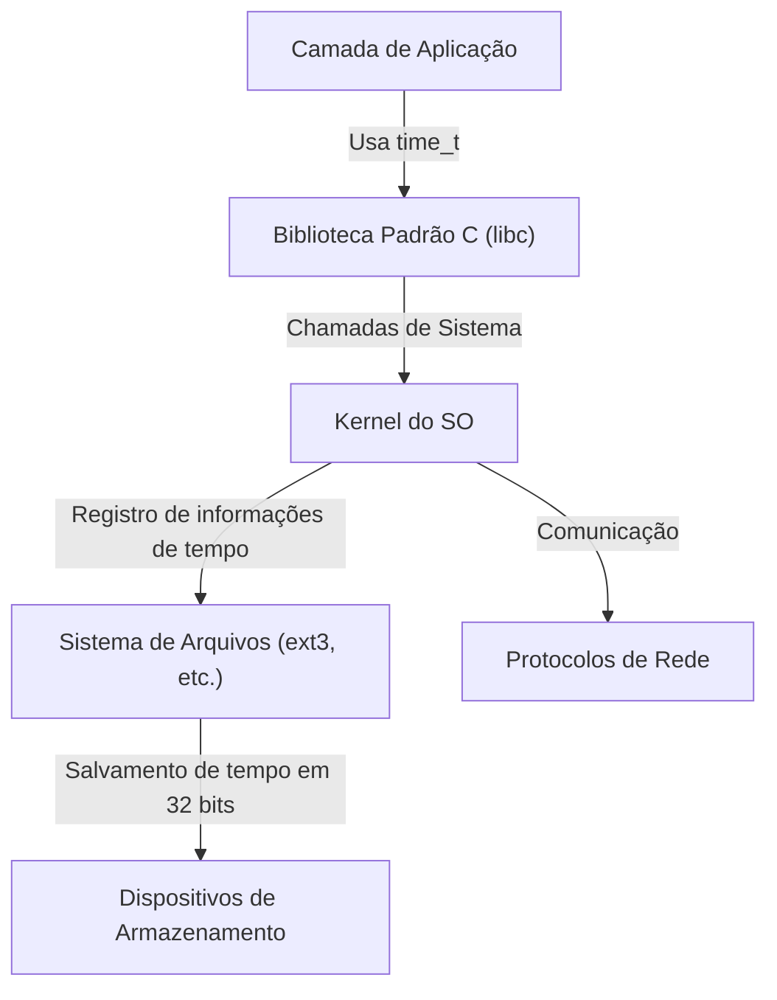

# Introdução: O Relógio do Juízo Final do Mundo Digital se Aproxima

Nossa sociedade moderna é sustentada por inúmeros sistemas de computadores. Transações financeiras, sistemas de controle de tráfego aéreo, comunicações de smartphones e os dispositivos IoT que nos cercam. Todos esses sistemas operam com base no conceito comum de "tempo". Mas o que aconteceria se o mecanismo subjacente a esse tempo entrasse em colapso repentinamente um dia?

Esse é o "Problema do Ano 2038 (Y2K38)", uma contagem regressiva que está silenciosamente, mas com certeza, se esgotando na indústria de TI. Para nós, que sobrevivemos ao Bug do Milênio (Y2K), o problema de 2038 se apresenta como o próximo grande desafio. Neste artigo, exploraremos detalhadamente, com profundidade técnica, o mecanismo desse problema de 2038, o contexto histórico do porquê foi projetado dessa forma e como os engenheiros modernos estão enfrentando esse problema.

# O Mecanismo do Tempo UNIX (Epoch Time)

Para entender o problema de 2038, primeiro precisamos saber "como os computadores entendem o tempo". O conceito de "ano, mês, dia, hora, minuto e segundo" que usamos normalmente é muito fácil de entender para os humanos, mas é um formato difícil de lidar para os computadores. Isso ocorre porque existem muitos elementos que complicam os cálculos, como anos bissextos, meses com diferentes números de dias e fusos horários.

Portanto, muitos sistemas de computadores, especialmente os sistemas operacionais baseados em UNIX, adotam um conceito muito simples chamado "Tempo UNIX (ou Segundos Epoch)". O Tempo UNIX usa "1 de janeiro de 1970 00:00:00 UTC (Tempo Universal Coordenado)" como o ponto de partida (Epoch) e continua contando os segundos que se passaram desde então como um simples "número inteiro".

Por exemplo, em 1 de janeiro de 1970 às 00:01:00 UTC, o Tempo UNIX seria "60". Essa representação simples em números inteiros tornou a adição, subtração e comparação de tempo extremamente rápidas e fáceis.

# Os Limites de um Número Inteiro com Sinal de 32 Bits e o Overflow

No início dos anos 1970, quando o sistema UNIX foi desenvolvido, os recursos dos computadores eram incomparavelmente limitados em relação aos de hoje. Como tanto a memória quanto o armazenamento eram muito caros, a principal prioridade era representar os dados no menor tamanho possível.

Por esse motivo, a variável usada para representar o tempo UNIX (o tipo `time_t` na linguagem C) foi definida como um "número inteiro com sinal de 32 bits (32-bit signed integer)". A quantidade de dados de 32 bits (4 bytes) pode representar 2 elevado à 32ª potência, ou seja, `4.294.967.296` valores numéricos possíveis. Por ser um número inteiro com sinal, metade dos valores é alocada para valores positivos e a outra metade para valores negativos, tornando o valor máximo representável igual a `2.147.483.647`. (Valores negativos são usados para representar tempos anteriores a 1970).

Esse tempo de `2.147.483.647` segundos é a raiz de todo o problema de 2038.

`2.147.483.647` segundos após 1 de janeiro de 1970. Ao calcular, isso resulta na seguinte data e hora:

**Tempo Universal Coordenado (UTC): 19 de janeiro de 2038 03:14:07**
(No Horário Padrão do Japão, seria 19 de janeiro de 2038 12:14:07)

Se esse horário passar em apenas 1 segundo, o contador interno do computador tentará se tornar `2.147.483.648`, mas, como excede o valor máximo de um número inteiro com sinal de 32 bits, ocorre um "overflow" (estouro de capacidade). No mundo binário, o bit mais significativo (o bit que representa o sinal) é invertido e o sistema, de repente, começa a interpretar o tempo como um valor "negativo".

Como resultado, o sistema reconhecerá erroneamente a hora atual como a seguinte:

**Menos 2.147.483.648 segundos = 13 de dezembro de 1901 20:45:52 UTC**

# Os Impactos Catastróficos Causados pelo Overflow

Se o sistema de repente começar a reconhecer que "atualmente estamos em 1901", quais seriam os impactos? O efeito não se limita apenas a fazer com que a exibição de um aplicativo de calendário fique estranha.

1. **Colapso da Segurança e Comunicação Criptografada**
   Certificados SSL/TLS usados em comunicações HTTPS, etc., têm datas de validade. Um sistema que reconhece "atualmente estamos em 1901" pode considerar todos os certificados como sendo "do futuro" ou "expirados" e se recusar completamente a realizar qualquer comunicação segura. Isso paralisaria a navegação na web, comunicações de API e transações financeiras.
2. **Corrupção de Dados em Bancos de Dados**
   Bancos de dados registram as datas de criação e modificação dos dados. Com a reversão do tempo, novos dados poderiam ser tratados como antigos, e registros com datas de validade (como informações de sessão) seriam descartados imediatamente, causando sérias inconsistências nos dados.
3. **Mau Funcionamento de Sistemas Embutidos e Infraestrutura**
   Em "sistemas embutidos", que frequentemente não são atualizados por décadas após serem implantados — como sistemas de controle de fábricas, equipamentos médicos e sistemas de controle de tráfego aéreo —, a reversão do tempo tem o perigo de causar encerramentos anormais (falhas) ou comportamentos inesperados.
4. **Gerenciamento de Licenças de Software**
   Assinaturas e licenças de software podem ser consideradas "expiradas", fazendo com que deixem de iniciar de uma só vez.

# Reação em Cadeia na Arquitetura de Sistemas

O problema de 2038 não é uma questão de um único aplicativo, mas um problema profundo que afeta hierarquicamente tudo, desde o sistema operacional até os protocolos de rede.

Mesmo que um aplicativo consiga lidar com o tempo de 64 bits de forma independente, se a biblioteca padrão C ou o kernel do sistema operacional subjacente estiverem usando o `time_t` de 32 bits, as informações de tempo passadas por meio de chamadas de sistema continuarão sendo de 32 bits. Além disso, sistemas de arquivos (como os antigos ext3 e FAT) podem estar armazenando carimbos de data/hora (timestamps) em 32 bits como metadados, o que significa que enfrentamos o problema de que os próprios dados no disco não conseguirão representar anos após 2038.

# Contexto Histórico: Por que eram 32 bits?

Olhando com olhos acostumados aos recursos abundantes de hoje, pode-se perguntar: "Por que eles não usaram 64 bits desde o início?". No entanto, na era dos mainframes e minicomputadores dos anos 1970, quando o UNIX nasceu, a economia de alguns bytes de memória podia determinar o desempenho do sistema.

Nos primórdios do UNIX, o tempo era, na verdade, gerenciado como um "número inteiro de 32 bits em unidades de 1/60 de segundo". No entanto, isso transbordaria em apenas cerca de 2,5 anos. Então, a unidade foi alterada para "1 segundo", estendendo a vida útil para cerca de 68 anos (de 1970 a 2038). Para os desenvolvedores da época, era inimaginável que os sistemas que eles projetaram continuariam a ser usados ​​68 anos depois. De fato, Ken Thompson, um dos desenvolvedores do UNIX, também afirmou: "Eu não esperava que o UNIX fosse usado por tanto tempo".

# Contramedidas e a Situação Atual do Problema de 2038

A solução mais confiável para essa bomba-relógio é "expandir as variáveis ​​que representam o tempo para números inteiros de 64 bits". O número máximo de segundos que um número inteiro com sinal de 64 bits pode representar equivale a cerca de 292 bilhões de anos no futuro. Como isso é maior que o tempo de vida do universo (dezenas de bilhões a trilhões de anos), praticamente não haverá mais necessidade de se preocupar com overflow para sempre.

Atualmente, as seguintes medidas estão sendo implementadas nas principais arquiteturas de sistemas:

1. **Migração Completa para SOs de 64 bits**
   A maioria dos PCs, servidores e smartphones modernos já está equipada com processadores de 64 bits e executam sistemas operacionais de 64 bits (Windows, macOS, versões de 64 bits do Linux). Nesses ambientes, o tipo `time_t` foi naturalmente expandido para 64 bits, e o problema de 2038 no nível do SO já foi resolvido.
2. **Correção do Suporte a Sistemas de 32 bits no Kernel do Linux**
   O maior desafio são as "versões de 32 bits do Linux" instaladas em dispositivos IoT, etc. Na comunidade do kernel do Linux, na versão 5.6 do kernel (lançada em 2020), foi feita uma grande modificação para oferecer suporte a um `time_t` de 64 bits, mesmo em arquiteturas de 32 bits. Isso tornou possível superar a barreira de 2038 até mesmo em hardwares de 32 bits, se o kernel mais recente for usado.
3. **Atualização de Sistemas de Arquivos**
   Sistemas de arquivos modernos como ext4, XFS e ZFS já suportam carimbos de data/hora a partir de 2038 em diante. No entanto, é preciso ter cuidado se sistemas de arquivos antigos, como o ext3, que não foram atualizados a partir de sistemas legados, ainda permanecerem em uso.

# Desafios Restantes: Sistemas Legados e Interoperabilidade

Mesmo que soluções técnicas tenham sido preparadas, o verdadeiro terror do problema de 2038 reside nos "sistemas legados que se escondem onde não podemos ver".

- **Dispositivos embutidos não atualizados**: Há inúmeros dispositivos ao redor do mundo, como repetidores de cabos submarinos, satélites artificiais e antigos painéis de controle de fábricas, onde o software não pode ser facilmente atualizado por motivos físicos ou operacionais.
- **Formatos de dados e protocolos**: Protocolos antigos que transmitem e recebem informações de tempo como binários de 32 bits através da rede (como alguns formatos de pacote NTP ou dumps binários de banco de dados) pararão de funcionar se ambos, remetente e destinatário, não forem atualizados.
- **Hardcoding dentro de aplicações**: O código de aplicações que preenchem independentemente o tempo em caixas de 32 bits e os serializam não será corrigido simplesmente atualizando o SO. Os desenvolvedores precisarão modificar o código-fonte manualmente e recompilar.

# Conclusão: Uma Lição para os Engenheiros do Futuro

O problema de 2038 não é um mero "bug", mas o ápice de um "débito técnico" onde os compromissos baseados nas restrições de recursos do passado se materializaram ao longo do tempo.

No Bug do Milênio (Y2K), engenheiros de todo o mundo gastaram um enorme esforço para consertar os sistemas e prevenir o pânico em larga escala. No entanto, o problema de 2038 é ainda mais profundo que o Y2K e se incrustou no núcleo do sistema (SO, kernel, sistemas de arquivos), que é muito mais profundo que a camada de aplicação.

À medida que nos aproximamos de 19 de janeiro de 2038, precisamos identificar os sistemas antigos, planejar a migração e modernizar firmemente os sistemas. E, quando os engenheiros atuais projetam software, eles devem ter a perspectiva humilde de que "este sistema pode sobreviver por muito mais tempo do que eu imagino" e são encorajados a construir arquiteturas com margens suficientes.
