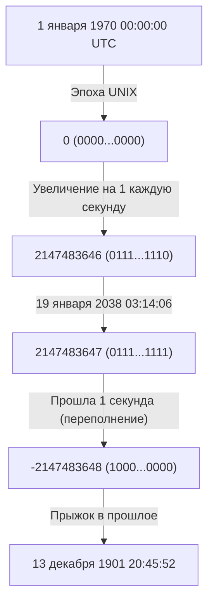
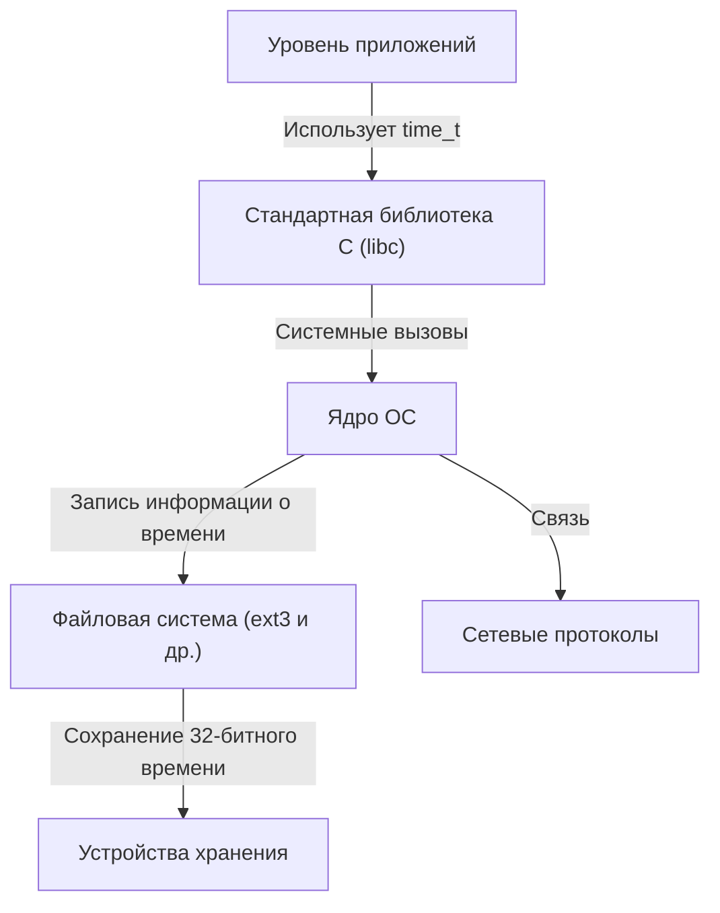

# Введение: Подкрадывающиеся часы судного дня цифрового мира

Наше современное общество поддерживается бесчисленным множеством компьютерных систем. Транзакции финансовых учреждений, системы управления полетами самолетов, связь на смартфонах и устройства IoT, которые нас окружают. Все эти системы работают на основе общей концепции «времени». Но что произойдет, если фундамент этого времени однажды внезапно рухнет?

Это и есть «Проблема 2038 года (Y2K38)», таймер которой сейчас тихо, но неумолимо отсчитывает время в IT-индустрии. Для нас, преодолевших проблему 2000 года (Y2K), проблема 2038 года предстает следующим серьезным испытанием. В этой статье мы подробно и с глубоким техническим погружением рассмотрим механизм проблемы 2038 года, исторический контекст ее возникновения (почему она была спроектирована именно так), и то, как современные инженеры противостоят этой угрозе.

# Как работает время UNIX (Эпоха UNIX)

Чтобы понять проблему 2038 года, необходимо сначала узнать, «как компьютеры понимают время». Привычная нам концепция «год, месяц, день, час, минута, секунда» очень удобна для людей, но для компьютеров это сложный формат. Високосные годы, разные длины месяцев, часовые пояса и другие факторы слишком усложняют вычисления.

Поэтому во многих компьютерных системах, особенно в операционных системах семейства UNIX, применяется очень простая концепция под названием «Время UNIX (или время эпохи UNIX)». Время UNIX использует «1 января 1970 года 00:00:00 UTC (Всемирное координированное время)» в качестве отправной точки (эпохи), и просто продолжает отсчитывать прошедшие с тех пор секунды в виде «целого числа».

Например, 1 января 1970 года 00:01:00 UTC время UNIX будет равно «60». Такое простое целочисленное представление позволяет очень быстро и легко выполнять сложение, вычитание и сравнение времени.

# Ограничения и переполнение 32-битных целых чисел со знаком

В начале 1970-х годов, когда разрабатывались системы UNIX, ресурсы компьютеров были несравнимо более ограничены, чем сегодня. Память и хранилища были очень дорогими, поэтому представление данных в минимально возможном размере было первоочередной задачей.

По этой причине переменная для представления времени UNIX (тип `time_t` в языке C) была определена как «32-битное целое число со знаком (32-bit signed integer)». Объем данных в 32 бита (4 байта) может представлять 2 в 32-й степени, то есть `4,294,967,296` различных числовых значений. Поскольку это число со знаком, половина выделяется под положительные значения, а половина — под отрицательные, поэтому максимальное положительное значение, которое можно представить, составляет `2,147,483,647`. (Отрицательные значения используются для представления времени до 1970 года).

Эти `2,147,483,647` секунд и являются корнем проблемы 2038 года.

Что будет через `2,147,483,647` секунд после 1 января 1970 года? Расчеты дают следующую дату и время:

**Всемирное координированное время (UTC): 19 января 2038 года 03:14:07**
(По японскому стандартному времени — 19 января 2038 года 12:14:07)

Если пройдет хотя бы 1 секунда после этого времени, внутренний счетчик компьютера попытается стать `2,147,483,648`, но поскольку он превысит максимальное значение 32-битного целого числа со знаком, произойдет «переполнение (overflow)». В двоичном мире старший бит (бит, обозначающий знак) перевернется, и система внезапно начнет интерпретировать время как «отрицательное».

В результате система ошибочно определит текущее время следующим образом:

**Минус 2,147,483,648 секунд ＝ 13 декабря 1901 года 20:45:52 UTC**

# Катастрофические последствия переполнения

Какие будут последствия, если система внезапно решит, что «сейчас 1901 год»? Последствия не ограничатся только неправильным отображением в приложении календаря.

1. **Крах безопасности и зашифрованной связи**
   Сертификаты SSL/TLS, используемые для связи по HTTPS и т.д., имеют срок действия. Система, считающая, что «сейчас 1901 год», может оценить все сертификаты как «выпущенные в будущем» или «просроченные» и полностью отказаться от безопасной связи. Это парализует просмотр веб-страниц, связь по API и финансовые операции.
2. **Повреждение данных в базах данных**
   В базах данных фиксируется время создания и обновления данных. Из-за возврата времени назад новые данные могут рассматриваться как старые, или записи с заданным сроком действия (например, информация о сессиях) могут быть немедленно удалены, что приведет к серьезным несоответствиям данных.
3. **Сбои в инфраструктуре и встроенных системах**
   Во встроенных системах (таких как системы управления производством, медицинское оборудование, системы управления воздушным движением), которые часто не обновляются десятилетиями после развертывания, скачок времени в прошлое может привести к аварийному завершению работы (сбоям) или непредвиденному поведению.
4. **Управление лицензиями программного обеспечения**
   Подписки и лицензии на программное обеспечение могут быть сочтены «просроченными», из-за чего программы могут массово перестать запускаться.

# Цепная реакция в системной архитектуре

Проблема 2038 года — это не проблема одного приложения; это глубоко укоренившаяся проблема, которая иерархически влияет на всё, от ОС до сетевых протоколов.

Даже если приложение может самостоятельно работать с 64-битным временем, пока лежащие в его основе стандартная библиотека C и ядро ОС используют 32-битный `time_t`, информация о времени, передаваемая через системные вызовы, останется 32-битной. Кроме того, файловые системы (такие как старые ext3 и FAT) могут сохранять временные метки в метаданных в 32-битном формате, из-за чего мы сталкиваемся с проблемой, что сами данные на диске не могут представлять время после 2038 года.

# Историческая справка: Почему 32 бита?

С точки зрения привыкших к обилию ресурсов современных людей может возникнуть вопрос: «Почему с самого начала не сделали 64 бита?». Однако в эпоху мейнфреймов и миникомпьютеров 1970-х годов, когда зародился UNIX, экономия даже нескольких байтов памяти определяла производительность системы.

В ранних версиях UNIX время фактически управлялось как «32-битное целое число в единицах 1/60 секунды». Однако при таком подходе переполнение происходило бы всего через 2,5 года. Поэтому единицу измерения изменили на «1 секунду», продлив срок службы примерно до 68 лет (с 1970 по 2038 год). Разработчики того времени и представить себе не могли, что спроектированная ими система будет использоваться спустя 68 лет. Действительно, один из создателей UNIX, Кен Томпсон, сказал: «Я не думал, что UNIX будет использоваться так долго».

# Контрмеры против проблемы 2038 года и текущая ситуация

Самое надежное решение этой бомбы замедленного действия — «расширить переменную, представляющую время, до 64-битного целого числа». Максимальное количество секунд, которое может представить 64-битное целое число со знаком, составит около 292 миллиардов лет. Это больше, чем время жизни Вселенной (от десятков миллиардов до триллионов лет), поэтому фактически отпадает необходимость когда-либо беспокоиться о переполнении.

В настоящее время в основных системных архитектурах реализуются следующие меры:

1. **Полный переход на 64-битные ОС**
   Большинство современных ПК, серверов и смартфонов уже оснащены 64-битными процессорами и работают под управлением 64-битных ОС (Windows, macOS, 64-битный Linux). В этих средах тип `time_t` естественным образом расширен до 64 бит, и проблема 2038 года на уровне ОС уже решена.
2. **Улучшения поддержки 32-битных систем в ядре Linux**
   Самой большой проблемой остаются «32-битные версии Linux», установленные на устройствах IoT и т.п. Сообщество ядра Linux в версии 5.6 (выпущенной в 2020 году) провело масштабные изменения для поддержки 64-битного `time_t` даже на 32-битных архитектурах. Благодаря этому использование новейшего ядра позволяет преодолеть барьер 2038 года даже на 32-битном оборудовании.
3. **Обновления файловых систем**
   Современные файловые системы, такие как ext4, XFS и ZFS, уже поддерживают временные метки после 2038 года. Однако следует быть осторожными, если остаются старые системы, не обновленные со старых файловых систем, таких как ext3.

# Оставшиеся проблемы: Устаревшие (legacy) системы и интероперабельность

Несмотря на наличие технических решений, истинный ужас проблемы 2038 года кроется в «устаревших системах, скрывающихся из виду».

- **Необновляемые встроенные устройства**: По всему миру существуют бесчисленные устройства, программное обеспечение которых сложно обновить по физическим или эксплуатационным причинам: ретрансляторы подводных кабелей, спутники, панели управления на старых заводах.
- **Форматы данных и протоколы**: Старые сетевые протоколы, обменивающиеся информацией о времени в виде 32-битных бинарных данных (некоторые форматы пакетов NTP, бинарные дампы баз данных и т.д.), перестанут работать, если не обновить и передающую, и принимающую стороны.
- **Жестко закодированные значения в приложениях**: Код приложений, где разработчики самостоятельно сериализуют время, помещая его в 32-битные контейнеры, не будет исправлен простым обновлением ОС. Разработчикам придется вручную исправить исходный код и перекомпилировать его.

# Заключение: Урок для будущих инженеров

Проблема 2038 года — это не просто «баг», это крайняя степень «технического долга», когда компромиссы из-за ограничений ресурсов прошлого становятся очевидными со временем.

Во время проблемы 2000 года (Y2K) инженеры по всему миру приложили огромные усилия для модификации систем, предотвратив масштабную панику. Однако проблема 2038 года укоренилась гораздо глубже, чем Y2K: она внедрена в ядро системы (ОС, ядро, файловые системы) намного глубже прикладного уровня.

По мере приближения к 19 января 2038 года нам необходимо выявлять старые системы, разрабатывать планы миграции и неуклонно модернизировать их. И когда современные инженеры проектируют программное обеспечение, от них требуется сохранять скромное понимание того, что «эта система может прожить гораздо дольше, чем я могу себе представить», и создавать архитектуру с достаточным запасом прочности.
