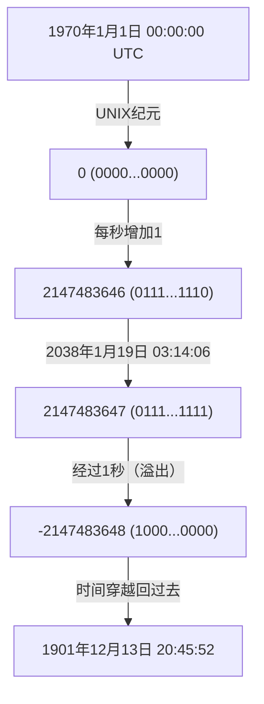
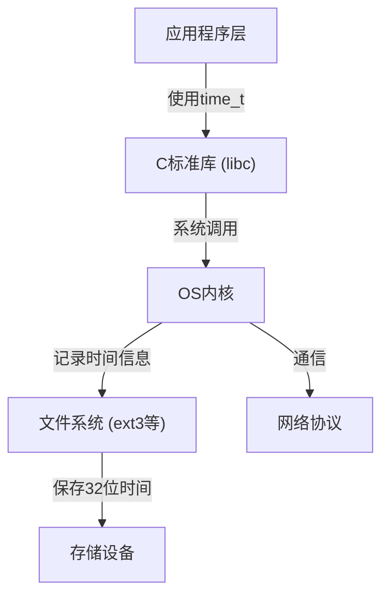

# 引言：悄然逼近的数字世界末日时钟

我们的现代社会由无数的计算机系统支撑。金融机构的交易、飞机的航班管理系统、智能手机的通信，以及我们身边无处不在的物联网设备。所有这些系统都在“时间”这个共同概念的基础上运行。然而，如果作为时间基础的底层机制某天突然崩溃，会发生什么呢？

这正是目前在IT行业中悄悄却又确实在逼近最后期限的“2038年问题（Y2K38）”。对于已经度过2000年问题（Y2K）的我们来说，2038年问题是我们要面对的下一个重大考验。在本文中，我们将深入技术细节，详细解释2038年问题的机制、形成这种设计的历史背景，以及现代工程师们是如何应对这个问题的。

# UNIX时间（Epoch Time）的机制

为了理解2038年问题，首先需要了解“计算机是如何理解时间的”。我们平时使用的“年、月、日、时、分、秒”这一概念对人类来说非常容易理解，但对计算机来说，这是一种难以处理的格式。因为存在闰年、大小月、时区等诸多使计算复杂化的因素。

因此，许多计算机系统，特别是类UNIX操作系统，采用了“UNIX时间（或称纪元秒）”这一非常简单的概念。UNIX时间以“1970年1月1日 00:00:00 UTC（协调世界时）”为起点（纪元），将自那时起经过的秒数作为简单的“整数”持续计数。

例如，如果是1970年1月1日 00:01:00 UTC，那么UNIX时间就是“60”。这种简单的整数表示，使得时间的加减和比较变得非常快速且容易。

# 32位有符号整数的极限与溢出

在开发UNIX系统的1970年代初，计算机的资源远不能与现代相比。当时内存和存储都极其昂贵，因此尽可能用较小的大小来表示数据是首要任务。

因此，用于表示UNIX时间的变量（C语言中的`time_t`类型）被定义为“32位有符号整数（32-bit signed integer）”。32位（4字节）的数据量可以表示2的32次方，即 `4,294,967,296` 个不同的数值。由于是有符号整数，正值和负值各分一半，能表示的最大正值为 `2,147,483,647`。（负值用于表示1970年之前的时间）。

这个 `2,147,483,647` 秒，就是引发2038年问题的所有根源。

从1970年1月1日起经过 `2,147,483,647` 秒后，经过计算为以下日期和时间：

**协调世界时（UTC）：2038年1月19日 03:14:07**
（日本标准时间为 2038年1月19日 12:14:07）

只要过了这个时间1秒，计算机内部的计数器就会尝试变成 `2,147,483,648`，但这超出了32位有符号整数的最大值，从而发生“溢出（overflow）”。在二进制的世界里，最高位（表示符号的位）会发生反转，系统会突然开始将时间解释为“负数”。

结果，系统会错误地将当前时间识别为：

**负2,147,483,648秒 ＝ 1901年12月13日 20:45:52 UTC**

# 溢出引发的毁灭性影响

如果系统突然开始认为“现在是1901年”，会产生什么样的影响？其影响远不止是日历应用的显示变得奇怪那么简单。

1. **安全与加密通信的崩溃**
   用于HTTPS等通信的SSL/TLS证书有其有效期限。认为“现在是1901年”的系统，可能会将所有证书判断为“未来的东西”或者“已过期”，从而完全拒绝安全通信。这将导致网页浏览、API通信以及金融交易陷入瘫痪。
2. **数据库的数据损坏**
   数据库中记录了数据的创建时间和更新时间。由于时间倒流，新数据可能会被当作旧数据处理，或者设置了有效期的记录（如会话信息等）会被立即销毁，从而发生严重的数据不一致。
3. **基础设施和嵌入式系统的故障**
   工厂的控制系统、医疗设备、航空管制系统等“嵌入式系统”，往往在部署后数十年都不更新，由于时间倒流，存在引发异常终止（崩溃）或意外行为的危险。
4. **软件的许可证管理**
   软件的订阅和许可证可能会被视为“已过期”，从而可能导致集体无法启动。

# 系统架构的连锁反应

2038年问题并非单一应用程序的问题，而是从操作系统到网络协议，自上而下产生影响的根深蒂固的问题。

即使应用程序本身能够处理64位时间，如果其背后的C标准库或OS内核仍在使用32位的 `time_t`，那么通过系统调用传递的时间信息依然是32位的。此外，文件系统（如旧的ext3或FAT等）可能也在以32位元数据格式保存时间戳，这就面临着磁盘上的数据本身无法表示2038年及以后时间的问题。

# 历史背景：为什么是32位？

以习惯了现代丰富资源的眼光来看，可能会有疑问：“为什么不一开始就使用64位呢？”然而，在UNIX诞生的1970年代，即大型机和小型机时代，节省几个字节的内存往往左右着系统的性能。

在早期的UNIX中，实际上是以“60分之一秒为单位的32位整数”来管理时间的。但这只能用大约2.5年就会溢出。因此，开发人员将单位更改为“1秒”，将寿命延长到了约68年（从1970年到2038年）。对当时的开发人员来说，他们设计的系统能在此后的68年里继续被使用，是难以想象的。事实上，UNIX的开发者之一肯·汤普森（Ken Thompson）也曾表示：“从未想过UNIX会被使用这么长时间。”

# 对2038年问题的应对措施及现状

针对这颗定时炸弹，最可靠的解决方案是“将表示时间的变量扩展为64位整数”。64位有符号整数能表示的最大秒数大约在2920亿年之后。这比宇宙的寿命（数百亿年到数万亿年）还要长，因此实质上永远不需要再担心溢出问题。

目前，主要系统架构正在推进以下应对措施：

1. **全面向64位操作系统迁移**
   现代的PC、服务器和智能手机大多已经搭载了64位处理器，并运行64位操作系统（Windows、macOS、64位版Linux）。在这些环境中，`time_t` 类型已自然扩展为64位，操作系统层面的2038年问题已经得到解决。
2. **Linux内核中对32位系统支持的修改**
   最大的挑战是搭载在物联网设备等上的“32位版Linux”。Linux内核社区在5.6版本（2020年发布）中进行了一项巨大的修改，使得即使在32位架构上也能支持64位的 `time_t`。因此，只要使用最新的内核，即便是32位硬件也能跨越2038年的障碍。
3. **文件系统的更新**
   像ext4、XFS、ZFS等现代文件系统，已经支持2038年以后的时间戳。但是，如果系统中仍残留有未从旧系统升级的老旧ext3文件系统，则需要特别注意。

# 遗留的挑战：旧系统与互操作性

尽管技术上的解决方案已经准备就绪，但2038年问题真正的可怕之处在于“潜伏在暗处的旧系统（Legacy System）”。

- **无法更新的嵌入式设备**：海底电缆的中继器、人造卫星、旧工厂的控制面板等，由于物理或操作上的原因，世界上有无数难以轻松更新软件的设备。
- **数据格式与协议**：作为32位二进制在网络上交换时间信息的旧协议（部分NTP数据包格式或数据库的二进制转储等），如果发送端和接收端都没有更新，将无法正常工作。
- **应用程序中的硬编码**：对于那些独自将时间装入32位容器中进行序列化的应用程序代码，即使更新了操作系统也无法修复。开发人员需要手动修改源代码并重新编译。

# 结论：给未来工程师的教训

2038年问题不仅仅是一个“漏洞”，而是由于过去资源受限所作出的妥协，随着时间推移而显现出来的“技术债务”的极致体现。

在2000年问题（Y2K）中，全世界的技术人员花费了巨大的精力修改系统，防患于未然，避免了大规模的恐慌。然而，2038年问题比Y2K更为根深蒂固，它已经深入到比应用层更深的系统核心（OS、内核、文件系统）之中。

为了迎接2038年1月19日的到来，我们需要排查旧系统、制定迁移计划，并稳步推进系统的现代化。同时，当现在的工程师在设计软件时，也应当抱有一种谦逊的视角——“这个系统可能会比我现象中存活得更久”，从而构建出具有充足余量的架构。
