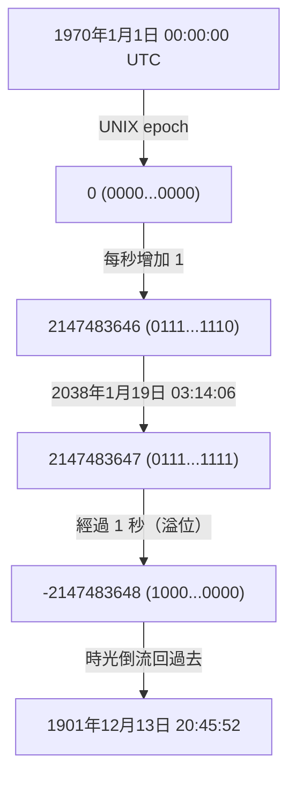
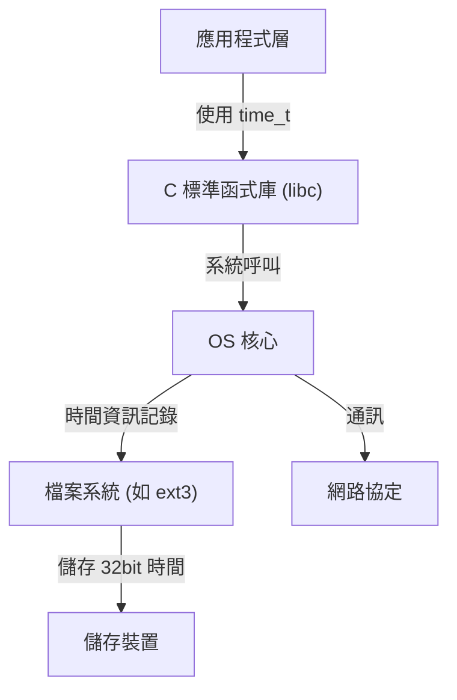

# 緒論：悄悄逼近的數位世界末日時鐘

我們現代社會仰賴著無數的電腦系統運作。金融機構的交易、航空機的飛航管理系統、智慧型手機的通訊，以及我們周遭滿佈的 IoT 裝置。這些系統全都奠基於「時間」這個共通概念來運作。然而，如果這個時間底層的機制在某天突然崩潰，會發生什麼事呢？

這正是目前在 IT 業界悄悄地、卻也確實地逼近倒數計時的「2038 年問題（Y2K38）」。對於經歷過 2000 年問題（Y2K）的我們來說，2038 年問題是下一個即將面臨的巨大考驗。本文將從這個 2038 年問題的機制開始，探討為何會採用這種設計的歷史背景，以及現代工程師們是如何面對這個問題的，並穿插技術性的深度剖析來詳細解說。

# UNIX 時間（Epoch Time）的運作機制

為了理解 2038 年問題，我們首先必須知道「電腦是如何理解時間的」。我們平常使用的「年、月、日、時、分、秒」概念，對人類來說非常容易理解，但對電腦而言卻是難以處理的格式。這是因為閏年、大小月、時區等因素，讓計算變得過於複雜。

因此，許多電腦系統，特別是 UNIX 系統家族的作業系統，採用了名為「UNIX 時間（或 Epoch 秒）」這個非常簡單的概念。UNIX 時間是以「1970 年 1 月 1 日 00:00:00 UTC（協調世界時）」為起點（Epoch），並將從那時起經過的秒數，單純地作為一個「整數」不斷累加計數的機制。

舉例來說，如果是 1970 年 1 月 1 日 00:01:00 UTC，UNIX 時間就會是「60」。透過這種簡單的整數表示法，時間的加減與比較就能夠非常快速且輕易地進行。

# 32 位元有號整數的極限與溢位

在開發 UNIX 系統的 1970 年代初期，電腦資源受限的程度是現代所無法比擬的。當時記憶體和儲存空間都極為昂貴，因此用盡可能小的尺寸來表示資料是最高原則。

基於這個原因，用來表示 UNIX 時間的變數（在 C 語言中為 `time_t` 型態），被定義為「32 位元的有號整數（32-bit signed integer）」。32 位元（4 個位元組）的資料量，可以表示 2 的 32 次方，也就是 `4,294,967,296` 種數值。因為是有號整數，正值和負值各分配了一半，所能表示的最大值為 `2,147,483,647`。（負值則被用來表示 1970 年之前的時間）。

這 `2,147,483,647` 秒的時間，就是 2038 年問題的罪魁禍首。

從 1970 年 1 月 1 日算起經過 `2,147,483,647` 秒後。計算出來的日期時間如下：

**協調世界時（UTC）：2038 年 1 月 19 日 03:14:07**
（日本標準時間為 2038 年 1 月 19 日 12:14:07）

只要超過這個時間 1 秒，電腦內部的計數器雖然想要變成 `2,147,483,648`，但因為超過了 32 位元有號整數的最大值，就會發生「溢位（Overflow）」。在二進位的世界中，最高位元（表示正負號的位元）會發生反轉，系統就會突然開始將時間解釋為「負數」。

結果，系統就會將現在時間錯誤認知為如下：

**負 2,147,483,648 秒 ＝ 1901 年 12 月 13 日 20:45:52 UTC**

# 溢位所引發的災難性影響

如果系統突然開始認知「現在是 1901 年」，會造成什麼影響呢？這個影響可不只是日曆應用程式顯示異常這麼簡單。

1. **安全性與加密通訊的崩壞**
   HTTPS 通訊等使用的 SSL/TLS 憑證都有有效期限。認知「現在是 1901 年」的系統，會將所有憑證判斷為「未來發行」或是「已過期」，並有可能拒絕一切的安全通訊。這會導致網頁瀏覽、API 通訊、金融交易癱瘓。
2. **資料庫的資料毀損**
   資料庫中記錄了資料的建立時間和更新時間。由於時間倒流，新資料可能會被當作舊資料處理，或是設定了有效期限的紀錄（如 Session 資訊等）可能會被立即丟棄，從而發生嚴重的資料不一致。
3. **基礎設施與嵌入式系統的故障**
   像是工廠的控制系統、醫療設備、航空管制系統等，這類一旦部署後可能數十年都不會更新的「嵌入式系統」，就有因時間倒流而引發異常終止（當機）或非預期動作的危險。
4. **軟體的授權管理**
   軟體的訂閱或授權可能會被視為「已過期」，並可能發生集體無法啟動的狀況。

# 系統架構的連鎖反應

2038 年問題並非單一應用程式的問題，而是從作業系統一路到網路協定，會產生階層性影響的根深蒂固問題。

即使應用程式本身能夠獨立處理 64 位元的時間，只要背後的 C 標準函式庫或 OS 核心仍在使用 32 位元的 `time_t`，透過系統呼叫傳遞的時間資訊依然會維持 32 位元。此外，檔案系統（如舊版的 ext3 或 FAT 等）也有可能將時間戳記以 32 位元格式儲存為中介資料，從而面臨磁碟上的資料本身無法表示 2038 年之後時間的問題。

# 歷史背景：為什麼是 32 位元？

習慣了現代充沛資源的我們，或許會納悶「為什麼一開始不直接用 64 位元就好？」然而，在 UNIX 誕生的 1970 年代，那個大型主機和迷你電腦的時代，節省幾個位元組的記憶體就能左右系統的效能。

早期的 UNIX 其實是以「60 分之 1 秒為單位的 32 位元整數」來管理時間。但這樣一來，大約只要 2.5 年就會發生溢位。於是他們將單位改為「1 秒」，這才把壽命延長到了約 68 年（從 1970 年到 2038 年）。對當時的開發者們來說，自己設計的系統會在 68 年後繼續被使用，是根本無法想像的事。事實上，UNIX 的開發者之一 Ken Thompson 也曾說過：「沒想到 UNIX 會被使用這麼久。」

# 對 2038 年問題的對策與現狀

對於這個定時炸彈，最確實的解決方案就是「將表示時間的變數擴充為 64 位元整數」。64 位元的有號整數所能表示的最大秒數，大約是 2,920 億年後。這比宇宙的壽命（數百億年到數兆年）還要長，因此實質上永遠都不必再擔心溢位的問題。

目前，主要的系統架構正在推動以下應對措施：

1. **全面轉移至 64 位元 OS**
   現代的 PC、伺服器和智慧型手機，大多已經搭載了 64 位元處理器，並執行 64 位元 OS（Windows、macOS、64 位元版 Linux）。在這些環境下，`time_t` 型態自然也已經擴充為 64 位元，OS 層級的 2038 年問題已經獲得解決。
2. **Linux 核心針對 32 位元系統支援的修改**
   最大的課題在於搭載於 IoT 設備等裝置上的「32 位元版 Linux」。在 Linux 核心的社群中，於核心版本 5.6（2020 年發布）裡，進行了一項巨大的修改，讓 32 位元架構上也能支援 64 位元的 `time_t`。如此一來，只要使用最新的核心，即使是 32 位元硬體也能跨越 2038 年的障礙。
3. **檔案系統的更新**
   如 ext4、XFS、ZFS 等現代檔案系統，已經支援 2038 年之後的時間戳記。不過，若還殘留著未從舊系統升級的舊版 ext3 檔案系統等，就需要特別注意。

# 殘留的課題：遺留系統與互通性

儘管技術上的解決方案已經備妥，但 2038 年問題真正的恐懼在於「潛伏在看不見角落的遺留系統」。

- **無法更新的嵌入式設備**：海底電纜的中繼器、人造衛星、老舊工廠的控制面板等，因為物理或維運上的理由而無法輕易更新軟體的裝置，在世界上多如牛毛。
- **資料格式與協定**：將時間資訊作為 32 位元二進位資料透過網路傳遞的舊協定（如部分 NTP 封包格式或資料庫的二進位傾印等），如果發送端和接收端沒有雙雙更新，就會失去作用。
- **應用程式內的寫死程式碼**：那些自行將時間塞進 32 位元空間並進行序列化的應用程式程式碼，就算更新了 OS 也無法修復。開發者必須手動修改原始碼並重新編譯。

# 結論：給未來工程師的教訓

2038 年問題不僅僅是一個「Bug」，它更是過去因資源限制而妥協的產物，隨著時間經過而浮現的「技術債」極致表現。

在 2000 年問題（Y2K）時，全世界的技術人員花費了巨大的心力進行系統修改，防範了大規模恐慌於未然。然而，2038 年問題比 Y2K 更根深蒂固，且深深侵入到比應用程式層更深層的系統核心（OS、核心、檔案系統）。

在邁向 2038 年 1 月 19 日的過程中，我們必須盤點老舊系統、擬定轉移計畫，並穩紮穩打地將系統現代化。此外，現在的工程師在設計軟體時，也被要求必須抱持著「這個系統可能會存活得比自己想像的還要久」的謙卑觀點，並建構具有充分餘裕的架構。
