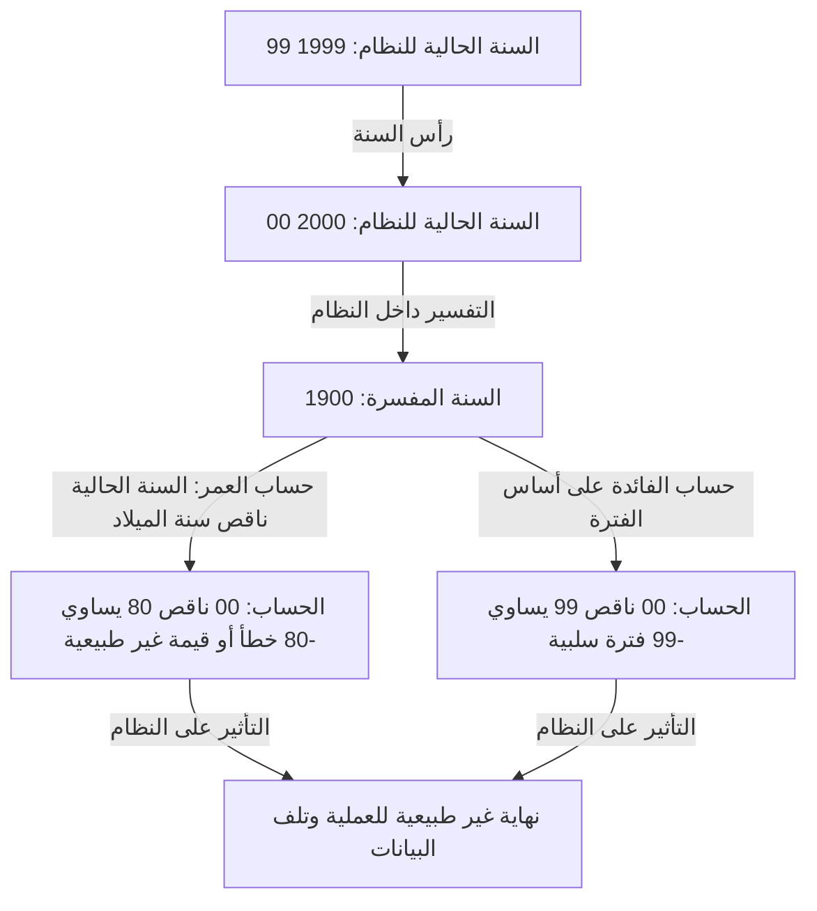
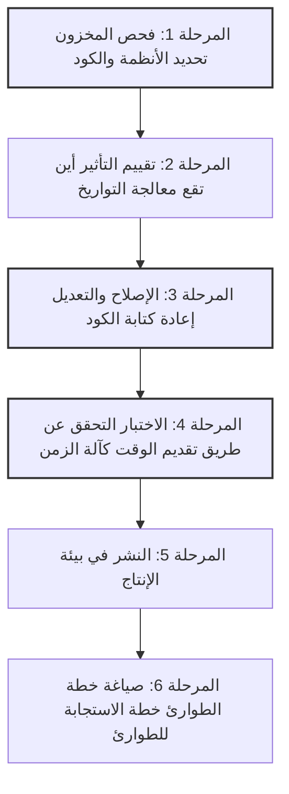

## مقدمة: القنبلة الموقوتة الرقمية التي واجهتها البشرية

في 31 ديسمبر 1999، بينما كان العالم يستعد للاحتفال بقدوم الألفية الجديدة، كان بعض الناس يحبسون أنفاسهم لسبب مختلف تمامًا. بدلاً من كؤوس الشمبانيا، كانوا يمسكون بأكواب القهوة ولوحات المفاتيح، في انتظار اللحظة التي تشير فيها عقارب الساعة على شاشاتهم إلى "00:00:00".

كانت تلك ذروة المعركة ضد "مشكلة Y2K (عام 2000)" - والمعروفة باسم "علة الألفية".

في ذلك الوقت، كانت وسائل الإعلام تفيد يوميًا على نطاق واسع بأن "الطائرات ستتحطم"، "ومحطات الطاقة النووية ستخرج عن السيطرة"، "وأرصدة الحسابات المصرفية ستصل إلى الصفر"، "والبنية التحتية ستتوقف تمامًا"، مما تسبب في ذعر عالمي. ومع ذلك، عندما جاء 1 يناير 2000، لم تقع أعطال واسعة النطاق أثرت سلبًا على حياتنا.

بناءً على هذه النتيجة، ظهر في السنوات اللاحقة أشخاص قالوا إن "مشكلة Y2K كانت وهمًا خلقته وسائل الإعلام" أو "لقد كانت عملية احتيال ضخمة من قبل صناعة تكنولوجيا المعلومات". ومع ذلك، هذا سوء فهم كبير. لم ينج العالم بسبب حدوث معجزة. كان ذلك بفضل الجهود المضنية "للمبرمجين المجهولين" الذين، على مدى عدة سنوات، صارعوا ملايين الأسطر من الأكواد القديمة وأعادوا حرفياً كتابة الأنظمة في جميع أنحاء العالم.

في هذه المقالة، سنشرح بالتفصيل سبب حدوث مشكلة Y2K، بدءًا من خلفيتها التاريخية وحتى الصورة الكاملة لمشروع التصحيح غير المسبوق الذي تم تنفيذه على نطاق عالمي، والدروس المتروكة للهندسة الحديثة.

## الفصل 1: لماذا ظهرت مشكلة Y2K؟

لشرح مشكلة Y2K باختصار، كانت عبارة عن "خطأ في النظام ناتج عن استخدام آخر رقمين فقط من السنة عند تمثيل التواريخ". على سبيل المثال، تتم معالجة عام 1998 كـ "98" وعام 1999 كـ "99". ومع ذلك، يصبح عام 2000 "00".

إذا قام النظام بتفسير "00" على أنه "1900" بدلاً من "2000"، فستحدث شذوذ في الحسابات على النحو التالي:

لماذا قام مبرمجو ذلك الوقت بتسجيل السنوات برقمين بدلاً من أربعة أرقام؟ لم يكن ذلك لأنهم كسالى أو يفتقرون إلى البصيرة. كان هناك "قيود صارمة على الأجهزة" في ذلك الوقت.

### عصر كانت فيه الذاكرة باهظة الثمن

في الستينيات والسبعينيات، كانت سعة ذاكرة الكمبيوتر وتخزينه مورداً باهظ الثمن وقيمًا لدرجة لا يمكن تخيلها اليوم.

في أجهزة الكمبيوتر المركزية المبكرة، كانت البيانات تُدار باستخدام البطاقات المثقبة. يمكن تسجيل 80 رقمًا أو حرفًا فقط على بطاقة مثقبة واحدة. في هذه المساحة المحدودة، كان يجب تضمين جميع أنواع البيانات، مثل الأسماء والعناوين وأرقام الحسابات ومبالغ المعاملات.

في ظل هذه الظروف، كان حذف أول رقمين "19" من بيانات التاريخ خيارًا عقلانيًا وضروريًا للغاية. في قواعد البيانات التي تخزن ملايين السجلات، أدى توفير 2 بايت فقط لكل سجل إلى خفض هائل في التكاليف بشكل عام.

كان لدى المبرمجين في ذلك الوقت أيضًا شك طفيف في أنه "بمجرد حلول عام 2000، قد تصبح هذه مشكلة". ومع ذلك، فقد اعتقدوا: "من المستحيل أن يستمر استخدام هذا النظام حتى عام 2000. بحلول ذلك الوقت، سيتم استبداله بنظام جديد."

لكن هذا التنبؤ فشل. استمرت الأنظمة القوية المكتوبة بلغة COBOL واللغات الأخرى التي بنوها في العمل لأكثر من 30 عامًا باعتبارها الأنظمة الأساسية للمؤسسات المالية وشركات التأمين والوكالات الحكومية.

## الفصل 2: حجم الأزمة الكامنة

في منتصف التسعينيات، مع اقتراب عام 2000، بدأ البعض في صناعة تكنولوجيا المعلومات في دق ناقوس الخطر. في البداية، تم تجاهلهم كرأي أقلية، ولكن مع تقدم التحقيقات، أصبح النطاق الاستثنائي والواسع لتأثيرهم واضحًا.

### نطاق واسع من التأثير

1. **المؤسسات المالية**: اختفاء أرصدة الحسابات أو الدخول في أرصدة سلبية بسبب حسابات الفائدة غير الطبيعية. حساب غير صحيح لتواريخ الاستحقاق.
2. **النقل والطيران**: تعليق الرحلات الجوية على نطاق واسع بسبب تعطل أنظمة مراقبة الحركة الجوية. انهيار أنظمة الحجز.
3. **البنية التحتية والطاقة**: انقطاع التيار الكهربائي على نطاق واسع بسبب خلل في أنظمة التحكم في محطات الطاقة خاصة الأنظمة المدمجة.
4. **الطب**: خطر على المرضى بسبب خلل في المعدات الطبية. التقييم غير الصحيح لتواريخ انتهاء صلاحية الأدوية.
5. **الجيش والدفاع**: خلل في أنظمة الإنذار المبكر وتعطل أنظمة الاتصالات.

ما كان يخشى أكثر من غيره هو خطأ Y2K في "الأنظمة المدمجة". قد يتم إخفاء منطق تحديد التاريخ في أي جهاز به شريحة دقيقة مدمجة، مثل المصاعد وخطوط إنتاج المصانع وأجهزة تنظيم ضربات القلب. لا يمكن إصلاح ذلك بسهولة مثل تحديث البرنامج، وفي بعض الحالات، كان يتطلب استبدال الشريحة نفسها.

### الانهيار التسلسلي لسلاسل التوريد

ما زاد المشكلة تعقيدًا هو الترابط في اقتصاد معولم. حتى لو تم إصلاح نظام الشركة بشكل مثالي، إذا تعطلت أنظمة شركاء العمل، فإن شراء الأجزاء والمدفوعات ستتوقف، مما يوقف الأعمال التجارية في تفاعل متسلسل. كان هذا "خطرًا منهجيًا" ومشكلة لا يمكن لدولة واحدة أو شركة واحدة حلها بمفردها.

## الفصل 3: عملية التصحيح غير المسبوقة

في أواخر التسعينيات، استعدت الحكومات والشركات في جميع أنحاء العالم أخيرًا. هكذا بدأ أكبر مشروع لتعديل البرامج في تاريخ البشرية.

### استدعاء المبرمجين المتقاعدين

كان جوهر مشكلة Y2K هو الكود المكتوب بلغة COBOL و Fortran ولغة التجميع قبل عقود. في ذلك الوقت، كان الاتجاه السائد في صناعة تكنولوجيا المعلومات يتحول بالفعل إلى C و C++ و Java، وكان عدد المهندسين النشطين الذين يمكنهم قراءة وكتابة هذه اللغات القديمة يتناقص.

لذلك، دعت الشركات المبرمجين المخضرمين الذين تقاعدوا بالفعل ويعيشون على معاشاتهم التقاعدية، وقدمت لهم رواتب استثنائية. لمجرد قدرتهم على "كتابة COBOL"، كانت الوظائف تتدفق بسعر أعلى بعدة مرات من المعتاد، مما يشير إلى وصول "فقاعة COBOL".

كانت مهمتهم هي البحث عن المتغيرات التي تتعامل مع التواريخ وإصلاحها بين عشرات الملايين من أسطر التعليمات البرمجية المصدرية المتشابكة مثل السباغيتي.

### عملية عمل شاقة

لم تكن عملية التصحيح لمشروع Y2K شيئًا يستخدم قرصنة براقة أو أحدث التقنيات. كانت سلسلة من المهام الرتيبة والشاقة للغاية.

1. **البحث عن الكود**: عندما لم يكن هناك اصطلاحات تسمية متسقة في الكود المصدري، كان من الضروري البحث يدويًا ليس فقط عن أسماء المتغيرات مثل "DATE" و "YY" و "YEAR"، ولكن أيضًا عن المتغيرات التي تم استخدامها ضمنيًا كتواريخ.
2. **صعوبة الاختبار**: لاختبار "مشكلة عام 2000"، كان من الضروري دفع ساعة النظام للأمام في الواقع السفر عبر الزمن. ومع ذلك، وبما أنهم لا يستطيعون تقديم ساعة بيئة الإنتاج، فقد اضطروا إلى بناء بيئة اختبار معزولة تمامًا والتحقق منها، بما في ذلك التكامل الواجهات مع الأنظمة الأخرى.

### طرق محددة للتصحيح

أدرك المبرمجون أنه ليس لديهم الوقت أو الميزانية لإعادة كتابة كل الكود إلى سنوات مكونة من 4 أرقام توسيع الحقل. لذلك، تم اعتماد طريقة تسمى "Windowing" على نطاق واسع.

**كيف يعمل Windowing:**
يتم تحديد سنة أساسية للنظام السنة المحورية، ويتم تفسير السنة المكونة من رقمين بناءً على السياق.
على سبيل المثال، إذا كانت السنة المحورية "50":
- يتم تفسير "50" إلى "99" على أنها العقد الأول من القرن العشرين، من 1950 إلى 1999.
- يتم تفسير "00" إلى "49" على أنها العقد الأول من القرن الحادي والعشرين، من 2000 إلى 2049.

بإضافة بضعة أسطر فقط من هذا المنطق إلى الكود، تمكنوا من إطالة عمر النظام حتى عام 2049 دون تغيير بنية قاعدة البيانات للسنوات المكونة من رقمين. لم يكن هذا حلاً مثاليًا، بل كان تأجيلاً للديون التقنية، ولكن في الوقت المحدود، كان الخدعة أو الطريقة الأكثر واقعية وفعالية.

## الفصل 4: لحظة الألفية وحقيقة أنه "لم يحدث شيء"

وهكذا جاء 31 ديسمبر 1999 المصيري. احتفظت أقسام تكنولوجيا المعلومات في جميع أنحاء العالم بالموظفين في الفنادق، وأعدت كميات كبيرة من البيتزا والقهوة، وكانوا يحدقون في الشاشات في "مقار الاستجابة".

كانت الدول الأقرب إلى خط التاريخ الدولي، مثل نيوزيلندا وأستراليا، أول من رحب بعام 2000 تدريجياً.

"سيدني، لا يوجد شذوذ"
"طوكيو، لا يوجد شذوذ"
"لندن، لا يوجد شذوذ"
"نيويورك، لا يوجد شذوذ"

مثل سباق التتابع في جميع أنحاء العالم، جابت موجة 2000 كوكب الأرض. على الرغم من حدوث مشكلات بسيطة، مثل عرض التاريخ كـ "19100" على بعض مواقع الويب أو الإخفاقات الصغيرة في الأنظمة المحلية، إلا أن الانهيار الكبير المخيف للبنية التحتية وحوادث الطائرات وتوقف النظام المالي لم يحدث أبدًا.

في فجر 1 يناير، استيقظ العالم على صباح لم يتغير عن يوم أمس.

### لماذا "لم يحدث شيء"؟

وذكرت وسائل الإعلام أنه "كان هناك الكثير من الضجة" وأن "Y2K كان وهمًا". نظر إليها عامة الناس أيضًا ببرود قائلين: "في النهاية، حققت شركات الكمبيوتر أرباحًا فقط."

ومع ذلك، فإن الحقيقة هي العكس تماما. **لا يعني ذلك أنه "لم يحدث شيء"، بل إنهم "جعلوا لا شيء يحدث."**

لقد كان ذلك "السلام" نتيجة لاستثمار هائل للأموال يقدر بما يتراوح بين 300 مليار و 600 مليار دولار على مستوى العالم، وعمل ملايين المهندسين لساعات إضافية وفي أيام العطلات لعدة سنوات، حيث قاموا بتعديل الأنظمة بدقة وتكرار الاختبارات.

إذا لم يفعلوا شيئًا، فمن المؤكد أن إخفاقات الأنظمة كانت ستحدث في سلسلة متتابعة في كل مكان، مما يتسبب في أضرار اقتصادية جسيمة وفوضى اجتماعية؛ أثبتت الأعطال التي لا حصر لها في بيئات الاختبار ذلك. كان مهندسو تكنولوجيا المعلومات "الأبطال غير المرئيين" الذين أنقذوا العالم في صمت.

## الفصل 5: دروس لليوم والقنبلة الموقوتة القادمة

مشكلة Y2K ليست مزحة من الماضي. لقد تركت العديد من الدروس المهمة والثقيلة في هندسة البرمجيات والتي لا تزال سارية حتى اليوم.

### 1. رعب الديون التقنية
التحسين أو التسوية على المدى القصير بالقول "في الوقت الحالي، هذا سيعمل" أو "سيتم تجديد النظام في المستقبل" هو الخطر المرعب للتحول إلى "دين تقني" ضخم يتطلب تكاليف إصلاح على مستوى الميزانية الوطنية بعد عقود.

### 2. الترابط بين الأنظمة والصناديق السوداء
تتشابك الأنظمة الحديثة بشكل أكثر تعقيدًا مما كانت عليه في عصر Y2K. إنهم يعتمدون على أنظمة خارجية لا يمكنهم التحكم فيها، مثل الخدمات السحابية وواجهات برمجة التطبيقات ومكتبات المصادر المفتوحة. إذا تم العثور على خطأ فادح في المنطق الأساسي الذي تعتمد عليه أنظمة العالم، فقد يكون تحديد التأثير وإصلاحه أكثر صعوبة من Y2K.

### 3. الأزمة القادمة: مشكلة عام 2038
في الواقع، بدأ العد التنازلي للقنبلة الموقوتة القادمة بالفعل بين المهندسين. هذه هي "مشكلة عام 2038" Y2K38.

في العديد من الأنظمة المستندة إلى UNIX، يُدار الوقت على أنه عدد الثواني المنقضية منذ "1 يناير 1970 00:00:00 UTC" كعدد صحيح بعلامة 32 بت. القيمة القصوى لهذا العدد الصحيح المكون من 32 بت هي "2,147,483,647"، وسيتم الوصول إلى هذا العدد من الثواني في **19 يناير 2038 الساعة 03:14:07 بتوقيت جرينتش**.

بمجرد مرور هذه اللحظة، ستفيض القيمة وسيتم تفسيرها على أنها رقم سالب تعود إلى عام 1901. في أنظمة 32 بت والأجهزة المدمجة أجهزة التوجيه القديمة، وأنظمة الملاحة في السيارة، وأجهزة إنترنت الأشياء، وما إلى ذلك التي تعمل حاليًا، يمكن أن تحدث أعطال خطيرة.

بالطبع، تم بالفعل تحويل العديد من أنظمة التشغيل وقواعد البيانات الحديثة إلى 64 بت، ويجري اتخاذ تدابير لمعالجة هذه المشكلة. ومع ذلك، لا أحد يعرف بالضبط عدد "الأجهزة القديمة المهجورة دون تحديث" المنتشرة حول العالم.

## الخاتمة: إلى أولئك الذين يدعمون البنية التحتية غير المرئية

السبب في أننا يمكننا إجراء المدفوعات بهواتفنا الذكية، وركوب الطائرات، واستخدام الكهرباء بشكل طبيعي كل يوم هو أن عددًا كبيرًا من المهندسين وراء الكواليس يجرون باستمرار الصيانة والتصحيح للتأكد من عدم تعطل الأنظمة.

كانت معركة المهندسين في مشكلة Y2K ذات طبيعة قاسية للغاية وغير مجزية: "إذا نجحت، فلن يلاحظ أحد أو سيقولون إنها كانت غير مجدية، وإذا فشلت، فسيتم إلقاء اللوم عليك لكونك متواطئًا في نهاية العالم."

ومع ذلك، فقد نجحوا.

في المرة القادمة التي تسمع فيها في الأخبار أنه "تم منع حدوث فشل كبير في نظام تكنولوجيا المعلومات"، فكر في مقدار العرق والليالي الطوال وراء الكواليس. بالنظر إلى تاريخ مشكلة Y2K، لا يسعنا إلا أن نشيد مرة أخرى بالعمل العظيم لهؤلاء "المحترفين غير المرئيين".
