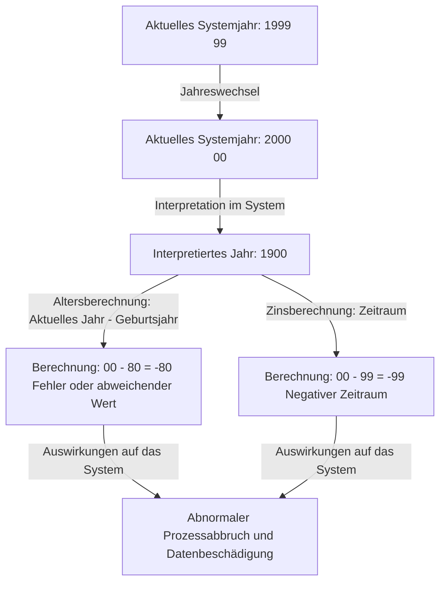
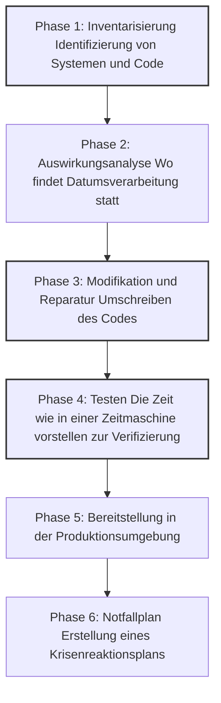

## Einführung: Die digitale Zeitbombe der Menschheit

Am 31. Dezember 1999, als sich die Welt darauf vorbereitete, das neue Jahrtausend zu feiern, hielten einige Menschen aus einem ganz anderen Grund den Atem an. Statt eines Champagnerglases hielten sie Kaffeetassen und Tastaturen fest und warteten auf den Moment, in dem die Uhr auf ihren Monitoren auf "00:00:00" sprang.

Das war der Höhepunkt des Kampfes gegen den "Y2K-Bug" (Year 2000) – allgemein bekannt als das "Jahr-2000-Problem".

Damals berichteten die Medien täglich groß aufgemacht, dass "Flugzeuge abstürzen werden", "Atomkraftwerke außer Kontrolle geraten", "Bankkontostände auf null sinken" und "die Infrastruktur komplett zum Erliegen kommen wird", was eine weltweite Panik auslöste. Doch als der 1. Januar 2000 kam, gab es keine großflächigen Ausfälle, die fatale Auswirkungen auf unser Leben hatten.

Aufgrund dieses Ergebnisses sagten einige Leute in späteren Jahren: "Das Y2K-Problem war eine von den Medien geschaffene Illusion" oder "Es war ein riesiger Betrug der IT-Branche." Das ist jedoch ein großes Missverständnis. Die Welt brach nicht zusammen, weil ein Wunder geschah. Es war das blutige Bemühen der "namenlosen Programmierer", die jahrelang mit Millionen Zeilen Legacy-Code kämpften und buchstäblich die Systeme auf der ganzen Welt umschrieben.

In diesem Artikel erklären wir im Detail, warum das Y2K-Problem auftrat, von seinem historischen Hintergrund über das gesamte Ausmaß des beispiellosen globalen Debugging-Projekts bis hin zu den Lehren, die für das moderne Engineering geblieben sind.

## Kapitel 1: Warum entstand das Y2K-Problem?

Kurz gesagt, das Y2K-Problem war ein "Systemfehler, der dadurch verursacht wurde, dass bei der Darstellung von Daten nur die letzten beiden Ziffern des Kalenderjahres verwendet wurden." Zum Beispiel wurde 1998 als "98" und 1999 als "99" verarbeitet. Das Jahr 2000 wurde jedoch zu "00".

Wenn das System "00" als "1900" statt als "2000" interpretierte, traten die folgenden Berechnungsfehler auf.

Warum haben die damaligen Programmierer das Jahr nur zweistellig statt vierstellig aufgezeichnet? Das lag keineswegs daran, dass sie faul waren oder nicht vorausschauend genug dachten. Es gab damals gravierende "Hardware-Einschränkungen".

### Eine Ära, in der Speicher teuer war

In den 1960er und 70er Jahren war die Speicherkapazität von Computern (Arbeitsspeicher und Festplatten) eine unfassbar teure und kostbare Ressource.

Auf frühen Großrechnern (Mainframes) wurden Daten mit Lochkarten verwaltet. Eine einzige Lochkarte konnte nur 80 Ziffern (80 Zeichen) speichern. In diesem begrenzten Raum mussten alle Daten wie Name, Adresse, Kontonummer und Transaktionsbetrag untergebracht werden.

Unter solchen Umständen war das Weglassen der ersten beiden Ziffern "19" in Datumsangaben eine äußerst logische und notwendige Entscheidung. In Datenbanken, die Millionen von Datensätzen speicherten, führte eine Einsparung von nur zwei Bytes (zwei Zeichen) zu massiven Kostensenkungen.

Die Programmierer jener Zeit ahnten bereits: "Wenn das Jahr 2000 kommt, könnte das ein Problem werden." Sie dachten jedoch: "Es ist unmöglich, dass dieses System bis zum Jahr 2000 genutzt wird. Bis dahin wird es sicherlich durch ein neues ersetzt worden sein."

Diese Vorhersage war jedoch falsch. Die robusten Systeme, die sie mit COBOL und anderen Sprachen aufbauten, liefen über 30 Jahre lang als Kernsysteme für Finanzen, Versicherungen, Regierungsbehörden usw. weiter.

## Kapitel 2: Das Ausmaß der lauernden Krise

Mitte der 1990er Jahre, als das Jahr 2000 immer näher rückte, begannen Teile der IT-Branche Alarm zu schlagen. Zunächst wurde es als Minderheitenmeinung abgetan, aber mit fortschreitenden Untersuchungen wurde das enorme Ausmaß der Auswirkungen deutlich.

### Weitreichende Auswirkungen

1. **Finanzinstitute**: Verschwinden von Kontoständen durch Fehler bei der Zinsberechnung oder Abgleiten in negative Salden. Falsche Berechnung von Fälligkeitsdaten.
2. **Verkehr und Luftfahrt**: Massive Flugausfälle aufgrund des Ausfalls von Flugsicherungssystemen. Zusammenbruch von Reservierungssystemen.
3. **Infrastruktur und Strom**: Großflächige Stromausfälle durch Fehlfunktionen in den Steuerungssystemen von Kraftwerken (insbesondere eingebettete Systeme).
4. **Medizin**: Gefahr für Patienten durch Fehlfunktionen medizinischer Geräte. Falsche Beurteilung der Haltbarkeit von Medikamenten.
5. **Militär und Verteidigung**: Fehlfunktionen in Frühwarnsystemen und Ausfälle von Kommunikationssystemen.

Besonders gefürchtet war der Y2K-Bug in "Eingebetteten Systemen" (Embedded Systems). Aufzügen, Produktionslinien, Herzschrittmachern und anderen Geräten mit integrierten Mikrochips konnte eine verborgene Logik zur Datumsbestimmung innewohnen. Diese ließen sich nicht einfach wie Software-Updates beheben; in einigen Fällen musste der Chip selbst ausgetauscht werden.

### Der Kettenzusammenbruch von Lieferketten

Erschwerend kam die gegenseitige Abhängigkeit in der globalisierten Wirtschaft hinzu. Selbst wenn ein Unternehmen seine Systeme perfekt reparierte: Wenn die Systeme der Geschäftspartner ausfielen, würden Teilebeschaffung und Zahlungen ins Stocken geraten, was zu einem Kettenstillstand der Wirtschaft führen würde. Dies war ein "systemisches Risiko", das von keinem Land und keinem Unternehmen allein gelöst werden konnte.

## Kapitel 3: Das beispiellose große Debugging-Projekt

In den späten 1990er Jahren wurden Regierungen und Unternehmen weltweit endlich aktiv. Hier begann das größte Software-Modifikationsprojekt der Menschheitsgeschichte.

### Einberufungsbefehl für pensionierte Programmierer

Im Zentrum des Y2K-Problems standen COBOL-, Fortran- und Assembly-Codes, die Jahrzehnte zuvor geschrieben worden waren. Damals hatte sich der Mainstream der IT-Branche bereits in Richtung C, C++ und Java verschoben, und die Zahl der aktiven Ingenieure, die diese alten Sprachen lesen und schreiben konnten, nahm ab.

Daher holten die Unternehmen Veteranen, die bereits im Ruhestand waren, für horrende Summen zurück. Allein die Fähigkeit, "COBOL zu programmieren", brachte Aufträge ein, die ein Vielfaches des üblichen Honorars zahlten – die sogenannte COBOL-Blase war da.

Ihre Aufgabe bestand darin, aus Millionen Zeilen spaghettiförmig verworrenem Quellcode jene Variablen zu finden, die Datumsangaben verarbeiteten, und diese zu korrigieren.

### Ein schwindelerregender Arbeitsprozess

Beim Debuggen des Y2K-Projekts ging es nicht um auffälliges Hacking oder den Einsatz modernster Technologien. Es war eine Reihe von mühsamen und dreckigen Aufgaben.

1. **Die Suche nach dem Code**: Ohne konsistente Namenskonventionen im Quellcode mussten sie nicht nur Variablen wie "DATE", "YY" und "YEAR" manuell suchen, sondern auch Variablen, die implizit als Datum verwendet wurden.
2. **Schwierigkeiten beim Testen**: Um das "Jahr-2000-Problem" zu testen, musste die Systemuhr tatsächlich vorgestellt werden (Zeitreise). Da man jedoch die Uhr in der Produktionsumgebung nicht vorstellen konnte, musste eine vollständig isolierte Testumgebung aufgebaut und die Verifizierung einschließlich der Integration (Schnittstellen) mit anderen Systemen durchgeführt werden.

### Spezifische Debugging-Methoden

Die Programmierer erkannten, dass weder Zeit noch Budget ausreichten, um den gesamten Code auf vierstellige Jahreszahlen umzuschreiben (Feld-Erweiterung). Daher wurde die Methode des sogenannten "Windowing" (Fensterung) weit verbreitet angewendet.

**Der Mechanismus des Windowing:**
Es wird ein Referenzjahr (Pivot-Jahr) für das System festgelegt, und die zweistellige Jahreszahl wird je nach Kontext interpretiert.
Zum Beispiel, wenn das Pivot-Jahr "50" ist:
- "50" bis "99" werden als 1900er (1950–1999) interpretiert.
- "00" bis "49" werden als 2000er (2000–2049) interpretiert.

Durch Hinzufügen von nur ein paar Zeilen dieser Logik in den Code konnte die Lebensdauer des Systems bis 2049 verlängert werden, ohne die Datenbankstruktur (zweistellige Jahreszahlen) ändern zu müssen. Dies war keine perfekte Lösung, sondern eine "Aufschiebung technischer Schulden", aber in der begrenzten Zeit war es der realistischste und effektivste Trick (Hack).

## Kapitel 4: Der Moment des Millenniums und die Wahrheit von "Nichts ist passiert"

Dann kam der schicksalhafte 31. Dezember 1999. IT-Abteilungen auf der ganzen Welt ließen ihre Mitarbeiter in Hotels bereitstehen, bereiteten Unmengen an Pizza und Kaffee vor und starrten in den "Einsatzzentralen" auf ihre Monitore.

Das Jahr 2000 brach nach und nach in den Ländern ein, die der Datumsgrenze am nächsten lagen, wie Neuseeland und Australien.

"Sydney, keine Anomalien."
"Tokio, keine Anomalien."
"London, keine Anomalien."
"New York, keine Anomalien."

Wie bei einem Staffellauf umrundete die Welle des Jahres 2000 die Erde. Obwohl es kleinere Probleme gab (z.B. zeigten einige Websites das Datum "19100" an, es gab kleinere Störungen in lokalen Systemen), blieben die gefürchteten massiven Zusammenbrüche der Infrastruktur, Flugzeugabstürze und der Stillstand der Finanzsysteme aus.

Als am 1. Januar die Sonne aufging, erwachte die Welt zu einem Morgen wie am Tag zuvor.

### Warum ist "Nichts passiert"?

Die Medien berichteten, es sei "viel Lärm um nichts" gewesen und "Y2K war eine Illusion". Auch die Öffentlichkeit reagierte kühl und sagte: "Letztendlich haben doch nur die Computerfirmen Kasse gemacht."

Die Wahrheit ist jedoch genau das Gegenteil. **Es ist nicht "nichts passiert", sondern "sie haben dafür gesorgt, dass nichts passiert."**

Es war der "Frieden", der aus massiven Investitionen von geschätzt 300 bis 600 Milliarden Dollar weltweit resultierte, und aus Millionen von Ingenieuren, die über Jahre hinweg Überstunden und Wochenendarbeit leisteten, um Systeme gründlich zu korrigieren und immer wieder zu testen.

Hätten sie nichts getan, wären Kettenausfälle der Systeme vorprogrammiert gewesen, und unzählige Abstürze in Testumgebungen bewiesen, dass dies zu immensen wirtschaftlichen Schäden und sozialen Unruhen geführt hätte. Die IT-Ingenieure waren die heimlichen, "unsichtbaren Helden", die die Welt gerettet haben.

## Kapitel 5: Lehren für die Gegenwart und die nächste Zeitbombe

Das Y2K-Problem ist kein alter Witz aus der Vergangenheit. Im Software-Engineering hat es viele weitreichende Lektionen hinterlassen, die auch heute noch gelten.

### 1. Der Schrecken technischer Schulden
Eine kurzfristige Optimierung (oder ein Kompromiss) wie "Das funktioniert erst mal" oder "Das System wird in Zukunft sowieso erneuert", kann sich zu einer gewaltigen "Technischen Schuld" (Technical Debt) auswachsen, die Jahrzehnte später Korrekturkosten in Höhe von Staatshaushalten erfordert.

### 2. System-Interdependenz und Black Boxes
Moderne Systeme sind noch komplexer vernetzt als zur Y2K-Zeit. Wir verlassen uns auf externe Systeme, die wir nicht kontrollieren können, wie Cloud-Dienste, APIs und Open-Source-Bibliotheken. Wenn in der grundlegenden Logik, auf die sich die Systeme der Welt stützen, ein fataler Fehler gefunden wird, könnte es schwieriger sein, die Auswirkungen zu identifizieren und zu beheben, als bei Y2K.

### 3. Die nächste Krise: Das "Jahr-2038-Problem"
Unter Ingenieuren hat der Countdown für die nächste Zeitbombe bereits begonnen. Es ist das "Jahr-2038-Problem" (Y2K38).

In vielen UNIX-basierten Systemen wird die Zeit als "vergangene Sekunden seit dem 1. Januar 1970 00:00:00 UTC" verwaltet, dargestellt als vorzeichenbehaftete 32-Bit-Ganzzahl. Der Maximalwert dieser 32-Bit-Ganzzahl ist "2.147.483.647", und diese Anzahl an Sekunden wird am **19. Januar 2038 um 03:14:07 (UTC)** erreicht sein.

Wenn dieser Moment überschritten wird, kommt es zu einem Überlauf (Overflow), und der Wert wird als negative Zahl (ein Rücksprung ins Jahr 1901) interpretiert. Bei aktuell laufenden 32-Bit-Systemen und eingebetteten Geräten (alte Router, Navigationsgeräte, IoT-Geräte usw.) kann es zu schwerwiegenden Fehlfunktionen kommen.

Natürlich sind viele moderne Betriebssysteme und Datenbanken bereits auf 64-Bit umgestellt, und die Maßnahmen gegen dieses Problem sind im Gange. Niemand weiß jedoch genau, wie viele "alte, unaktualisiert belassene Geräte" auf der Welt verstreut sind.

## Fazit: An die Menschen, die die unsichtbare Infrastruktur stützen

Die Tatsache, dass wir heute wie selbstverständlich mit Smartphones bezahlen, in Flugzeuge steigen und Strom nutzen können, liegt daran, dass hinter den Kulissen eine riesige Anzahl von Ingenieuren kontinuierlich Wartung und Debugging durchführt, damit die Systeme nicht zusammenbrechen.

Der Kampf der Ingenieure beim Y2K-Problem hatte eine äußerst harte und undankbare Natur: "Wenn du erfolgreich bist, wird es niemand merken (oder es wird als nutzlos abgetan), und wenn du scheiterst, wirst du beschuldigt, zum Weltuntergang beigetragen zu haben."

Trotzdem haben sie es durchgezogen.

Hinter den Nachrichten, dass "ein großer Ausfall der IT-Systeme verhindert wurde", verbirgt sich eine unermessliche Menge an Schweiß und schlaflosen Nächten. Wenn wir auf die Geschichte des Y2K-Problems zurückblicken, müssen wir der großen Leistung dieser "unsichtbaren Profis" erneut unseren tiefsten Respekt zollen.
