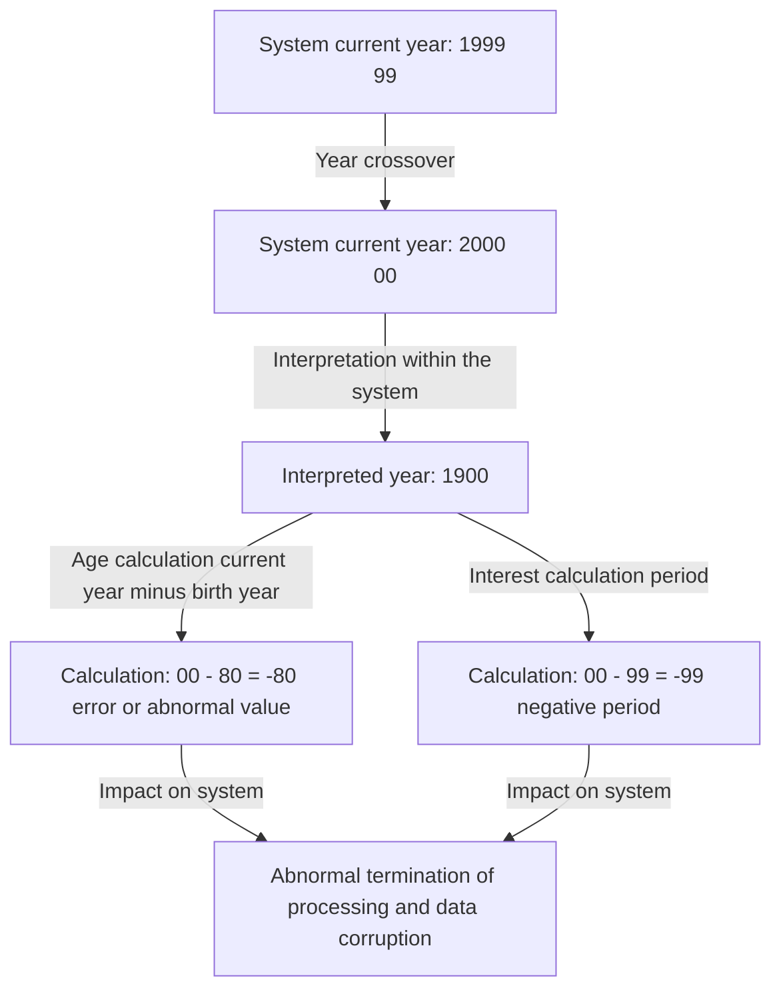
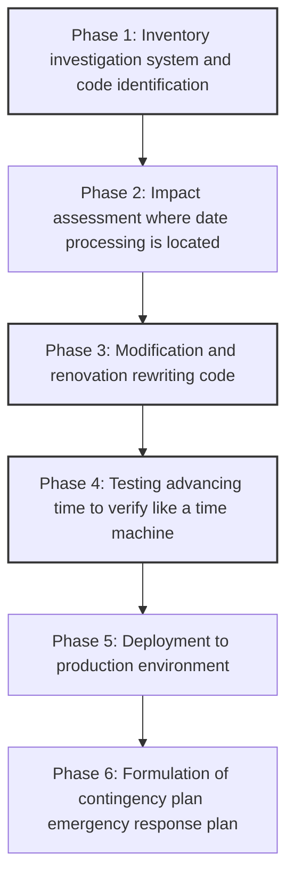

## Prologue: The Digital Time Bomb Facing Humanity

On December 31, 1999, as the world prepared to celebrate the arrival of the new millennium, some people held their breath for an entirely different reason. Gripping coffee cups and keyboards instead of champagne glasses, they waited for the moment the clock hands on their monitors would point to "00:00:00".

That was the climax of the battle against the "Y2K Year 2000 problem"—commonly known as the "Year 2000 bug".

At the time, the media reported daily on sensational scenarios: "planes will crash," "nuclear power plants will go out of control," "bank account balances will become zero," and "infrastructure will completely stop," causing global panic. However, when January 1, 2000 arrived, no large-scale failures occurred that fatally affected our lives.

Following this outcome, people in later years began to say that "the Y2K bug was an illusion created by the media" or "it was a massive scam by the IT industry." However, that is a huge misunderstanding. The world didn't collapse because a miracle happened. It was because of the blood-sweat-and-tears efforts of "nameless programmers" who spent years fighting millions of lines of legacy code and literally rewriting the world's systems.

In this article, we will explain in great detail why the Y2K problem occurred, starting from its historical background, to the full picture of the unprecedented global debugging project, and the lessons left for modern engineering.

## Chapter 1: Why Did the Y2K Bug Originate?

If the Y2K problem were to be explained in a single phrase, it is "a system bug caused by using only the last two digits of the year when representing dates." For example, 1998 is processed as "98" and 1999 as "99". However, 2000 becomes "00".

If the system misinterprets "00" as "1900" instead of "2000", calculation anomalies like the following occur:

Why did programmers of that time record the year in 2 digits instead of 4? It was not because they were lazy or lacked foresight. It was due to severe "hardware constraints" of the time.

### The Era When Memory Was Expensive

From the 1960s to the 1970s, computer storage capacity memory and storage was an unbelievably expensive and precious resource compared to modern times.

In early mainframe computers, data was managed on punch cards. A single punch card could only record 80 columns 80 characters. Into this limited space, it was necessary to cram all sorts of data, such as names, addresses, account numbers, and transaction amounts.

Under such circumstances, omitting the upper 2 digits "19" of date data was an extremely rational and essential choice. In a database storing millions of records, saving just 2 bytes 2 characters per record led to enormous overall cost reductions.

The programmers of that time also vaguely realized that "eventually the year 2000 will come and it might be a problem." However, they thought: "This system cannot possibly remain in use until the year 2000. It will have been replaced by a new system by then."

However, that prediction was wrong. The robust systems they built, written in COBOL and other languages, continued to operate for over 30 years as core systems for financial institutions, insurance companies, and government agencies.

## Chapter 2: The Scale of the Hidden Crisis

By the mid-1990s, as the year 2000 finally approached, warning bells began to sound from parts of the IT industry. Initially ignored as a minority opinion, as investigations progressed, the unusually broad scope of its impact became clear.

### A Diverse Range of Impacts

1. **Financial Institutions**: Disappearance of account balances due to abnormal interest calculations, or plunging into negative balances. Miscalculation of maturity dates.
2. **Transportation and Aviation**: Large-scale flight stoppages due to air traffic control systems going down. Collapse of reservation systems.
3. **Infrastructure and Power**: Massive blackouts due to malfunctions in power plant control systems especially embedded systems.
4. **Medical**: Danger to patients due to malfunctions in medical equipment. Misjudgment of pharmaceutical expiration dates.
5. **Military and Defense**: Malfunctions in early warning systems and communication system outages.

What was especially feared was the Y2K bug in "Embedded Systems". There was a possibility that date judgment logic was hiding in any device containing a microchip, such as elevators, factory production lines, and pacemakers. These were not something that could be easily fixed like a software update; in some cases, the chip itself needed to be replaced.

### Chain Collapse of the Supply Chain

Further complicating the problem was the interdependence in the increasingly globalized economy. Even if a company perfectly fixed its own systems, if a supplier's systems went down, parts procurement and payments would stall, causing a chain reaction of business stoppages. This was a "systemic risk," a problem that could not be solved by a single country or company alone.

## Chapter 3: An Unprecedented Grand Debugging Operation

In the late 1990s, governments and companies around the world finally got off their heavy rears. Here, the largest software modification project in human history began.

### The Draft Notice for Retired Programmers

At the core of the Y2K problem was code written decades ago in COBOL, Fortran, and Assembly languages. At the time, the mainstream IT industry was already shifting to C, C++, Java, etc., and active engineers who could read and write these older languages were decreasing.

Therefore, companies recalled veteran programmers who had already retired and were living on pensions, offering them extraordinary compensation. A true COBOL bubble arrived, where simply being able to "write COBOL" brought in work at several times the normal unit price.

Their job was to search for variables handling dates from among tens of millions of lines of source code tangled like spaghetti, and to fix them.

### A Mind-Boggling Work Process

Debugging the Y2K project did not involve flashy hacking or utilizing the latest technology. It was a continuous series of extremely steady, unglamorous work.

1. **Code Search**: In the absence of consistent naming conventions in the source code, they had to manually find not only variables named "DATE", "YY", or "YEAR", but also variables implicitly used as dates.
2. **Difficulty of Testing**: To test the "Year 2000 problem", it was necessary to actually advance the system clock time travel. However, since the production environment's clock could not be advanced, a completely isolated test environment had to be built, and verification had to be done including linkages interfaces with other systems.

### Specific Debugging Techniques

Programmers realized they did not have the time or budget to rewrite all code to 4-digit years field expansion. Therefore, a technique called "Windowing" was widely adopted.

**How Windowing Works:**
A reference year pivot year for the system is set, and a 2-digit year is interpreted according to the context.
For example, if the pivot year is set to "50":
- "50" to "99" are interpreted as the 1900s 1950 to 1999.
- "00" to "49" are interpreted as the 2000s 2000 to 2049.

By simply adding a few lines of this logic to the code, they were able to extend the system's life until 2049 without changing the database structure 2-digit years. This was not a perfect solution but a "postponement of technical debt," but it was the most realistic and effective hack technique given the limited time.

## Chapter 4: The Moment of the Millennium and the Truth That "Nothing Happened"

Then came the fateful December 31, 1999. IT departments worldwide kept their employees on standby in hotels, prepared massive amounts of pizza and coffee, and stared at monitors in "countermeasure headquarters".

Gradually, the year 2000 arrived from countries closest to the International Date Line, such as New Zealand and Australia.

"Sydney, no anomalies"
"Tokyo, no anomalies"
"London, no anomalies"
"New York, no anomalies"

Like a relay around the world, the wave of the year 2000 circled the earth. Although minor troubles occurred some websites displayed the date as "19100", minor failures in regional systems, the feared massive infrastructure collapses, aircraft accidents, and financial system halts never happened even once.

When dawn broke on January 1, the world welcomed a morning no different from yesterday.

### Why Did "Nothing Happen"?

The media reported that it was "too much fuss" and "Y2K was an illusion". The general public also cast cold glances, saying, "In the end, it was just the computer companies making money."

However, the truth is entirely the opposite. **It is not that "nothing happened," but that they "made sure nothing happened."**

An estimated 300 billion to 600 billion dollars roughly 30 to 60 trillion yen at the exchange rate of the time was invested globally, and millions of engineers worked overtime and on holidays for years, thoroughly fixing systems and repeatedly testing. This "peace" was the result.

If they had done nothing, failures would have certainly cascaded through systems everywhere, causing immense economic damage and social chaos, as proven by the countless crashes in test environments. IT engineers were the "invisible heroes" who quietly saved the world.

## Chapter 5: Lessons for Today and the Next Time Bomb

The Y2K problem is not a laughing matter of the past. In software engineering, it left many heavy lessons that apply today.

### 1. The Terror of Technical Debt
The terror that short-term optimization or compromise—"It works for now" or "The system will surely be updated in the future"—grows into a massive "Technical Debt" requiring modification costs on the scale of national budgets decades later.

### 2. System Interdependence and Black Boxing
Modern systems are even more complexly intertwined than during Y2K. We rely on external systems we cannot control, such as cloud services, APIs, and open-source libraries. If a fatal bug is found in the foundational logic upon which the world's systems depend, identifying and fixing its impact might be even more difficult than Y2K.

### 3. The Next Crisis: "The Year 2038 Problem"
Actually, among engineers, the countdown for the next time bomb has already begun. That is the "Year 2038 Problem Y2K38".

Many UNIX-like systems manage time as "elapsed seconds since January 1, 1970, 00:00:00 UTC" as a 32-bit signed integer. The maximum value of this 32-bit integer is "2,147,483,647", and this number of seconds will be reached on **January 19, 2038, 03:14:07 UTC**.

After this moment passes, the value will overflow, being interpreted as a negative number turning back to 1901. Serious malfunctions could occur in currently operating 32-bit systems and embedded devices old routers, car navigation systems, IoT devices, etc..

Of course, many modern OSs and databases have already moved to 64-bit, and countermeasures against this problem are progressing. However, no one knows exactly how many "old devices left un-updated" are scattered around the world.

## Conclusion: To the People Who Support Our Invisible Infrastructure

The fact that we can naturally make payments with our smartphones, board planes, and use electricity every day is because a massive number of engineers behind the scenes are constantly performing maintenance and debugging so that the systems do not fail.

The engineers' battle during the Y2K problem was an extremely harsh and unrewarding one: "If successful, no one will notice or they'll say it was pointless, and if it fails, you'll be blamed for contributing to the end of the world."

Yet they saw it through.

Next time you hear news that "a major IT system failure was prevented," think of how much sweat and sleepless nights were behind it. When looking back on the history of the Y2K problem, we cannot help but pay our respects once again to the great achievements of these "invisible professionals."
