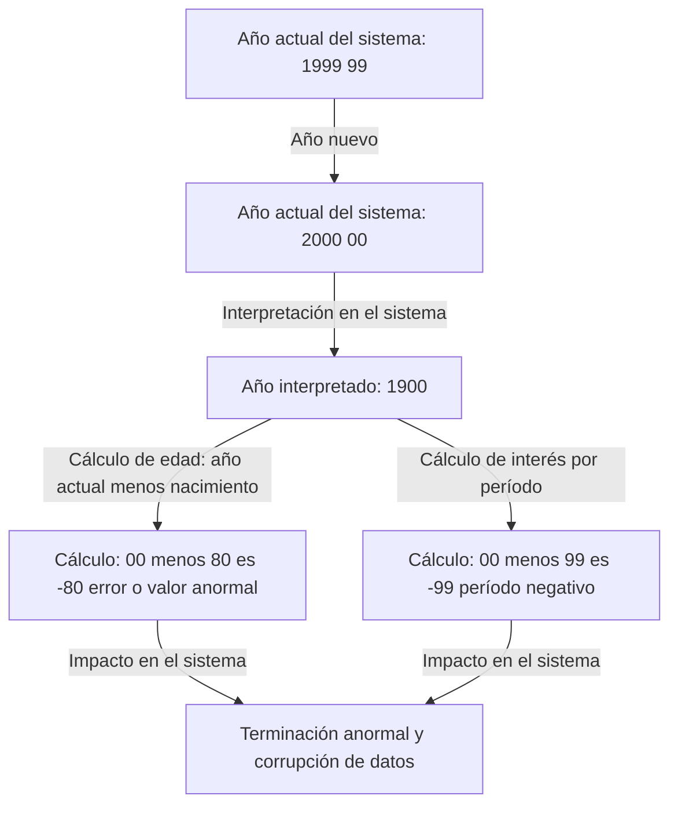
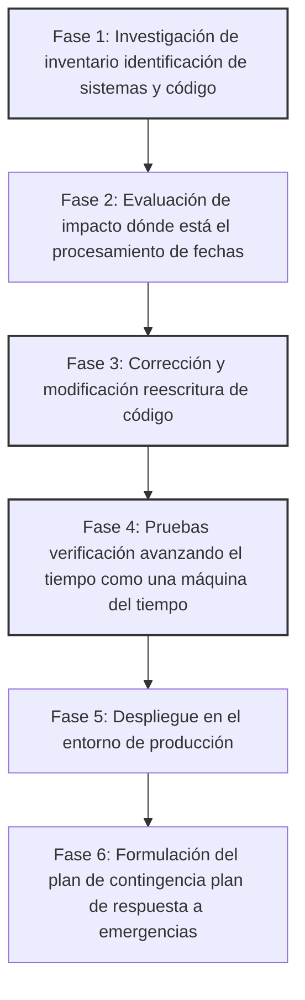

## Introducción: La bomba de tiempo digital que enfrentó la humanidad

El 31 de diciembre de 1999, mientras el mundo se preparaba para celebrar la llegada del nuevo milenio, algunas personas contenían la respiración por una razón completamente diferente. En lugar de copas de champán, sostenían tazas de café y teclados, esperando el momento en que las manecillas del reloj en sus monitores apuntaran a "00:00:00".

Ese fue el clímax de la batalla contra el "Problema Y2K (Año 2000)", comúnmente conocido como el "Error del Milenio".

En ese momento, los medios informaban todos los días a gran escala que "los aviones se estrellarían", "las plantas de energía nuclear se descontrolarían", "los saldos de las cuentas bancarias llegarían a cero" y "la infraestructura se detendría por completo", causando pánico mundial. Sin embargo, cuando llegó el 1 de enero de 2000, no ocurrieron fallos a gran escala que afectaran fatalmente nuestras vidas.

Ante este resultado, en años posteriores, algunas personas dijeron que "el problema Y2K fue una ilusión creada por los medios" o "fue un fraude gigantesco de la industria de TI". Sin embargo, ese es un gran malentendido. El mundo no colapsó porque ocurrió un milagro. Fue gracias al esfuerzo de "programadores anónimos" que, durante varios años, lucharon contra millones de líneas de código heredado y literalmente reescribieron los sistemas de todo el mundo.

En este artículo, explicaremos en detalle por qué ocurrió el problema Y2K, desde sus antecedentes históricos hasta la imagen completa del proyecto de depuración sin precedentes llevado a cabo a escala global, y las lecciones dejadas para la ingeniería moderna.

## Capítulo 1: ¿Por qué surgió el problema Y2K?

Explicado en pocas palabras, el problema Y2K fue "un error del sistema causado por usar solo los últimos dos dígitos del año al representar fechas". Por ejemplo, 1998 se procesa como "98" y 1999 como "99". Sin embargo, el año 2000 se convierte en "00".

Si el sistema interpretara "00" como "1900" en lugar de "2000", ocurrirían anomalías de cálculo como las siguientes:

¿Por qué los programadores de aquella época registraron los años con dos dígitos en lugar de cuatro? No fue porque fueran perezosos o carecieran de previsión. Hubo una severa "restricción de hardware" en ese entonces.

### La era en la que la memoria era cara

En las décadas de 1960 y 1970, la capacidad de memoria y almacenamiento de las computadoras era un recurso tan caro y valioso que hoy es inimaginable.

En las primeras computadoras mainframe, los datos se manejaban con tarjetas perforadas. Solo se podían registrar 80 dígitos o caracteres en una sola tarjeta perforada. En este espacio limitado, se debía incluir toda clase de datos, como nombres, direcciones, números de cuenta y montos de transacciones.

En tales circunstancias, omitir los dos primeros dígitos "19" de los datos de fecha era una opción extremadamente racional y esencial. En las bases de datos que almacenaban millones de registros, ahorrar solo 2 bytes por registro resultó en una enorme reducción de costos en general.

Los programadores de esa época también tenían la ligera sospecha de que "cuando llegue el año 2000, esto podría ser un problema". Sin embargo, pensaron: "Es imposible que este sistema siga en uso para el año 2000. Para entonces, habrá sido reemplazado por un nuevo sistema".

Pero esa predicción falló. Los sistemas robustos escritos en COBOL y otros lenguajes que construyeron continuaron operando por más de 30 años como los sistemas centrales de instituciones financieras, seguros y agencias gubernamentales.

## Capítulo 2: La magnitud de la crisis latente

A mediados de la década de 1990, cuando se acercaba el año 2000, algunos en la industria de TI comenzaron a hacer sonar las alarmas. Al principio, fueron ignorados como una opinión minoritaria, pero a medida que avanzaban las investigaciones, se hizo evidente el alcance extraordinariamente amplio de su impacto.

### Un alcance de impacto muy diverso

1. **Instituciones financieras**: Desaparición de saldos de cuentas o entrada en saldos negativos debido a cálculos de intereses anormales. Cálculo incorrecto de las fechas de vencimiento.
2. **Transporte y aviación**: Suspensión de vuelos a gran escala debido a la caída de los sistemas de control de tráfico aéreo. Colapso de los sistemas de reservas.
3. **Infraestructura y energía**: Apagones masivos debido al mal funcionamiento de los sistemas de control de las plantas de energía, especialmente los sistemas integrados.
4. **Atención médica**: Peligro para los pacientes debido al mal funcionamiento de los equipos médicos. Evaluación incorrecta de las fechas de caducidad de los medicamentos.
5. **Militar y defensa**: Mal funcionamiento de los sistemas de alerta temprana y caída de los sistemas de comunicación.

Lo más temido era el error Y2K en los "sistemas integrados". La lógica de determinación de fechas podría estar oculta en cualquier dispositivo con un microchip incorporado, como ascensores, líneas de producción en fábricas y marcapasos. Estos no podían repararse tan fácilmente como una actualización de software, y en algunos casos, requería reemplazar el chip en sí.

### Colapso en cadena de las cadenas de suministro

Lo que complicó aún más el problema fue la interdependencia en una economía globalizada. Incluso si el sistema de una empresa se solucionara perfectamente, si los sistemas de los socios comerciales colapsaban, la adquisición de piezas y los pagos se estancarían, deteniendo los negocios en una reacción en cadena. Este era un "riesgo sistémico" y un problema que un solo país o empresa no podía resolver por sí solo.

## Capítulo 3: La operación de depuración sin precedentes

A finales de la década de 1990, los gobiernos y las empresas de todo el mundo finalmente se pusieron manos a la obra. Así comenzó el proyecto de corrección de software más grande de la historia humana.

### El llamado a los programadores retirados

El núcleo del problema Y2K era el código escrito en COBOL, Fortran y lenguaje ensamblador décadas atrás. En ese momento, la corriente principal de la industria de TI ya estaba cambiando a C, C++ y Java, y el número de ingenieros en activo que podían leer y escribir en estos lenguajes antiguos estaba disminuyendo.

Por ello, las empresas llamaron a programadores veteranos que ya estaban jubilados y vivían de sus pensiones, ofreciéndoles salarios excepcionales. Solo por saber escribir en COBOL, los trabajos llovían a un precio varias veces superior al habitual, marcando la llegada de la "burbuja COBOL".

Su trabajo consistía en buscar variables que manejaran fechas en decenas de millones de líneas de código fuente enredadas como espaguetis, y corregirlas.

### Un proceso de trabajo abrumador

La depuración del proyecto Y2K no fue algo que utilizara hacking llamativo o tecnología de punta. Fue una serie de tareas extremadamente monótonas y arduas.

1. **Búsqueda de código**: Cuando el código fuente no tenía convenciones de nomenclatura consistentes, era necesario buscar manualmente no solo nombres de variables como "DATE", "YY" o "YEAR", sino también variables que se usaban implícitamente como fechas.
2. **Dificultad de las pruebas**: Para probar el "Problema 2000", era necesario adelantar el reloj del sistema en realidad, como viajar en el tiempo. Sin embargo, dado que no podían adelantar el reloj del entorno de producción, tuvieron que construir un entorno de prueba completamente aislado y verificarlo, incluidas las integraciones e interfaces con otros sistemas.

### Métodos específicos de depuración

Los programadores se dieron cuenta de que no tenían el tiempo ni el presupuesto para reescribir todo el código a años de 4 dígitos expansión de campos. Por lo tanto, se adoptó ampliamente un método llamado "Windowing" creación de ventanas.

**Cómo funciona el Windowing:**
Se establece un año base del sistema, año pivote, y el año de 2 dígitos se interpreta según el contexto.
Por ejemplo, si el año pivote es "50":
- "50" a "99" se interpreta como la década de 1900, de 1950 a 1999.
- "00" a "49" se interpreta como la década de 2000, de 2000 a 2049.

Agregando solo unas pocas líneas de esta lógica al código, pudieron extender la vida útil del sistema hasta el año 2049 sin cambiar la estructura de la base de datos de años de 2 dígitos. Esto no fue una solución perfecta, sino un aplazamiento de la deuda técnica, pero en el tiempo limitado, fue el truco o método más realista y efectivo.

## Capítulo 4: El momento del milenio y la verdad de que "no pasó nada"

Y así llegó el fatídico 31 de diciembre de 1999. Los departamentos de TI de todo el mundo mantuvieron a sus empleados en hoteles, prepararon grandes cantidades de pizza y café, y miraban fijamente los monitores en sus "cuarteles generales de respuesta".

Los países más cercanos a la línea internacional de cambio de fecha, como Nueva Zelanda y Australia, fueron los primeros en recibir gradualmente el año 2000.

"Sídney, sin anomalías"
"Tokio, sin anomalías"
"Londres, sin anomalías"
"Nueva York, sin anomalías"

Como un relevo por todo el mundo, la ola del 2000 dio la vuelta al planeta. Aunque ocurrieron problemas menores, como que la fecha se mostrara como "19100" en algunos sitios web o fallas a pequeña escala en sistemas locales, el tan temido colapso masivo de la infraestructura, los accidentes aéreos y la interrupción de los sistemas financieros nunca sucedieron.

Al amanecer del 1 de enero, el mundo despertó a una mañana igual a la de ayer.

### ¿Por qué "no pasó nada"?

Los medios de comunicación informaron que "se hizo demasiado alboroto" y que "el Y2K fue una ilusión". El público en general también lo miró con frialdad, diciendo: "Al final, las compañías de computadoras solo querían ganar dinero".

Sin embargo, la verdad es exactamente la opuesta. **No es que "no pasó nada", sino que "hicieron que no pasara nada".**

Fue la "paz" resultante de la inversión de una enorme suma de fondos estimada entre 300 mil millones y 600 mil millones de dólares a nivel mundial, y de millones de ingenieros trabajando horas extras y días festivos durante varios años, modificando a fondo los sistemas y repitiendo pruebas.

Si no hubieran hecho nada, era seguro que los fallos en los sistemas habrían ocurrido en cadena por todas partes, causando daños económicos masivos y caos social; los innumerables colapsos en los entornos de prueba lo demostraban. Los ingenieros de TI fueron los "héroes invisibles" que salvaron al mundo en silencio.

## Capítulo 5: Lecciones para la actualidad y la próxima bomba de tiempo

El problema Y2K no es una broma del pasado. Dejó muchas lecciones importantes y pesadas en la ingeniería de software que aún se aplican en la actualidad.

### 1. El terror de la deuda técnica
La optimización a corto plazo o el compromiso de decir "por ahora, esto funciona" o "el sistema se renovará en el futuro" es el terror de convertirse en una enorme "Deuda Técnica" que requiere costos de reparación a nivel de presupuesto nacional décadas después.

### 2. Interdependencia del sistema y cajas negras
Los sistemas modernos están aún más entrelazados de manera compleja que en la época del Y2K. Dependen de sistemas externos que no pueden controlar, como servicios en la nube, API y bibliotecas de código abierto. Si se encuentra un error fatal en la lógica fundamental de la que dependen los sistemas de todo el mundo, identificar y corregir el impacto podría ser aún más difícil que el Y2K.

### 3. La próxima crisis: El Problema del año 2038
De hecho, entre los ingenieros, la cuenta regresiva para la próxima bomba de tiempo ya ha comenzado. Es el "Problema del año 2038" Y2K38.

En muchos sistemas basados en UNIX, el tiempo se gestiona como el número de segundos transcurridos desde el "1 de enero de 1970 00:00:00 UTC" como un número entero con signo de 32 bits. El valor máximo para este entero de 32 bits es "2,147,483,647", y el número de segundos se alcanzará el **19 de enero de 2038 a las 03:14:07 UTC**.

Una vez que pase este momento, el valor se desbordará y se interpretará como un número negativo volviendo a 1901. En los sistemas y dispositivos integrados de 32 bits que funcionan actualmente como enrutadores antiguos, sistemas de navegación de automóviles, dispositivos IoT, etc., podrían ocurrir fallos de funcionamiento graves.

Por supuesto, muchos sistemas operativos y bases de datos modernos ya se han convertido a 64 bits y se están tomando medidas para abordar este problema. Sin embargo, nadie sabe exactamente cuántos "dispositivos antiguos abandonados sin actualizar" están dispersos por todo el mundo.

## Conclusión: A quienes sustentan la infraestructura invisible

La razón por la que podemos hacer pagos con nuestros teléfonos inteligentes, tomar vuelos y usar electricidad todos los días con naturalidad, es porque una gran cantidad de ingenieros detrás de escena están constantemente realizando mantenimiento y depuración para que los sistemas no colapsen.

La batalla de los ingenieros en el problema Y2K tuvo una naturaleza extremadamente dura y poco gratificante: "Si tienes éxito, nadie lo notará o dirán que fue inútil, y si fallas, serás culpado por ser cómplice del fin del mundo".

Aun así, lo lograron.

La próxima vez que escuches en las noticias que "se evitó un fallo importante del sistema de TI", piensa en cuánto sudor y noches en vela hubo detrás de escena. Al reflexionar sobre la historia del problema Y2K, no podemos evitar rendir un renovado homenaje a la gran obra de estos "profesionales invisibles".
