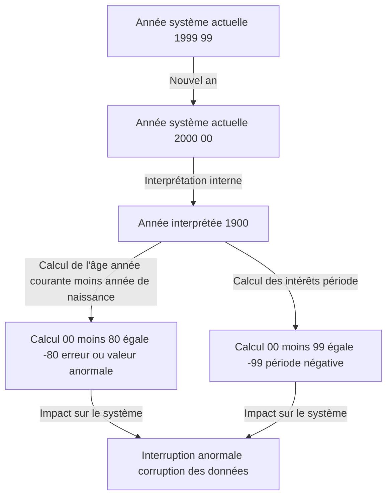
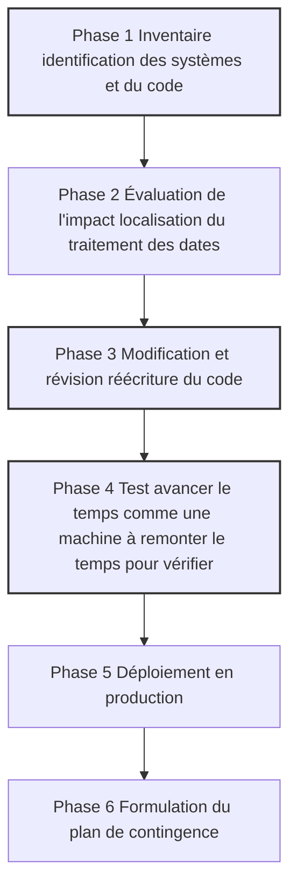

## Introduction : La bombe à retardement numérique à laquelle l'humanité a été confrontée

Le 31 décembre 1999, alors que le monde se préparait à célébrer l'arrivée du nouveau millénaire, certaines personnes retenaient leur souffle pour une raison complètement différente. Au lieu de flûtes à champagne, ils s'accrochaient à des tasses de café et des claviers, attendant le moment où l'horloge sur leurs écrans afficherait "00:00:00".

C'était le point culminant de la bataille contre le "Problème Y2K", communément appelé le "Bug de l'an 2000".

À l'époque, les médias rapportaient quotidiennement que "les avions s'écraseraient", "les centrales nucléaires deviendraient incontrôlables", "les soldes des comptes bancaires tomberaient à zéro" et "les infrastructures s'arrêteraient complètement", déclenchant une panique mondiale. Cependant, lorsque le 1er janvier 2000 est arrivé, aucune panne à grande échelle n'a eu lieu qui aurait gravement affecté nos vies.

À la suite de cela, certaines personnes ont affirmé plus tard que "le bug de l'an 2000 était une illusion créée par les médias" ou "une arnaque massive de l'industrie informatique". Cependant, c'est un énorme malentendu. Le monde ne s'est pas effondré grâce à un miracle. C'est grâce aux efforts acharnés de "programmeurs anonymes" qui ont lutté avec des millions de lignes de code hérité pendant des années, réécrivant littéralement les systèmes du monde entier.

Dans cet article, nous expliquerons en détail pourquoi le problème de l'an 2000 s'est produit, son contexte historique, la portée de ce projet de débogage mondial sans précédent et les leçons qu'il a laissées pour l'ingénierie moderne.

## Chapitre 1 : Pourquoi le bug de l'an 2000 est-il apparu ?

En un mot, le problème de l'an 2000 était "un bug du système causé par l'utilisation de seulement les deux derniers chiffres de l'année pour représenter les dates". Par exemple, 1998 était traité comme "98" et 1999 comme "99". Mais 2000 devenait "00".

Si le système interprétait "00" comme "1900" au lieu de "2000", des anomalies de calcul telles que les suivantes se produisaient.

Pourquoi les programmeurs de l'époque ont-ils enregistré l'année avec 2 chiffres au lieu de 4 ? Ce n'était certainement pas par paresse ou manque de prévoyance. C'était dû aux "contraintes matérielles" sévères de l'époque.

### L'époque où la mémoire coûtait cher

Des années 1960 aux années 1970, la capacité de stockage des ordinateurs, mémoire et disque, était une ressource extrêmement coûteuse et précieuse, inimaginable par rapport aux normes actuelles.

Dans les premiers ordinateurs centraux, les données étaient gérées par des cartes perforées. Une seule carte perforée ne pouvait contenir que 80 caractères. Dans cet espace limité, il fallait entasser toutes sortes de données : noms, adresses, numéros de compte, montants de transactions, etc.

Dans un tel contexte, omettre les deux premiers chiffres "19" des données de date était un choix extrêmement rationnel et nécessaire. Dans une base de données contenant des millions d'enregistrements, économiser seulement 2 octets pour 2 caractères entraînait d'énormes réductions de coûts au niveau global.

Les programmeurs de l'époque se doutaient vaguement que "lorsque l'an 2000 arriverait, cela pourrait devenir un problème". Cependant, ils pensaient : "Il est impossible que ce système soit encore utilisé d'ici l'an 2000. D'ici là, il sera remplacé par un nouveau système."

Mais cette prédiction s'est avérée fausse. Les systèmes robustes qu'ils avaient construits, écrits en langages comme COBOL, ont continué à fonctionner comme des systèmes centraux pour la finance, l'assurance et les agences gouvernementales pendant plus de 30 ans.

## Chapitre 2 : L'ampleur du danger latent

Au milieu des années 1990, alors que l'an 2000 approchait, certains dans l'industrie informatique ont commencé à sonner l'alarme. Initialement ignoré comme une opinion minoritaire, la portée extraordinairement large de l'impact est devenue claire au fur et à mesure que les enquêtes avançaient.

### Domaines d'impact diversifiés

1. **Institutions financières** : Disparition des soldes de compte ou passage en solde négatif à cause d'anomalies dans le calcul des intérêts. Mauvais calcul des dates d'échéance.
2. **Transports et aviation** : Suspension massive des vols due à la panne des systèmes de contrôle aérien. Effondrement des systèmes de réservation.
3. **Infrastructures et électricité** : Coupures de courant à grande échelle causées par des dysfonctionnements des systèmes de contrôle des centrales électriques en particulier les systèmes embarqués.
4. **Médical** : Danger pour les patients dû aux dysfonctionnements des équipements médicaux. Mauvaise évaluation des dates de péremption des médicaments.
5. **Militaire et défense** : Dysfonctionnement des systèmes d'alerte précoce et pannes des systèmes de communication.

Ce qui était particulièrement redouté, c'était le bug de l'an 2000 dans les "Systèmes Embarqués". Ascenseurs, chaînes de production d'usines, stimulateurs cardiaques... tout appareil contenant une puce électronique pouvait abriter une logique de vérification de date. Ceux-ci ne pouvaient pas être facilement corrigés avec une mise à jour logicielle, et dans certains cas, la puce elle-même devait être remplacée.

### L'effondrement en chaîne de la chaîne d'approvisionnement

Le problème a été encore compliqué par l'interdépendance de l'économie mondialisée. Même si une entreprise corrigeait parfaitement son propre système, si le système de son partenaire commercial tombait en panne, l'approvisionnement en pièces et les paiements seraient bloqués, arrêtant les affaires en chaîne. C'était un "risque systémique" qui ne pouvait pas être résolu par un seul pays ou une seule entreprise.

## Chapitre 3 : La grande mission de débogage sans précédent

À la fin des années 1990, les gouvernements et les entreprises du monde entier ont finalement agi. Ainsi a commencé le plus grand projet de correction de logiciels de l'histoire de l'humanité.

### Convocation des programmeurs retraités

Au cœur du problème de l'an 2000 se trouvaient des codes écrits des décennies plus tôt en COBOL, Fortran et en langage assembleur. À l'époque, le courant dominant de l'industrie informatique se tournait déjà vers le C, le C++ et Java, et le nombre d'ingénieurs actifs capables de lire et écrire ces anciens langages diminuait.

Par conséquent, les entreprises ont rappelé des programmeurs vétérans déjà à la retraite moyennant des compensations extraordinaires. Le simple fait de pouvoir "écrire en COBOL" apportait des emplois à des tarifs plusieurs fois supérieurs à la normale. C'était l'avènement de la "bulle COBOL".

Leur travail consistait à fouiller dans des dizaines de millions de lignes de code source entremêlées comme des spaghettis pour trouver les variables traitant des dates et les corriger.

### Un processus de travail vertigineux

Le débogage du projet Y2K n'impliquait pas de piratage tape-à-l'œil ou l'utilisation de technologies de pointe. C'était une série ininterrompue de tâches extrêmement fastidieuses et laborieuses.

1. **Recherche de code** : Sans règles de nommage cohérentes dans le code source, ils devaient rechercher manuellement non seulement les variables nommées "DATE", "YY", "YEAR", mais aussi les variables implicitement utilisées comme dates.
2. **Difficulté des tests** : Pour tester le problème de l'an 2000, il fallait littéralement avancer l'horloge du système voyager dans le temps. Mais on ne pouvait pas avancer l'horloge des environnements de production. Il fallait donc construire un environnement de test complètement isolé et vérifier la coordination les interfaces avec d'autres systèmes.

### Techniques de débogage spécifiques

Les programmeurs se sont rendu compte qu'il n'y avait ni le temps ni le budget pour réécrire tous les codes en années à 4 chiffres extension de champ. Ainsi, la technique du "Windowing" a été largement adoptée.

**Fonctionnement du Windowing :**
Une année de référence année pivot pour le système est définie, et l'année à 2 chiffres est interprétée en fonction du contexte.
Par exemple, si l'année pivot est "50" :
- De "50" à "99" est interprété comme les années 1900 de 1950 à 1999.
- De "00" à "49" est interprété comme les années 2000 de 2000 à 2049.

En ajoutant simplement quelques lignes de cette logique au code, le système pouvait être prolongé jusqu'en 2049 sans modifier la structure de la base de données les années à 2 chiffres. Ce n'était pas une solution parfaite, mais plutôt un "report de la dette technique", mais c'était la technique la plus réaliste et efficace dans le temps imparti.

## Chapitre 4 : Le moment du millénaire et la vérité où "rien ne s'est passé"

Puis vint le fatidique 31 décembre 1999. Les services informatiques du monde entier ont fait patienter leurs employés dans des hôtels, préparé d'énormes quantités de pizzas et de café, et fixé les écrans dans les "centres de crise".

En commençant par les pays les plus proches de la ligne de changement de date, comme la Nouvelle-Zélande et l'Australie, l'an 2000 est progressivement arrivé.

"Sydney, aucun problème."
"Tokyo, aucun problème."
"Londres, aucun problème."
"New York, aucun problème."

La vague de l'an 2000 a fait le tour du monde comme un relais. Bien que des problèmes mineurs se soient produits comme certains sites web affichant la date comme "19100" ou des pannes à petite échelle dans des systèmes régionaux, l'effondrement des infrastructures à grande échelle, les accidents d'avion et l'arrêt des systèmes financiers qui étaient tant redoutés ne se sont jamais produits.

Au matin du 1er janvier, le monde s'est réveillé pour une journée qui ne différait pas de la veille.

### Pourquoi "rien ne s'est-il passé" ?

Les médias ont rapporté que "c'était une exagération" et que "Y2K était une illusion". Le grand public a également posé un regard froid, pensant : "En fin de compte, seules les entreprises informatiques en ont profité, n'est-ce pas ?"

Cependant, la vérité est exactement le contraire. **Ce n'est pas que "rien ne s'est passé", c'est qu'ils "ont fait en sorte que rien ne se passe".**

Une somme énorme estimée entre 300 et 600 milliards de dollars à l'échelle mondiale a été investie. Des millions d'ingénieurs ont accumulé des heures supplémentaires et des week-ends de travail pendant plusieurs années. La "paix" était le résultat de leur correction exhaustive et de leurs tests répétés des systèmes.

S'ils n'avaient rien fait, d'innombrables pannes de systèmes se seraient produites partout, provoquant d'immenses dommages économiques et un chaos social, comme le prouvaient les innombrables crashs dans les environnements de test. Les ingénieurs informatiques étaient les "héros invisibles" qui ont sauvé le monde en silence.

## Chapitre 5 : Les leçons pour l'ère moderne et la prochaine bombe à retardement

Le problème de l'an 2000 n'est pas une simple anecdote du passé. Il a laissé de nombreuses leçons profondes pour l'ingénierie logicielle qui sont toujours pertinentes aujourd'hui.

### 1. La peur de la dette technique
L'optimisation à court terme ou le compromis tel que "ça marche pour l'instant" ou "le système sera renouvelé dans le futur" peut se transformer en une énorme "Dette Technique" nécessitant des coûts de correction de l'ampleur d'un budget national des décennies plus tard. C'est terrifiant.

### 2. Interdépendance des systèmes et l'effet boîte noire
Les systèmes modernes sont encore plus intriqués qu'à l'époque du Y2K. Nous dépendons de systèmes externes que nous ne pouvons pas contrôler : services cloud, API, bibliothèques open source, etc. Si un bug fatal est découvert dans la logique fondamentale sur laquelle reposent les systèmes mondiaux, identifier et corriger son impact pourrait être plus difficile que le bug de l'an 2000.

### 3. La prochaine crise : le problème de l'année 2038
En réalité, le compte à rebours pour la prochaine bombe à retardement a déjà commencé parmi les ingénieurs. C'est le "problème de l'an 2038" Y2K38.

Dans de nombreux systèmes UNIX, l'heure est gérée comme "le nombre de secondes écoulées depuis le 1er janvier 1970 00:00:00 UTC" à l'aide d'un entier signé de 32 bits. La valeur maximale de cet entier de 32 bits est "2 147 483 647", et ce nombre de secondes sera atteint le **19 janvier 2038 à 03:14:07 UTC**.

Une fois cet instant passé, la valeur débordera overflow et sera interprétée comme un nombre négatif ramenant l'horloge à 1901. Il y a une possibilité que de graves dysfonctionnements se produisent dans les systèmes 32 bits et les appareils embarqués anciens routeurs, systèmes de navigation automobile, appareils IoT qui fonctionnent actuellement.

Bien sûr, de nombreux systèmes d'exploitation et bases de données modernes sont déjà passés en 64 bits, et des mesures sont prises. Mais personne ne sait exactement combien d'anciens appareils abandonnés sans mise à jour sont dispersés dans le monde.

## Conclusion : Aux personnes qui soutiennent l'infrastructure invisible

Si nous pouvons payer avec nos smartphones, prendre des avions et utiliser de l'électricité tous les jours comme si c'était naturel, c'est parce qu'un nombre incalculable d'ingénieurs maintiennent et déboguent constamment les systèmes en arrière-plan pour éviter qu'ils ne s'effondrent.

La bataille des ingénieurs contre le problème Y2K était d'une nature extrêmement cruelle et ingrate : "S'ils réussissent, personne ne le remarquera ou on dira que c'était inutile, et s'ils échouent, ils seront blâmés d'avoir contribué à la fin du monde."

Et pourtant, ils l'ont fait.

La prochaine fois que vous entendrez aux informations qu'"une panne majeure du système informatique a été évitée", pensez à toute la sueur et aux nuits blanches qu'il a fallu. En regardant l'histoire du bug de l'an 2000, nous ne pouvons nous empêcher de rendre hommage une fois de plus aux grandes réalisations de ces "professionnels invisibles".
