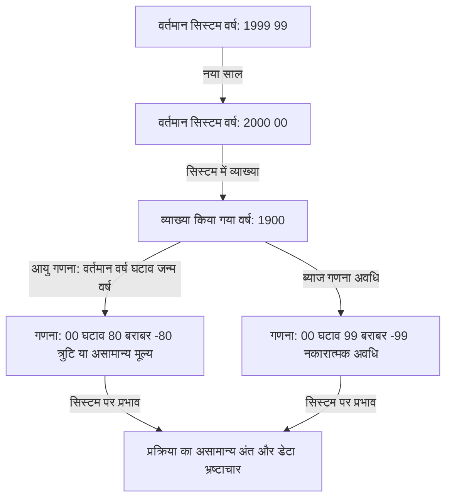
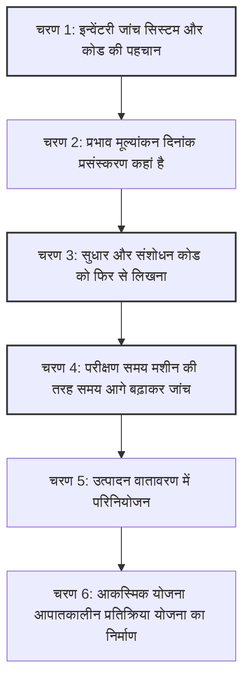

## प्रस्तावना: डिजिटल टाइम बम जिसका मानवता ने सामना किया

31 दिसंबर 1999 को, जब दुनिया नए सहस्राब्दी का जश्न मनाने की तैयारी कर रही थी, कुछ लोग बिल्कुल अलग कारण से अपनी सांसें रोके हुए थे। शैंपेन के गिलास के बजाय, उन्होंने कॉफी के कप और कीबोर्ड पकड़े हुए थे, उस क्षण की प्रतीक्षा कर रहे थे जब उनके मॉनिटर पर घड़ी की सुइयां "00:00:00" पर टिकेंगी।

वह "Y2K वर्ष 2000 समस्या" के खिलाफ लड़ाई का चरम बिंदु था - जिसे "मिलेनियम बग" भी कहा जाता है।

उस समय, मीडिया हर दिन बड़े पैमाने पर रिपोर्ट कर रहा था कि "विमान दुर्घटनाग्रस्त हो जाएंगे", "परमाणु ऊर्जा संयंत्र नियंत्रण से बाहर हो जाएंगे", "बैंक खातों का बैलेंस शून्य हो जाएगा" और "बुनियादी ढांचा पूरी तरह से बंद हो जाएगा", जिससे वैश्विक दहशत फैल गई। हालांकि, जब 1 जनवरी, 2000 आया, तो हमारे जीवन को घातक रूप से प्रभावित करने वाली कोई बड़े पैमाने की विफलता नहीं हुई।

इस परिणाम के आधार पर, बाद के वर्षों में कुछ लोगों ने कहा कि "Y2K समस्या मीडिया द्वारा बनाया गया एक भ्रम था" या "यह आईटी उद्योग का एक बहुत बड़ा धोखा था"। हालाँकि, यह एक बहुत बड़ी गलतफहमी है। दुनिया इसलिए नहीं बची क्योंकि कोई चमत्कार हुआ था। यह "अनाम प्रोग्रामर्स" के अथक प्रयासों के कारण था, जिन्होंने कई वर्षों तक लाखों लाइनों वाले पुराने लेगेसी कोड से जूझते हुए सचमुच पूरी दुनिया के सिस्टम को फिर से लिखा।

इस लेख में, हम इस बात पर बहुत विस्तार से चर्चा करेंगे कि Y2K समस्या क्यों उत्पन्न हुई, इसकी ऐतिहासिक पृष्ठभूमि से लेकर वैश्विक स्तर पर चलाए गए अभूतपूर्व डिबगिंग प्रोजेक्ट की पूरी तस्वीर, और आधुनिक इंजीनियरिंग के लिए छोड़े गए सबक।

## अध्याय 1: Y2K समस्या क्यों पैदा हुई?

Y2K समस्या को संक्षेप में समझाने के लिए, यह "तारीख को दर्शाने के लिए वर्ष के केवल अंतिम दो अंकों का उपयोग करने के कारण उत्पन्न सिस्टम बग" था। उदाहरण के लिए, 1998 को "98" और 1999 को "99" के रूप में प्रोसेस किया जाता है। हालाँकि, वर्ष 2000, "00" बन जाता है।

यदि सिस्टम ने "00" की व्याख्या "2000" के बजाय "1900" के रूप में की, तो निम्नलिखित जैसी गणना संबंधी असामान्यताएं उत्पन्न होतीं:

उस समय के प्रोग्रामर्स ने वर्षों को चार के बजाय दो अंकों के साथ क्यों रिकॉर्ड किया? ऐसा इसलिए नहीं था क्योंकि वे आलसी थे या उनमें दूरदर्शिता की कमी थी। उस समय गंभीर "हार्डवेयर बाधाएं" थीं।

### वह युग जब मेमोरी महंगी थी

1960 और 70 के दशक में, कंप्यूटर की मेमोरी और स्टोरेज क्षमता इतने महंगे और दुर्लभ संसाधन थे जिसकी आज हम कल्पना भी नहीं कर सकते।

प्रारंभिक मेनफ्रेम कंप्यूटर में, डेटा को पंच कार्डों के साथ प्रबंधित किया जाता था। एक पंच कार्ड पर केवल 80 अंक या अक्षर ही रिकॉर्ड किए जा सकते थे। इस सीमित स्थान में, नाम, पते, खाता संख्या और लेनदेन की राशि जैसे हर तरह के डेटा को शामिल किया जाना था।

ऐसी परिस्थितियों में, दिनांक डेटा के पहले दो अंकों "19" को हटाना एक अत्यंत तर्कसंगत और आवश्यक विकल्प था। लाखों रिकॉर्ड संग्रहीत करने वाले डेटाबेस में, प्रति रिकॉर्ड केवल 2 बाइट्स की बचत भी कुल मिलाकर भारी लागत में कमी लाती थी।

उस समय के प्रोग्रामर्स को भी इस बात का हल्का सा अंदाजा था कि "जब वर्ष 2000 आएगा, तो यह एक समस्या बन सकता है।" हालाँकि, उन्होंने सोचा: "यह सिस्टम 2000 तक उपयोग में नहीं रहेगा। तब तक, इसे एक नए सिस्टम से बदल दिया जाएगा।"

लेकिन यह भविष्यवाणी गलत साबित हुई। COBOL और अन्य भाषाओं में उनके द्वारा बनाए गए मजबूत सिस्टम वित्तीय संस्थानों, बीमा कंपनियों और सरकारी एजेंसियों के मुख्य सिस्टम के रूप में 30 से अधिक वर्षों तक चलते रहे।

## अध्याय 2: संभावित संकट का पैमाना

1990 के दशक के मध्य में, जैसे-जैसे वर्ष 2000 करीब आ रहा था, आईटी उद्योग में कुछ लोगों ने अलार्म बजाना शुरू कर दिया। शुरुआत में, उन्हें अल्पसंख्यक की राय के रूप में नजरअंदाज कर दिया गया था, लेकिन जैसे-जैसे जांच आगे बढ़ी, इसके प्रभाव का असाधारण रूप से व्यापक दायरा स्पष्ट हो गया।

### प्रभाव का व्यापक दायरा

1. **वित्तीय संस्थान**: असामान्य ब्याज गणना के कारण खाता शेष का गायब होना, या नकारात्मक शेष राशि में जाना। परिपक्वता तिथियों की गलत गणना।
2. **परिवहन और विमानन**: हवाई यातायात नियंत्रण प्रणालियों के बंद होने के कारण उड़ान का बड़े पैमाने पर निलंबन। आरक्षण प्रणाली का पतन।
3. **बुनियादी ढांचा और बिजली**: पावर प्लांट नियंत्रण प्रणालियों विशेष रूप से एम्बेडेड सिस्टम की खराबी के कारण बड़े पैमाने पर ब्लैकआउट।
4. **चिकित्सा**: चिकित्सा उपकरणों की खराबी के कारण मरीजों को खतरा। दवाओं की समाप्ति तिथियों का गलत मूल्यांकन।
5. **सैन्य और रक्षा**: प्रारंभिक चेतावनी प्रणाली की खराबी और संचार प्रणालियों का ठप होना।

सबसे ज्यादा डर "एम्बेडेड सिस्टम" में Y2K बग से था। लिफ्ट, फैक्ट्री प्रोडक्शन लाइन और पेसमेकर जैसे माइक्रोचिप वाले किसी भी उपकरण में डेट चेक लॉजिक छिपा हो सकता है। इन्हें सॉफ़्टवेयर अपडेट की तरह आसानी से ठीक नहीं किया जा सकता था, और कुछ मामलों में, स्वयं चिप को बदलने की आवश्यकता थी।

### सप्लाई चेन का चेन कोलैप्स

जिस चीज ने समस्या को और जटिल बना दिया, वह थी वैश्वीकृत अर्थव्यवस्था में परस्पर निर्भरता। यहां तक कि अगर किसी कंपनी ने अपने सिस्टम को पूरी तरह से ठीक कर लिया, तो भी अगर उसके व्यापारिक भागीदारों के सिस्टम विफल हो जाते, तो पुर्जों की खरीद और भुगतान रुक जाते, जिससे व्यवसाय श्रृंखला प्रतिक्रिया में बंद हो जाता। यह एक "प्रणालीगत जोखिम" था और एक ऐसी समस्या थी जिसे कोई भी देश या कंपनी अकेले हल नहीं कर सकती थी।

## अध्याय 3: अभूतपूर्व डिबगिंग ऑपरेशन

1990 के दशक के अंत में, दुनिया भर की सरकारों और कंपनियों ने अंततः कमर कस ली। इस प्रकार मानव इतिहास की सबसे बड़ी सॉफ्टवेयर संशोधन परियोजना शुरू हुई।

### सेवानिवृत्त प्रोग्रामरों का बुलावा

Y2K समस्या के केंद्र में दशकों पहले COBOL, Fortran और असेंबली भाषा में लिखा गया कोड था। उस समय, आईटी उद्योग की मुख्यधारा पहले से ही C, C++ और Java की ओर मुड़ रही थी, और सक्रिय इंजीनियरों की संख्या घट रही थी जो इन पुरानी भाषाओं को पढ़ और लिख सकते थे।

इसलिए, कंपनियों ने अनुभवी प्रोग्रामर्स को वापस बुलाया जो पहले ही सेवानिवृत्त हो चुके थे और पेंशन पर जी रहे थे, और उन्हें असाधारण वेतन की पेशकश की। केवल "COBOL लिख सकने" के लिए, सामान्य से कई गुना अधिक दरों पर काम मिलने लगा, जिससे "COBOL बबल" आ गया।

उनका काम लाखों लाइनों वाले उलझे हुए सोर्स कोड में उन चरों वेरिएबल्स को खोजना और सही करना था जो तारीखों को संभाल रहे थे।

### एक थकाऊ कार्य प्रक्रिया

Y2K प्रोजेक्ट को डिबग करना कोई ऐसी चीज नहीं जिसमें आकर्षक हैकिंग या नवीनतम तकनीक का उपयोग किया गया हो। यह लगातार चलने वाले उबाऊ और श्रमसाध्य कार्यों की एक श्रृंखला थी।

1. **कोड खोजना**: जब स्रोत कोड में सुसंगत नामकरण परंपराएं नहीं थीं, तो "DATE", "YY", और "YEAR" जैसे वेरिएबल नामों के साथ-साथ उन चरों को मैन्युअल रूप से खोजना आवश्यक था जिनका उपयोग अप्रत्यक्ष रूप से तिथियों के रूप में किया जाता था।
2. **परीक्षण में कठिनाई**: "वर्ष 2000 समस्या" का परीक्षण करने के लिए, सिस्टम की घड़ी को वास्तव में आगे बढ़ाना टाइम ट्रैवल आवश्यक था। हालाँकि, वे उत्पादन वातावरण की घड़ी को आगे नहीं बढ़ा सकते थे, इसलिए उन्हें एक पूरी तरह से पृथक परीक्षण वातावरण बनाना पड़ा और अन्य प्रणालियों इंटरफेस के साथ एकीकरण सहित इसका सत्यापन करना पड़ा।

### विशिष्ट डिबगिंग विधियाँ

प्रोग्रामरों को एहसास हुआ कि उनके पास सभी कोड को 4-अंकीय वर्षों फ़ील्ड विस्तार में फिर से लिखने के लिए समय या बजट नहीं था। इसलिए, "विंडोइंग" नामक एक विधि को व्यापक रूप से अपनाया गया।

**विंडोइंग कैसे काम करता है:**
सिस्टम का एक आधार वर्ष पिवट वर्ष निर्धारित किया जाता है, और संदर्भ के आधार पर 2-अंकीय वर्ष की व्याख्या की जाती है।
उदाहरण के लिए, यदि पिवट वर्ष "50" है:
- "50" से "99" की व्याख्या 1900 के दशक 1950 से 1999 के रूप में की जाती है।
- "00" से "49" की व्याख्या 2000 के दशक 2000 से 2049 के रूप में की जाती है।

कोड में इस तर्क की केवल कुछ पंक्तियाँ जोड़कर, वे 2-अंकीय वर्ष वाले डेटाबेस संरचना को बदले बिना सिस्टम के जीवन को 2049 तक बढ़ा सकते थे। यह एक सही समाधान नहीं था बल्कि तकनीकी ऋण का स्थगन था, लेकिन सीमित समय में यह सबसे यथार्थवादी और प्रभावी हैक था।

## अध्याय 4: मिलेनियम का क्षण और सत्य कि "कुछ नहीं हुआ"

और इस प्रकार भाग्यपूर्ण 31 दिसंबर, 1999 आ गया। दुनिया भर के आईटी विभागों ने कर्मचारियों को होटलों में रखा, भारी मात्रा में पिज्जा और कॉफी तैयार की, और अपने "प्रतिक्रिया मुख्यालय" में मॉनिटर को घूर रहे थे।

अंतरराष्ट्रीय तिथि रेखा के सबसे करीब के देश, जैसे न्यूजीलैंड और ऑस्ट्रेलिया, धीरे-धीरे वर्ष 2000 का स्वागत करने वाले पहले देश थे।

"सिडनी, कोई असामान्यता नहीं"
"टोक्यो, कोई असामान्यता नहीं"
"लंदन, कोई असामान्यता नहीं"
"न्यूयॉर्क, कोई असामान्यता नहीं"

दुनिया भर में रिले की तरह, 2000 की लहर दुनिया भर में घूमी। हालांकि मामूली समस्याएं उत्पन्न हुईं, जैसे कि कुछ वेबसाइटों पर दिनांक "19100" के रूप में प्रदर्शित होना या स्थानीय प्रणालियों में छोटे पैमाने पर विफलताएं, बुनियादी ढांचे का पतन, विमान दुर्घटनाएं, और वित्तीय प्रणाली के ठहराव जैसी बड़े पैमाने की आपदाएं जिनका डर था, कभी नहीं हुईं।

1 जनवरी की सुबह, दुनिया कल की ही तरह एक सुबह उठी।

### "कुछ क्यों नहीं हुआ?"

मीडिया ने रिपोर्ट दी कि "यह बहुत ज्यादा हंगामा था" और "Y2K एक भ्रम था।" आम जनता ने भी इसे ठंडी नजरों से देखते हुए कहा, "अंत में, कंप्यूटर कंपनियों ने केवल पैसा कमाया।"

हालाँकि, सच्चाई इसके बिल्कुल विपरीत है। **ऐसा नहीं है कि "कुछ नहीं हुआ", बल्कि "उन्होंने ऐसा किया कि कुछ न हो।"**

यह 300 बिलियन डॉलर से लेकर 600 बिलियन डॉलर तक के विशाल फंड के वैश्विक निवेश और लाखों इंजीनियरों द्वारा कई वर्षों तक ओवरटाइम काम करने, सिस्टम को पूरी तरह से संशोधित करने और बार-बार परीक्षण करने का परिणाम था - यही वह "शांति" थी।

यदि उन्होंने कुछ नहीं किया होता, तो निश्चित रूप से हर जगह सिस्टम में श्रृंखला विफलताएं होतीं, जिससे भारी आर्थिक क्षति और सामाजिक अराजकता पैदा होती; परीक्षण के वातावरण में अनगिनत क्रैश ने इसे साबित कर दिया था। आईटी इंजीनियर "अदृश्य नायक" थे जिन्होंने चुपचाप दुनिया को बचाया।

## अध्याय 5: आज के लिए सबक और अगला टाइम बम

Y2K समस्या अतीत का कोई मजाक नहीं है। इसने सॉफ्टवेयर इंजीनियरिंग में कई भारी सबक छोड़े हैं जो आज भी लागू होते हैं।

### 1. तकनीकी ऋण का आतंक
अल्पकालिक अनुकूलन या समझौता यह कहना कि "अभी के लिए, यह काम करेगा" या "भविष्य में सिस्टम का नवीनीकरण हो जाएगा" दशकों बाद राष्ट्रीय बजट स्तर की मरम्मत लागत की मांग करते हुए एक विशाल "तकनीकी ऋण" में बढ़ने का एक भयानक खतरा है।

### 2. सिस्टम परस्पर निर्भरता और ब्लैक बॉक्स
आधुनिक सिस्टम Y2K युग की तुलना में और भी अधिक जटिल रूप से जुड़े हुए हैं। हम उन बाहरी प्रणालियों पर निर्भर हैं जिन्हें हम नियंत्रित नहीं कर सकते, जैसे क्लाउड सेवाएं, एपीआई और ओपन-सोर्स लाइब्रेरी। यदि उस मूल तर्क में कोई घातक बग पाया जाता है जिस पर दुनिया भर के सिस्टम निर्भर करते हैं, तो प्रभाव की पहचान करना और उसे ठीक करना Y2K से भी अधिक कठिन हो सकता है।

### 3. अगला संकट: वर्ष 2038 की समस्या
वास्तव में, इंजीनियरों के बीच अगले टाइम बम की उलटी गिनती पहले ही शुरू हो चुकी है। वह है "वर्ष 2038 की समस्या" Y2K38।

कई UNIX-आधारित प्रणालियों में, समय को "1 जनवरी 1970 00:00:00 UTC" के बाद से बीते सेकंड की संख्या के रूप में 32-बिट हस्ताक्षरित पूर्णांक के रूप में प्रबंधित किया जाता है। इस 32-बिट पूर्णांक का अधिकतम मूल्य "2,147,483,647", और सेकंड की यह संख्या **19 जनवरी, 2038 को 03:14:07 UTC** पर पहुँच जाएगी।

एक बार जब यह क्षण बीत जाता है, तो मूल्य अतिप्रवाह ओवरफ़्लो होगा और इसे एक नकारात्मक संख्या के रूप में समझा जाएगा 1901 पर वापस आना। 32-बिट सिस्टम और एम्बेडेड डिवाइस पुराने राउटर, कार नेविगेशन सिस्टम, IoT डिवाइस आदि जो वर्तमान में काम कर रहे हैं, उनमें गंभीर खराबी हो सकती है।

बेशक, कई आधुनिक ओएस और डेटाबेस पहले ही 64-बिट में बदल चुके हैं, और इस समस्या के समाधान के लिए उपाय किए जा रहे हैं। हालाँकि, कोई नहीं जानता कि दुनिया भर में कितने "पुराने डिवाइस बिना अपडेट किए छोड़ दिए गए हैं" बिखरे हुए हैं।

## निष्कर्ष: उन लोगों के लिए जो अदृश्य बुनियादी ढांचे का समर्थन करते हैं

हम स्मार्टफोन से भुगतान कर सकते हैं, उड़ानों में चढ़ सकते हैं, और हर दिन स्वाभाविक रूप से बिजली का उपयोग कर सकते हैं, इसका कारण यह है कि पर्दे के पीछे बड़ी संख्या में इंजीनियर लगातार सिस्टम का रखरखाव और डिबगिंग कर रहे हैं ताकि यह सुनिश्चित हो सके कि वे टूट न जाएं।

Y2K समस्या में इंजीनियरों की लड़ाई बेहद कठोर और असंतोषजनक प्रकृति की थी: "यदि आप सफल होते हैं, तो किसी का ध्यान नहीं जाएगा या वे कहेंगे कि यह बेकार था, और यदि आप विफल होते हैं, तो आपको दुनिया के अंत में भागीदार होने का दोषी ठहराया जाएगा।"

फिर भी, उन्होंने यह कर दिखाया।

अगली बार जब आप खबर सुनें कि "एक बड़ी आईटी सिस्टम विफलता को रोक दिया गया था," तो सोचें कि पर्दे के पीछे कितना पसीना और नींद हराम हुई होगी। Y2K समस्या के इतिहास पर नजर डालते हुए, हम इन "अदृश्य पेशेवरों" के महान काम को फिर से श्रद्धांजलि दिए बिना नहीं रह सकते।
