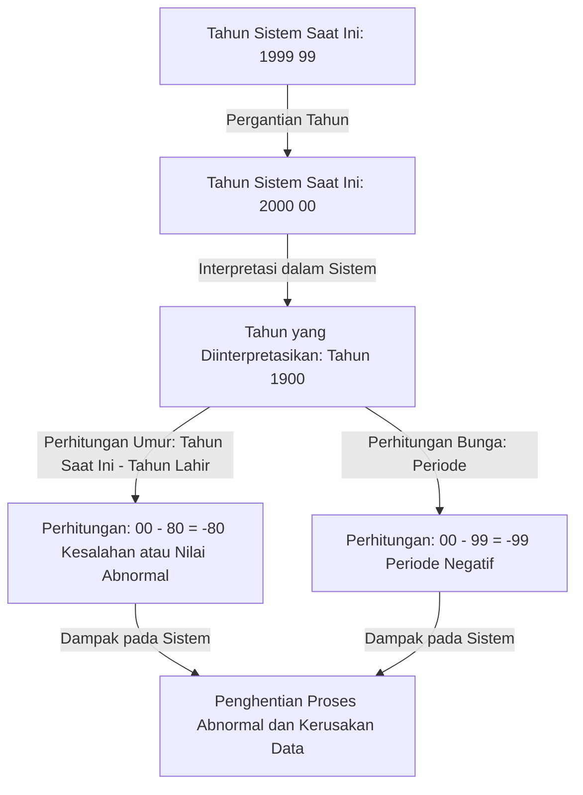
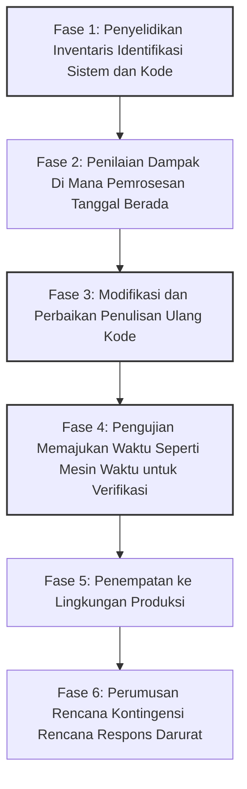

## Pengantar: Bom Waktu Digital yang Dihadapi Umat Manusia

Pada 31 Desember 1999, saat seluruh dunia bersiap merayakan kedatangan milenium baru, beberapa orang menahan napas karena alasan yang sama sekali berbeda. Alih-alih memegang gelas sampanye, mereka menggenggam cangkir kopi dan keyboard, menunggu saat jarum jam di monitor mereka menunjuk ke "00:00:00".

Itulah klimaks dari pertempuran melawan "Masalah Y2K" (Year 2000)——yang biasa disebut "Masalah Tahun 2000".

Pada saat itu, media setiap hari secara besar-besaran melaporkan bahwa "pesawat akan jatuh", "pembangkit listrik tenaga nuklir akan kehilangan kendali", "saldo rekening bank akan menjadi nol", dan "infrastruktur akan berhenti total", memicu kepanikan global. Namun, saat 1 Januari 2000 tiba, tidak ada kegagalan skala besar yang berakibat fatal pada kehidupan kita.

Melihat hasil ini, beberapa orang di tahun-tahun berikutnya berkata, "Masalah Y2K hanyalah ilusi yang diciptakan media" atau "Itu adalah penipuan besar-besaran di industri TI." Namun, itu adalah kesalahpahaman besar. Dunia tidak runtuh bukan karena keajaiban. Itu karena upaya berdarah-darah dari "programmer tanpa nama" yang selama bertahun-tahun berjuang melawan jutaan baris kode warisan dan secara harfiah menulis ulang sistem di seluruh dunia.

Dalam artikel ini, kami akan menjelaskan secara rinci mengapa Masalah Y2K terjadi, dari latar belakang historisnya, gambaran lengkap dari proyek debugging yang belum pernah terjadi sebelumnya dalam skala global, hingga pelajaran yang ditinggalkan untuk rekayasa modern.

## Bab 1: Mengapa Masalah Y2K Muncul?

Singkatnya, Masalah Y2K adalah "bug sistem yang disebabkan karena hanya menggunakan dua digit terakhir dari tahun kalender saat merepresentasikan tanggal." Misalnya, tahun 1998 diproses sebagai "98", dan 1999 sebagai "99". Namun, tahun 2000 menjadi "00".

Jika sistem menafsirkan "00" sebagai "1900" alih-alih "2000", anomali perhitungan berikut akan terjadi.

Mengapa programmer pada masa itu mencatat tahun dengan dua digit alih-alih empat digit? Itu sama sekali bukan karena mereka malas atau kurang pandangan ke depan. Ada "keterbatasan perangkat keras" yang parah pada saat itu.

### Era Ketika Memori Sangat Mahal

Dari tahun 1960-an hingga 1970-an, kapasitas penyimpanan komputer (memori dan penyimpanan) adalah sumber daya yang sangat mahal dan berharga, sesuatu yang sulit dibayangkan saat ini.

Pada komputer mainframe awal, data dikelola dengan kartu plong (punch card). Satu kartu plong hanya bisa menyimpan 80 digit (80 karakter). Dalam ruang terbatas ini, segala macam data seperti nama, alamat, nomor rekening, dan jumlah transaksi harus dimasukkan.

Dalam situasi seperti itu, menghilangkan dua digit pertama "19" dari data tanggal adalah pilihan yang sangat logis dan penting. Dalam basis data yang menyimpan jutaan catatan, penghematan hanya dua byte (dua karakter) bisa menghasilkan pengurangan biaya yang sangat besar secara keseluruhan.

Para programmer saat itu diam-diam menyadari bahwa "pada akhirnya, ketika tahun 2000 tiba, ini mungkin akan menjadi masalah." Namun, mereka berpikir, "Sistem ini tidak mungkin terus digunakan sampai tahun 2000. Saat itu, sistem pasti sudah diganti dengan yang baru."

Namun, prediksi itu meleset. Sistem kuat yang mereka bangun dengan bahasa seperti COBOL terus beroperasi sebagai sistem inti untuk keuangan, asuransi, lembaga pemerintah, dan lainnya selama lebih dari 30 tahun.

## Bab 2: Skala Krisis yang Mengintai

Pada pertengahan 1990-an, saat tahun 2000 semakin dekat, peringatan mulai berbunyi dari sebagian industri TI. Awalnya diabaikan sebagai pendapat minoritas, tetapi seiring dengan berjalannya penyelidikan, luasnya dampak masalah ini menjadi jelas.

### Ruang Lingkup Dampak yang Luas

1. **Lembaga Keuangan**: Hilangnya saldo rekening karena anomali perhitungan bunga, atau saldo menjadi negatif. Kesalahan perhitungan tanggal jatuh tempo.
2. **Transportasi dan Penerbangan**: Penangguhan penerbangan besar-besaran karena matinya sistem kontrol lalu lintas udara. Keruntuhan sistem reservasi.
3. **Infrastruktur dan Tenaga Listrik**: Pemadaman listrik skala besar karena kerusakan sistem kontrol pembangkit listrik (terutama sistem tertanam).
4. **Medis**: Bahaya bagi pasien karena tidak berfungsinya peralatan medis. Penilaian tanggal kedaluwarsa obat yang salah.
5. **Militer dan Pertahanan**: Malfungsi sistem peringatan dini dan rusaknya sistem komunikasi.

Yang paling ditakuti adalah Bug Y2K pada "Sistem Tertanam" (Embedded Systems). Lift, jalur produksi pabrik, alat pacu jantung, dan perangkat lain yang menyertakan microchip berpotensi memiliki logika penentuan tanggal yang tersembunyi. Hal-hal ini tidak bisa diperbaiki dengan mudah seperti pembaruan perangkat lunak; dalam beberapa kasus, chip itu sendiri harus diganti.

### Runtuhnya Rantai Pasokan Secara Berantai

Yang membuat masalah ini lebih rumit adalah saling ketergantungan dalam ekonomi yang mengglobal. Bahkan jika sebuah perusahaan memperbaiki sistemnya dengan sempurna, jika sistem mitra bisnisnya rusak, pengadaan suku cadang dan pembayaran akan terhenti, yang mengarah pada penghentian bisnis berantai. Ini adalah "risiko sistemik" yang tidak bisa diselesaikan oleh satu negara atau satu perusahaan saja.

## Bab 3: Proyek Debugging Besar-besaran yang Belum Pernah Terjadi Sebelumnya

Pada akhir 1990-an, pemerintah dan perusahaan di seluruh dunia akhirnya mulai bertindak. Di sinilah proyek modifikasi perangkat lunak terbesar dalam sejarah manusia dimulai.

### Panggilan Bertugas bagi Programmer Pensiunan

Inti dari Masalah Y2K adalah baris kode COBOL, Fortran, dan bahasa rakitan yang ditulis puluhan tahun lalu. Pada saat itu, arus utama industri TI sudah bergeser ke bahasa C, C++, Java, dan jumlah insinyur aktif yang bisa membaca dan menulis bahasa lama ini terus berkurang.

Oleh karena itu, perusahaan memanggil kembali programmer veteran yang sudah pensiun dengan bayaran yang sangat besar. Hanya dengan bisa menulis "COBOL", pekerjaan datang dengan tarif beberapa kali lipat dari biasanya, membawa apa yang bisa disebut gelembung COBOL.

Pekerjaan mereka adalah mencari variabel yang menangani tanggal dari puluhan juta baris kode sumber yang kusut seperti spageti, dan memperbaikinya.

### Proses Kerja yang Memusingkan

Debugging proyek Y2K bukanlah tentang peretasan yang mencolok atau menggunakan teknologi mutakhir. Itu adalah rangkaian tugas kotor yang sangat panjang dan membosankan.

1. **Pencarian Kode**: Tanpa konvensi penamaan yang konsisten dalam kode sumber, mereka harus secara manual mencari tidak hanya nama variabel seperti "DATE", "YY", "YEAR", tetapi juga variabel yang secara implisit digunakan sebagai tanggal.
2. **Kesulitan Pengujian**: Untuk menguji "Masalah 2000", jam sistem harus benar-benar dimajukan (perjalanan waktu). Namun, karena jam di lingkungan produksi tidak dapat dimajukan, lingkungan pengujian yang benar-benar terisolasi harus dibangun, dan verifikasi harus mencakup integrasi (antarmuka) dengan sistem lain.

### Teknik Debugging Spesifik

Para programmer menyadari bahwa tidak ada waktu dan anggaran untuk menulis ulang semua kode menjadi angka tahun 4 digit (ekspansi bidang). Oleh karena itu, metode yang disebut "Windowing" diadopsi secara luas.

**Mekanisme Windowing:**
Tahun referensi (tahun pivot) ditetapkan untuk sistem, dan tahun 2 digit ditafsirkan sesuai dengan konteksnya.
Misalnya, jika tahun pivot ditetapkan ke "50":
- "50" hingga "99" ditafsirkan sebagai tahun 1900-an (1950-1999).
- "00" hingga "49" ditafsirkan sebagai tahun 2000-an (2000-2049).

Hanya dengan menambahkan beberapa baris logika ini ke dalam kode, umur sistem dapat diperpanjang hingga tahun 2049 tanpa mengubah struktur basis data (tahun 2 digit). Ini bukan solusi yang sempurna tetapi "penundaan hutang teknis", yang pada saat itu merupakan trik (peretasan) yang paling realistis dan efektif dalam waktu yang terbatas.

## Bab 4: Momen Milenium dan Kebenaran "Tidak Terjadi Apa-apa"

Lalu tibalah tanggal yang ditakdirkan, 31 Desember 1999. Departemen TI di seluruh dunia menyiagakan karyawan di hotel, menyiapkan banyak pizza dan kopi, dan menatap layar di "Markas Besar Penanggulangan".

Tahun 2000 secara bertahap tiba dari negara-negara yang paling dekat dengan Garis Tanggal Internasional, seperti Selandia Baru dan Australia.

"Sydney, tidak ada anomali."
"Tokyo, tidak ada anomali."
"London, tidak ada anomali."
"New York, tidak ada anomali."

Gelombang tahun 2000 mengelilingi bumi seperti estafet. Meskipun ada masalah kecil (seperti beberapa situs web menampilkan tanggal "19100", atau gangguan kecil pada sistem lokal), tidak pernah terjadi pemadaman infrastruktur skala besar, kecelakaan pesawat, atau runtuhnya sistem keuangan seperti yang ditakuti.

Ketika matahari terbit pada 1 Januari, dunia menyambut pagi yang sama seperti hari sebelumnya.

### Mengapa "Tidak Terjadi Apa-apa"?

Media melaporkan bahwa itu adalah "terlalu dibesar-besarkan" dan "Y2K adalah ilusi." Publik juga memandang dingin, mengatakan, "Pada akhirnya, hanya perusahaan komputer yang meraup untung."

Namun, kebenarannya justru sebaliknya. **Bukan "tidak terjadi apa-apa", melainkan "mereka memastikan tidak ada yang terjadi."**

Ini adalah "kedamaian" yang dihasilkan oleh investasi besar yang diperkirakan mencapai 300 miliar hingga 600 miliar dolar di seluruh dunia, di mana jutaan insinyur bekerja lembur dan pada hari libur selama beberapa tahun untuk secara menyeluruh memperbaiki sistem dan mengulangi pengujian.

Jika mereka tidak melakukan apa-apa, kerusakan sistem pasti akan terjadi di mana-mana, dan banyak crash di lingkungan pengujian membuktikan bahwa kerusakan ekonomi dan kekacauan sosial yang parah akan terjadi. Insinyur TI diam-diam adalah "pahlawan tak terlihat" yang menyelamatkan dunia.

## Bab 5: Pelajaran untuk Masa Kini dan Bom Waktu Berikutnya

Masalah Y2K bukanlah lelucon masa lalu. Dalam rekayasa perangkat lunak, masalah ini meninggalkan banyak pelajaran berharga yang masih relevan hingga saat ini.

### 1. Kengerian Hutang Teknis
Optimalisasi (atau kompromi) jangka pendek seperti "ini akan berfungsi untuk saat ini" atau "sistem ini pasti akan diperbarui di masa depan" dapat berkembang menjadi "Hutang Teknis" (Technical Debt) yang mengerikan, membutuhkan biaya perbaikan seukuran anggaran negara beberapa dekade kemudian.

### 2. Saling Ketergantungan Sistem dan Kotak Hitam
Sistem saat ini lebih kompleks daripada era Y2K. Kita bergantung pada sistem eksternal yang tidak dapat kita kendalikan, seperti layanan cloud, API, dan perpustakaan sumber terbuka. Jika bug fatal ditemukan pada logika fundamental yang diandalkan oleh sistem di seluruh dunia, mengidentifikasi dan memperbaiki dampaknya mungkin lebih sulit daripada Y2K.

### 3. Krisis Berikutnya: "Masalah Tahun 2038"
Faktanya, di kalangan insinyur, hitung mundur untuk bom waktu berikutnya sudah dimulai. Itu adalah "Masalah 2038" (Y2K38).

Banyak sistem berbasis UNIX mengatur waktu sebagai "detik yang berlalu sejak 1 Januari 1970 00:00:00 UTC", menggunakan bilangan bulat bertanda 32-bit. Nilai maksimum bilangan bulat 32-bit ini adalah "2.147.483.647", dan jumlah detik ini akan tercapai pada **19 Januari 2038 03:14:07 (UTC)**.

Melewati momen ini, nilai akan meluap (overflow) dan ditafsirkan sebagai angka negatif (mundur ke tahun 1901). Kerusakan parah dapat terjadi pada sistem 32-bit dan perangkat tertanam (router lama, sistem navigasi mobil, perangkat IoT, dll.) yang saat ini beroperasi.

Tentu saja, sebagian besar OS dan basis data modern telah beralih ke 64-bit, dan langkah penanggulangan masalah ini sedang dilakukan. Namun, tidak ada yang tahu persis berapa banyak "perangkat lama yang dibiarkan tanpa pembaruan" tersebar di seluruh dunia.

## Kesimpulan: Untuk Mereka yang Mendukung Infrastruktur Tak Terlihat

Fakta bahwa kita dapat melakukan pembayaran dengan ponsel cerdas, naik pesawat, dan menggunakan listrik setiap hari seperti biasa adalah karena sejumlah besar insinyur terus memelihara dan mendebug di balik layar sehingga sistem tidak rusak.

Pertempuran para insinyur dalam masalah Y2K memiliki sifat yang sangat keras dan tidak berterima kasih: "Jika berhasil, tidak ada yang akan menyadarinya (atau mengatakan itu sia-sia), dan jika gagal, Anda akan dituduh berkontribusi pada akhir dunia."

Namun, mereka menyelesaikannya.

Di balik berita bahwa "kegagalan besar sistem TI telah dicegah", berapa banyak keringat dan malam tanpa tidur yang telah dihabiskan? Saat melihat kembali sejarah masalah Y2K, kita mau tidak mau harus memberikan rasa hormat baru pada pencapaian luar biasa dari para "profesional tak terlihat" tersebut.
