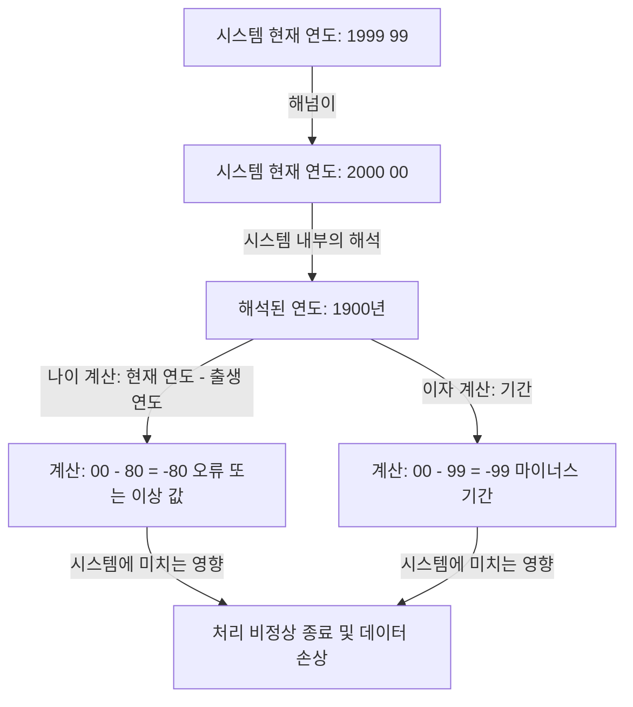
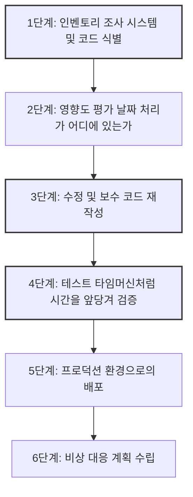

## 서장: 인류가 직면한 디지털 시한폭탄

1999년 12월 31일, 전 세계가 새로운 밀레니엄의 도래를 축하할 준비를 하는 가운데 일부 사람들은 전혀 다른 이유로 숨을 죽이고 있었습니다. 그들은 샴페인 잔 대신 커피잔과 키보드를 꽉 쥐고 모니터에 비친 시계 바늘이 "00:00:00"을 가리키는 순간을 기다리고 있었습니다.

그것이 바로 "Y2K(Year 2000) 문제"——통칭 "2000년 문제"와의 싸움의 절정이었습니다.

당시 언론은 연일 "비행기가 추락한다", "원자력 발전소가 폭주한다", "은행 계좌 잔고가 0이 된다", "인프라가 완전히 정지한다"라고 대대적으로 보도하며 전 세계적인 패닉을 일으켰습니다. 그러나 2000년 1월 1일이 되었을 때 우리의 삶에 치명적인 영향을 미치는 대규모 장애는 발생하지 않았습니다.

이러한 결과를 보고 후년에 "Y2K 문제는 언론이 만들어낸 환상이었다", "IT 업계의 거대한 사기극이었다"라고 말하는 사람들도 나타났습니다. 그러나 그것은 큰 오해입니다. 세계가 붕괴하지 않은 것은 기적이 일어났기 때문이 아닙니다. 수년에 걸쳐 수백만 줄의 레거시 코드와 사투를 벌이며 말 그대로 전 세계의 시스템을 다시 쓴 "이름 없는 프로그래머들"의 피나는 노력이 있었기 때문입니다.

이 기사에서는 Y2K 문제가 왜 발생했는지 그 역사적 배경부터 전 세계적인 규모로 진행된 전대미문의 디버깅 프로젝트의 전모, 그리고 현대 엔지니어링에 남겨진 교훈까지 매우 상세하게 설명하겠습니다.

## 제1장: 왜 Y2K 문제가 발생했을까?

Y2K 문제를 한마디로 설명하자면 "날짜를 표현할 때 연도의 마지막 두 자리만 사용했기 때문에 발생한 시스템상의 버그"입니다. 예를 들어 1998년은 "98"로, 1999년은 "99"로 처리됩니다. 하지만 2000년은 "00"이 됩니다.

시스템이 "00"을 "2000년"이 아니라 "1900년"으로 해석해 버릴 경우 다음과 같은 계산 이상이 발생합니다.

왜 당시 프로그래머들은 연도를 4자리가 아닌 2자리로 기록했을까요? 그것은 결코 그들이 게을러서도, 선견지명이 없어서도 아닙니다. 거기에는 당시의 심각한 "하드웨어 제약"이 있었습니다.

### 메모리가 비쌌던 시대

1960년대부터 70년대에 걸쳐 컴퓨터의 기억 용량(메모리나 스토리지)은 현대에서는 상상도 할 수 없을 정도로 비싸고 귀중한 자원이었습니다.

초기 메인프레임 컴퓨터에서는 데이터를 펀치 카드로 관리했습니다. 펀치 카드 한 장에는 80자리(80문자)밖에 기록할 수 없었습니다. 이 제한된 공간에 이름, 주소, 계좌 번호, 거래 금액 등 모든 데이터를 채워 넣어야 했습니다.

그러한 상황에서 날짜 데이터의 상위 2자리인 "19"를 생략하는 것은 극히 합리적이고 필수적인 선택이었습니다. 수백만 건의 레코드를 저장하는 데이터베이스에서 단 2바이트(2문자 분량)의 절약이라도 전체적으로는 엄청난 비용 절감으로 이어졌습니다.

당시 프로그래머들도 "언젠가 2000년이 오면 문제가 될지도 모른다"라고 어렴풋이 깨닫고 있었습니다. 그러나 그들은 이렇게 생각했습니다. "이 시스템이 2000년까지 계속 사용될 리가 없다. 그때쯤이면 새로운 시스템으로 교체되어 있을 것이다"라고.

하지만 그 예측은 빗나갔습니다. 그들이 COBOL 등으로 구축한 견고한 시스템은 금융, 보험, 정부 기관 등의 기간 시스템으로서 30년 이상 계속 가동되고 말았습니다.

## 제2장: 잠재된 위기의 규모

1990년대 중반이 되어 드디어 2000년이 다가오자, IT 업계 일각에서 경종을 울리기 시작했습니다. 처음에는 소수의 의견으로 무시당했지만 조사가 진행됨에 따라 그 영향 범위의 비정상적인 넓이가 밝혀지기 시작했습니다.

### 광범위한 영향 범위

1. **금융 기관**: 이자 계산 이상으로 인한 계좌 잔고 소실 또는 마이너스 잔고로의 진입. 만기일 오계산.
2. **교통 및 항공**: 항공 관제 시스템 다운으로 인한 대규모 운항 정지. 예약 시스템 붕괴.
3. **인프라 및 전력**: 발전소 제어 시스템(특히 임베디드 시스템) 오작동으로 인한 대규모 정전.
4. **의료**: 의료 기기 오작동으로 인한 환자에 대한 위험. 의약품 유효 기간 오판.
5. **군사 및 방위**: 조기 경보 시스템 오작동 및 통신 시스템 다운.

특히 두려웠던 것은 "임베디드 시스템(Embedded Systems)"의 Y2K 버그였습니다. 엘리베이터, 공장 생산 라인, 심박 조율기 등 마이크로칩이 내장된 모든 기기에 날짜 판정 로직이 숨어 있을 가능성이 있었습니다. 이것들은 소프트웨어 업데이트처럼 간단히 수정할 수 있는 것이 아니었으며 칩 자체를 교체해야 하는 경우도 있었습니다.

### 공급망의 연쇄 붕괴

문제를 더욱 복잡하게 만든 것은 글로벌화된 경제의 상호 의존성이었습니다. 자사의 시스템을 완벽하게 수정했다고 해도 거래처의 시스템이 다운되면 부품 조달이나 결제가 지연되어 연쇄적으로 비즈니스가 정지해 버립니다. 이는 "시스템적인 위험"이며 한 국가나 한 기업만으로는 해결할 수 없는 문제였습니다.

## 제3장: 전대미문의 디버깅 대작전

1990년대 후반, 마침내 전 세계 정부와 기업이 무거운 허리를 폈습니다. 여기서 인류 역사상 최대의 소프트웨어 수정 프로젝트가 막을 올렸습니다.

### 퇴역 프로그래머 소집장

Y2K 문제의 핵심을 담당하고 있던 것은 수십 년 전에 작성된 COBOL이나 Fortran, 어셈블리어 코드였습니다. 당시 이미 IT 업계의 주류는 C 언어나 C++, Java 등으로 이동하고 있었고 이러한 오래된 언어를 읽고 쓸 수 있는 현역 엔지니어는 감소하고 있었습니다.

그래서 기업들은 이미 은퇴하여 연금 생활을 하고 있던 베테랑 프로그래머들을 파격적인 보수로 불러들였습니다. "COBOL을 할 수 있다"는 것만으로 평소의 몇 배나 되는 단가로 일이 들어오는, 그야말로 COBOL 버블이 도래한 것입니다.

그들의 일은 스파게티처럼 얽힌 수천만 줄의 소스 코드 속에서 날짜를 다루고 있는 변수를 찾아내어 그것을 수정하는 것이었습니다.

### 아찔한 작업 프로세스

Y2K 프로젝트의 디버깅은 화려한 해킹이나 최신 기술을 구사한 것이 아닙니다. 그것은 지극히 끈질기고 진흙투성이인 작업의 연속이었습니다.

1. **코드 수색**: 소스 코드에 일관된 명명 규칙이 없는 경우 "DATE", "YY", "YEAR" 등의 변수명뿐만 아니라 암묵적으로 날짜로 사용되고 있는 변수를 수작업으로 찾아야 했습니다.
2. **테스트의 어려움**: "2000년 문제"를 테스트하기 위해서는 시스템의 시계를 실제로 앞당길(시간 여행을 시킬) 필요가 있었습니다. 그러나 프로덕션 환경의 시계를 앞당길 수는 없었기 때문에 완전히 격리된 테스트 환경을 구축하고 다른 시스템과의 연계(인터페이스)까지 포함하여 검증해야 했습니다.

### 구체적인 디버깅 기법

프로그래머들은 모든 코드를 4자리 연도로 다시 쓸(필드 확장) 시간도 예산도 없다는 것을 깨달았습니다. 그래서 "윈도윙(Windowing)"이라는 기법이 널리 채택되었습니다.

**윈도윙(Windowing)의 원리:**
시스템의 기준이 되는 연도(피벗 연도)를 설정하고 2자리 연도를 문맥에 따라 해석합니다.
예를 들어 피벗 연도를 "50"으로 설정한 경우:
- "50"~"99"는 1900년대(1950~1999)로 해석한다.
- "00"~"49"는 2000년대(2000~2049)로 해석한다.

이 로직을 코드에 몇 줄 추가하는 것만으로 데이터베이스 구조(2자리 연도)를 변경하지 않고도 2049년까지 시스템의 수명을 연장할 수 있었습니다. 이것은 완벽한 해결책이 아니라 "기술적 부채의 이연"이었지만 제한된 시간 내에서는 가장 현실적이고 효과적인 기법이었습니다.

## 제4장: 밀레니엄의 순간과 "아무 일도 없었던" 진실

그리고 운명의 1999년 12월 31일. 전 세계 IT 부서는 직원들을 호텔에 대기시키고 피자와 커피를 대량으로 준비하여 "대책 본부"에서 모니터를 응시하고 있었습니다.

뉴질랜드나 호주 등 날짜 변경선에 가장 가까운 국가부터 서서히 2000년을 맞이해 갑니다.

"시드니, 이상 없음."
"도쿄, 이상 없음."
"런던, 이상 없음."
"뉴욕, 이상 없음."

전 세계를 릴레이하듯 2000년의 물결이 지구를 한 바퀴 돌았습니다. 소규모 문제(일부 웹사이트에서 날짜가 "19100년"으로 표시되거나 지방 시스템에서 소규모 장애가 일어나는 등)는 발생했지만 두려워했던 대규모 인프라 붕괴나 항공기 사고, 금융 시스템의 정지는 단 한 번도 일어나지 않았습니다.

날이 밝은 1월 1일, 세상은 어제와 다름없는 아침을 맞이했습니다.

### 왜 "아무 일도 일어나지 않았을까"?

언론은 "너무 호들갑을 떨었다", "Y2K는 환상이었다"라고 보도했습니다. 일반 사람들도 "결국 컴퓨터 회사들만 돈을 번 것 아니냐"며 차가운 시선을 보냈습니다.

하지만 진실은 전혀 반대입니다. **"아무 일도 일어나지 않은 것"이 아니라 "아무 일도 일어나지 않게 한 것"입니다.**

전 세계적으로 약 3,000억 달러에서 6,000억 달러(당시 환율로 약 30조 원~60조 원)라는 거액의 자금이 투입되어 수백만 명의 엔지니어가 수년간 야근과 휴일 출근을 거듭하며 시스템을 철저히 수정하고 테스트를 반복한 결과인 "평온"이었습니다.

만약 그들이 아무것도 하지 않았다면 분명 곳곳의 시스템에서 연쇄적으로 장애가 발생하여 막대한 경제적 피해와 사회적 혼란이 일어났을 것임을 테스트 환경에서의 수많은 크래시가 증명하고 있었습니다. IT 엔지니어들은 조용히 세상을 구한 "보이지 않는 영웅"이었습니다.

## 제5장: 현대에 남기는 교훈과 다음 시한폭탄

Y2K 문제는 과거의 웃음거리가 아닙니다. 소프트웨어 엔지니어링에 있어서 현대에도 통하는 많은 무거운 교훈을 남겼습니다.

### 1. 기술적 부채의 무서움
"일단 지금은 이걸로 작동하니까", "장래에는 시스템이 새로워질 테니까"라는 눈앞의 최적화(혹은 타협)가 수십 년 후에 국가 예산 규모의 수정 비용을 요구하는 거대한 "기술적 부채(Technical Debt)"로 성장하는 무서움입니다.

### 2. 시스템의 상호 의존성과 블랙박스화
현대의 시스템은 Y2K 당시보다 더욱 복잡하게 얽혀 있습니다. 클라우드 서비스, API, 오픈 소스 라이브러리 등 스스로 통제할 수 없는 외부 시스템에 의존하고 있습니다. 만약 전 세계 시스템이 의존하고 있는 근간의 로직에서 치명적인 버그가 발견될 경우 그 영향을 특정하고 수정하는 것은 Y2K보다 더 어려울지도 모릅니다.

### 3. 다음 위기 "2038년 문제"
사실 엔지니어들 사이에서는 이미 다음 시한폭탄의 카운트다운이 시작되었습니다. 그것이 "2038년 문제(Y2K38)"입니다.

많은 UNIX 계열 시스템에서는 시간을 "1970년 1월 1일 00:00:00 UTC부터 경과한 초"로서 32비트 부호 있는 정수로 관리하고 있습니다. 이 32비트 정수의 최댓값은 "2,147,483,647"이며, 이 초 수에 도달하는 것은 **2038년 1월 19일 03:14:07(UTC)**입니다.

이 순간이 지나면 값이 오버플로(자릿수 넘침)를 일으켜 음수(1901년으로 되돌아감)로 해석되어 버립니다. 현재 가동 중인 32비트 시스템이나 임베디드 기기(오래된 라우터, 내비게이션, IoT 기기 등)에서 심각한 오작동이 일어날 가능성이 있습니다.

물론 현대의 OS나 데이터베이스의 대부분은 이미 64비트화되어 이 문제에 대한 대책이 진행되고 있습니다. 하지만 전 세계에 흩어져 있는 "업데이트되지 않은 채 방치되어 있는 오래된 기기"가 얼마나 존재하는지는 아무도 정확히 알지 못합니다.

## 맺음말: 보이지 않는 인프라를 지탱하는 사람들에게

우리가 매일 당연하다는 듯이 스마트폰으로 결제하고, 비행기를 타고, 전기를 사용할 수 있는 것은 그 이면에서 수많은 엔지니어들이 시스템이 파탄나지 않도록 끊임없이 유지보수와 디버깅을 계속하고 있기 때문입니다.

Y2K 문제에 있어서 엔지니어들의 싸움은 "성공하면 아무도 눈치채지 못하고(혹은 헛수고였다고 듣고), 실패하면 세상의 종말에 가담했다고 비난받는" 극히 가혹하고 보답받지 못하는 성질의 것이었습니다.

그럼에도 불구하고 그들은 해냈습니다.

다음번에 "IT 시스템의 큰 장애를 미연에 방지했다"는 뉴스의 이면에는 얼마나 많은 땀과 철야가 있었을까요. Y2K 문제의 역사를 되돌아볼 때, 우리는 그 "보이지 않는 프로페셔널들"의 위업에 새삼 경의를 표하지 않을 수 없습니다.
