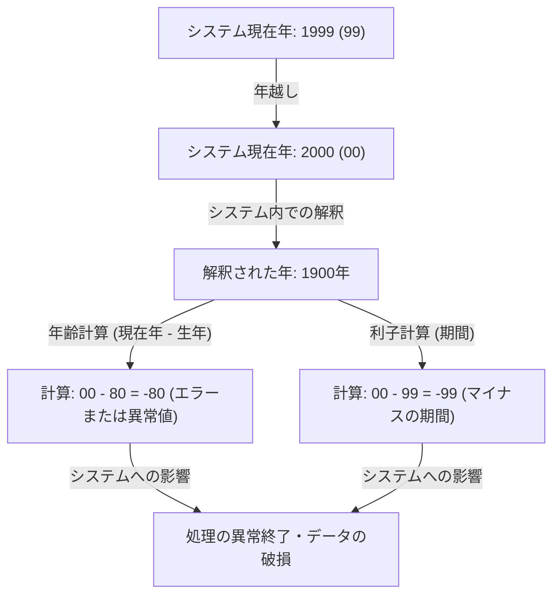
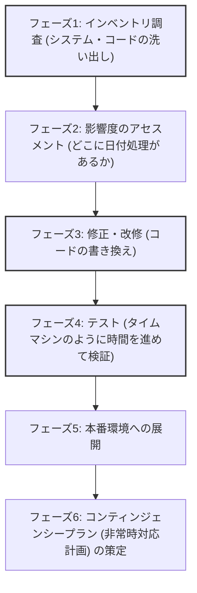

## 序章：人類が直面したデジタルな時限爆弾

1999年12月31日、世界中が新しいミレニアムの到来を祝う準備を進める中、一部の人々は全く異なる理由で息を潜めていました。彼らはシャンパングラスではなく、コーヒーカップとキーボードを握りしめ、モニターに映し出される時計の針が「00:00:00」を指す瞬間を待ち構えていました。

それが、「Y2K（Year 2000）問題」——通称「2000年問題」との戦いのクライマックスでした。

当時、メディアは連日のように「飛行機が墜落する」「原子力発電所が暴走する」「銀行の口座残高がゼロになる」「インフラが完全に停止する」と大々的に報じ、世界的なパニックを引き起こしました。しかし、2000年1月1日を迎えたとき、私たちの生活に致命的な影響を与えるような大規模な障害は発生しませんでした。

この結果を受けて、後年「Y2K問題はメディアが作り出した幻影だった」「IT業界の巨大な詐欺だった」と語る人々も現れました。しかし、それは大きな誤解です。世界が崩壊しなかったのは、奇跡が起きたからではありません。数年にわたり、数百万行に及ぶレガシーコードと格闘し、文字通り世界中のシステムを書き換えた「名もなきプログラマーたち」の血の滲むような努力があったからです。

本記事では、Y2K問題がなぜ発生したのか、その歴史的背景から、世界規模で行われた前代未聞のデバッグプロジェクトの全貌、そして現代のエンジニアリングに遺された教訓まで、非常に詳細に解説していきます。

## 第1章：なぜY2K問題は生まれたのか？

Y2K問題を一言で説明するなら、「日付を表現する際、西暦の下2桁のみを使用していたために引き起こされたシステム上のバグ」です。たとえば、1998年は「98」、1999年は「99」として処理されます。しかし、2000年は「00」となります。

システムが「00」を「2000年」ではなく「1900年」と解釈してしまった場合、以下のような計算異常が発生します。

なぜ、当時のプログラマーは西暦を4桁ではなく2桁で記録したのでしょうか？それは決して彼らが怠惰だったからでも、先見の明がなかったからでもありません。そこには、当時の深刻な「ハードウェアの制約」がありました。

### メモリが高価だった時代

1960年代から70年代にかけて、コンピュータの記憶容量（メモリやストレージ）は、現代からは想像もつかないほど高価で貴重なリソースでした。

初期のメインフレームコンピュータでは、データをパンチカードで管理していました。1枚のパンチカードには80桁（80文字）しか記録できませんでした。この限られたスペースに、名前、住所、口座番号、取引金額など、あらゆるデータを詰め込む必要がありました。

そのような状況下で、日付データの「19」という上位2桁を省略することは、極めて合理的かつ必須の選択でした。何百万件ものレコードを保存するデータベースにおいて、たった2バイト（2文字分）の節約であっても、全体では膨大なコスト削減につながったのです。

当時のプログラマーたちも、「いずれ2000年が来れば問題になるかもしれない」と薄々は気づいていました。しかし、彼らはこう考えていました。「このシステムが2000年まで使われ続けるはずがない。その頃には新しいシステムに置き換わっているだろう」と。

しかし、その予測は外れました。彼らが構築したCOBOLなどで書かれた堅牢なシステムは、金融、保険、政府機関などの基幹システムとして、30年以上も稼働し続けてしまったのです。

## 第2章：潜在する危機のスケール

1990年代半ばになり、いよいよ2000年が近づいてくると、IT業界の一部から警鐘が鳴らされ始めました。最初は少数派の意見として無視されていましたが、調査が進むにつれ、その影響範囲の異常な広さが明らかになってきました。

### 多岐にわたる影響範囲

1. **金融機関**: 利息計算の異常による口座残高の消失や、マイナス残高への突入。満期日の誤計算。
2. **交通・航空**: 航空管制システムのダウンによる大規模なフライト停止。予約システムの崩壊。
3. **インフラ・電力**: 発電所の制御システム（特に組み込みシステム）の誤動作による大規模停電。
4. **医療**: 医療機器の誤動作による患者への危険。医薬品の有効期限の誤判定。
5. **軍事・防衛**: 早期警戒システムの誤作動や、通信システムのダウン。

特に恐れられていたのが、「組み込みシステム（Embedded Systems）」におけるY2Kバグです。エレベーター、工場の生産ライン、ペースメーカーなど、マイクロチップが組み込まれたあらゆる機器に、日付判定のロジックが潜んでいる可能性がありました。これらはソフトウェアのアップデートのように簡単に修正できるものではなく、チップそのものを交換する必要があるケースもありました。

### 供給網（サプライチェーン）の連鎖崩壊

さらに問題を複雑にしたのが、グローバル化が進んだ経済における相互依存性です。自社のシステムを完璧に修正したとしても、取引先のシステムがダウンすれば、部品の調達や決済が滞り、連鎖的にビジネスが停止してしまいます。これは「システム的なリスク」であり、一国や一企業だけでは解決できない問題でした。

## 第3章：前代未聞のデバッグ大作戦

1990年代後半、ついに世界中の政府と企業が重い腰を上げました。ここに、人類史上最大のソフトウェア修正プロジェクトが幕を開けました。

### 退役プログラマーの召集令状

Y2K問題の中核を担っていたのは、何十年も前に書かれたCOBOLやFortran、アセンブリ言語のコードでした。当時、すでにIT業界の主流はC言語やC++、Javaなどに移行しつつあり、これらの古い言語を読み書きできる現役エンジニアは減少していました。

そこで企業は、すでにリタイアして年金生活を送っていたベテランプログラマーたちを、破格の報酬で呼び戻しました。「COBOLが書ける」というだけで、通常の何倍もの単価で仕事が舞い込む、まさにCOBOLバブルが到来したのです。

彼らの仕事は、スパゲティのように絡み合った数千万行ものソースコードの中から、日付を扱っている変数を探し出し、それを修正することでした。

### 気が遠くなるような作業プロセス

Y2Kプロジェクトのデバッグは、派手なハッキングや最新技術を駆使したものではありません。それは極めて地道で、泥臭い作業の連続でした。

1. **コードの捜索**: ソースコードに一貫した命名規則がない場合、「DATE」「YY」「YEAR」といった変数名だけでなく、暗黙的に日付として使われている変数を手作業で探す必要がありました。
2. **テストの困難さ**: 「2000年問題」のテストを行うためには、システムの時計を実際に進める（タイムトラベルさせる）必要がありました。しかし、本番環境の時計を進めるわけにはいかないため、完全に隔離されたテスト環境を構築し、他のシステムとの連携（インターフェース）も含めて検証しなければなりませんでした。

### デバッグの具体的な手法

プログラマーたちは、全てのコードを4桁年号に書き換える（フィールド拡張）時間も予算もないことに気づきました。そこで、「ウィンドウイング（Windowing）」という手法が広く採用されました。

**ウィンドウイング（Windowing）の仕組み：**
システムの基準となる年（ピボット年）を設定し、2桁の年号を文脈に応じて解釈します。
例えば、ピボット年を「50」とした場合：
- 「50」〜「99」は、1900年代（1950〜1999）として解釈する。
- 「00」〜「49」は、2000年代（2000〜2049）として解釈する。

このロジックをコードに数行追加するだけで、データベースの構造（2桁年号）を変更することなく、2049年まではシステムを延命することができました。これは完璧な解決策ではなく「技術的負債の先送り」でしたが、限られた時間の中では最も現実的で効果的なハック（手法）でした。

## 第4章：ミレニアムの瞬間と「何事もなかった」真実

そして運命の1999年12月31日。世界中のIT部門は、社員をホテルに待機させ、ピザとコーヒーを大量に用意し、「対策本部」でモニターを凝視していました。

ニュージーランドやオーストラリアなど、日付変更線に最も近い国々から徐々に2000年を迎えていきます。

「シドニー、異常なし」
「東京、異常なし」
「ロンドン、異常なし」
「ニューヨーク、異常なし」

世界中をリレーするように、2000年の波が地球を一周しました。小規模なトラブル（一部のウェブサイトで日付が「19100年」と表示される、地方のシステムで小規模な障害が起きるなど）は発生したものの、恐れられていた大規模なインフラ崩壊や航空機事故、金融システムの停止は、ただの一度も起きませんでした。

夜が明けた1月1日、世界は昨日と変わらない朝を迎えました。

### なぜ「何も起きなかった」のか？

メディアは「騒ぎすぎだった」「Y2Kは幻だった」と報道しました。一般の人々も「結局、コンピュータ会社が儲けただけじゃないか」と冷ややかな視線を送りました。

しかし、真実は全く逆です。**「何も起きなかった」のではなく、「何も起きないようにした」のです。**

世界全体で推定3000億ドルから6000億ドル（当時のレートで約30兆円〜60兆円）という巨額の資金が投じられ、数百万人のエンジニアが数年間にわたって残業や休日出勤を重ね、システムを徹底的に修正し、テストを繰り返した結果としての「平穏」でした。

もし彼らが何もしなければ、確実にあちこちのシステムで障害が連鎖し、甚大な経済的被害と社会的混乱が起きていたことは、テスト環境での無数のクラッシュが証明していました。ITエンジニアたちは、静かに世界を救った「見えないヒーロー」だったのです。

## 第5章：現代への教訓と次の時限爆弾

Y2K問題は過去の笑い話ではありません。ソフトウェアエンジニアリングにおいて、現代にも通じる多くの重い教訓を残しました。

### 1. 技術的負債の恐ろしさ
「とりあえず今はこれで動くから」「将来はシステムが新しくなるはずだから」という目先の最適化（あるいは妥協）が、数十年後に国家予算規模の修正コストを要求する巨大な「技術的負債（Technical Debt）」へと成長する恐ろしさです。

### 2. システムの相互依存性とブラックボックス化
現代のシステムは、Y2K当時よりもさらに複雑に絡み合っています。クラウドサービス、API、オープンソースライブラリなど、自分たちがコントロールできない外部のシステムに依存しています。もし世界中のシステムが依存している根幹のロジックに致命的なバグが見つかった場合、その影響を特定して修正することは、Y2Kよりも困難かもしれません。

### 3. 次の危機「2038年問題」
実は、エンジニアたちの間では、すでに次の時限爆弾のカウントダウンが始まっています。それが「2038年問題（Y2K38）」です。

多くのUNIX系システムでは、時刻を「1970年1月1日 00:00:00 UTC からの経過秒数」として、32ビットの符号付き整数で管理しています。この32ビット整数の最大値は「2,147,483,647」であり、この秒数に達するのは**2038年1月19日 03:14:07 (UTC)**です。

この瞬間を過ぎると、値がオーバーフロー（桁あふれ）を起こし、負の数（1901年に逆戻り）として解釈されてしまいます。現在稼働している32ビットのシステムや組み込み機器（古いルーター、カーナビ、IoT機器など）で、深刻な誤作動が起きる可能性があります。

もちろん、現代のOSやデータベースの多くはすでに64ビット化されており、この問題への対策は進んでいます。しかし、世界中に散らばる「アップデートされないまま放置されている古いデバイス」がどれほど存在するかは、誰にも正確にはわかりません。

## 結び：見えないインフラを支える人々へ

私たちが毎日当たり前のようにスマホで決済をし、飛行機に乗り、電気を使えるのは、その裏側で膨大な数のエンジニアたちが、システムが破綻しないように絶えずメンテナンスとデバッグを続けているからです。

Y2K問題におけるエンジニアたちの戦いは、「成功すれば誰にも気づかれず（あるいは無駄だったと言われ）、失敗すれば世界の終わりに加担したと非難される」という、極めて過酷で報われない性質のものでした。

それでも彼らはやり遂げました。

次に「ITシステムの大きな障害が未然に防がれた」というニュースの裏側に、どれほどの汗と徹夜があったのか。Y2K問題の歴史を振り返るとき、私たちはその「見えないプロフェッショナルたち」の偉業に、改めて敬意を払わずにはいられないのです。
