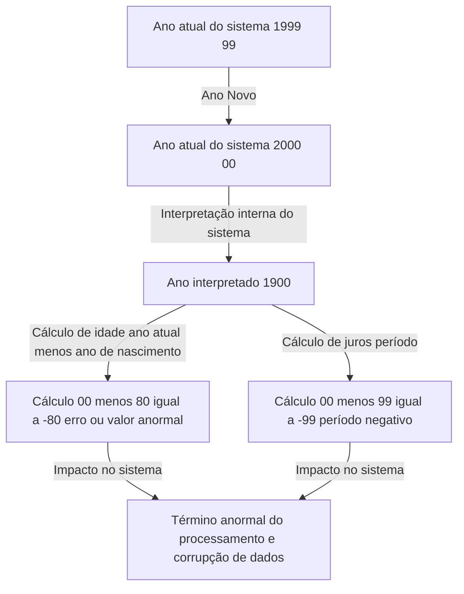
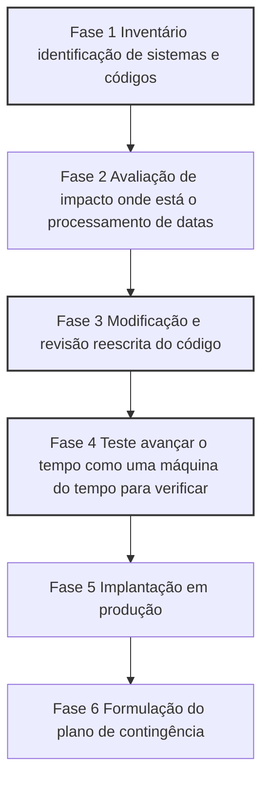

## Prólogo: A bomba-relógio digital enfrentada pela humanidade

Em 31 de dezembro de 1999, enquanto o mundo se preparava para celebrar a chegada do novo milênio, algumas pessoas prendiam a respiração por um motivo completamente diferente. Em vez de taças de champanhe, eles seguravam xícaras de café e teclados, aguardando o momento em que os ponteiros do relógio em seus monitores marcariam "00:00:00".

Esse foi o clímax da batalha contra o "Problema Y2K" Year 2000 —— comumente conhecido como o "Bug do Milênio".

Naquela época, a mídia relatava diariamente que "aviões cairiam", "usinas nucleares sairiam de controle", "saldos bancários seriam zerados" e "a infraestrutura pararia completamente", causando pânico global. No entanto, quando chegou o dia 1º de janeiro de 2000, não ocorreram falhas em grande escala que afetassem fatalmente nossas vidas.

Como resultado, surgiram pessoas que diziam que "o Bug do Milênio foi uma ilusão criada pela mídia" ou "um enorme golpe da indústria de TI". No entanto, isso é um grande mal-entendido. O mundo não entrou em colapso por causa de um milagre. Foi graças aos esforços árduos de "programadores anônimos" que, por anos, lutaram contra milhões de linhas de código legado e literalmente reescreveram os sistemas de todo o mundo.

Neste artigo, explicaremos detalhadamente por que o problema do ano 2000 ocorreu, seu contexto histórico, o escopo deste projeto global de depuração sem precedentes e as lições deixadas para a engenharia moderna.

## Capítulo 1: Por que o Bug do Milênio surgiu?

Resumindo, o problema Y2K foi "um bug de sistema causado pelo uso de apenas os dois últimos dígitos do ano para representar datas". Por exemplo, 1998 era processado como "98" e 1999 como "99". Mas 2000 virava "00".

Se o sistema interpretasse "00" não como "2000", mas como "1900", ocorriam anomalias de cálculo como as seguintes.

Por que os programadores da época registraram o ano com 2 dígitos em vez de 4? Não foi porque eram preguiçosos ou sem visão de futuro. Havia graves "restrições de hardware".

### A era em que a memória era cara

Dos anos 1960 aos 1970, a capacidade de armazenamento dos computadores memória e armazenamento era um recurso extremamente caro e valioso, inimaginável para os padrões de hoje.

Nos primeiros mainframes, os dados eram gerenciados por cartões perfurados. Um único cartão perfurado podia armazenar apenas 80 caracteres. Nesse espaço limitado, era necessário espremer todos os dados: nomes, endereços, números de contas, valores de transações, etc.

Nessas circunstâncias, omitir os dois primeiros dígitos "19" nas datas era uma escolha extremamente racional e necessária. Em bancos de dados com milhões de registros, economizar apenas 2 bytes 2 caracteres por registro levava a enormes reduções de custos no total.

Os programadores da época também suspeitavam que "quando o ano 2000 chegasse, poderia ser um problema". No entanto, eles pensaram: "Não há como este sistema continuar sendo usado até o ano 2000. Até lá, ele será substituído por um novo sistema".

Mas essa previsão estava errada. Os sistemas robustos que eles construíram em linguagens como o COBOL continuaram operando como sistemas centrais de finanças, seguros e agências governamentais por mais de 30 anos.

## Capítulo 2: A escala do perigo latente

Em meados dos anos 1990, com a aproximação do ano 2000, alguns profissionais da indústria de TI começaram a soar o alarme. Inicialmente ignorados, o alcance assustador do impacto ficou claro à medida que as investigações avançaram.

### Áreas de impacto diversificadas

1. **Instituições Financeiras**: Desaparecimento de saldos ou saldos negativos devido a anomalias no cálculo de juros. Erro no cálculo das datas de vencimento.
2. **Transporte e Aviação**: Paralisação massiva de voos devido à queda de sistemas de controle de tráfego aéreo. Colapso de sistemas de reservas.
3. **Infraestrutura e Energia**: Apagões em grande escala causados por mau funcionamento dos sistemas de controle de usinas elétricas especialmente sistemas embarcados.
4. **Médica**: Perigo para os pacientes devido a falhas em equipamentos médicos. Erro nas datas de validade de medicamentos.
5. **Militar e Defesa**: Falhas em sistemas de alerta precoce e queda de sistemas de comunicação.

O que mais se temia era o Bug do Milênio em "Sistemas Embarcados" Embedded Systems. Elevadores, linhas de produção, marca-passos — qualquer dispositivo com um microchip poderia conter lógica de verificação de datas. Eles não podiam ser corrigidos com uma simples atualização de software; às vezes, o próprio chip precisava ser trocado.

### O colapso em cadeia da cadeia de suprimentos

O problema foi ainda mais complicado pela interdependência da economia globalizada. Mesmo que uma empresa corrigisse seus sistemas, se o sistema de seu parceiro caísse, o fornecimento de peças e pagamentos travariam, interrompendo os negócios em cadeia. Era um "risco sistêmico" que nenhum país ou empresa poderia resolver sozinho.

## Capítulo 3: A missão de depuração sem precedentes

No final dos anos 1990, governos e empresas finalmente agiram. Assim começou o maior projeto de correção de software da história.

### A convocação de programadores aposentados

No centro do problema Y2K estava o código escrito décadas antes em COBOL, Fortran e Assembly. Naquela época, o mercado de TI já estava focado em C, C++ e Java, e havia poucos engenheiros capazes de ler e escrever nessas linguagens antigas.

Assim, as empresas trouxeram de volta programadores veteranos aposentados, oferecendo pagamentos astronômicos. Apenas saber "escrever COBOL" trazia trabalhos pagando várias vezes a taxa normal. Foi o auge da "Bolha do COBOL".

O trabalho deles consistia em vasculhar dezenas de milhões de linhas de código emaranhado como espaguete, encontrar as variáveis que lidavam com datas e corrigi-las.

### Um processo de trabalho vertiginoso

A depuração do projeto Y2K não envolvia hackers chamativos ou tecnologias de ponta. Era uma série de trabalhos extremamente tediosos e monótonos.

1. **Busca de código**: Sem regras de nomenclatura consistentes, eles tinham que procurar manualmente não apenas por "DATE", "YY", "YEAR", mas também por variáveis usadas implicitamente como datas.
2. **Dificuldade de teste**: Para testar o Bug do Milênio, era necessário avançar fisicamente o relógio do sistema viajar no tempo. Mas não se podia fazer isso nos ambientes de produção, então tiveram que construir ambientes de teste totalmente isolados e verificar a integração interfaces com outros sistemas.

### Métodos específicos de depuração

Os programadores perceberam que não havia tempo nem orçamento para reescrever todos os códigos para anos de 4 dígitos expansão de campo. Assim, a técnica de "Windowing" janela de anos foi amplamente adotada.

**Como o Windowing funciona:**
Define-se um ano base ano pivô para o sistema e interpreta-se o ano de 2 dígitos de acordo com o contexto.
Por exemplo, se o ano base for "50":
- "50" a "99" é interpretado como anos 1900 1950 a 1999.
- "00" a "49" é interpretado como anos 2000 2000 a 2049.

Adicionando apenas algumas linhas dessa lógica ao código, o sistema pôde ser estendido até 2049 sem alterar a estrutura do banco de dados anos de 2 dígitos. Não era a solução perfeita, mas um "adiamento da dívida técnica", sendo a técnica mais realista e eficaz no tempo disponível.

## Capítulo 4: O momento do milênio e a verdade onde "nada aconteceu"

E chegou o fatídico 31 de dezembro de 1999. Os departamentos de TI de todo o mundo mantiveram seus funcionários de prontidão em hotéis, prepararam enormes quantidades de pizza e café, e ficaram de olho nos monitores das "salas de guerra".

Começando pelos países mais próximos à Linha Internacional de Data, como Nova Zelândia e Austrália, o ano 2000 chegou gradualmente.

"Sydney, sem problemas."
"Tóquio, sem problemas."
"Londres, sem problemas."
"Nova York, sem problemas."

Como em um revezamento, a onda do ano 2000 deu a volta ao mundo. Embora pequenos problemas tenham ocorrido como sites exibindo a data "19100", o tão temido colapso em larga escala, acidentes aéreos e falhas bancárias nunca aconteceram.

Na manhã de 1º de janeiro, o mundo acordou igual ao dia anterior.

### Por que "nada aconteceu"?

A mídia relatou que "foi um exagero" e "o Y2K era uma ilusão". O público também teve uma visão cínica, pensando: "No final, apenas as empresas de computador lucraram".

No entanto, a verdade é exatamente o oposto. **Não é que "nada aconteceu", e sim que "eles fizeram com que nada acontecesse".**

Cerca de 300 a 600 bilhões de dólares foram gastos globalmente. Milhões de engenheiros trabalharam duro por anos. A "paz" foi o resultado da depuração exaustiva e testes repetidos.

Se não tivessem feito nada, sem dúvida os sistemas teriam falhado em cascata, causando enormes danos econômicos e caos social — como provado pelos inúmeros travamentos nos ambientes de teste. Os engenheiros de TI foram os "heróis invisíveis" que salvaram o mundo.

## Capítulo 5: Lições para a atualidade e a próxima bomba-relógio

O problema Y2K não é uma piada do passado. Deixou muitas lições importantes sobre engenharia de software que se aplicam hoje.

### 1. O terror da Dívida Técnica
Otimizações de curto prazo como "funciona por enquanto" ou "o sistema será renovado no futuro" podem crescer e se tornar uma enorme "Dívida Técnica", exigindo orçamentos do tamanho do PIB de um país décadas depois.

### 2. Interdependência e efeito caixa preta
Os sistemas modernos são ainda mais complexos. Dependemos de serviços em nuvem, APIs e bibliotecas de código aberto que não controlamos. Se um bug fatal for encontrado na base de nossos sistemas, corrigi-lo será muito mais difícil do que o Y2K.

### 3. A próxima crise: O Problema de 2038
Na verdade, a contagem regressiva para a próxima bomba-relógio já começou entre os engenheiros: o "Problema do ano 2038" Y2K38.

Muitos sistemas UNIX gerenciam o tempo como "o número de segundos desde 1º de janeiro de 1970 00:00:00 UTC", usando um número inteiro de 32 bits assinado. O valor máximo é "2.147.483.647", que será alcançado em **19 de janeiro de 2038 às 03:14:07 UTC**.

Depois disso, o valor transbordará overflow, voltando para o ano de 1901. Roteadores antigos, GPS e dispositivos IoT podem sofrer falhas graves.

Claro, sistemas operacionais modernos e bancos de dados já mudaram para 64 bits. Mas ninguém sabe ao certo quantos "dispositivos antigos e sem atualização" ainda estão em operação no mundo.

## Conclusão: Para as pessoas que apoiam a infraestrutura invisível

Se podemos pagar com nossos smartphones, voar de avião e usar eletricidade todos os dias como se fosse natural, é porque inúmeros engenheiros mantêm e depuram constantemente os sistemas nos bastidores.

A batalha dos engenheiros contra o problema Y2K foi cruel e ingrata: "Se der certo, ninguém notará ou dirão que foi inútil; se der errado, serão acusados de ajudar a acabar com o mundo".

Mesmo assim, eles conseguiram.

Da próxima vez que ouvir que "uma grande falha de TI foi evitada", lembre-se do suor e das noites sem dormir por trás disso. Ao relembrar a história do Bug do Milênio, não podemos deixar de prestar homenagem às grandes realizações desses "profissionais invisíveis".
