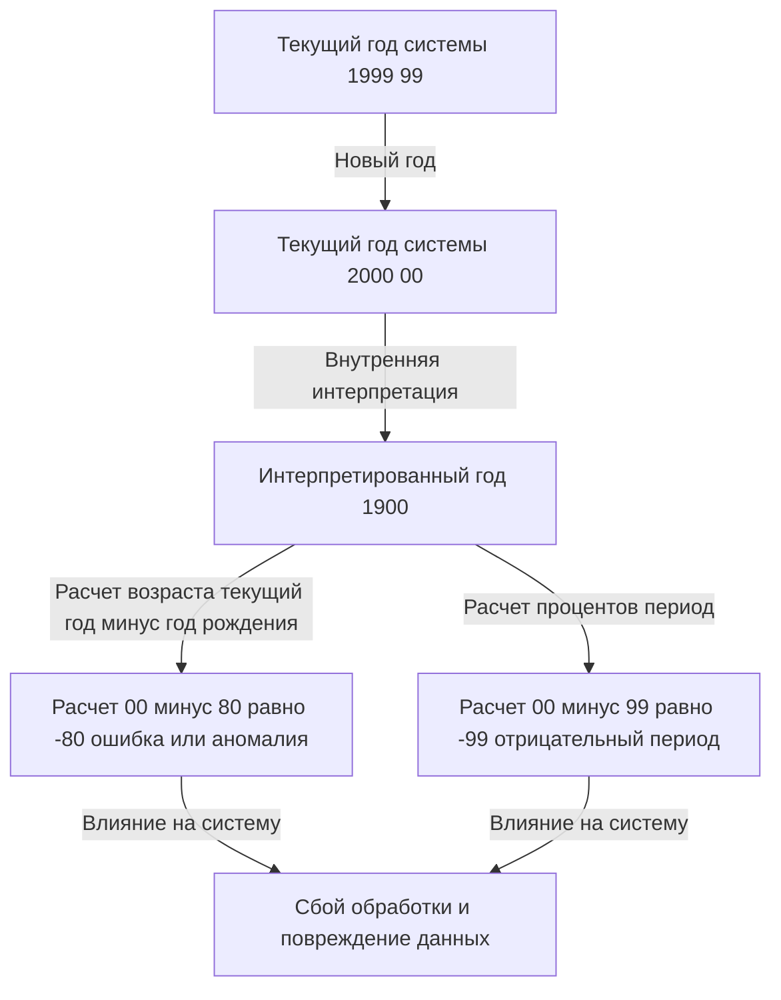
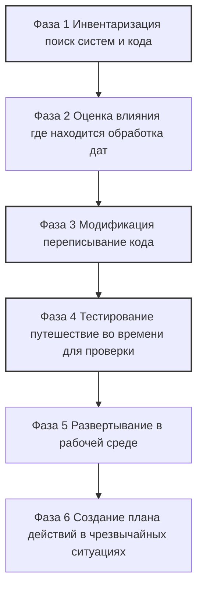

## Пролог: Цифровая бомба замедленного действия, с которой столкнулось человечество

31 декабря 1999 года, когда весь мир готовился праздновать наступление нового тысячелетия, некоторые люди затаили дыхание по совершенно иной причине. Они держали не бокалы с шампанским, а чашки кофе и клавиатуры, ожидая момента, когда стрелки часов на их мониторах покажут "00:00:00".

Это была кульминация битвы с "проблемой Y2K" Year 2000 —— известной как "Проблема 2000 года".

В то время СМИ ежедневно трубили о том, что "самолеты упадут", "атомные электростанции выйдут из-под контроля", "балансы банковских счетов обнулятся", а "инфраструктура полностью остановится", вызывая глобальную панику. Однако, когда наступило 1 января 2000 года, никаких масштабных сбоев, фатально повлиявших на нашу жизнь, не произошло.

Из-за этого впоследствии появились люди, утверждавшие, что "проблема 2000 года была иллюзией, созданной СМИ" или "огромной аферой IT-индустрии". Однако это большое заблуждение. Мир не рухнул не из-за какого-то чуда. Это произошло благодаря титаническим усилиям "безымянных программистов", которые годами боролись с миллионами строк устаревшего кода и буквально переписали системы по всему миру.

В этой статье мы подробно объясним, почему возникла проблема 2000 года, её исторический контекст, масштаб этого беспрецедентного глобального проекта по отладке и уроки, оставленные для современной инженерии.

## Глава 1: Почему возникла проблема 2000 года?

В двух словах, проблема 2000 года — это "системная ошибка, вызванная использованием только двух последних цифр года для представления дат". Например, 1998 год обрабатывался как "98", а 1999 — как "99". Но 2000 год становился "00".

Если система интерпретировала "00" не как "2000", а как "1900", возникали следующие аномалии в расчетах.

Почему же программисты того времени записывали год двумя цифрами вместо четырех? Вовсе не потому, что они были ленивы или недальновидны. Тому были виной суровые "аппаратные ограничения".

### Эпоха, когда память стоила дорого

С 1960-х по 1970-е годы емкость памяти и хранилищ компьютеров была невероятно дорогим и ценным ресурсом, что немыслимо по сегодняшним меркам.

В ранних мейнфреймах данные управлялись с помощью перфокарт. Одна перфокарта могла хранить только 80 символов. В это ограниченное пространство нужно было втиснуть все: имена, адреса, номера счетов, суммы транзакций и т. д.

В таких условиях отбрасывание первых двух цифр "19" в датах было крайне рациональным и необходимым шагом. В базах данных с миллионами записей экономия всего 2 байт 2 символа на каждую запись приводила к колоссальному снижению общих затрат.

Программисты того времени тоже смутно догадывались, что "когда наступит 2000 год, это может стать проблемой". Однако они думали: "Эта система ни за что не будет использоваться до 2000 года. К тому времени её заменят на новую".

Но этот прогноз не сбылся. Надежные системы, написанные ими на COBOL и других языках, продолжали работать в качестве ключевых систем в финансах, страховании и правительственных учреждениях более 30 лет.

## Глава 2: Масштаб скрытой угрозы

В середине 1990-х, по мере приближения 2000 года, некоторые представители IT-индустрии начали бить тревогу. Сначала их игнорировали, но по мере проведения исследований стал ясен невероятно широкий масштаб проблемы.

### Разнообразные области воздействия

1. **Финансовые учреждения**: Исчезновение балансов или уход в минус из-за аномалий в расчете процентов. Ошибочный расчет сроков погашения.
2. **Транспорт и авиация**: Масштабные остановки полетов из-за сбоев в системах управления воздушным движением. Крах систем бронирования.
3. **Инфраструктура и энергетика**: Масштабные отключения электричества из-за сбоев в системах управления электростанциями особенно во встроенных системах.
4. **Медицина**: Опасность для пациентов из-за сбоев в медицинском оборудовании. Ошибочное определение сроков годности лекарств.
5. **Военные и оборона**: Сбои в системах раннего предупреждения и падение систем связи.

Особенно пугала проблема 2000 года во "встроенных системах" Embedded Systems. Лифты, заводские конвейеры, кардиостимуляторы — любое устройство с микрочипом могло скрывать логику проверки даты. Их нельзя было легко исправить обновлением софта, иногда приходилось менять сам чип.

### Цепной коллапс цепочек поставок

Проблему усугубляла взаимозависимость глобализированной экономики. Даже если компания идеально исправила свои системы, сбой у партнера остановил бы поставки запчастей и платежи, что привело бы к цепной остановке бизнеса. Это был "системный риск", который нельзя было решить силами одной страны или компании.

## Глава 3: Беспрецедентная операция по отладке

В конце 1990-х правительства и компании по всему миру наконец взялись за дело. Так начался крупнейший в истории человечества проект по исправлению программного обеспечения.

### Призыв программистов-пенсионеров

В основе проблемы Y2K лежал код, написанный десятилетиями ранее на COBOL, Fortran и ассемблере. К тому времени в IT доминировали C, C++ и Java, а инженеров, знающих старые языки, оставалось мало.

Поэтому компании стали возвращать ветеранов-программистов, уже вышедших на пенсию, за баснословные деньги. Одно только умение "писать на COBOL" обеспечивало работу с оплатой в несколько раз выше обычной. Наступил настоящий "пузырь COBOL".

Их задача заключалась в том, чтобы рыться в десятках миллионов строк запутанного спагетти-кода, находя переменные, обрабатывающие даты, и исправляя их.

### Головокружительный рабочий процесс

Отладка проекта Y2K не была связана с ярким хакерством или новейшими технологиями. Это была череда крайне монотонной и грязной работы.

1. **Поиск кода**: Из-за отсутствия единых правил именования приходилось вручную искать не только переменные "DATE", "YY", "YEAR", но и те, что использовались как даты неявно.
2. **Сложность тестирования**: Для тестирования нужно было физически переводить системные часы вперед путешествие во времени. Делать это в рабочей среде было нельзя, поэтому приходилось создавать полностью изолированные тестовые среды и проверять интеграцию интерфейсы с другими системами.

### Конкретные методы отладки

Программисты поняли, что времени и бюджета на перевод всего кода на 4-значный формат дат расширение полей нет. Поэтому широкое применение получил метод "Окон" Windowing.

**Как работает метод Окон:**
Устанавливается базовый год пивотный год системы, и 2-значный год интерпретируется в зависимости от контекста.
Например, если базовый год — "50":
- "50" — "99" интерпретируются как 1900-е 1950–1999.
- "00" — "49" интерпретируются как 2000-е 2000–2049.

Добавление всего пары строк этой логики в код позволяло продлить жизнь системы до 2049 года без изменения структуры баз данных. Это было не идеальное решение, а "отсрочка технического долга", но в условиях нехватки времени это был самый реалистичный и эффективный хак.

## Глава 4: Момент миллениума и правда о том, что ничего не произошло

И вот настало роковое 31 декабря 1999 года. IT-отделы по всему миру размещали сотрудников в отелях, запасались пиццей и кофе, и не отрывали глаз от мониторов в "штабах".

Начиная с стран, ближайших к линии перемены дат, таких как Новая Зеландия и Австралия, мир постепенно входил в 2000 год.

"Сидней, без происшествий."
"Токио, без происшествий."
"Лондон, без происшествий."
"Нью-Йорк, без происшествий."

Волна 2000 года обошла планету, как эстафета. Были мелкие сбои например, даты на некоторых сайтах отображались как "19100", небольшие локальные проблемы, но масштабного коллапса инфраструктуры, авиакатастроф и остановки финансовых систем так и не случилось.

Утром 1 января мир проснулся таким же, как и вчера.

### Почему ничего не произошло?

СМИ писали: "Слишком много шума", "Y2K был иллюзией". Обычные люди тоже думали: "В итоге заработали только компьютерные компании".

Но правда совершенно в другом. **Дело не в том, что "ничего не произошло", а в том, что "они сделали так, чтобы ничего не произошло".**

От 300 до 600 миллиардов долларов вложено по всему миру. Миллионы инженеров годами работали сверхурочно и по выходным. Это "спокойствие" было результатом их тщательных исправлений и бесконечных тестов.

Если бы они ничего не сделали, системы бы рухнули по принципу домино, вызвав огромный экономический ущерб и хаос — бесчисленные сбои в тестовых средах доказали это. IT-инженеры стали тихими "невидимыми героями", спасшими мир.

## Глава 5: Уроки для современности и следующая бомба замедленного действия

Проблема 2000 года — это не повод для шуток из прошлого. Она оставила тяжелые уроки для разработки ПО, актуальные и сегодня.

### 1. Ужас технического долга
Краткосрочная оптимизация или компромисс вроде "пока работает, сойдет" или "в будущем систему обновят" могут спустя десятилетия превратиться в гигантский "Технический долг", требующий затрат масштаба госбюджета.

### 2. Взаимозависимость систем и превращение в черный ящик
Современные системы переплетены еще сложнее, чем в эпоху Y2K. Мы зависим от облачных сервисов, API, опенсорс-библиотек — систем, которые не можем контролировать. Если в базовой логике найдется фатальный баг, найти и исправить его будет сложнее, чем проблему 2000 года.

### 3. Следующий кризис: Проблема 2038 года
Среди инженеров уже начался отсчет времени до следующей бомбы — "Проблемы 2038 года" Y2K38.

Многие UNIX-системы считают время как "количество секунд, прошедших с 1 января 1970 года 00:00:00 UTC", используя 32-битное целое число со знаком. Его максимальное значение — "2 147 483 647", и оно будет достигнуто **19 января 2038 года в 03:14:07 UTC**.

После этого произойдет переполнение, и значение станет отрицательным возврат в 1901 год. На старых роутерах, навигаторах и IoT-устройствах могут произойти серьезные сбои.

Конечно, современные ОС и БД уже перешли на 64 бита, меры принимаются. Но никто не знает точно, сколько в мире осталось "старых, не обновляемых устройств".

## Заключение: Тем, кто поддерживает невидимую инфраструктуру

То, что мы каждый день легко расплачиваемся смартфоном, летаем на самолетах и пользуемся электричеством, возможно благодаря огромному числу инженеров, которые постоянно поддерживают и отлаживают системы.

Битва инженеров с проблемой Y2K была крайне суровой и неблагодарной: "В случае успеха никто не заметит или скажут, что всё было зря, а в случае провала обвинят в причастности к концу света".

И всё же они справились.

Когда в следующий раз вы услышите, что "крупный сбой IT-системы был предотвращен", подумайте о том, сколько пота и бессонных ночей за этим стоит. Оглядываясь на историю Y2K, мы обязаны еще раз отдать дань уважения великим достижениям этих "невидимых профессионалов".
