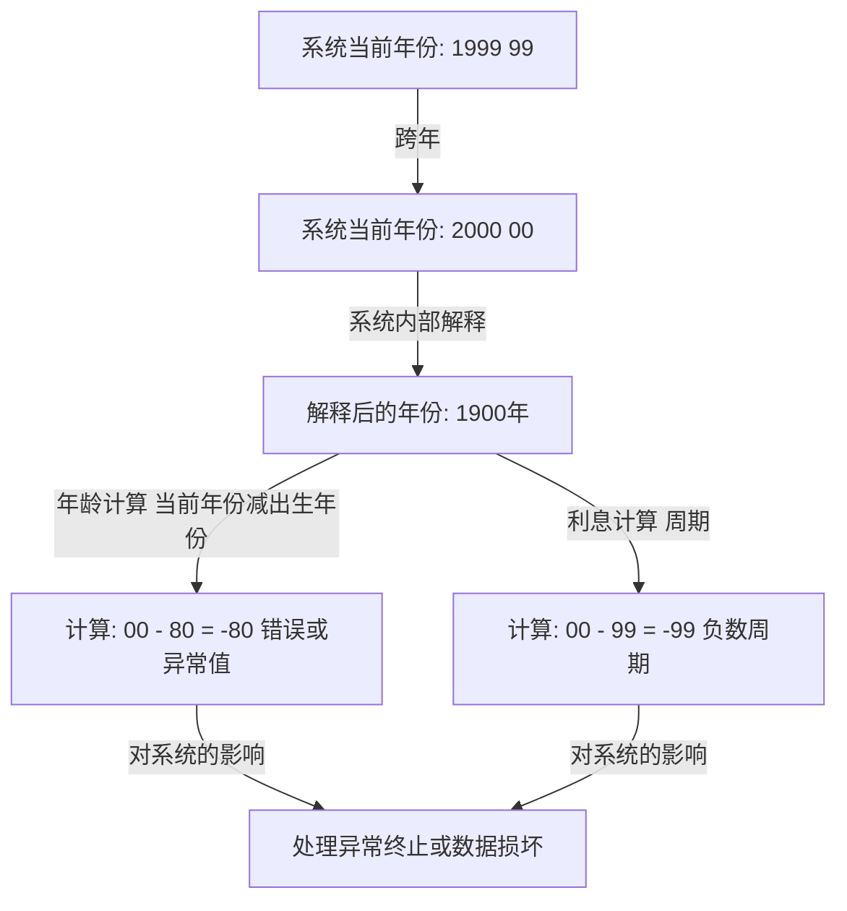
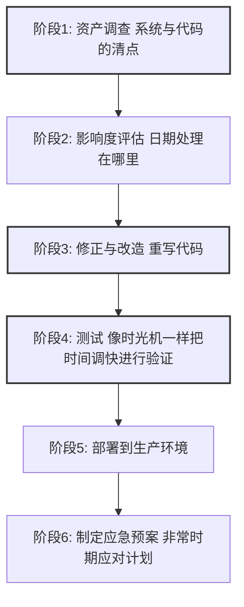

## 序章：人类面临的数字定时炸弹

1999年12月31日，正当全世界准备庆祝新千禧年到来之际，有一群人却因为完全不同的理由屏住了呼吸。他们手里拿着的不是香槟杯，而是咖啡杯和键盘，等待着显示器上的时钟指针指向“00:00:00”的那一瞬间。

那就是与“Y2K Year 2000 问题”——俗称“千年虫”——之战的高潮。

当时，媒体每天都在铺天盖地地报道：“飞机将会坠毁”、“核电站将会失控”、“银行账户余额将归零”、“基础设施将全面瘫痪”，引发了全球性的恐慌。然而，当2000年1月1日到来时，并没有发生对我们的生活造成致命影响的大规模故障。

由于这个结果，后来有些人开始说“Y2K问题是媒体制造的幻象”、“这是IT行业的一场巨大骗局”。然而，这是一个巨大的误解。世界没有崩溃，并非因为奇迹发生。而是因为数年来，“无名程序员们”与几百万行遗留代码进行搏斗，几乎是字面意义上重写了全世界的系统，付出了血汗般的努力。

在本文中，我们将极其详细地解说Y2K问题为何发生，从其历史背景到全球规模展开的前所未有的调试项目全貌，以及留给现代工程学的教训。

## 第1章：为什么会产生Y2K问题？

用一句话来解释Y2K问题，那就是“在表示日期时，因为只使用了公历年的最后两位数而引发的系统漏洞”。例如，1998年被处理为“98”，1999年被处理为“99”。但是，2000年变成了“00”。

如果系统将“00”解释为“1900年”而不是“2000年”，就会发生以下计算异常：

为什么当时的程序员在记录年份时不使用4位数而使用2位数呢？这绝不是因为他们懒惰或者缺乏先见之明。这背后有当时严重的“硬件限制”。

### 内存昂贵的时代

在20世纪60年代到70年代，计算机的存储容量内存和存储对于现代来说是难以想象的昂贵和宝贵的资源。

在早期的商用大型计算机中，数据是通过打孔卡来管理的。一张打孔卡只能记录80列 80个字符。在这个有限的空间里，必须塞入姓名、地址、账号、交易金额等所有数据。

在这种情况下，省略日期数据的“19”这高两位，是一个极其合理且必须的选择。在一个保存数百万条记录的数据库中，即使每条记录只节省2字节 2个字符，整体上也能带来巨大的成本削减。

当时的程序员们其实也隐约意识到，“等到2000年到来时可能会成为一个问题”。但是，他们是这样想的：“这个系统不可能一直用到2000年。到那时它肯定已经被新系统取代了。”

然而，这个预测落空了。他们用COBOL等语言编写的稳健系统，作为金融、保险、政府机构等的核心系统，持续运行了30多年。

## 第2章：潜在危机的规模

到了20世纪90年代中期，随着2000年的临近，IT行业的一部分人终于开始敲响警钟。起初作为少数派意见被忽视，但随着调查的深入，其影响范围之广异常令人震惊。

### 广泛的影响范围

1. **金融机构**：由于利息计算异常导致账户余额消失，或陷入负余额。到期日计算错误。
2. **交通与航空**：航空管制系统瘫痪导致大规模航班停飞。预订系统崩溃。
3. **基础设施与电力**：发电站控制系统 特别是嵌入式系统 故障导致大规模停电。
4. **医疗**：医疗设备故障对患者造成危险。药品有效期的误判。
5. **军事与国防**：预警系统误报及通信系统瘫痪。

尤其令人恐惧的是“嵌入式系统 Embedded Systems”中的Y2K漏洞。在电梯、工厂生产线、心脏起搏器等包含微芯片的各种设备中，都可能潜藏着日期判断逻辑。这些不仅是像软件更新那样容易修复的东西，有时甚至需要更换芯片本身。

### 供应链的连锁崩溃

使问题进一步复杂化的是，全球化经济中不断加深的相互依赖性。即使一家公司完美地修复了自己的系统，如果供应商的系统瘫痪，零部件采购和结算就会停滞，进而导致业务发生连锁性停止。这是一个“系统性风险”，仅仅依靠一个国家或一家企业是无法解决的。

## 第3章：史无前例的调试大作战

20世纪90年代后期，世界各国的政府和企业终于开始行动。至此，人类历史上规模最大的软件修改项目拉开了帷幕。

### 退役程序员的征召令

Y2K问题的核心是几十年前用COBOL、Fortran和汇编语言编写的代码。当时，IT行业的主流已经逐渐转向C语言、C++、Java等，能够读写这些老式语言的现役工程师已经越来越少。

因此，企业以极其丰厚的报酬，召回了那些已经退休过着养老生活的资深程序员们。仅仅因为“会写COBOL”，工作便以平时好几倍的单价接踵而至，真可谓迎来了COBOL泡沫。

他们的工作，就是从像意大利面条一样纠缠不清的数千万行源代码中，找出处理日期的变量，并将它们修正。

### 令人头晕目眩的工作流程

Y2K项目的调试并非使用什么华丽的黑客技术或最新科技。那是极其脚踏实地、单调乏味的工作的延续。

1. **搜索代码**：在源代码没有统一命名规范的情况下，不仅要找诸如“DATE”、“YY”、“YEAR”等变量名，还必须手动找出那些隐含作为日期使用的变量。
2. **测试的困难性**：为了对“2000年问题”进行测试，需要实际调快系统时钟 进行时间旅行。但是，又不能调快生产环境的时钟，因此必须建立一个完全隔离的测试环境，并且要包括与其他系统的联动 接口 在内进行验证。

### 调试的具体方法

程序员们意识到，他们没有时间也没有预算将所有代码都改写为4位数年份 字段扩展。因此，一种被称为“窗口化 Windowing”的方法被广泛采用。

**窗口化 Windowing 的原理：**
设定系统的基准年份 枢轴年，根据上下文来解释2位数的年份。
例如，如果将枢轴年设定为“50”：
- “50”～“99”，被解释为1900年代 1950～1999。
- “00”～“49”，被解释为2000年代 2000～2049。

只需在代码中添加几行这样的逻辑，无需改变数据库结构 2位数年份，系统寿命就可以延长到2049年。这并非完美的解决方案，而是一种“技术债务的推迟”，但在有限的时间内，这是最现实且有效的Hack 手段。

## 第4章：千禧年的瞬间与“什么都没发生”的真相

命运的1999年12月31日。世界各地的IT部门让员工在酒店待命，准备了大量的披萨和咖啡，在“对策本部”紧盯着显示器。

从最靠近国际日期变更线的国家如新西兰、澳大利亚开始，2000年逐渐到来。

“悉尼，无异常”
“东京，无异常”
“伦敦，无异常”
“纽约，无异常”

如同接力一般，2000年的浪潮绕地球一圈。虽然发生了一些小规模的故障 某些网站将日期显示为“19100年”、地方系统发生小故障等，但令人恐惧的大规模基础设施瘫痪、空难、金融系统停摆，却一次也没有发生过。

天亮后的1月1日，世界迎来了与昨天一样平凡的早晨。

### 为什么“什么都没有发生”？

媒体报道说“大惊小怪了”、“Y2K只是幻影”。普通民众也投来冷漠的目光，说“结果还不是只有电脑公司赚到了钱”。

然而，真相完全相反。**并非“什么都没发生”，而是“确保了什么都没发生”。**

据估计，全世界投入了3000亿到6000亿美元 约合当时汇率的30万亿到60万亿日元的巨额资金，数百万工程师长年累月地加班和周末出勤，彻底修正系统并反复测试，这才是导致“平静”的结果。

如果他们什么都不做，测试环境中无数次的崩溃已经证明，各个系统必定会发生连锁故障，造成巨大的经济损失和社会混乱。IT工程师们，是悄悄拯救了世界的“隐形英雄”。

## 第5章：对现代的教训与下一颗定时炸弹

Y2K问题不是过去的笑谈。在软件工程中，它留下了许多适用于现代的沉重教训。

### 1. 技术债务的恐怖
“反正现在能运行就行”、“将来系统肯定会更新”等眼前的优化 或妥协，在几十年后会成长为要求国家预算规模修正成本的巨大“技术债务 Technical Debt”，这种恐怖。

### 2. 系统的相互依赖与黑盒化
现代系统比Y2K当时更加复杂地交织在一起。我们依赖于无法自行控制的外部系统，如云服务、API、开源库等。如果在全球系统赖以生存的根本逻辑中发现了致命的漏洞，查明其影响并进行修正，可能会比Y2K更加困难。

### 3. 下一场危机“2038年问题”
实际上，在工程师之间，下一颗定时炸弹的倒计时已经开始。那就是“2038年问题 Y2K38”。

在许多UNIX类系统中，时间被管理为“自1970年1月1日 00:00:00 UTC 以来的秒数”，并以32位有符号整数来表示。这个32位整数的最大值是“2,147,483,647”，达到这个秒数的时间是**2038年1月19日 03:14:07 UTC**。

过了这一瞬间，数值就会发生溢出，并被解释为负数 倒退回1901年。目前正在运行的32位系统和嵌入式设备 老式路由器、汽车导航仪、IoT设备等 可能会发生严重的故障。

当然，许多现代操作系统和数据库已经实现了64位化，针对这个问题的对策也在推进中。然而，全世界到底散落着多少“被遗弃且未更新的旧设备”，谁也无法准确知晓。

## 结语：致那些支撑隐形基础设施的人们

我们每天能理所当然地用手机支付、乘坐飞机、使用电力，正是因为在背后，有庞大数量的工程师在不断进行维护和调试，以防止系统崩溃。

工程师在Y2K问题中的战斗，其性质极其残酷且吃力不讨好：“如果成功了，没人会注意到 甚至说白忙一场，如果失败了，就会被指责为导致世界末日的帮凶。”

即便如此，他们还是完成了。

下次当你听到“未然防止了一起重大IT系统故障”的新闻时，想想其背后有多少汗水与彻夜未眠。回顾Y2K问题的历史时，我们不禁要对这些“隐形的专业人士”的伟业再次致以崇高的敬意。
