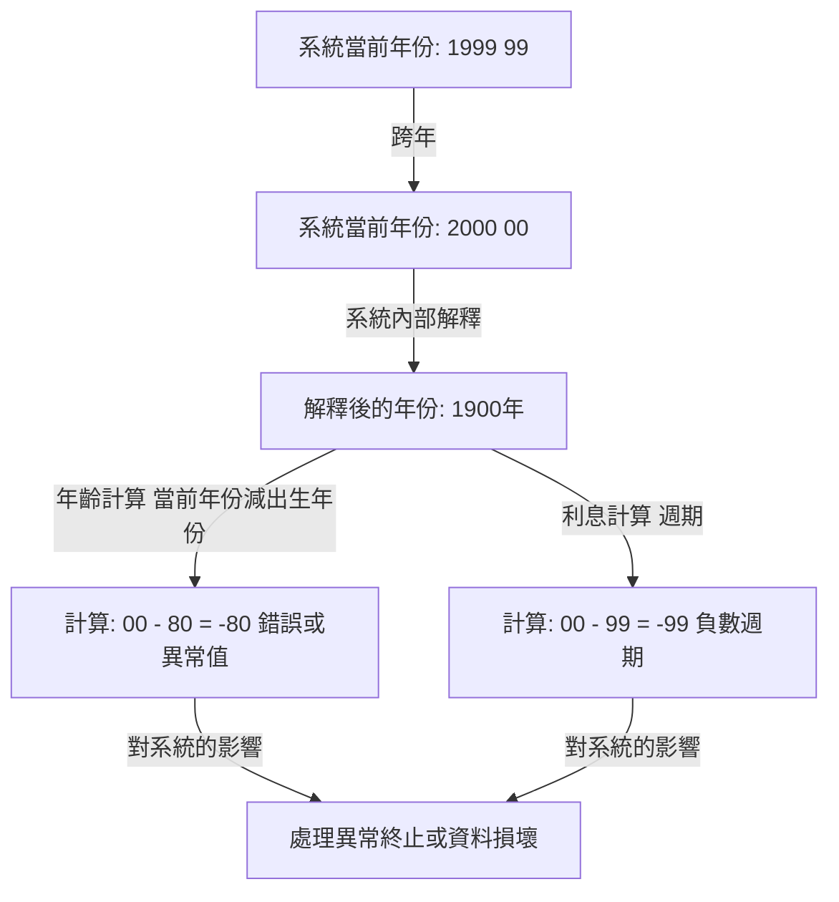
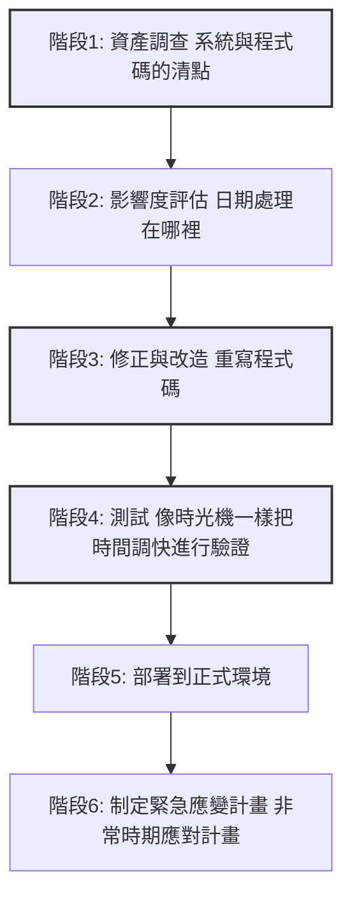

## 序章：人類面臨的數位定時炸彈

1999年12月31日，正當全世界準備慶祝新千禧年到來之際，有一群人卻因為完全不同的理由屏住了呼吸。他們手裡拿著的不是香檳杯，而是咖啡杯和鍵盤，等待著顯示器上的時鐘指針指向「00:00:00」的那一瞬間。

那就是與「Y2K Year 2000 問題」——俗稱「千禧蟲」——之戰的高潮。

當時，媒體每天都在鋪天蓋地地報導：「飛機將會墜毀」、「核電廠將會失控」、「銀行帳戶餘額將歸零」、「基礎設施將全面癱瘓」，引發了全球性的恐慌。然而，當2000年1月1日到來時，並沒有發生對我們的生活造成致命影響的大規模故障。

由於這個結果，後來有些人開始說「Y2K問題是媒體製造的幻象」、「這是IT產業的一場巨大騙局」。然而，這是一個巨大的誤解。世界沒有崩潰，並非因為奇蹟發生。而是因為數年來，「無名程式設計師們」與幾百萬行舊程式碼進行搏鬥，幾乎是字面意義上重寫了全世界的系統，付出了血汗般的努力。

在本文中，我們將極其詳細地解說Y2K問題為何發生，從其歷史背景到全球規模展開的前所未有的除錯專案全貌，以及留給現代工程學的教訓。

## 第1章：為什麼會產生Y2K問題？

用一句話來解釋Y2K問題，那就是「在表示日期時，因為只使用了西元年份的最後兩位數而引發的系統錯誤」。例如，1998年被處理為「98」，1999年被處理為「99」。但是，2000年變成了「00」。

如果系統將「00」解釋為「1900年」而不是「2000年」，就會發生以下計算異常：

為什麼當時的程式設計師在記錄年份時不使用4位數而使用2位數呢？這絕不是因為他們懶惰或者缺乏先見之明。這背後有當時嚴重的「硬體限制」。

### 記憶體昂貴的時代

在20世紀60年代到70年代，電腦的儲存容量記憶體和儲存空間對於現代來說是難以想像的昂貴和寶貴的資源。

在早期的商用大型電腦中，資料是透過打孔卡來管理的。一張打孔卡只能記錄80欄 80個字元。在這個有限的空間裡，必須塞入姓名、地址、帳號、交易金額等所有資料。

在這種情況下，省略日期資料的「19」這高兩位，是一個極其合理且必須的選擇。在一個保存數百萬筆紀錄的資料庫中，即使每筆紀錄只節省2位元組 2個字元，整體上也能帶來巨大的成本縮減。

當時的程式設計師們其實也隱約意識到，「等到2000年到來時可能會成為一個問題」。但是，他們是這樣想的：「這個系統不可能一直用到2000年。到那時它肯定已經被新系統取代了。」

然而，這個預測落空了。他們用COBOL等語言編寫的穩健系統，作為金融、保險、政府機構等的核心系統，持續運行了30多年。

## 第2章：潛在危機的規模

到了20世紀90年代中期，隨著2000年的臨近，IT產業的一部分人終於開始敲響警鐘。起初作為少數派意見被忽視，但隨著調查的深入，其影響範圍之廣異常令人震驚。

### 廣泛的影響範圍

1. **金融機構**：由於利息計算異常導致帳戶餘額消失，或陷入負餘額。到期日計算錯誤。
2. **交通與航空**：航空管制系統癱瘓導致大規模航班停飛。預訂系統崩潰。
3. **基礎設施與電力**：發電廠控制系統 特別是嵌入式系統 故障導致大規模停電。
4. **醫療**：醫療設備故障對病患造成危險。藥品有效期的誤判。
5. **軍事與國防**：預警系統誤報及通訊系統癱瘓。

尤其令人恐懼的是「嵌入式系統 Embedded Systems」中的Y2K漏洞。在電梯、工廠生產線、心律調節器等包含微晶片的各種設備中，都可能潛藏著日期判斷邏輯。這些不僅是像軟體更新那樣容易修復的東西，有時甚至需要更換晶片本身。

### 供應鏈的連鎖崩潰

使問題進一步複雜化的是，全球化經濟中不斷加深的相互依賴性。即使一家公司完美地修復了自己的系統，如果供應商的系統癱瘓，零組件採購和結算就會停滯，進而導致業務發生連鎖性停止。這是一個「系統性風險」，僅僅依靠一個國家或一家企業是無法解決的。

## 第3章：史無前例的除錯大作戰

20世紀90年代後期，世界各國的政府和企業終於開始行動。至此，人類歷史上規模最大的軟體修改專案拉開了帷幕。

### 退役程式設計師的徵召令

Y2K問題的核心是幾十年前用COBOL、Fortran和組合語言編寫的程式碼。當時，IT產業的主流已經逐漸轉向C語言、C++、Java等，能夠讀寫這些老式語言的現役工程師已經越來越少。

因此，企業以極其豐厚的報酬，召回了那些已經退休過著養老生活的資深程式設計師們。僅僅因為「會寫COBOL」，工作便以平時好幾倍的單價接踵而至，真可謂迎來了COBOL泡沫。

他們的工作，就是從像義大利麵條一樣糾纏不清的數千萬行原始碼中，找出處理日期的變數，並將它們修正。

### 令人頭暈目眩的工作流程

Y2K專案的除錯並非使用什麼華麗的駭客技術或最新科技。那是極其腳踏實地、單調乏味的工作的延續。

1. **搜尋程式碼**：在原始碼沒有統一命名規範的情況下，不僅要找諸如「DATE」、「YY」、「YEAR」等變數名稱，還必須手動找出那些隱含作為日期使用的變數。
2. **測試的困難性**：為了對「2000年問題」進行測試，需要實際調快系統時鐘 進行時間旅行。但是，又不能調快正式環境的時鐘，因此必須建立一個完全隔離的測試環境，並且要包括與其他系統的聯動 介面 在內進行驗證。

### 除錯的具體方法

程式設計師們意識到，他們沒有時間也沒有預算將所有程式碼都改寫為4位數年份 欄位擴充。因此，一種被稱為「視窗化 Windowing」的方法被廣泛採用。

**視窗化 Windowing 的原理：**
設定系統的基準年份 樞軸年，根據上下文來解釋2位數的年份。
例如，如果將樞軸年設定為「50」：
- 「50」～「99」，被解釋為1900年代 1950～1999。
- 「00」～「49」，被解釋為2000年代 2000～2049。

只需在程式碼中添加幾行這樣的邏輯，無需改變資料庫結構 2位數年份，系統壽命就可以延長到2049年。這並非完美的解決方案，而是一種「技術債的推遲」，但在有限的時間內，這是最現實且有效的Hack 手段。

## 第4章：千禧年的瞬間與「什麼都沒發生」的真相

命運的1999年12月31日。世界各地的IT部門讓員工在飯店待命，準備了大量的披薩和咖啡，在「對策本部」緊盯著顯示器。

從最靠近國際換日線的國家如紐西蘭、澳洲開始，2000年逐漸到來。

「雪梨，無異常」
「東京，無異常」
「倫敦，無異常」
「紐約，無異常」

如同接力一般，2000年的浪潮繞地球一圈。雖然發生了一些小規模的故障 某些網站將日期顯示為「19100年」、地方系統發生小故障等，但令人恐懼的大規模基礎設施癱瘓、空難、金融系統停擺，卻一次也沒有發生過。

天亮後的1月1日，世界迎來了與昨天一樣平凡的早晨。

### 為什麼「什麼都沒有發生」？

媒體報導說「大驚小怪了」、「Y2K只是幻影」。普通民眾也投來冷漠的目光，說「結果還不是只有電腦公司賺到了錢」。

然而，真相完全相反。**並非「什麼都沒發生」，而是「確保了什麼都沒發生」。**

據估計，全世界投入了3000億到6000億美元 約合當時匯率的30兆到60兆日圓的巨額資金，數百萬工程師長年累月地加班和週末出勤，徹底修正系統並反覆測試，這才是導致「平靜」的結果。

如果他們什麼都不做，測試環境中無數次的崩潰已經證明，各個系統必定會發生連鎖故障，造成巨大的經濟損失和社會混亂。IT工程師們，是悄悄拯救了世界的「隱形英雄」。

## 第5章：對現代的教訓與下一顆定時炸彈

Y2K問題不是過去的笑談。在軟體工程中，它留下了許多適用於現代的沉重教訓。

### 1. 技術債的恐怖
「反正現在能運行就行」、「將來系統肯定會更新」等眼前的最佳化 或妥協，在幾十年後會成長為要求國家預算規模修正成本的巨大「技術債 Technical Debt」，這種恐怖。

### 2. 系統的相互依賴與黑箱化
現代系統比Y2K當時更加複雜地交織在一起。我們依賴於無法自行控制的外部系統，如雲端服務、API、開源函式庫等。如果在全球系統賴以生存的根本邏輯中發現了致命的漏洞，查明其影響並進行修正，可能會比Y2K更加困難。

### 3. 下一場危機「2038年問題」
實際上，在工程師之間，下一顆定時炸彈的倒數計時已經開始。那就是「2038年問題 Y2K38」。

在許多UNIX類系統中，時間被管理為「自1970年1月1日 00:00:00 UTC 以來的秒數」，並以32位元有號整數來表示。這個32位元整數的最大值是「2,147,483,647」，達到這個秒數的時間是**2038年1月19日 03:14:07 UTC**。

過了這一瞬間，數值就會發生溢位，並被解釋為負數 倒退回1901年。目前正在運行的32位元系統和嵌入式設備 舊式路由器、汽車導航儀、IoT設備等 可能會發生嚴重的故障。

當然，許多現代作業系統和資料庫已經實現了64位元化，針對這個問題的對策也在推進中。然而，全世界到底散落著多少「被遺棄且未更新的舊設備」，誰也無法準確知曉。

## 結語：致那些支撐隱形基礎設施的人們

我們每天能理所當然地用手機支付、搭乘飛機、使用電力，正是因為在背後，有龐大數量的工程師在不斷進行維護和除錯，以防止系統崩潰。

工程師在Y2K問題中的戰鬥，其性質極其殘酷且吃力不討好：「如果成功了，沒人會注意到 甚至說白忙一場，如果失敗了，就會被指責為導致世界末日的幫兇。」

即便如此，他們還是完成了。

下次當你聽到「防患於未然地阻止了一起重大IT系統故障」的新聞時，想想其背後有多少汗水與徹夜未眠。回顧Y2K問題的歷史時，我們不禁要對這些「隱形的專業人士」的偉業再次致以崇高的敬意。
