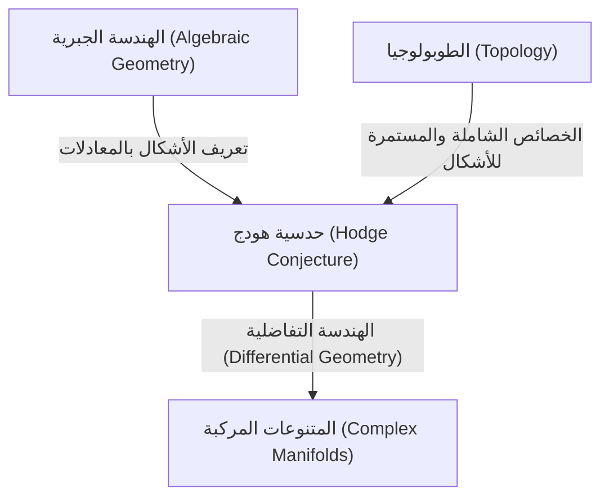
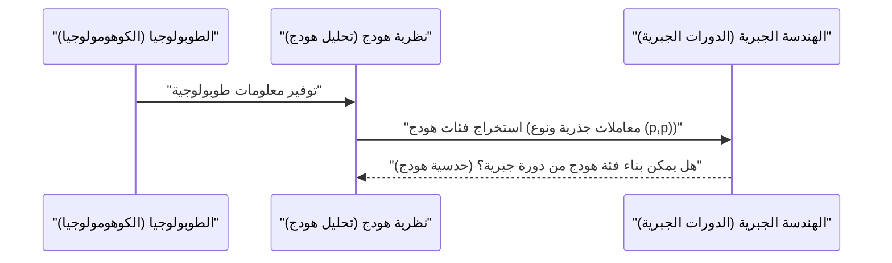

# مقدمة

في عالم الرياضيات، هناك العديد من الألغاز التي لم تُحل بعد. ومن بين أهم هذه الألغاز التي تقف كجدار كبير في الرياضيات الحديثة هي **مسائل جائزة الألفية** (Millennium Prize Problems). هذه المسائل السبع غير المحلولة، والتي أعلن عنها معهد كلاي للرياضيات في عام 2000، تحمل كل منها جائزة قدرها مليون دولار، ويتحدى علماء الرياضيات العباقرة في جميع أنحاء العالم لحلها. في هذا المقال، سنتعمق في إحدى مسائل جائزة الألفية، وهي حدسية جميلة للغاية تربط بين الهندسة الجبرية والطوبولوجيا، ألا وهي **حدسية هودج** ([Hodge Conjecture](https://kenji.blog/ar/p/hodge-conjecture/)).

باختصار، حدسية هودج هي حدسية تتعلق بالعلاقة العميقة بين "الأشكال الهندسية" و"المعادلات الجبرية". وبشكل أكثر دقة، فهي تتساءل عما إذا كان يمكن التعبير عن كائنات ذات خصائص طوبولوجية معينة من خلال مجموعة من المتنوعات الجزئية الجبرية في متنوع جبري إسقاطي غير شاذ على حقل الأعداد المركبة.

## 1. نقطة التقاطع بين الهندسة الجبرية والطوبولوجيا

لفهم حدسية هودج، يجب علينا أولاً أن نعرف العلاقة بين فرعين من الرياضيات: **الهندسة الجبرية** (Algebraic Geometry) و **الطوبولوجيا** (Topology).

الهندسة الجبرية هي مجال يدرس الأشكال (المتنوعات الجبرية) المعرفة كأصفار مشتركة لمعادلات متعددة الحدود. على سبيل المثال، معادلة الدائرة x^2 + y^2 = 1 هي واحدة من أبسط المتنوعات الجبرية.

من ناحية أخرى، الطوبولوجيا هي مجال يدرس الخصائص التي يتم الحفاظ عليها حتى عند تشويه الأشكال بشكل مستمر. وكما يقول المثال الشهير "فنجان القهوة وكعكة الدونات لهما نفس الشكل طوبولوجياً"، فهي تركز على الخصائص العامة مثل عدد الثقوب والترابط.

تقع حدسية هودج في نقطة التقاطع بين هذين المجالين المختلفين.

## 2. صياغة حدسية هودج

لشرح حدسية هودج بدقة، نحتاج إلى تقديم بعض المفاهيم المتخصصة.

### 2.1 المتنوعات الإسقاطية المركبة

المسرح هنا هو **المتنوع الجبري الإسقاطي غير الشاذ على حقل الأعداد المركبة**. لنطلق عليه X.
المتنوع المركب هو فضاء يمكن اعتباره محلياً كفضاء مركب \mathbb{C}^n. كونه متنوعاً إسقاطياً يعني أنه مغمور في فضاء إسقاطي \mathbb{P}^N(\mathbb{C}) كأصفار مشتركة لعدة متعددات حدود متجانسة. كونه غير شاذ يعني أنه شكل أملس بدون "نقاط شاذة" مثل الرؤوس المدببة أو التقاطعات الذاتية.

### 2.2 كوهومولوجيا دي رام وتحليل هودج

الأداة القوية لدراسة طوبولوجيا المتنوع X هي **الكوهومولوجيا** (Cohomology). على وجه الخصوص، تُعرَّف زمر كوهومولوجيا دي رام H^k(X, \mathbb{C}) ذات المعاملات في حقل الأعداد الحقيقية أو المركبة باستخدام الصيغ التفاضلية على المتنوع.

أظهر ويليام هودج (W. V. D. Hodge) أنه يمكن تحليل زمرة الكوهومولوجيا المركبة هذه إلى زمر أدق تعكس البنية المركبة. هذا هو **تحليل هودج** (Hodge Decomposition).

 H^k(X, \mathbb{C}) = \bigoplus_{p+q=k} H^{p,q}(X) 

هنا، يمثل H^{p,q}(X) فئة الصيغ التفاضلية التي تتكون من الجداء الإسفيني لـ p من التفاضلات التحليلية و q من التفاضلات المرافقة للتحليلية.

### 2.3 الدورات الجبرية وفئات هودج

يُطلق على التركيبة الخطية الشكلية لمتنوعات جبرية (متنوعات جزئية) ذات أبعاد أقل داخل المتنوع X اسم **الدورة الجبرية** (Algebraic Cycle).

الدورة الجبرية من البعد k، بواسطة ثنائية بوانكاريه (Poincaré Duality)، تحدد عنصراً في زمرة الكوهومولوجيا من الدرجة 2k لـ X. الشيء المهم هو أن فئة الكوهومولوجيا المحددة بواسطة متنوع جزئي جبري تظهر فقط في مكون معين في تحليل هودج. على وجه التحديد، فئة الكوهومولوجيا المحددة بواسطة متنوع جزئي جبري ذو بُعد مرافق (البعد الكلي ناقص بعد المتنوع الجزئي) يساوي p، تنتمي إلى المكون H^{p,p}(X).

علاوة على ذلك، نظراً لأن الدورات الجبرية مُعرَّفة من المعادلات، يمكن اعتبار معاملاتها كأعداد جذرية (أو صحيحة). لذلك، فإن فئة الكوهومولوجيا المحددة من الدورة الجبرية تنتمي أيضاً إلى زمرة الكوهومولوجيا ذات المعاملات الجذرية H^{2p}(X, \mathbb{Q}).

فئة الكوهومولوجيا التي تستوفي هذين الشرطين، أي التي تنتمي إلى

 \text{هودج}^{p,p}(X) = H^{2p}(X, \mathbb{Q}) \cap H^{p,p}(X) 

تُسمى **فئة هودج** (Hodge Class).

## 3. إدعاء حدسية هودج

لقد اكتملت التحضيرات. إدعاء حدسية هودج بسيط للغاية، ولكنه قوي بشكل مذهل.

> **[حدسية هودج ([Hodge Conjecture](https://kenji.blog/ar/p/hodge-conjecture/))](https://kenji.blog/p/hodge-conjecture/)**
> أي فئة هودج على متنوع جبري إسقاطي غير شاذ X على حقل الأعداد المركبة، يمكن التعبير عنها كتركيبة خطية بمعاملات جذرية من الدورات الجبرية.

بعبارة أخرى، تدعي الحدسية أن "فئات الكوهومولوجيا (فئات هودج) التي تبدو وكأنها هندسة جبرية من منظور الطوبولوجيا والتحليل المركب، تنشأ في الواقع من أشكال (دورات جبرية) مبنية من معادلات جبرية".

إنه سؤال حول ما إذا كان يمكن بناء فئات الكوهومولوجيا، وهي كائنات من عالم الطوبولوجيا، من معادلات متعددة الحدود، وهي كائنات من عالم الهندسة الجبرية.

## 4. تطور وصعوبة حدسية هودج

اقترح هودج نفسه هذه الحدسية في المؤتمر الدولي لعلماء الرياضيات في عام 1950. ومنذ ذلك الحين، تعامل العديد من علماء الرياضيات مع هذه المشكلة، ولكن حتى الآن لم يتم التوصل إلى حل كامل.

### 4.1 الحالات المحلولة

بالنسبة لبعض الحالات الخاصة، تم إثبات صحة حدسية هودج.
- **في حالة p=1 (مبرهنة ليفشيتز)**: بالنسبة للدورات الجبرية ذات البعد المرافق 1 (والتي تسمى القواسم)، أثبتها سولومون ليفشيتز (Solomon Lefschetz) في عشرينيات القرن الماضي، حتى قبل صياغة هودج. يُعرف هذا باسم **مبرهنة ليفشيتز (1,1)** (Lefschetz (1,1)-theorem)، ويمكن اعتباره أصل حدسية هودج.
- **النتائج المتعلقة بمتنوعات معينة**: على سبيل المثال، تم التأكد من صحة حدسية هودج لفئات معينة من المتنوعات، مثل المتنوعات الأبيلية وبعض أسطح K3.

### 4.2 لماذا هي صعبة؟

تكمن صعوبة حدسية هودج في صعوبة إثبات الوجود. عندما تُعطى فئة هودج معينة، يجب إثبات أن الدورة الجبرية المقابلة لها **موجودة**. ومع ذلك، تُعطى فئة هودج فقط كبيانات تحليلية وطوبولوجية مثل التكاملات والصيغ التفاضلية، في حين تتكون الدورة الجبرية من بيانات جبرية وهي معادلات متعددة الحدود.

الأسلوب العام لإعادة بناء معادلات جبرية محددة من بيانات تحليلية لم يُكتشف بعد حتى في الرياضيات الحديثة.

## 5. تعميم حدسية هودج والمسائل ذات الصلة

هناك العديد من التعميمات والحدسيات المتعلقة بحدسية هودج.

- **حدسية هودج المعممة (Generalized [Hodge Conjecture](https://kenji.blog/ar/p/hodge-conjecture/))**: محاولة لتوسيع حدسية هودج إلى إطار أكثر عمومية (على سبيل المثال، المتنوعات ذات النقاط الشاذة، المتنوعات المفتوحة، إلخ). تمت صياغتها من قبل [ألكسندر غروتينديك](https://kenji.blog/ar/p/grothendieck/) ([Alexander Grothendieck](https://kenji.blog/ar/p/grothendieck/)) وآخرين، ولكن تم العثور على أمثلة مضادة، مما جعل الصياغة المناسبة بحد ذاتها تحدياً صعباً.
- **حدسية تيت (Tate Conjecture)**: يُعرف النظير في نظرية الأعداد لحدسية هودج باسم حدسية تيت. وتصاغ باستخدام مفهوم كوهومولوجيا إيتال (Étale Cohomology) للمتنوعات على الحقول المنتهية بدلاً من المتنوعات على حقل الأعداد المركبة. هذه أيضاً مسألة غير محلولة بالغة الصعوبة.

## 6. الخلاصة والنظرة المستقبلية

حدسية هودج ليست مجرد لغز، بل هي مسألة مهمة تلامس أعماق الرياضيات. إذا كانت هذه الحدسية صحيحة، فهذا يعني وجود رابطة أساسية وجميلة لم نفهمها بعد بين الطوبولوجيا والهندسة الجبرية.

ومع وجود الجائزة المغرية البالغة مليون دولار، سيستمر علماء الرياضيات حول العالم في تحدي هذه المسألة الصعبة. بناء نظريات رياضية جديدة، أو اقتراب من مجالات غير متوقعة تماماً، قد يفتح يوماً ما باب مسألة جائزة الألفية هذه. يحمل حل حدسية هودج في طياته إمكانية إحداث تقدم ثوري في الرياضيات بأكملها.

نأمل أن يكون هذا المقال قد أثار اهتمامكم بهذا العالم الرياضي العميق.

## 7. أمثلة محددة لفهم حدسية هودج بشكل أعمق

قد يكون من الصعب فهم الطبيعة الحقيقية لحدسية هودج من خلال تعريفها المجرد فقط. هنا، على الرغم من أنه سيكون تقنياً بعض الشيء، دعونا نتعمق أكثر في معنى حدسية هودج من خلال بعض الأمثلة المحددة.

### 7.1 الطارة والمنحنيات الإهليلجية

من أبسط الأمثلة وأكثرها قابلية للفهم هو المتنوع المركب أحادي البعد، أي **سطح ريمان** (Riemann Surface). من بينها، تُعرف الطارة (على شكل دونات) ذات الجنس (عدد الثقوب) 1 في الهندسة الجبرية باسم **المنحنى الإهليلجي** (Elliptic Curve).

في حالة المنحنى الإهليلجي E، يكون البعد المركب 1 (والبعد الحقيقي 2). عند النظر في زمر الكوهومولوجيا، فإن ما يثير الاهتمام هو زمرة الكوهومولوجيا من الدرجة الأولى H^1(E, \mathbb{C})، ذات البعد المتوسط، ولكن حدسية هودج تستهدف زمر الكوهومولوجيا ذات الأبعاد الكلية الزوجية. لذلك، في المنحنى الإهليلجي نفسه (بعد مركب 1)، لا تظهر عبارة غير بديهية لحدسية هودج.

ومع ذلك، دعونا نعتبر فضاء الجداء الديكارتي X = E_1 \times E_2 بين منحنيين إهليلجيين. يصبح البعد المركب هنا 2 (والبعد الحقيقي 4)، مما يوفر مسرحاً مثيراً للاهتمام. يمكننا تطبيق حدسية هودج على زمرة الكوهومولوجيا من الدرجة الثانية H^2(X, \mathbb{Q}) لهذا الفضاء X.

ترتبط فئات هودج على X بنماذج تقاطع تستوفي شروطاً معينة. في هذه الحالة، تكون الدورة الجبرية المقابلة لفئة هودج عبارة عن منحنى داخل X. إذا كان E_1 و E_2 في علاقة خاصة (على سبيل المثال، لديهما ضرب مركب)، فقد تم إثبات وجود العديد من المنحنيات غير البديهية (الدورات الجبرية) في فضاء الجداء والتي تولد فئات هودج. هذا أحد الأمثلة المهمة لحدسية هودج.

### 7.2 أسطح K3 وفضاءات المعاملات (Moduli Spaces)

أكثر تعقيداً وتلعب دوراً حاسماً في الرياضيات الحديثة هي **أسطح K3** (K3 Surfaces). سطح K3 هو أبسط مثال لمتنوعات كالابي-ياو ذات البعد المركب 2 (البعد الحقيقي 4)، وهو أيضاً كائن مهم في الفيزياء مثل نظرية الأوتار (String Theory).

تم بالفعل إثبات حدسية هودج لأسطح K3. ومع ذلك، فإن بنية هودج لأسطح K3 قوية لدرجة أنها تحدد هندستها (مبرهنة توريلي، Torelli Theorem)، وتأسيس حدسية هودج يجلب فهماً عميقاً لأسطح K3. تتحقق فئات هودج على سطح K3 بالكامل كفئات من المنحنيات الجبرية الموجودة على هذا السطح.

علاوة على ذلك، من خلال النظر في عائلات أسطح K3 (مجموعة أسطح K3 التي يتم الحصول عليها عند تغيير المعلمات)، نصل إلى مفهوم **فضاء المعاملات** (Moduli Space). تتشابك نظرية هودج على فضاءات المعاملات وحدسية هودج للمتنوعات الفردية بشكل وثيق، لتشكل طليعة الهندسة الجبرية.

## 8. الروابط مع المسائل غير المحلولة في الهندسة الجبرية

حدسية هودج ليست مسألة معزولة، بل ترتبط بعمق بالعديد من الحدسيات الرياضية المهمة الأخرى.

### 8.1 حدسيات غروتينديك القياسية (Grothendieck's Standard Conjectures)

وضع [ألكسندر غروتينديك](https://kenji.blog/ar/p/grothendieck/) سلسلة من الحدسيات الكبرى حول الدورات الجبرية على المتنوعات الجبرية. هذه هي **الحدسيات القياسية** (Standard Conjectures on Algebraic Cycles).

تتضمن الحدسيات القياسية نظرية التقاطع للدورات الجبرية وتعميمات مبرهنة ليفشيتز لأي بُعد. إذا كانت حدسية هودج صحيحة، فيُعتقد أن جزءاً من الحدسيات القياسية سيتبع للمتنوعات على حقل الأعداد المركبة. وعلى العكس من ذلك، إذا تم حل الحدسيات القياسية، فستوفر أداة قوية لحدسية هودج. هذه قطع أساسية لإكمال "نظرية الدوافع" (Theory of Motives)، وهو الهدف النهائي في الهندسة الجبرية.

### 8.2 حدسية ميلنور ونظرية K الجبرية (Milnor Conjecture and Algebraic K-Theory)

على الرغم من اختلاف طبيعتها قليلاً، إلا أن حدسية ميلنور (Milnor Conjecture)، التي حلها فلاديمير فويفودسكي (Vladimir Voevodsky)، وتعميمها حدسية بلوخ-كاتو (Bloch-Kato Conjecture)، ربطت بين نظرية K الجبرية وكوهومولوجيا غالوا.

بنى عمل فويفودسكي إطاراً جديداً يسمى "الكوهومولوجيا الدافعية" (Motivic Cohomology)، وعزز الرابطة بين الهندسة الجبرية والطوبولوجيا. يضع هذا المنظور الدافعي حدسية هودج ضمن نظرية أعم للدورات الجبرية، وأصبح نهجاً لا غنى عنه في البحث الحديث حول حدسية هودج.

## 9. من منظور الطوبولوجيا والتحليل الرياضي

من المهم النظر إلى حدسية هودج ليس فقط من الهندسة الجبرية، ولكن أيضاً من منظور الطوبولوجيا والتحليل.

### 9.1 التقاطع مع نظرية النقاط الشاذة

عند السماح بوجود نقاط شاذة (Singularities) في المتنوعات، تتطور نظرية هودج إلى نظرية **بنية هودج المختلطة** (Mixed Hodge Structure). هذه نظرية جميلة بناها بيير ديلين (Pierre Deligne)، وتقدم بنية هرمية جديدة تسمى الوزن (Weight) في كوهومولوجيا الفضاءات ذات النقاط الشاذة.

تعد نظرية بنية هودج المختلطة أداة قوية لوصف التغيرات في الكوهومولوجيا في النهاية التي تتدهور فيها المتنوعات (على سبيل المثال، العملية التي ينهار فيها السطح الأملس تدريجياً ليصبح سطحاً ذا نقاط شاذة). في محاولة لتوسيع حدسية هودج، تلعب نظرية النقاط الشاذة وبنى هودج المختلطة دوراً مهماً، وهي ضرورية لفهم الظواهر الهندسية بشكل تحليلي.

### 9.2 فضاء التويستر والهندسة التفاضلية (Twistor Space and Differential Geometry)

نظرية التويستر (Twistor Theory)، التي اقترحها روجر بنروز (Roger Penrose)، هي محاولة لترجمة هندسة الزمكان إلى هندسة تحليلية على الفضاءات الإسقاطية المركبة. يربط فضاء التويستر الهندسة التفاضلية ونظرية المتنوعات المركبة بشكل قوي.

تستند حدسية هودج إلى الصيغ التفاضلية (تحليل هودج) على المتنوعات المركبة، ولكن من منظور الهندسة التفاضلية، تُفهم هذه على أنها صيغ توافقية لمؤثر لابلاس. تكمن النظرية القوية للتحليل الرياضي المتمثلة في نظرية التكامل التوافقي وراء تحليل هودج، ويتوقع بعض الباحثين أن البنى الهندسية التفاضلية مثل فضاء التويستر قد توفر طرقاً تحليلية جديدة لبناء فئات هودج في المستقبل.

## 10. تطلعات المستقبل: متى ستُحل حدسية هودج؟

لقد مرت بالفعل أكثر من 70 عاماً منذ اقتراح حدسية هودج. وعلى الرغم من بناء العديد من النتائج الجزئية والنظريات القوية ذات الصلة (مثل الكوهومولوجيا الدافعية وبنى هودج المختلطة)، لم يتم التوصل إلى إثبات كامل للمتنوعات الإسقاطية غير الشاذة العامة.

يشك بعض علماء الرياضيات في "احتمال وجود مثال مضاد لحدسية هودج". إذا تم العثور على مثال مضاد، فسيشكل ذلك صدمة كبيرة لمجتمع الرياضيات، وسيُجبرنا على مراجعة فهمنا للعلاقة بين الطوبولوجيا والهندسة الجبرية من جذوره.

ومع ذلك، يعتقد معظم علماء الرياضيات أن حدسية هودج صحيحة، ويستكشفون نماذج رياضية جديدة نحو إثباتها. تتربع حدسية هودج في النقطة المركزية التي تندمج فيها مجالات متنوعة مثل الهندسة الجبرية، الطوبولوجيا، التحليل المركب، وحتى نظرية الأعداد والفيزياء الرياضية.

لا أحد يعلم متى سيأتي اليوم الذي تُحل فيه هذه المسألة. ومع ذلك، فإن الأفكار الرياضية الجديدة التي تولدت خلال عملية تحدي حدسية هودج ستثري المعرفة البشرية بلا شك وستصبح حجر الأساس لرياضيات الجيل القادم. إن القيمة التي تزيد عن مليون دولار الموضوعة على مسألة جائزة الألفية هذه موجودة هناك بالتأكيد.
