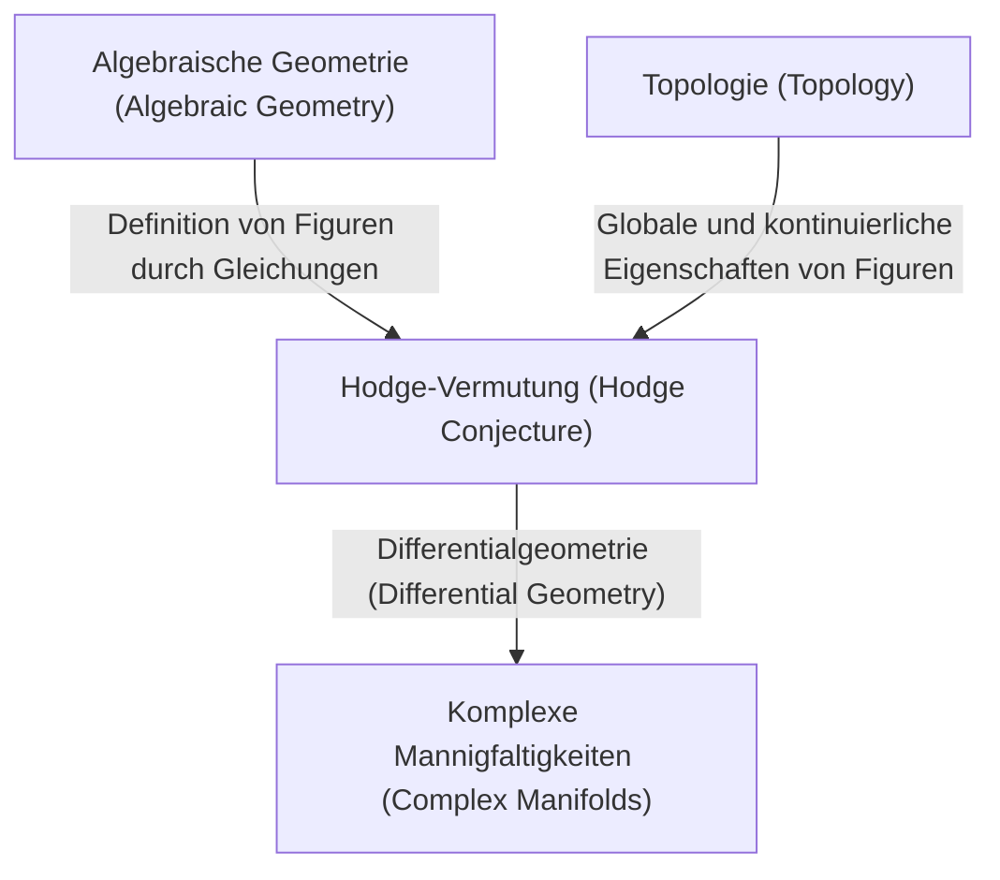
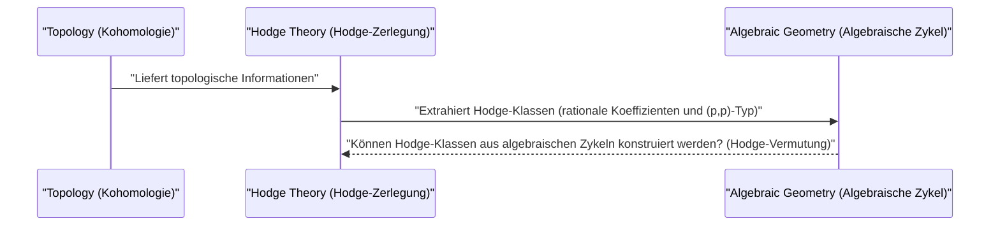

# Einführung

In der Welt der Mathematik gibt es viele noch ungelöste Rätsel. Eines der wichtigsten und als große Mauer in der modernen Mathematik stehenden ist ein **Millennium-Problem** (Millennium Prize Problems). Die sieben ungelösten Probleme, die im Jahr 2000 vom Clay Mathematics Institute angekündigt wurden, sind mit einem Preisgeld von jeweils einer Million Dollar dotiert, und brillante Mathematiker auf der ganzen Welt versuchen, sie zu lösen. In diesem Artikel werden wir uns eingehend mit einem dieser Millennium-Probleme befassen, der **Hodge-Vermutung** ([Hodge Conjecture](https://kenji.blog/de/p/hodge-conjecture/)), einer sehr schönen Vermutung, die die algebraische Geometrie und die Topologie verbindet.

Zusammenfassend lässt sich sagen, dass es sich bei der Hodge-Vermutung um eine Vermutung über die tiefe Beziehung zwischen "geometrischen Formen" und "algebraischen Gleichungen" handelt. Genauer gesagt stellt sie die Frage, ob Objekte mit bestimmten topologischen Eigenschaften auf einer nicht-singulären projektiven algebraischen Varietät über dem Körper der komplexen Zahlen als Kombinationen von algebraischen Untervarietäten dargestellt werden können.

## 1. Der Schnittpunkt von algebraischer Geometrie und Topologie

Um die Hodge-Vermutung zu verstehen, muss man zunächst die Beziehung zwischen zwei Bereichen der Mathematik kennen: der **algebraischen Geometrie** (Algebraic Geometry) und der **Topologie** (Topology).

Die algebraische Geometrie ist das Gebiet, das geometrische Figuren (algebraische Varietäten) untersucht, die als gemeinsame Nullstellen von Polynomgleichungen definiert sind. Zum Beispiel ist die Gleichung eines Kreises x^2 + y^2 = 1 eine der einfachsten algebraischen Varietäten.

Auf der anderen Seite ist die Topologie das Gebiet, das Eigenschaften untersucht, die auch bei kontinuierlicher Verformung der Figur erhalten bleiben. Wie die berühmte Analogie besagt: "Eine Kaffeetasse und ein Donut haben topologisch dieselbe Form." Sie konzentriert sich auf globale Eigenschaften wie die Anzahl der Löcher und die Konnektivität.

Die Hodge-Vermutung existiert genau an dem Punkt, an dem sich diese beiden unterschiedlichen Bereiche kreuzen.

## 2. Formulierung der Hodge-Vermutung

Um die Hodge-Vermutung genau zu formulieren, müssen einige Fachbegriffe eingeführt werden.

### 2.1 Komplexe projektive Varietäten

Die Bühne bildet eine **nicht-singuläre projektive algebraische Varietät über dem Körper der komplexen Zahlen**. Nennen wir sie X.
Eine komplexe Mannigfaltigkeit ist ein Raum, der lokal als ein komplexer Raum \mathbb{C}^n betrachtet werden kann. Dass sie eine projektive Varietät ist, bedeutet, dass sie in einen projektiven Raum \mathbb{P}^N(\mathbb{C}) als gemeinsame Nullstelle mehrerer homogener Polynome eingebettet ist. Dass sie nicht-singulär ist, bedeutet, dass es sich um eine glatte Figur ohne "Singularitäten" wie Spitzen oder Selbstdurchdringungen handelt.

### 2.2 De-Rham-Kohomologie und Hodge-Zerlegung

Ein leistungsfähiges Werkzeug zur Untersuchung der Topologie einer Mannigfaltigkeit X ist die **Kohomologie** (Cohomology). Insbesondere werden die De-Rham-Kohomologiegruppen H^k(X, \mathbb{C}) mit Koeffizienten im Körper der reellen oder komplexen Zahlen mithilfe von Differentialformen auf der Mannigfaltigkeit definiert.

William Hodge (W. V. D. Hodge) zeigte, dass diese komplexen Kohomologiegruppen in feinere Gruppen zerlegt werden können, die die komplexe Struktur widerspiegeln. Dies ist die **Hodge-Zerlegung** (Hodge Decomposition).

 H^k(X, \mathbb{C}) = \bigoplus_{p+q=k} H^{p,q}(X) 

Hierbei stellt H^{p,q}(X) eine Klasse von Differentialformen dar, die aus dem Dachprodukt von p holomorphen Differentialen und q anti-holomorphen Differentialen besteht.

### 2.3 Algebraische Zykel und Hodge-Klassen

Formale Linearkombinationen von algebraischen Varietäten (Untervarietäten) niedrigerer Dimensionen in einer Mannigfaltigkeit X nennt man **algebraische Zykel** (Algebraic Cycle).

Ein algebraischer Zykel der Dimension k bestimmt aufgrund der [Poincaré](https://kenji.blog/de/p/poincare/)-Dualität ([Poincaré](https://kenji.blog/de/p/poincare/) Duality) ein Element der 2k-ten Kohomologiegruppe von X. Wichtig ist die Tatsache, dass die durch algebraische Untervarietäten bestimmten Kohomologieklassen nur in bestimmten Komponenten der Hodge-Zerlegung erscheinen. Genauer gesagt gehört eine Kohomologieklasse, die durch eine algebraische Untervarietät mit Kodimension p (Gesamtdimension minus Dimension der Untervarietät) bestimmt ist, zu der Komponente H^{p,p}(X).

Darüber hinaus können, da algebraische Zykel aus Gleichungen definiert sind, ihre Koeffizienten als rationale Zahlen (oder ganze Zahlen) betrachtet werden. Daher gehören Kohomologieklassen, die durch algebraische Zykel bestimmt sind, auch zur Kohomologiegruppe mit rationalen Koeffizienten H^{2p}(X, \mathbb{Q}).

Eine Kohomologieklasse, die diese beiden Bedingungen erfüllt, also zu

 \text{Hodge}^{p,p}(X) = H^{2p}(X, \mathbb{Q}) \cap H^{p,p}(X) 

gehört, nennt man eine **Hodge-Klasse** (Hodge Class).

## 3. Die Aussage der Hodge-Vermutung

Wir sind nun vorbereitet. Die Aussage der Hodge-Vermutung ist sehr einfach, aber erstaunlich mächtig.

> **[Hodge-Vermutung (Hodge Conjecture)](https://kenji.blog/p/hodge-conjecture/)**
> Jede Hodge-Klasse auf einer nicht-singulären projektiven algebraischen Varietät X über dem Körper der komplexen Zahlen kann als Linearkombination von algebraischen Zykeln mit rationalen Koeffizienten dargestellt werden.

Mit anderen Worten wird behauptet: "Kohomologieklassen (Hodge-Klassen), die aus Sicht der Topologie und komplexen Analysis algebraisch-geometrisch aussehen, stammen tatsächlich von Figuren (algebraischen Zykeln), die durch algebraische Gleichungen konstruiert wurden."

Es ist die Frage, ob Kohomologieklassen, die Objekte der Welt der Topologie sind, aus Polynomgleichungen konstruiert werden können, die Objekte der Welt der algebraischen Geometrie sind.

## 4. Fortschritte und Schwierigkeiten der Hodge-Vermutung

Die Hodge-Vermutung wurde 1950 von Hodge selbst auf dem Internationalen Mathematikerkongress vorgeschlagen. Seitdem haben viele Mathematiker an diesem Problem gearbeitet, aber bis heute ist es nicht vollständig gelöst.

### 4.1 Gelöste Fälle

Für einige spezielle Fälle wurde bewiesen, dass die Hodge-Vermutung wahr ist.
- **Fall p=1 (Satz von Lefschetz)**: Für algebraische Zykel mit Kodimension 1 (sogenannte Divisoren) wurde dies bereits in den 1920er Jahren von Solomon Lefschetz (Solomon Lefschetz) vor Hodges Formulierung bewiesen. Dies wird als **Satz von Lefschetz vom Typ (1,1)** (Lefschetz (1,1)-theorem) bezeichnet und kann als Ursprung der Hodge-Vermutung angesehen werden.
- **Ergebnisse für bestimmte Mannigfaltigkeiten**: Beispielsweise wurde bestätigt, dass die Hodge-Vermutung für bestimmte Klassen von Mannigfaltigkeiten gilt, wie abelsche Varietäten und einige K3-Flächen.

### 4.2 Warum ist es schwierig?

Die Schwierigkeit der Hodge-Vermutung liegt in der Schwierigkeit von Existenzbeweisen. Wenn eine Hodge-Klasse gegeben ist, muss gezeigt werden, dass ein entsprechender algebraischer Zykel **existiert**. Während Hodge-Klassen jedoch lediglich als analytische und topologische Daten wie Integrale und Differentialformen angegeben werden, werden algebraische Zykel aus algebraischen Daten, d. h. Polynomgleichungen, konstruiert.

Eine allgemeine Methode zur Rekonstruktion spezifischer algebraischer Gleichungen aus analytischen Daten ist in der modernen Mathematik noch immer nicht gefunden worden.

## 5. Verallgemeinerungen der Hodge-Vermutung und verwandte Probleme

Es gibt verschiedene Verallgemeinerungen und verwandte Vermutungen zur Hodge-Vermutung.

- **Verallgemeinerte Hodge-Vermutung (Generalized [Hodge Conjecture](https://kenji.blog/de/p/hodge-conjecture/))**: Dies ist ein Versuch, die Hodge-Vermutung auf einen allgemeineren Rahmen (z. B. Mannigfaltigkeiten mit Singularitäten oder offene Mannigfaltigkeiten) zu erweitern. Sie wurde von Alexander Grothendieck ([Alexander Grothendieck](https://kenji.blog/de/p/grothendieck/)) und anderen formuliert, aber es wurden Gegenbeispiele gefunden, was die Formulierung selbst zu einer schwierigen Aufgabe macht.
- **Tate-Vermutung (Tate Conjecture)**: Bekannt als ein zahlentheoretisches Analogon der Hodge-Vermutung. Sie ist nicht für Mannigfaltigkeiten über dem Körper der komplexen Zahlen formuliert, sondern für Mannigfaltigkeiten über endlichen Körpern, unter Verwendung des Konzepts der Étale-Kohomologie (Étale Cohomology). Dies ist ebenfalls ein extrem schwieriges, ungelöstes Problem.

## 6. Zusammenfassung und zukünftige Aussichten

Die Hodge-Vermutung ist nicht nur ein Rätsel, sondern ein wichtiges Problem, das die Tiefen der Mathematik berührt. Wenn diese Vermutung wahr ist, bedeutet dies, dass es eine grundlegende und schöne Verbindung zwischen Topologie und algebraischer Geometrie gibt, die wir noch nicht verstanden haben.

Auch dank des attraktiven Preisgeldes von einer Million Dollar werden Mathematiker aus aller Welt dieses schwierige Problem weiterhin in Angriff nehmen. Vielleicht werden die Konstruktion neuer mathematischer Theorien oder völlig unerwartete Ansätze aus anderen Bereichen eines Tages die Tür zu diesem Millennium-Problem öffnen. Die Lösung der Hodge-Vermutung hat das Potenzial, einen revolutionären Fortschritt für die gesamte Mathematik zu bringen.

Wir hoffen, dass auch Sie, liebe Leser, ein wenig Interesse an dieser tiefgründigen Welt der Mathematik gefunden haben.

## 7. Konkrete Beispiele für ein tieferes Verständnis der Hodge-Vermutung

Es mag schwierig sein, die Essenz der Hodge-Vermutung allein anhand ihrer abstrakten Definition zu begreifen. Hier wollen wir die Bedeutung der Hodge-Vermutung anhand einiger konkreter Beispiele weiter vertiefen, auch wenn es etwas fachspezifischer wird.

### 7.1 Tori und elliptische Kurven

Eines der einfachsten und am leichtesten verständlichen Beispiele ist eine eindimensionale komplexe Mannigfaltigkeit, d. h. eine **[Riemann](https://kenji.blog/de/p/riemann/)sche Fläche** ([Riemann](https://kenji.blog/de/p/riemann/) Surface). Darunter ist ein Torus (Donut-Form) mit dem Geschlecht (Anzahl der Löcher) 1 in der algebraischen Geometrie als **elliptische Kurve** (Elliptic Curve) bekannt.

Im Falle einer elliptischen Kurve E ist die komplexe Dimension 1 (die reelle Dimension ist 2). Betrachtet man die Kohomologiegruppen, ist die interessanteste die Kohomologiegruppe vom Grad 1 der mittleren Dimension, H^1(E, \mathbb{C}). Die Hodge-Vermutung zielt jedoch auf Kohomologiegruppen mit einer geraden Gesamtdimension ab. Daher gibt es in der elliptischen Kurve selbst (komplexe Dimension 1) keine nicht-triviale Aussage zur Hodge-Vermutung.

Betrachten wir jedoch den direkten Produktraum X = E_1 \times E_2 von zwei elliptischen Kurven. Hierbei wird die komplexe Dimension zu 2 (die reelle Dimension zu 4), was eine interessante Bühne darstellt. Auf die zweite Kohomologiegruppe H^2(X, \mathbb{Q}) dieses Raumes X kann die Hodge-Vermutung angewendet werden.

Hodge-Klassen auf X sind mit Schnittformen verbunden, die bestimmte Bedingungen erfüllen. In diesem Fall ist der algebraische Zykel, der der Hodge-Klasse entspricht, eine Kurve in X. Wenn E_1 und E_2 eine spezielle Beziehung haben (z. B. komplexe Multiplikation), wurde bewiesen, dass es viele nicht-triviale Kurven (algebraische Zykel) in dem direkten Produktraum gibt und diese die Hodge-Klassen erzeugen. Dies ist eines der wichtigen Beispiele für die Hodge-Vermutung.

### 7.2 K3-Flächen und Modulräume

Noch komplexer und spielen in der modernen Mathematik eine äußerst wichtige Rolle sind **K3-Flächen** (K3 Surface). Eine K3-Fläche ist das einfachste Beispiel einer Calabi-Yau-Mannigfaltigkeit mit der komplexen Dimension 2 (reelle Dimension 4) und ist auch ein wichtiges Objekt in der Physik, wie z. B. in der Stringtheorie (String Theory).

Für K3-Flächen ist die Hodge-Vermutung bereits bewiesen. Die Hodge-Struktur einer K3-Fläche ist jedoch so stark, dass sie deren Geometrie bestimmt (Satz von Torelli, Torelli Theorem), und das Bestehen der Hodge-Vermutung führt zu einem tiefen Verständnis der K3-Flächen. Hodge-Klassen auf K3-Flächen werden vollständig als Klassen von algebraischen Kurven realisiert, die auf diesen Flächen existieren.

Darüber hinaus gelangt man durch die Betrachtung der Familie von K3-Flächen (die Menge der K3-Flächen, die durch Variation von Parametern erhalten werden) zu dem Konzept eines **Modulraums** (Moduli Space). Die Hodge-Theorie auf Modulräumen und die Hodge-Vermutung einzelner Mannigfaltigkeiten sind eng miteinander verwoben und bilden die vorderste Front der algebraischen Geometrie.

## 8. Verbindungen zu ungelösten Problemen in der algebraischen Geometrie

Die Hodge-Vermutung ist kein isoliertes Problem, sondern tief mit vielen anderen wichtigen mathematischen Vermutungen verbunden.

### 8.1 Grothendiecks Standardvermutungen (Grothendieck's Standard Conjectures)

[Alexander Grothendieck](https://kenji.blog/de/p/grothendieck/) formulierte eine Reihe großartiger Vermutungen über algebraische Zykel auf algebraischen Varietäten. Dies sind die **Standardvermutungen** (Standard Conjectures on Algebraic Cycles).

Die Standardvermutungen umfassen die Schnitttheorie algebraischer Zykel und die Verallgemeinerung des Satzes von Lefschetz auf beliebige Dimensionen. Wenn die Hodge-Vermutung wahr ist, wird angenommen, dass für Mannigfaltigkeiten über dem Körper der komplexen Zahlen ein Teil der Standardvermutungen daraus folgt. Umgekehrt, wenn die Standardvermutungen gelöst sind, würden sie ein starkes Werkzeug für die Hodge-Vermutung liefern. Dies sind unverzichtbare Puzzleteile für die Vollendung der "Motivtheorie" (Theory of Motives), dem ultimativen Ziel der algebraischen Geometrie.

### 8.2 Milnor-Vermutung und algebraische K-Theorie (Milnor Conjecture and Algebraic K-Theory)

Ein wenig anders, aber die Milnor-Vermutung (Milnor Conjecture), die von Vladimir Voevodsky gelöst wurde, und ihre Verallgemeinerung, die Bloch-Kato-Vermutung (Bloch-Kato Conjecture), verbanden die algebraische K-Theorie mit der [Galois](https://kenji.blog/de/p/galois/)-Kohomologie.

Voevodskys Arbeit schuf einen neuen Rahmen namens "motivische Kohomologie" (Motivic Cohomology) und stärkte die Verbindung zwischen algebraischer Geometrie und Topologie weiter. Diese motivische Perspektive ordnet die Hodge-Vermutung in eine allgemeinere Theorie der algebraischen Zykel ein und ist zu einem unverzichtbaren Ansatz in der modernen Erforschung der Hodge-Vermutung geworden.

## 9. Aus der Perspektive von Topologie und Analysis

Es ist wichtig, die Hodge-Vermutung nicht nur aus der algebraischen Geometrie, sondern auch aus der Perspektive der Topologie und Analysis zu betrachten.

### 9.1 Überschneidungen mit der Singularitätentheorie

Wenn Singularitäten (Singularities) auf einer Mannigfaltigkeit zugelassen werden, entwickelt sich die Hodge-Theorie zu einer Theorie der **gemischten Hodge-Strukturen** (Mixed Hodge Structure). Dies ist eine wunderschöne Theorie, die von Pierre Deligne (Pierre Deligne) entwickelt wurde und eine neue hierarchische Struktur, das sogenannte Gewicht (Weight), auch für die Kohomologie von Räumen mit Singularitäten einführt.

Die Theorie der gemischten Hodge-Strukturen ist ein leistungsfähiges Werkzeug zur Beschreibung der Veränderungen der Kohomologie am Limes, wenn eine Mannigfaltigkeit entartet (z. B. der Prozess, bei dem eine glatte Fläche allmählich kollabiert und zu einer Fläche mit Singularitäten wird). Bei dem Versuch, die Hodge-Vermutung zu erweitern, spielen diese Singularitätentheorie und die gemischten Hodge-Strukturen eine wichtige Rolle und sind für das analytische Erfassen geometrischer Phänomene unverzichtbar geworden.

### 9.2 Twistorräume und Differentialgeometrie (Twistor Space and Differential Geometry)

Die von Roger Penrose (Roger Penrose) vorgeschlagene Twistortheorie (Twistor Theory) ist ein Versuch, die Geometrie der Raumzeit in die analytische Geometrie auf komplexen projektiven Räumen zu übersetzen. Der Twistorraum verbindet die Differentialgeometrie stark mit der Theorie komplexer Mannigfaltigkeiten.

Die Hodge-Vermutung basiert auf Differentialformen (Hodge-Zerlegung) auf komplexen Mannigfaltigkeiten, aber aus der Perspektive der Differentialgeometrie werden diese als harmonische Formen des Laplace-Operators verstanden. Hinter der Hodge-Zerlegung steht der starke Satz der harmonischen Integrale in der Analysis, und einige Forscher hoffen, dass differentialgeometrische Konstruktionen wie Twistorräume in Zukunft neue analytische Methoden zur Konstruktion von Hodge-Klassen liefern werden.

## 10. Zukunftsaussichten: Wann wird die Hodge-Vermutung gelöst sein?

Seit der Aufstellung der Hodge-Vermutung sind bereits mehr als 70 Jahre vergangen. Obwohl viele Teilergebnisse und verwandte starke Theorien (wie motivische Kohomologie und gemischte Hodge-Strukturen) entwickelt wurden, wurde kein vollständiger Beweis für allgemeine nicht-singuläre projektive Varietäten erbracht.

Einige Mathematiker vermuten, dass es Gegenbeispiele zur Hodge-Vermutung geben könnte. Wenn ein Gegenbeispiel gefunden würde, würde dies der mathematischen Welt einen großen Schock versetzen und uns zwingen, unser Verständnis der Beziehung zwischen Topologie und algebraischer Geometrie grundlegend zu revidieren.

Die meisten Mathematiker glauben jedoch, dass die Hodge-Vermutung wahr ist, und suchen nach neuen mathematischen Paradigmen, um sie zu beweisen. Die Hodge-Vermutung thront im Zentrum, wo verschiedene Bereiche wie algebraische Geometrie, Topologie, komplexe Analysis, sowie Zahlentheorie und mathematische Physik verschmelzen.

Niemand weiß, wann der Tag kommen wird, an dem dieses Problem gelöst wird. Die neuen mathematischen Ideen, die bei der Herausforderung der Hodge-Vermutung entstehen, werden jedoch zweifellos das menschliche Wissen bereichern und den Grundstein für die Mathematik der nächsten Generation legen. Der Wert von über einer Million Dollar für das Millennium-Problem ist sicherlich dort vorhanden.
