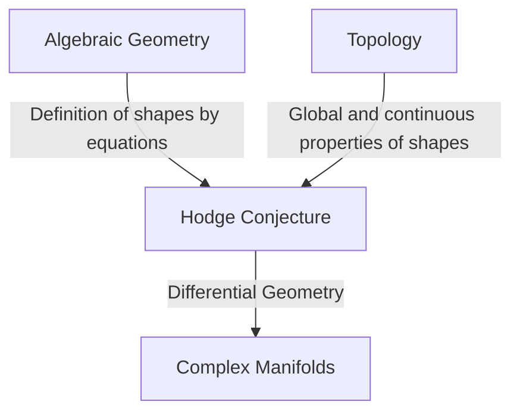
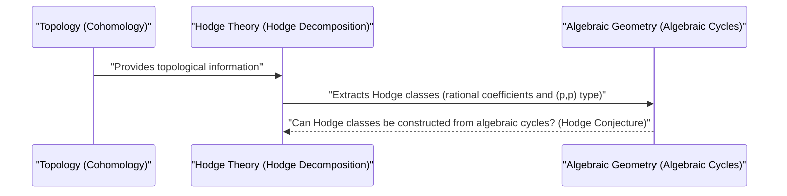

# Introduction

In the world of mathematics, there are still many unsolved mysteries. Among them, the **Millennium Prize Problems**, which stand as major walls in modern mathematics, are particularly important. Announced by the Clay Mathematics Institute in 2000, these seven unsolved problems each carry a prize of one million dollars, and genius mathematicians around the world are taking on the challenge of solving them. In this article, we will delve deeply into the **[Hodge Conjecture](https://kenji.blog/en/p/hodge-conjecture/)**, an incredibly beautiful conjecture among the Millennium Prize Problems that connects algebraic geometry and topology.

In a word, the [Hodge Conjecture](https://kenji.blog/en/p/hodge-conjecture/) is a conjecture about the deep relationship between "geometric shapes" and "algebraic equations." More precisely, it asks whether objects with specific topological properties in a non-singular projective algebraic variety over the field of complex numbers can be represented by a combination of algebraic subvarieties.

## 1. The Intersection of Algebraic Geometry and Topology

To understand the [Hodge Conjecture](https://kenji.blog/en/p/hodge-conjecture/), we first need to know the relationship between two mathematical fields: **Algebraic Geometry** and **Topology**.

Algebraic geometry is the field that studies shapes (algebraic varieties) defined as the common zeros of polynomial equations. For example, the equation of a circle x^2 + y^2 = 1 is one of the simplest algebraic varieties.

On the other hand, topology is the field that studies properties that are preserved even when shapes are continuously deformed. As in the famous analogy "a coffee cup and a doughnut are topologically the same shape," it focuses on global properties such as the number of holes and connectedness.

The [Hodge Conjecture](https://kenji.blog/en/p/hodge-conjecture/) exists at the intersection of these two different fields.

## 2. Formulation of the [Hodge Conjecture](https://kenji.blog/en/p/hodge-conjecture/)

To accurately state the [Hodge Conjecture](https://kenji.blog/en/p/hodge-conjecture/), it is necessary to introduce some specialized concepts.

### 2.1 Complex Projective Varieties

The stage is a **non-singular projective algebraic variety over the field of complex numbers**. Let this be X.
A complex manifold is a space that can locally be regarded as the complex space \mathbb{C}^n. Being a projective variety means that it is embedded in the projective space \mathbb{P}^N(\mathbb{C}) as the common zeros of several homogeneous polynomials. Being non-singular means that it is a smooth shape without "singularities" such as cusps or self-intersections.

### 2.2 de Rham Cohomology and Hodge Decomposition

A powerful tool for investigating the topology of a manifold X is **Cohomology**. In particular, the de Rham cohomology group H^k(X, \mathbb{C}) with coefficients in the field of real or complex numbers is defined using differential forms on the manifold.

William V. D. Hodge showed that this complex cohomology group can be decomposed into finer groups that reflect the complex structure. This is the **Hodge Decomposition**.

 H^k(X, \mathbb{C}) = \bigoplus_{p+q=k} H^{p,q}(X) 

Here, H^{p,q}(X) represents the class of differential forms consisting of the wedge product of p holomorphic differentials and q anti-holomorphic differentials.

### 2.3 Algebraic Cycles and Hodge Classes

Formal linear combinations of lower-dimensional algebraic varieties (subvarieties) within the manifold X are called **Algebraic Cycles**.

An algebraic cycle of dimension k determines an element of the 2k-th cohomology group of X by [Poincaré](https://kenji.blog/en/p/poincare/) Duality. Importantly, the cohomology class determined by an algebraic subvariety only appears in specific components in the Hodge decomposition. Specifically, a cohomology class determined by an algebraic subvariety of codimension p (the dimension of the whole minus the dimension of the subvariety) belongs to the component H^{p,p}(X).

Furthermore, since algebraic cycles are defined by equations, their coefficients can be considered as rational numbers (or integers). Therefore, the cohomology class determined by an algebraic cycle also belongs to the cohomology group with rational coefficients H^{2p}(X, \mathbb{Q}).

A cohomology class satisfying these two conditions, namely an element belonging to

 \text{Hodge}^{p,p}(X) = H^{2p}(X, \mathbb{Q}) \cap H^{p,p}(X) 

is called a **Hodge Class**.

## 3. The Statement of the [Hodge Conjecture](https://kenji.blog/en/p/hodge-conjecture/)

The preparations are complete. The statement of the [Hodge Conjecture](https://kenji.blog/en/p/hodge-conjecture/) is incredibly simple yet surprisingly powerful.

> **[Hodge Conjecture](https://kenji.blog/en/p/hodge-conjecture/)**
> Any Hodge class on a non-singular projective algebraic variety X over the field of complex numbers can be represented by a linear combination of algebraic cycles with rational coefficients.

In other words, it claims that "cohomology classes (Hodge classes) that look like algebraic geometry from the perspective of topology and complex analysis actually arise from shapes created from algebraic equations (algebraic cycles)."

It is a question of whether cohomology classes, which are objects in the world of topology, can be constructed from polynomial equations, which are objects in the world of algebraic geometry.

## 4. Progress and Difficulty of the [Hodge Conjecture](https://kenji.blog/en/p/hodge-conjecture/)

The [Hodge Conjecture](https://kenji.blog/en/p/hodge-conjecture/) was proposed by Hodge himself at the International Congress of Mathematicians in 1950. Since then, many mathematicians have tackled this problem, but a complete resolution has not yet been reached.

### 4.1 Solved Cases

The [Hodge Conjecture](https://kenji.blog/en/p/hodge-conjecture/) has been proven true for some special cases.
- **The case of p=1 (Lefschetz's Theorem)**: For algebraic cycles of codimension 1 (called divisors), it was already proven by Solomon Lefschetz in the 1920s, before Hodge's formulation. This is called the **Lefschetz (1,1)-theorem**, and it can be said to be the origin of the [Hodge Conjecture](https://kenji.blog/en/p/hodge-conjecture/).
- **Results for specific varieties**: For example, it has been confirmed that the [Hodge Conjecture](https://kenji.blog/en/p/hodge-conjecture/) holds for specific classes of varieties, such as some [Abel](https://kenji.blog/en/p/abel/)ian varieties and K3 surfaces.

### 4.2 Why is it difficult?

The difficulty of the [Hodge Conjecture](https://kenji.blog/en/p/hodge-conjecture/) lies in the difficulty of the existence proof. Given a Hodge class, one must show that the corresponding algebraic cycle **exists**. However, while Hodge classes are given purely as analytic and topological data such as integrals and differential forms, algebraic cycles are constructed from algebraic data, namely polynomial equations.

A general method for reconstructing specific algebraic equations from analytic data has not yet been found even in modern mathematics.

## 5. Generalizations and Related Problems of the [Hodge Conjecture](https://kenji.blog/en/p/hodge-conjecture/)

There are various generalizations and related conjectures to the [Hodge Conjecture](https://kenji.blog/en/p/hodge-conjecture/).

- **Generalized [Hodge Conjecture](https://kenji.blog/en/p/hodge-conjecture/)**: An attempt to extend the Hodge Conjecture to a more general framework (for example, varieties with singularities, open varieties, etc.). It was formulated by [Alexander Grothendieck](https://kenji.blog/en/p/grothendieck/) and others, but counterexamples were found, making the formulation itself a difficult challenge.
- **Tate Conjecture**: Known as the arithmetic analogue of the [Hodge Conjecture](https://kenji.blog/en/p/hodge-conjecture/) is the Tate Conjecture. It is formulated using the concept of Étale Cohomology for varieties over finite fields, rather than varieties over the field of complex numbers. This is also an extremely difficult unsolved problem.

## 6. Conclusion and Future Prospects

The [Hodge Conjecture](https://kenji.blog/en/p/hodge-conjecture/) is not just a puzzle, but an important problem that touches the abyss of mathematics. If this conjecture is true, it means that there is a fundamental and beautiful connection between topology and algebraic geometry that we do not yet understand.

With the attractive prize of one million dollars set, mathematicians around the world will continue to challenge this difficult problem in the future. The construction of new mathematical theories and approaches from completely unexpected fields may one day open the door to this Millennium Prize Problem. The resolution of the [Hodge Conjecture](https://kenji.blog/en/p/hodge-conjecture/) has the potential to bring revolutionary progress to mathematics as a whole.

We would be delighted if our readers have become even a little interested in this profound world of mathematics.

## 7. Concrete Examples to Deeply Understand the [Hodge Conjecture](https://kenji.blog/en/p/hodge-conjecture/)

It may be difficult to grasp the reality of the [Hodge Conjecture](https://kenji.blog/en/p/hodge-conjecture/) with just its abstract definition. Here, it gets a bit technical, but let's delve deeper into the meaning of the [Hodge Conjecture](https://kenji.blog/en/p/hodge-conjecture/) through some concrete examples.

### 7.1 Tori and Elliptic Curves

One of the simplest and easiest-to-understand examples is a 1-dimensional complex manifold, namely a **[Riemann](https://kenji.blog/en/p/riemann/) Surface**. Among them, a torus (doughnut shape) with genus (number of holes) 1 is known algebraically as an **Elliptic Curve**.

In the case of an elliptic curve E, the complex dimension is 1 (real dimension is 2). Considering cohomology groups, the interesting one is the middle-dimensional 1st cohomology group H^1(E, \mathbb{C}), but the subject of the [Hodge Conjecture](https://kenji.blog/en/p/hodge-conjecture/) is cohomology groups with an even overall dimension. Therefore, in the elliptic curve itself (complex dimension 1), no non-trivial statement of the [Hodge Conjecture](https://kenji.blog/en/p/hodge-conjecture/) appears.

However, consider the product space X = E_1 \times E_2 of two elliptic curves. This has a complex dimension of 2 (real dimension 4) and becomes an interesting stage. We can apply the [Hodge Conjecture](https://kenji.blog/en/p/hodge-conjecture/) to the 2nd cohomology group H^2(X, \mathbb{Q}) of this space X.

Hodge classes on X are related to intersection forms that satisfy specific conditions. In this case, the algebraic cycles corresponding to Hodge classes are curves within X. If E_1 and E_2 are in a special relationship (for example, having complex multiplication), it is proven that many non-trivial curves (algebraic cycles) exist in the product space and they generate Hodge classes. This is one of the important practical examples of the [Hodge Conjecture](https://kenji.blog/en/p/hodge-conjecture/).

### 7.2 K3 Surfaces and Moduli Spaces

More complex and playing a crucial role in modern mathematics is the **K3 Surface**. K3 surfaces are the simplest examples of Calabi-Yau manifolds of complex dimension 2 (real dimension 4), and are important objects in physics such as String Theory.

The [Hodge Conjecture](https://kenji.blog/en/p/hodge-conjecture/) for K3 surfaces has already been proven. However, the Hodge structure of a K3 surface is so powerful that it determines its geometry (Torelli Theorem), and the establishment of the [Hodge Conjecture](https://kenji.blog/en/p/hodge-conjecture/) brings a deep understanding of K3 surfaces. Hodge classes on a K3 surface are completely realized as classes of algebraic curves existing on that surface.

Furthermore, by considering families of K3 surfaces (sets of K3 surfaces obtained when parameters are varied), we arrive at the concept of a **Moduli Space**. The Hodge theory on moduli spaces and the [Hodge Conjecture](https://kenji.blog/en/p/hodge-conjecture/) of individual varieties intertwine closely, forming the forefront of algebraic geometry.

## 8. Connections to the Group of Unsolved Problems in Algebraic Geometry

The [Hodge Conjecture](https://kenji.blog/en/p/hodge-conjecture/) is not an isolated problem, but is deeply connected to many other important mathematical conjectures.

### 8.1 Grothendieck's Standard Conjectures

[Alexander Grothendieck](https://kenji.blog/en/p/grothendieck/) established a series of grand conjectures regarding algebraic cycles on algebraic varieties. These are the **Standard Conjectures on Algebraic Cycles**.

The Standard Conjectures include intersection theory of algebraic cycles and the generalization of Lefschetz's theorem to arbitrary dimensions. If the [Hodge Conjecture](https://kenji.blog/en/p/hodge-conjecture/) is true, it is believed that some of the Standard Conjectures follow for varieties over the complex numbers. Conversely, if the Standard Conjectures are solved, it would provide a powerful means for the [Hodge Conjecture](https://kenji.blog/en/p/hodge-conjecture/). These are indispensable pieces for the completion of the "Theory of Motives," which is the ultimate goal in algebraic geometry.

### 8.2 Milnor Conjecture and Algebraic K-Theory

With a slightly different flavor, the Milnor Conjecture solved by Vladimir Voevodsky, and the Bloch-Kato Conjecture which generalized it, connect algebraic K-theory and [Galois](https://kenji.blog/en/p/galois/) cohomology.

Voevodsky's work constructed a new framework called "Motivic Cohomology" and further solidified the connection between algebraic geometry and topology. This motivic perspective positions the [Hodge Conjecture](https://kenji.blog/en/p/hodge-conjecture/) within a more general theory of algebraic cycles, and has become an indispensable approach in modern [Hodge Conjecture](https://kenji.blog/en/p/hodge-conjecture/) research.

## 9. From the Perspective of Topology and Analysis

It is also important to look at the [Hodge Conjecture](https://kenji.blog/en/p/hodge-conjecture/) not only from algebraic geometry, but also from the perspectives of topology and analysis.

### 9.1 Intersection with Singularity Theory

When singularities are allowed in varieties, Hodge theory develops into the theory of **Mixed Hodge Structure**. This is a beautiful theory constructed by Pierre Deligne, and it introduces a new hierarchical structure called Weight into the cohomology of spaces with singularities.

The theory of mixed Hodge structures is a powerful tool for describing changes in cohomology at the limit where a variety degenerates (for example, the process where a smooth surface gradually collapses into a surface with singularities). In attempts to extend the [Hodge Conjecture](https://kenji.blog/en/p/hodge-conjecture/), this singularity theory and mixed Hodge structures play important roles and have become indispensable for analytically capturing geometric phenomena.

### 9.2 Twistor Space and Differential Geometry

Twistor Theory, proposed by Roger Penrose, is an attempt to translate the geometry of spacetime into analytic geometry on complex projective space. Twistor space powerfully connects differential geometry and the theory of complex manifolds.

The [Hodge Conjecture](https://kenji.blog/en/p/hodge-conjecture/) is based on differential forms on complex manifolds (Hodge decomposition), but from the perspective of differential geometry, these are understood as harmonic forms of the Laplace operator. The powerful theorems of analysis called harmonic integral theory exist behind the Hodge decomposition, and some researchers hope that differential geometric constructions like twistor space will provide new analytic methods for constructing Hodge classes in the future.

## 10. Future Prospects: When Will the [Hodge Conjecture](https://kenji.blog/en/p/hodge-conjecture/) Be Solved?

More than 70 years have passed since the [Hodge Conjecture](https://kenji.blog/en/p/hodge-conjecture/) was proposed. Although many partial results and related powerful theories (such as motivic cohomology and mixed Hodge structures) have been constructed, a complete proof for general non-singular projective varieties has not yet been reached.

Some mathematicians suspect that "there may be counterexamples to the [Hodge Conjecture](https://kenji.blog/en/p/hodge-conjecture/)." If a counterexample is found, it will give a great shock to the mathematical world and force us to fundamentally revise our understanding of the relationship between topology and algebraic geometry.

However, the majority of mathematicians believe the [Hodge Conjecture](https://kenji.blog/en/p/hodge-conjecture/) is true and are searching for new mathematical paradigms towards its proof. The [Hodge Conjecture](https://kenji.blog/en/p/hodge-conjecture/) sits at the center where diverse fields such as algebraic geometry, topology, complex analysis, and even number theory and mathematical physics converge.

No one knows when the day this problem will be solved will come. However, the new mathematical ideas generated in the process of tackling the [Hodge Conjecture](https://kenji.blog/en/p/hodge-conjecture/) will undoubtedly enrich human knowledge and become the foundation of mathematics for the next generation. The value of more than a million dollars placed on the Millennium Prize Problem certainly exists there.
