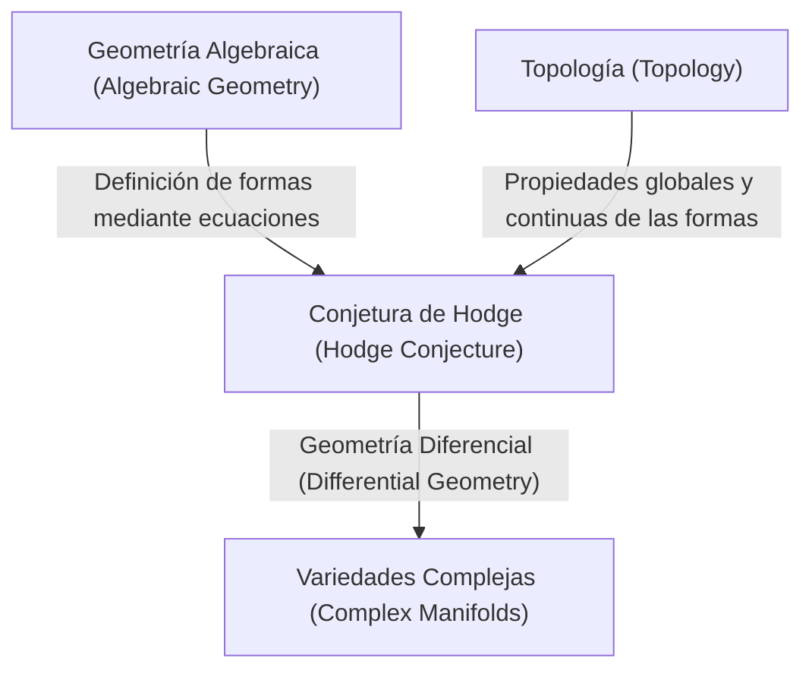
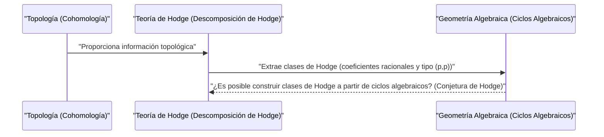

# Introducción

En el mundo de las matemáticas, aún existen muchos misterios inexplicados. Entre ellos, los que son particularmente importantes y se erigen como un gran muro de las matemáticas modernas son los **Problemas del Premio del Milenio** (Millennium Prize Problems). Los 7 problemas sin resolver anunciados por el Instituto Clay de Matemáticas en el año 2000 tienen un premio de un millón de dólares cada uno, y matemáticos geniales de todo el mundo están intentando resolverlos. En este artículo, profundizaremos en una conjetura muy hermosa que conecta la geometría algebraica y la topología entre estos problemas del milenio: la **Conjetura de Hodge** ([Hodge Conjecture](https://kenji.blog/es/p/hodge-conjecture/)).

En pocas palabras, la Conjetura de Hodge es una conjetura sobre la profunda relación entre "formas geométricas" y "ecuaciones algebraicas". Más exactamente, pregunta si, en una variedad algebraica proyectiva no singular sobre el cuerpo de los números complejos, un objeto con ciertas propiedades topológicas específicas puede expresarse mediante una combinación de subvariedades algebraicas.

## 1. La intersección entre la Geometría Algebraica y la Topología

Para entender la Conjetura de Hodge, primero es necesario conocer la relación entre dos campos de las matemáticas: la **Geometría Algebraica** (Algebraic Geometry) y la **Topología** (Topology).

La geometría algebraica es el campo que estudia las formas (variedades algebraicas) definidas como el lugar geométrico (ceros comunes) de ecuaciones polinomiales. Por ejemplo, la ecuación de un círculo x^2 + y^2 = 1 es una de las variedades algebraicas más simples.

Por otro lado, la topología es el campo que estudia las propiedades de las formas que se conservan incluso cuando se deforman continuamente. Como en la famosa analogía "una taza de café y una rosquilla tienen topológicamente la misma forma", se centra en propiedades globales como el número de agujeros y la conectividad.

La Conjetura de Hodge existe en el punto de intersección de estos dos campos diferentes.

## 2. Formulación de la Conjetura de Hodge

Para enunciar la Conjetura de Hodge con precisión, es necesario introducir algunos conceptos especializados.

### 2.1 Variedad Proyectiva Compleja

El escenario es una **variedad algebraica proyectiva no singular sobre el cuerpo de los números complejos**. Llamémosla X.
Una variedad compleja es un espacio que localmente puede verse como un espacio complejo \mathbb{C}^n. Ser una variedad proyectiva significa que está incrustada en un espacio proyectivo \mathbb{P}^N(\mathbb{C}) como los ceros comunes de varios polinomios homogéneos. Ser no singular significa que es una forma suave sin "singularidades" como cúspides o autointersecciones.

### 2.2 Cohomología de de Rham y Descomposición de Hodge

Una herramienta poderosa para investigar la topología de la variedad X es la **Cohomología** (Cohomology). Especialmente los grupos de cohomología de de Rham H^k(X, \mathbb{C}) con coeficientes en el cuerpo de los números reales o complejos se definen utilizando formas diferenciales sobre la variedad.

William Hodge (W. V. D. Hodge) demostró que este grupo de cohomología compleja puede descomponerse en grupos más finos que reflejan la estructura compleja. Esta es la **Descomposición de Hodge** (Hodge Decomposition).

$$ H^k(X, \mathbb{C}) = \bigoplus_{p+q=k} H^{p,q}(X) $$

Aquí, H^{p,q}(X) representa la clase de formas diferenciales consistentes en el producto exterior de p diferenciales holomorfos y q diferenciales antiholomorfos.

### 2.3 Ciclos Algebraicos y Clases de Hodge

Una combinación lineal formal de variedades algebraicas (subvariedades) de menor dimensión dentro de la variedad X se llama **Ciclo Algebraico** (Algebraic Cycle).

Un ciclo algebraico de dimensión k define un elemento del grupo de cohomología de dimensión 2k de X mediante la Dualidad de [Poincaré](https://kenji.blog/es/p/poincare/) ([Poincaré](https://kenji.blog/es/p/poincare/) Duality). Lo importante es el hecho de que la clase de cohomología determinada por la subvariedad algebraica aparece solo en ciertos componentes en la descomposición de Hodge. Específicamente, la clase de cohomología determinada por una subvariedad algebraica cuya codimensión (la dimensión total menos la dimensión de la subvariedad) es p pertenece al componente H^{p,p}(X).

Además, dado que un ciclo algebraico se define mediante ecuaciones, sus coeficientes pueden considerarse como números racionales (o enteros). Por lo tanto, la clase de cohomología determinada por el ciclo algebraico también pertenece al grupo de cohomología con coeficientes racionales H^{2p}(X, \mathbb{Q}).

Una clase de cohomología que cumple con estas dos condiciones, es decir, un elemento que pertenece a

$$ \text{Hodge}^{p,p}(X) = H^{2p}(X, \mathbb{Q}) \cap H^{p,p}(X) $$

se llama **Clase de Hodge** (Hodge Class).

## 3. Afirmación de la Conjetura de Hodge

Estamos listos. La afirmación de la Conjetura de Hodge es sorprendentemente poderosa aunque muy simple.

> **[Conjetura de Hodge (Hodge Conjecture)](https://kenji.blog/p/hodge-conjecture/)**
> Cualquier clase de Hodge sobre una variedad algebraica proyectiva no singular X sobre el cuerpo de los números complejos se expresa mediante una combinación lineal de coeficientes racionales de ciclos algebraicos.

En otras palabras, afirma que "las clases de cohomología (clases de Hodge) que parecen algebraico-geométricas desde la perspectiva de la topología y el análisis complejo surgen realmente de formas construidas a partir de ecuaciones algebraicas (ciclos algebraicos)".

Es la pregunta de si las clases de cohomología, que son objetos del mundo de la topología, pueden construirse a partir de ecuaciones polinómicas, que son objetos del mundo de la geometría algebraica.

## 4. Progreso y Dificultad de la Conjetura de Hodge

La Conjetura de Hodge fue propuesta por el propio Hodge en el Congreso Internacional de Matemáticos en 1950. Desde entonces, muchos matemáticos han abordado este problema, pero no se ha llegado a una resolución completa hasta el día de hoy.

### 4.1 Casos Resueltos

Para algunos casos especiales, se ha demostrado que la Conjetura de Hodge es correcta.
- **Caso p=1 (Teorema de Lefschetz)**: Para ciclos algebraicos de codimensión 1 (llamados divisores), esto ya había sido demostrado por Solomon Lefschetz en la década de 1920, antes de la formulación de Hodge. Esto se llama el **Teorema (1,1) de Lefschetz** (Lefschetz (1,1)-theorem) y se puede decir que es el origen de la Conjetura de Hodge.
- **Resultados relacionados con variedades específicas**: Por ejemplo, se ha confirmado que la Conjetura de Hodge se cumple para ciertas clases de variedades, como variedades abelianas y algunas superficies K3.

### 4.2 ¿Por qué es difícil?

La dificultad de la Conjetura de Hodge radica en la dificultad de la prueba de existencia. Cuando se da una cierta clase de Hodge, se debe demostrar que el ciclo algebraico correspondiente **existe**. Sin embargo, mientras que las clases de Hodge se dan como datos analíticos y topológicos como integrales y formas diferenciales, los ciclos algebraicos se construyen a partir de datos algebraicos que son ecuaciones polinomiales.

Todavía no se ha encontrado en las matemáticas modernas un método general para reconstruir ecuaciones algebraicas concretas a partir de datos analíticos.

## 5. Generalización de la Conjetura de Hodge y Problemas Relacionados

Existen varias generalizaciones y conjeturas relacionadas con la Conjetura de Hodge.

- **Conjetura de Hodge Generalizada (Generalized [Hodge Conjecture](https://kenji.blog/es/p/hodge-conjecture/))**: Es un intento de extender la Conjetura de Hodge a un marco más general (por ejemplo, variedades con singularidades, o variedades abiertas, etc.). Fue formulada por [Alexander Grothendieck](https://kenji.blog/es/p/grothendieck/) y otros, pero encontrar contraejemplos ha convertido la formulación adecuada en sí misma en un desafío difícil.
- **Conjetura de Tate (Tate Conjecture)**: Conocida como un análogo aritmético de la Conjetura de Hodge es la Conjetura de Tate. Se formula utilizando el concepto de Cohomología Étale (Étale Cohomology) no sobre variedades sobre el cuerpo de los números complejos, sino sobre variedades sobre campos finitos. Este es también un problema sin resolver extremadamente difícil.

## 6. Conclusión y Perspectivas Futuras

La Conjetura de Hodge no es un simple rompecabezas, sino un problema importante que toca el abismo de las matemáticas. Si esta conjetura es cierta, significará que existe una conexión fundamental y hermosa entre la topología y la geometría algebraica que aún no entendemos.

Con un atractivo premio en metálico de un millón de dólares, los matemáticos de todo el mundo seguirán desafiando este difícil problema. La construcción de nuevas teorías matemáticas o los enfoques desde campos completamente inesperados podrían abrir la puerta a este Problema del Milenio algún día. La resolución de la Conjetura de Hodge tiene el potencial de traer un avance revolucionario a todas las matemáticas.

Me alegraría si los lectores pudieran interesarse aunque sea un poco en este profundo mundo de las matemáticas.

## 7. Ejemplos Concretos para Entender más Profundamente la Conjetura de Hodge

Puede ser difícil captar la realidad de la Conjetura de Hodge solo con su definición abstracta. Aquí, profundicemos en el significado de la Conjetura de Hodge a través de algunos ejemplos concretos, aunque se vuelva un poco más técnico.

### 7.1 Toros y Curvas Elípticas

Uno de los ejemplos más simples y fáciles de entender es una variedad compleja unidimensional, es decir, una **Superficie de [Riemann](https://kenji.blog/es/p/riemann/)** ([Riemann](https://kenji.blog/es/p/riemann/) Surface). Entre ellas, el toro (forma de rosquilla) con género (número de agujeros) igual a 1 se conoce algebraico-geométricamente como una **Curva Elíptica** (Elliptic Curve).

En el caso de una curva elíptica E, la dimensión compleja es 1 (la dimensión real es 2). Considerando el grupo de cohomología, lo interesante es el grupo de cohomología unidimensional intermedio H^1(E, \mathbb{C}), pero el objetivo de la Conjetura de Hodge son los grupos de cohomología de dimensión par total. Por lo tanto, no aparece una afirmación no trivial de la Conjetura de Hodge en la curva elíptica misma (dimensión compleja 1).

Sin embargo, consideremos el espacio producto cartesiano de dos curvas elípticas X = E_1 \times E_2. Aquí la dimensión compleja se convierte en 2 (dimensión real 4) y se convierte en un escenario interesante. Podemos aplicar la Conjetura de Hodge al segundo grupo de cohomología H^2(X, \mathbb{Q}) de este espacio X.

La clase de Hodge en X está relacionada con la forma de intersección que satisface ciertas condiciones. En este caso, el ciclo algebraico correspondiente a la clase de Hodge se convierte en una curva dentro de X. Si E_1 y E_2 tienen una relación especial (por ejemplo, tienen multiplicación compleja), se ha demostrado que existen muchas curvas no triviales (ciclos algebraicos) en el espacio del producto cartesiano, y generan clases de Hodge. Este es uno de los ejemplos prácticos importantes de la Conjetura de Hodge.

### 7.2 Superficies K3 y Espacios de Módulos

Más complejas, y que juegan un papel extremadamente importante en las matemáticas modernas, son las **Superficies K3** (K3 Surfaces). La superficie K3 es el ejemplo más simple de una variedad de Calabi-Yau con dimensión compleja 2 (dimensión real 4), y también es un objeto importante en física como la Teoría de Cuerdas (String Theory).

La Conjetura de Hodge para superficies K3 ya ha sido probada. Sin embargo, la estructura de Hodge de la superficie K3 es lo suficientemente fuerte como para determinar su geometría (Teorema de Torelli, Torelli Theorem), y el establecimiento de la Conjetura de Hodge proporciona una comprensión profunda de las superficies K3. La clase de Hodge en una superficie K3 se realiza completamente como la clase de curvas algebraicas existentes en esa superficie.

Además, al considerar la familia de superficies K3 (el conjunto de superficies K3 obtenido al mover parámetros), llegamos al concepto de **Espacio de Módulos** (Moduli Space). La teoría de Hodge en el espacio de módulos y la Conjetura de Hodge de las variedades individuales se entrelazan estrechamente, formando la vanguardia de la geometría algebraica.

## 8. Conexiones con Problemas sin Resolver en Geometría Algebraica

La Conjetura de Hodge no es un problema aislado, sino que está profundamente conectada con muchas otras conjeturas matemáticas importantes.

### 8.1 Conjeturas Estándar de Grothendieck (Grothendieck's Standard Conjectures)

[Alexander Grothendieck](https://kenji.blog/es/p/grothendieck/) formuló una serie de grandes conjeturas sobre ciclos algebraicos en variedades algebraicas. Estas son las **Conjeturas Estándar** (Standard Conjectures on Algebraic Cycles).

Las conjeturas estándar incluyen la teoría de la intersección de ciclos algebraicos y la generalización del teorema de Lefschetz a cualquier dimensión. Si la Conjetura de Hodge es cierta, se considera que parte de las conjeturas estándar seguirán para las variedades sobre el cuerpo de los números complejos. A la inversa, si se resuelven las conjeturas estándar, proporcionarán herramientas poderosas para la Conjetura de Hodge. Estas son piezas esenciales para completar la "Teoría de los Motivos" (Theory of Motives), que es el objetivo final en la geometría algebraica.

### 8.2 Conjetura de Milnor y Teoría K Algebraica (Milnor Conjecture and Algebraic K-Theory)

De una naturaleza un poco diferente, la Conjetura de Milnor (Milnor Conjecture) resuelta por Vladimir Voevodsky, y su generalización, la Conjetura de Bloch-Kato (Bloch-Kato Conjecture), conectaban la Teoría K Algebraica y la cohomología de [Galois](https://kenji.blog/es/p/galois/).

El trabajo de Voevodsky construyó un nuevo marco llamado "Cohomología Motívica" (Motivic Cohomology) e hizo la conexión entre la geometría algebraica y la topología aún más sólida. Esta perspectiva motívica sitúa la Conjetura de Hodge dentro de una teoría más general de ciclos algebraicos, y se ha convertido en un enfoque esencial en la investigación moderna de la Conjetura de Hodge.

## 9. Desde la Perspectiva de la Topología y el Análisis

También es importante mirar la Conjetura de Hodge no solo desde la geometría algebraica, sino también desde la perspectiva de la topología y el análisis.

### 9.1 Intersección con la Teoría de Singularidades

Cuando se permiten singularidades (Singularities) en las variedades, la teoría de Hodge se desarrolla en una teoría llamada **Estructura de Hodge Mixta** (Mixed Hodge Structure). Esta es una hermosa teoría construida por Pierre Deligne, y también introduce una nueva estructura jerárquica llamada Peso (Weight) en la cohomología de espacios con singularidades.

La teoría de las estructuras de Hodge mixtas es una herramienta poderosa que describe los cambios en la cohomología en el límite donde una variedad se degenera (por ejemplo, el proceso donde una superficie suave colapsa gradualmente en una superficie con singularidades). En los intentos de extender la Conjetura de Hodge, esta teoría de singularidades y la estructura de Hodge mixta juegan un papel importante, y se han vuelto indispensables para capturar analíticamente los fenómenos geométricos.

### 9.2 Espacio de Twistores y Geometría Diferencial (Twistor Space and Differential Geometry)

La Teoría de Twistores (Twistor Theory) propuesta por Roger Penrose es un intento de traducir la geometría del espacio-tiempo a la geometría analítica en espacios proyectivos complejos. El espacio de twistores conecta fuertemente la geometría diferencial y la teoría de variedades complejas.

La Conjetura de Hodge se basa en formas diferenciales en variedades complejas (descomposición de Hodge), pero desde la perspectiva de la geometría diferencial, estas se entienden como formas armónicas del operador de Laplace. Un poderoso teorema en análisis llamado teoría de integrales armónicas existe detrás de la descomposición de Hodge, y algunos investigadores esperan que construcciones de geometría diferencial como el espacio de twistores proporcionen nuevos métodos analíticos para construir clases de Hodge en el futuro.

## 10. Perspectivas Futuras: ¿Cuándo se resolverá la Conjetura de Hodge?

Ya han pasado más de 70 años desde que se propuso la Conjetura de Hodge. Se han construido muchos resultados parciales y teorías poderosas relacionadas (como la cohomología motívica y las estructuras de Hodge mixtas), pero no se ha alcanzado una prueba completa para variedades proyectivas no singulares generales.

Algunos matemáticos sospechan que "pueden existir contraejemplos para la Conjetura de Hodge". Si se encuentra un contraejemplo, dará un gran impacto al mundo de las matemáticas y nos obligará a corregir fundamentalmente nuestra comprensión de la relación entre la topología y la geometría algebraica.

Sin embargo, la mayoría de los matemáticos creen que la Conjetura de Hodge es cierta y están buscando un nuevo paradigma de las matemáticas hacia su prueba. La Conjetura de Hodge se encuentra en el centro donde se fusionan diversos campos como la geometría algebraica, la topología, el análisis complejo, e incluso la teoría de números y la física matemática.

Nadie sabe cuándo llegará el día en que se resuelva este problema. Sin embargo, las nuevas ideas matemáticas generadas en el proceso de desafiar la Conjetura de Hodge indudablemente enriquecerán el conocimiento humano y se convertirán en la piedra angular de las matemáticas para la próxima generación. El valor de más de un millón de dólares otorgado al Problema del Premio del Milenio ciertamente existe allí.
