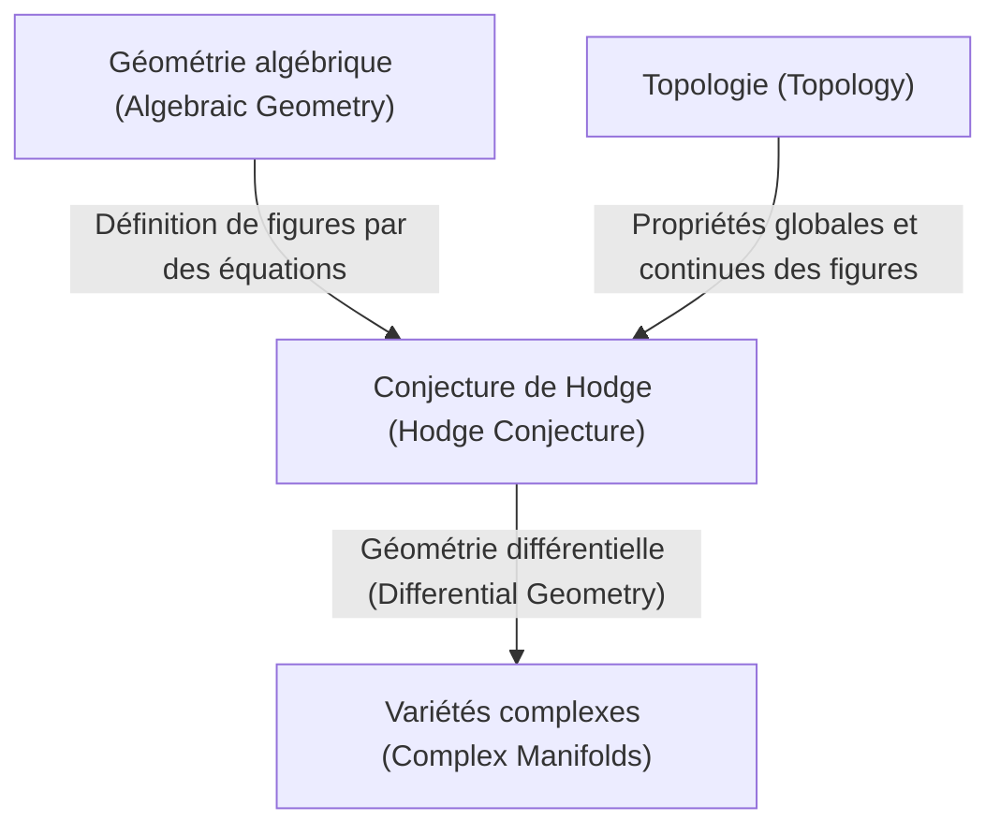
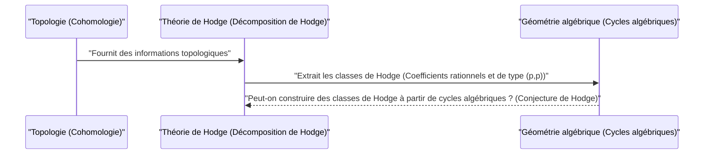

# Introduction

Dans le monde des mathématiques, il existe encore de nombreux mystères non résolus. Parmi eux, les **problèmes du prix du millénaire** (Millennium Prize Problems) se dressent comme un mur majeur des mathématiques modernes. Chacun des sept problèmes non résolus annoncés par l'Institut de mathématiques Clay en 2000 est doté d'un prix d'un million de dollars, et les mathématiciens de génie du monde entier tentent de les résoudre. Dans cet article, nous allons plonger profondément dans la **conjecture de Hodge** ([Hodge Conjecture](https://kenji.blog/p/hodge-conjecture/)), une conjecture extrêmement belle qui relie la géométrie algébrique et la topologie, parmi ces problèmes du prix du millénaire.

En un mot, la conjecture de Hodge est une conjecture concernant la relation profonde entre les « formes géométriques » et les « équations algébriques ». Plus précisément, elle demande si des objets ayant des propriétés topologiques spécifiques dans des variétés algébriques projectives non singulières sur le corps des nombres complexes peuvent être représentés par des combinaisons de sous-variétés algébriques.

## 1. L'intersection de la géométrie algébrique et de la topologie

Pour comprendre la conjecture de Hodge, il faut d'abord connaître la relation entre deux domaines mathématiques : la **géométrie algébrique** (Algebraic Geometry) et la **topologie** (Topology).

La géométrie algébrique est le domaine qui étudie les figures géométriques (variétés algébriques) définies comme les zéros communs d'équations polynomiales. Par exemple, l'équation d'un cercle x^2 + y^2 = 1 est l'une des variétés algébriques les plus simples.

D'autre part, la topologie est le domaine qui étudie les propriétés qui sont conservées même si une figure est continuellement déformée. Comme dans la célèbre métaphore « une tasse de café et un beignet ont la même forme d'un point de vue topologique », elle se concentre sur des propriétés globales telles que le nombre de trous et la connectivité.

La conjecture de Hodge se situe à l'intersection de ces deux domaines différents.

## 2. Formulation de la conjecture de Hodge

Pour énoncer avec précision la conjecture de Hodge, nous devons introduire quelques concepts spécialisés.

### 2.1 Variété projective complexe

Le cadre est une **variété algébrique projective non singulière sur le corps des nombres complexes**. Nommons-la X.
Une variété complexe est un espace qui peut être considéré localement comme l'espace complexe \mathbb{C}^n. Être une variété projective signifie qu'elle est plongée dans un espace projectif \mathbb{P}^N(\mathbb{C}) comme le zéro commun de plusieurs polynômes homogènes. Être non singulier signifie que c'est une figure lisse, sans "singularités" telles que des points de rebroussement ou des auto-intersections.

### 2.2 Cohomologie de de Rham et décomposition de Hodge

Un outil puissant pour étudier la topologie d'une variété X est la **cohomologie** (Cohomology). En particulier, les groupes de cohomologie de de Rham H^k(X, \mathbb{C}) à coefficients dans le corps des nombres réels ou complexes sont définis à l'aide des formes différentielles sur la variété.

William Hodge (W. V. D. Hodge) a montré que ces groupes de cohomologie complexe peuvent être décomposés en groupes plus fins reflétant la structure complexe. C'est la **décomposition de Hodge** (Hodge Decomposition).

 H^k(X, \mathbb{C}) = \bigoplus_{p+q=k} H^{p,q}(X) 

Ici, H^{p,q}(X) représente la classe des formes différentielles constituée du produit extérieur de p différentielles holomorphes et de q différentielles antiholomorphes.

### 2.3 Cycles algébriques et classes de Hodge

Une combinaison linéaire formelle de variétés algébriques (sous-variétés) de dimension inférieure à l'intérieur de la variété X est appelée un **cycle algébrique** (Algebraic Cycle).

Un cycle algébrique de dimension k détermine un élément du groupe de cohomologie de degré 2k de X, par la dualité de Poincaré (Poincaré Duality). Ce qui est important, c'est le fait que les classes de cohomologie déterminées par les sous-variétés algébriques n'apparaissent que dans des composantes spécifiques de la décomposition de Hodge. Plus précisément, la classe de cohomologie définie par une sous-variété algébrique de codimension p (la dimension totale moins la dimension de la sous-variété) appartient à la composante H^{p,p}(X).

De plus, comme un cycle algébrique est défini par des équations, ses coefficients peuvent être considérés comme des nombres rationnels (ou des entiers). Par conséquent, la classe de cohomologie déterminée par un cycle algébrique appartient également au groupe de cohomologie à coefficients rationnels H^{2p}(X, \mathbb{Q}).

Les classes de cohomologie satisfaisant ces deux conditions, c'est-à-dire les éléments appartenant à

 \text{Hodge}^{p,p}(X) = H^{2p}(X, \mathbb{Q}) \cap H^{p,p}(X) 

sont appelées **classes de Hodge** (Hodge Class).

## 3. L'énoncé de la conjecture de Hodge

Nous sommes maintenant prêts. L'énoncé de la conjecture de Hodge est étonnamment puissant tout en étant très simple.

> **Conjecture de Hodge ([Hodge Conjecture](https://kenji.blog/p/hodge-conjecture/))**
> Toute classe de Hodge sur une variété algébrique projective non singulière X sur le corps des nombres complexes est représentée par une combinaison linéaire à coefficients rationnels de cycles algébriques.

En d'autres termes, elle affirme que « les classes de cohomologie (classes de Hodge) qui semblent provenir de la géométrie algébrique du point de vue de la topologie et de l'analyse complexe proviennent en réalité de figures construites à partir d'équations algébriques (cycles algébriques) ».

C'est la question de savoir si les classes de cohomologie, objets du monde de la topologie, peuvent être construites à partir d'équations polynomiales, objets du monde de la géométrie algébrique.

## 4. Progrès et difficulté de la conjecture de Hodge

La conjecture de Hodge a été proposée par Hodge lui-même lors du Congrès international des mathématiciens de 1950. Depuis lors, de nombreux mathématiciens se sont penchés sur ce problème, mais jusqu'à présent, il n'a pas été entièrement résolu.

### 4.1 Cas résolus

La conjecture de Hodge s'est avérée exacte dans certains cas particuliers.
- **Le cas p=1 (Théorème de Lefschetz)** : Pour les cycles algébriques de codimension 1 (appelés diviseurs), cela a déjà été prouvé par Solomon Lefschetz dans les années 1920, avant la formulation de Hodge. C'est ce qu'on appelle le **théorème (1,1) de Lefschetz** (Lefschetz (1,1)-theorem), que l'on peut considérer comme l'origine de la conjecture de Hodge.
- **Résultats concernant des variétés spécifiques** : Par exemple, on a vérifié que la conjecture de Hodge est valable pour certaines classes de variétés, comme les variétés abéliennes et certaines surfaces K3.

### 4.2 Pourquoi est-ce difficile ?

La difficulté de la conjecture de Hodge réside dans la difficulté de la preuve d'existence. Lorsqu'une classe de Hodge est donnée, il faut montrer que le cycle algébrique correspondant **existe**. Cependant, alors que les classes de Hodge sont données uniquement comme des données analytiques et topologiques telles que des intégrales et des formes différentielles, les cycles algébriques sont construits à partir de données algébriques que sont les équations polynomiales.

Une méthode générale pour reconstruire des équations algébriques spécifiques à partir de données analytiques n'a pas encore été trouvée, même dans les mathématiques modernes.

## 5. Généralisations et problèmes liés à la conjecture de Hodge

Il existe diverses généralisations et conjectures liées à la conjecture de Hodge.

- **Conjecture de Hodge généralisée (Generalized [Hodge Conjecture](https://kenji.blog/p/hodge-conjecture/))** : Il s'agit d'une tentative d'étendre la conjecture de Hodge à un cadre plus général (par exemple, des variétés avec des singularités, ou des variétés ouvertes). Bien qu'elle ait été formulée par [Alexander Grothendieck](https://kenji.blog/p/grothendieck/) et d'autres, la formulation appropriée elle-même est devenue une tâche difficile, des contre-exemples ayant été trouvés.
- **Conjecture de Tate (Tate Conjecture)** : Connue comme l'analogue arithmétique de la conjecture de Hodge, c'est la conjecture de Tate. Elle est formulée en utilisant le concept de cohomologie étale (Étale Cohomology) non pas pour les variétés sur le corps des nombres complexes, mais pour les variétés sur des corps finis. C'est également un problème non résolu extrêmement difficile.

## 6. Conclusion et perspectives d'avenir

La conjecture de Hodge n'est pas un simple casse-tête, mais un problème important qui touche aux abysses des mathématiques. Si cette conjecture est vraie, cela signifierait qu'il existe un lien fondamental et magnifique entre la topologie et la géométrie algébrique que nous ne comprenons pas encore.

Avec la récompense attrayante d'un million de dollars, il est certain que des mathématiciens du monde entier continueront à relever ce défi difficile. La construction de nouvelles théories mathématiques, ou une approche issue d'un domaine totalement inattendu, pourrait un jour ouvrir la porte de ce problème du prix du millénaire. La résolution de la conjecture de Hodge a le potentiel d'apporter des avancées révolutionnaires aux mathématiques dans leur ensemble.

Nous espérons que vous avez été, ne serait-ce qu'un peu, intéressé par ce monde mathématique profond.

## 7. Exemples concrets pour comprendre plus profondément la conjecture de Hodge

La définition abstraite de la conjecture de Hodge seule peut rendre difficile la compréhension de sa réalité. Ici, bien que cela devienne un peu technique, nous allons approfondir la signification de la conjecture de Hodge à travers quelques exemples concrets.

### 7.1 Tores et courbes elliptiques

L'un des exemples les plus simples et les plus faciles à comprendre est la variété complexe de dimension 1, à savoir une **surface de Riemann** (Riemann Surface). Parmi celles-ci, le tore (de forme torique) de genre 1 (nombre de trous) est connu en géométrie algébrique sous le nom de **courbe elliptique** (Elliptic Curve).

Dans le cas d'une courbe elliptique E, la dimension complexe est de 1 (la dimension réelle est de 2). Si l'on considère les groupes de cohomologie, ce qui est intéressant, c'est le groupe de cohomologie de degré 1 H^1(E, \mathbb{C}), qui est une dimension intermédiaire. Cependant, les objets visés par la conjecture de Hodge sont les groupes de cohomologie dont la dimension totale est paire. Par conséquent, il n'y a pas d'énoncé non trivial de la conjecture de Hodge sur la courbe elliptique elle-même (de dimension complexe 1).

Considérons cependant l'espace produit direct de courbes elliptiques X = E_1 \times E_2. La dimension complexe devient 2 (la dimension réelle est de 4), et cela devient une scène intéressante. Nous pouvons appliquer la conjecture de Hodge au groupe de cohomologie de degré 2 H^2(X, \mathbb{Q}) de cet espace X.

Les classes de Hodge sur X sont liées à des formes d'intersection satisfaisant à des conditions spécifiques. Dans ce cas, les cycles algébriques correspondant aux classes de Hodge seront des courbes dans X. Si E_1 et E_2 ont une relation particulière (par exemple, ont une multiplication complexe), il est prouvé que de nombreuses courbes non triviales (cycles algébriques) existent dans l'espace produit direct, et qu'elles génèrent les classes de Hodge. C'est l'un des exemples importants de la conjecture de Hodge.

### 7.2 Surfaces K3 et espaces de modules

Ce qui est plus complexe et joue un rôle extrêmement important dans les mathématiques modernes, ce sont les **surfaces K3** (K3 Surface). La surface K3 est l'exemple le plus simple de variété de Calabi-Yau de dimension complexe 2 (réelle 4), et c'est également un objet d'étude important en physique, notamment en théorie des cordes (String Theory).

La conjecture de Hodge pour les surfaces K3 a déjà été prouvée. Cependant, la structure de Hodge d'une surface K3 est si puissante qu'elle détermine sa géométrie (théorème de Torelli, Torelli Theorem), et la validité de la conjecture de Hodge a conduit à une compréhension profonde des surfaces K3. Les classes de Hodge sur une surface K3 sont complètement réalisées en tant que classes de courbes algébriques existant sur cette surface.

De plus, en considérant une famille de surfaces K3 (l'ensemble des surfaces K3 obtenues en faisant varier un paramètre), nous arrivons au concept d'**espace de modules** (Moduli Space). La théorie de Hodge sur l'espace de modules et la conjecture de Hodge des variétés individuelles s'entremêlent étroitement pour former la pointe de la géométrie algébrique.

## 8. Liens avec les groupes de problèmes non résolus en géométrie algébrique

La conjecture de Hodge n'est pas un problème isolé et est profondément liée à de nombreuses autres conjectures mathématiques importantes.

### 8.1 Conjectures standard de Grothendieck (Grothendieck's Standard Conjectures)

[Alexander Grothendieck](https://kenji.blog/p/grothendieck/) a formulé une série de conjectures grandioses sur les cycles algébriques sur les variétés algébriques. Ce sont les **conjectures standard** (Standard Conjectures on Algebraic Cycles).

Les conjectures standard incluent la théorie de l'intersection des cycles algébriques et la généralisation du théorème de Lefschetz à n'importe quelle dimension. Si la conjecture de Hodge est vraie, on pense qu'une partie des conjectures standard s'ensuivra pour les variétés sur le corps des nombres complexes. À l'inverse, si les conjectures standard sont résolues, elles fourniront un moyen puissant pour la conjecture de Hodge. Ce sont des pièces indispensables pour achever la "théorie des motifs" (Theory of Motives), qui est le but ultime de la géométrie algébrique.

### 8.2 Conjecture de Milnor et K-théorie algébrique (Milnor Conjecture and Algebraic K-Theory)

Bien que de nature légèrement différente, la conjecture de Milnor (Milnor Conjecture) résolue par Vladimir Voevodsky, et sa généralisation, la conjecture de Bloch-Kato (Bloch-Kato Conjecture), reliaient la K-théorie algébrique et la cohomologie galoisienne.

Les travaux de Voevodsky ont construit un nouveau cadre appelé "cohomologie motivique" (Motivic Cohomology), et ont consolidé le lien entre la géométrie algébrique et la topologie. Ce point de vue motivique place la conjecture de Hodge dans une théorie plus générale des cycles algébriques, et est devenu une approche essentielle dans la recherche contemporaine sur la conjecture de Hodge.

## 9. Du point de vue de la topologie et de l'analyse

Il est également important de considérer la conjecture de Hodge non seulement du point de vue de la géométrie algébrique, mais aussi du point de vue de la topologie et de l'analyse.

### 9.1 Entrecroisement avec la théorie des singularités

Si l'on autorise les singularités (Singularities) sur les variétés, la théorie de Hodge évolue vers une théorie appelée **structure de Hodge mixte** (Mixed Hodge Structure). Il s'agit d'une belle théorie construite par Pierre Deligne, et elle introduit une nouvelle structure hiérarchique appelée poids (Weight) à la cohomologie des espaces présentant des singularités.

La théorie des structures de Hodge mixtes est un outil puissant pour décrire les changements de la cohomologie dans la limite où une variété dégénère (par exemple, le processus où une surface lisse s'aplatit progressivement pour devenir une surface avec des singularités). Dans les tentatives d'extension de la conjecture de Hodge, cette théorie des singularités et les structures de Hodge mixtes jouent un rôle important et sont indispensables pour appréhender les phénomènes géométriques de manière analytique.

### 9.2 Espace des twisteurs et géométrie différentielle (Twistor Space and Differential Geometry)

La théorie des twisteurs (Twistor Theory) proposée par Roger Penrose est une tentative de traduire la géométrie de l'espace-temps en géométrie analytique sur l'espace projectif complexe. L'espace des twisteurs relie puissamment la géométrie différentielle et la théorie des variétés complexes.

Bien que la conjecture de Hodge soit basée sur les formes différentielles (décomposition de Hodge) sur les variétés complexes, du point de vue de la géométrie différentielle, celles-ci sont comprises comme des formes harmoniques de l'opérateur de Laplace. Un théorème puissant d'analyse appelé théorie des intégrales harmoniques existe derrière la décomposition de Hodge, et certains chercheurs espèrent que des constructions de géométrie différentielle comme l'espace des twisteurs fourniront à l'avenir de nouvelles méthodes analytiques pour construire des classes de Hodge.

## 10. Perspectives d'avenir : Quand la conjecture de Hodge sera-t-elle résolue ?

Plus de 70 ans se sont écoulés depuis que la conjecture de Hodge a été proposée. De nombreux résultats partiels et des théories puissantes associées (telles que la cohomologie motivique et les structures de Hodge mixtes) ont été construits, mais aucune preuve complète n'a été apportée pour les variétés projectives non singulières générales.

Certains mathématiciens soupçonnent "qu'il pourrait y avoir un contre-exemple à la conjecture de Hodge". Si un contre-exemple est trouvé, cela provoquera un choc énorme dans le monde mathématique et nous obligera à réviser fondamentalement notre compréhension de la relation entre la topologie et la géométrie algébrique.

Cependant, la majorité des mathématiciens croient que la conjecture de Hodge est vraie et cherchent un nouveau paradigme mathématique en vue de sa preuve. La conjecture de Hodge trône au centre d'une fusion de divers domaines tels que la géométrie algébrique, la topologie, l'analyse complexe, ainsi que la théorie des nombres et la physique mathématique.

Personne ne sait quand ce problème sera résolu. Cependant, les nouvelles idées mathématiques générées au cours de la tentative de relever le défi de la conjecture de Hodge enrichiront sans aucun doute les connaissances humaines et deviendront la pierre angulaire des mathématiques de la prochaine génération. La valeur de plus d'un million de dollars attribuée au problème du prix du millénaire est certainement là.
