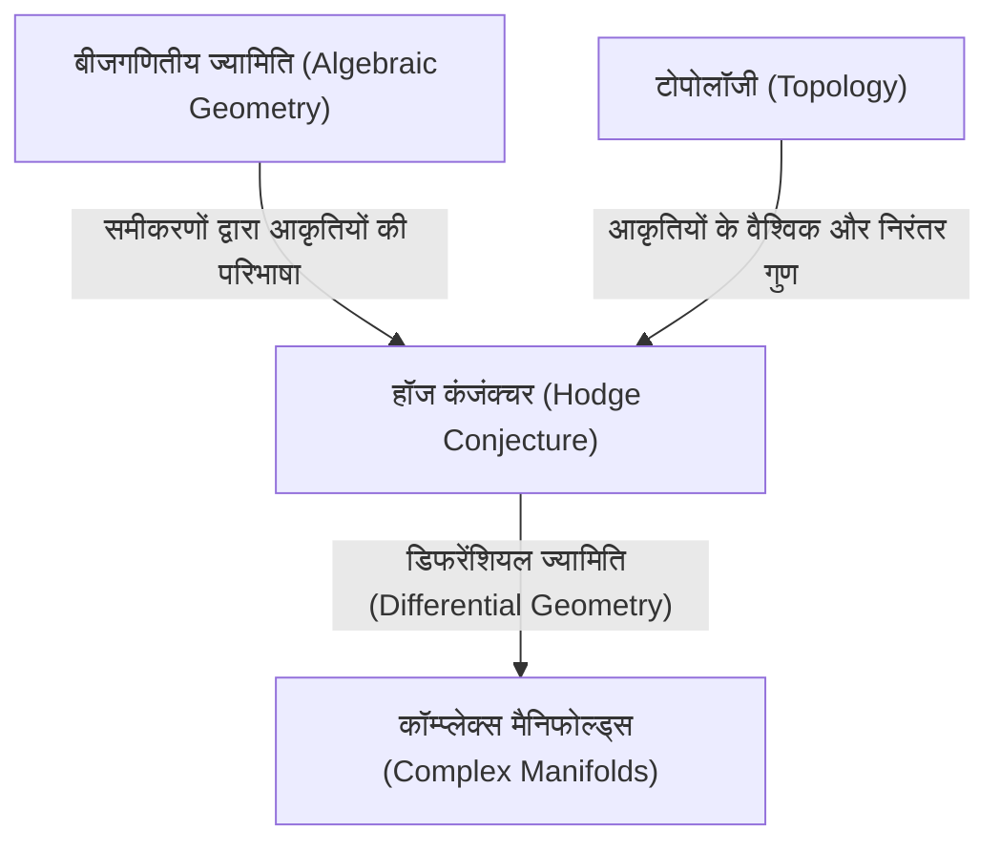
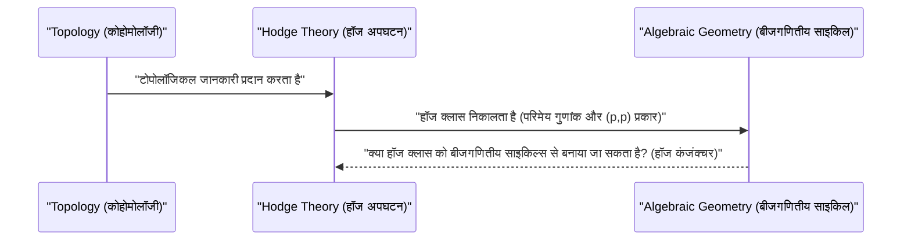

# परिचय

गणित की दुनिया में आज भी कई अनसुलझे रहस्य मौजूद हैं। इनमें सबसे महत्वपूर्ण और आधुनिक गणित की एक बड़ी दीवार के रूप में खड़ी **मिलेनियम प्राइज़ समस्याएँ** (Millennium Prize Problems) हैं। 2000 में क्ले मैथमेटिक्स इंस्टीट्यूट द्वारा घोषित 7 अनसुलझी समस्याओं में से प्रत्येक के लिए 1 मिलियन डॉलर का इनाम रखा गया है, और दुनिया भर के प्रतिभाशाली गणितज्ञ इन्हें सुलझाने की चुनौती ले रहे हैं। इस लेख में, हम मिलेनियम प्राइज़ समस्याओं में से एक, **हॉज कंजंक्चर** ([Hodge Conjecture](https://kenji.blog/hi/p/hodge-conjecture/)) पर गहराई से चर्चा करेंगे, जो बीजगणितीय ज्यामिति और टोपोलॉजी (स्थितिविज्ञान) को जोड़ने वाला एक अत्यंत सुंदर अनुमान है।

हॉज कंजंक्चर, संक्षेप में, "ज्यामितीय आकृतियों" और "बीजगणितीय समीकरणों" के बीच के गहरे संबंधों से संबंधित एक अनुमान है। अधिक सटीकता से कहें तो, यह इस बात पर सवाल उठाता है कि क्या सम्मिश्र संख्या क्षेत्र पर एक नॉन-सिंगुलर प्रोजेक्टिव बीजगणितीय मैनिफोल्ड (non-singular projective algebraic variety) में, कुछ विशिष्ट टोपोलॉजिकल गुणों वाले ऑब्जेक्ट्स को बीजगणितीय उप-मैनिफोल्ड्स (subvarieties) के संयोजनों द्वारा व्यक्त किया जा सकता है।

## 1. बीजगणितीय ज्यामिति और टोपोलॉजी का चौराहा

हॉज कंजंक्चर को समझने के लिए, सबसे पहले गणित की दो शाखाओं, **बीजगणितीय ज्यामिति** (Algebraic Geometry) और **टोपोलॉजी** (Topology) के बीच के संबंध को जानना आवश्यक है।

बीजगणितीय ज्यामिति वह क्षेत्र है जो बहुपद समीकरणों (polynomial equations) के सामान्य शून्यों (common zeros) के रूप में परिभाषित आकृतियों (बीजगणितीय मैनिफोल्ड्स) का अध्ययन करता है। उदाहरण के लिए, वृत्त का समीकरण x^2 + y^2 = 1 सबसे सरल बीजगणितीय मैनिफोल्ड्स में से एक है।

वहीं, टोपोलॉजी वह क्षेत्र है जो उन गुणों का अध्ययन करता है जो आकृतियों को निरंतर विकृत (deform) करने पर भी संरक्षित रहते हैं। जैसे कि एक प्रसिद्ध कहावत है, "एक कॉफी कप और एक डोनट टोपोलॉजिकल रूप से समान आकार के होते हैं," यह छिद्रों की संख्या और कनेक्टिविटी जैसी वैश्विक (global) विशेषताओं पर ध्यान केंद्रित करता है।

हॉज कंजंक्चर इन दो अलग-अलग क्षेत्रों के प्रतिच्छेदन बिंदु पर स्थित है।

## 2. हॉज कंजंक्चर का सूत्रीकरण

हॉज कंजंक्चर को सटीक रूप से वर्णित करने के लिए, कुछ विशेष अवधारणाओं को पेश करना आवश्यक है।

### 2.1 सम्मिश्र प्रोजेक्टिव मैनिफोल्ड

इसका मुख्य मंच **सम्मिश्र संख्या क्षेत्र पर नॉन-सिंगुलर प्रोजेक्टिव बीजगणितीय मैनिफोल्ड** है। मान लें कि यह X है।
कॉम्प्लेक्स मैनिफोल्ड एक ऐसा स्थान है जिसे स्थानीय रूप से सम्मिश्र स्थान \mathbb{C}^n के रूप में माना जा सकता है। प्रोजेक्टिव मैनिफोल्ड का अर्थ है कि इसे प्रोजेक्टिव स्पेस \mathbb{P}^N(\mathbb{C}) के भीतर कुछ समरूप बहुपदों के सामान्य शून्यों के रूप में एम्बेड किया गया है। नॉन-सिंगुलर होने का मतलब है कि आकृति में कोई 'सिंगुलैरिटी' (जैसे कस्प या सेल्फ-इंटरसेक्शन) नहीं है, यह एक चिकनी आकृति है।

### 2.2 डी राम कोहोमोलॉजी और हॉज अपघटन

मैनिफोल्ड X की टोपोलॉजी की जांच करने के लिए एक शक्तिशाली उपकरण **कोहोमोलॉजी** (Cohomology) है। विशेष रूप से वास्तविक या सम्मिश्र संख्याओं के गुणांक वाले डी राम कोहोमोलॉजी समूह H^k(X, \mathbb{C}), मैनिफोल्ड पर डिफरेंशियल फॉर्म्स का उपयोग करके परिभाषित किए जाते हैं।

विलियम हॉज (W. V. D. Hodge) ने दिखाया कि इस सम्मिश्र कोहोमोलॉजी समूह को सम्मिश्र संरचना को दर्शाने वाले और भी बारीक समूहों में तोड़ा जा सकता है। इसे ही **हॉज अपघटन** (Hodge Decomposition) कहा जाता है।

 H^k(X, \mathbb{C}) = \bigoplus_{p+q=k} H^{p,q}(X) 

यहाँ, H^{p,q}(X) उन डिफरेंशियल फॉर्म्स के वर्ग का प्रतिनिधित्व करता है जो p होलोमोर्फिक डिफ़रेंशियल्स और q एंटी-होलोमोर्फिक डिफ़रेंशियल्स के वेज प्रोडक्ट से बने होते हैं।

### 2.3 बीजगणितीय साइकिल और हॉज क्लास

मैनिफोल्ड X के भीतर स्थित, निम्न-आयामी बीजगणितीय मैनिफोल्ड्स (उप-मैनिफोल्ड्स) के औपचारिक रैखिक संयोजन को **बीजगणितीय साइकिल** (Algebraic Cycle) कहा जाता है।

k आयाम का बीजगणितीय साइकिल, पोंकारे डुआलिटी (Poincaré Duality) के माध्यम से, X के 2k-डिग्री कोहोमोलॉजी समूह के एक तत्व को निर्धारित करता है। महत्वपूर्ण बात यह है कि बीजगणितीय उप-मैनिफोल्ड्स से निर्धारित कोहोमोलॉजी वर्ग, हॉज अपघटन में केवल विशिष्ट घटकों में ही दिखाई देते हैं। विशेष रूप से, p कोडिमेंशन (कुल आयाम में से उप-मैनिफोल्ड के आयाम को घटाने पर प्राप्त) वाले बीजगणितीय उप-मैनिफोल्ड द्वारा निर्धारित कोहोमोलॉजी वर्ग, H^{p,p}(X) घटक से संबंधित होता है।

इसके अलावा, क्योंकि बीजगणितीय साइकिल समीकरणों से परिभाषित होते हैं, उनके गुणांकों को परिमेय संख्याओं (या पूर्णांकों) के रूप में माना जा सकता है। इसलिए, बीजगणितीय साइकिल से निर्धारित कोहोमोलॉजी वर्ग परिमेय गुणांकों वाले कोहोमोलॉजी समूह H^{2p}(X, \mathbb{Q}) से भी संबंधित होते हैं।

इन दोनों शर्तों को पूरा करने वाले कोहोमोलॉजी वर्ग, अर्थात

 \text{हॉज}^{p,p}(X) = H^{2p}(X, \mathbb{Q}) \cap H^{p,p}(X) 

से संबंधित तत्वों को **हॉज क्लास** (Hodge Class) कहा जाता है।

## 3. हॉज कंजंक्चर का दावा

अब हम तैयार हैं। हॉज कंजंक्चर का दावा बहुत ही सरल लेकिन आश्चर्यजनक रूप से शक्तिशाली है।

> **[हॉज कंजंक्चर ([Hodge Conjecture](https://kenji.blog/hi/p/hodge-conjecture/))](https://kenji.blog/p/hodge-conjecture/)**
> सम्मिश्र संख्या क्षेत्र पर एक नॉन-सिंगुलर प्रोजेक्टिव बीजगणितीय मैनिफोल्ड X पर कोई भी हॉज क्लास, बीजगणितीय साइकिल्स के परिमेय गुणांकों वाले रैखिक संयोजनों द्वारा व्यक्त किया जा सकता है।

दूसरे शब्दों में, यह दावा करता है कि "टोपोलॉजी और कॉम्प्लेक्स एनालिसिस के दृष्टिकोण से बीजगणितीय ज्यामिति जैसी दिखने वाली कोहोमोलॉजी क्लासेस (हॉज क्लासेस), वास्तव में बीजगणितीय समीकरणों (बीजगणितीय साइकिल) से बनी आकृतियों से उत्पन्न होती हैं।"

यह इस सवाल को उठाता है कि क्या टोपोलॉजी की दुनिया की वस्तुएँ (कोहोमोलॉजी क्लासेस) बीजगणितीय ज्यामिति की दुनिया की वस्तुओं (बहुपद समीकरणों) से बनाई जा सकती हैं।

## 4. हॉज कंजंक्चर की प्रगति और कठिनाई

हॉज कंजंक्चर 1950 की अंतर्राष्ट्रीय गणितज्ञ कांग्रेस में स्वयं हॉज द्वारा प्रस्तावित किया गया था। तब से, कई गणितज्ञों ने इस समस्या पर काम किया है, लेकिन आज तक इसका पूर्ण समाधान नहीं हो पाया है।

### 4.1 हल किए गए मामले

कुछ विशेष मामलों में, हॉज कंजंक्चर सही साबित हुआ है।
- **p=1 का मामला (लेफशेट्ज़ प्रमेय)**: कोडिमेंशन 1 वाले बीजगणितीय साइकिल (जिन्हें डिवाइज़र कहा जाता है) के लिए, हॉज के सूत्रीकरण से पहले ही 1920 के दशक में सोलोमन लेफशेट्ज़ (Solomon Lefschetz) द्वारा इसे सिद्ध कर दिया गया था। इसे **लेफशेट्ज़ (1,1)-प्रमेय** (Lefschetz (1,1)-theorem) कहा जाता है, और इसे हॉज कंजंक्चर की उत्पत्ति भी माना जा सकता है।
- **विशिष्ट मैनिफोल्ड्स से संबंधित परिणाम**: उदाहरण के लिए, एबेलियन मैनिफोल्ड्स और K3 सतहों के कुछ हिस्सों जैसे मैनिफोल्ड्स के विशिष्ट वर्गों के लिए हॉज कंजंक्चर सही पाया गया है।

### 4.2 यह क्यों कठिन है?

हॉज कंजंक्चर की कठिनाई अस्तित्व सिद्ध करने में है। जब एक हॉज क्लास दिया जाता है, तो हमें यह दिखाना होगा कि उसके अनुरूप एक बीजगणितीय साइकिल **मौजूद है**। हालाँकि, हॉज क्लास मुख्य रूप से एनालिटिक या टोपोलॉजिकल डेटा जैसे इंटीग्रल और डिफरेंशियल फॉर्म्स के रूप में दिए जाते हैं, जबकि बीजगणितीय साइकिल बहुपद समीकरणों के बीजगणितीय डेटा से बनाए जाते हैं।

एनालिटिक डेटा से विशिष्ट बीजगणितीय समीकरणों के पुनर्निर्माण का सामान्य तरीका आधुनिक गणित में भी अब तक नहीं मिला है।

## 5. हॉज कंजंक्चर का सामान्यीकरण और संबंधित समस्याएँ

हॉज कंजंक्चर के कई सामान्यीकरण और संबंधित अनुमान मौजूद हैं।

- **सामान्यीकृत हॉज कंजंक्चर (Generalized [Hodge Conjecture](https://kenji.blog/hi/p/hodge-conjecture/))**: यह हॉज कंजंक्चर को अधिक सामान्य रूपरेखा (उदाहरण के लिए, सिंगुलैरिटी वाले मैनिफोल्ड्स या ओपन मैनिफोल्ड्स) में विस्तारित करने का एक प्रयास है। इसे [अलेक्जेंडर ग्रोथेंडिक](https://kenji.blog/hi/p/grothendieck/) ([Alexander Grothendieck](https://kenji.blog/hi/p/grothendieck/)) द्वारा तैयार किया गया था, लेकिन काउंटर-एग्ज़ैम्पल्स मिलने के कारण उचित सूत्रीकरण ही एक मुश्किल काम बन गया है।
- **टेट कंजंक्चर (Tate Conjecture)**: हॉज कंजंक्चर का संख्या-सैद्धांतिक एनालॉग (number-theoretic analogue) टेट कंजंक्चर है। इसे सम्मिश्र संख्या क्षेत्र के बजाय, परिमित क्षेत्र पर मैनिफोल्ड्स के लिए एटाले कोहोमोलॉजी (Étale Cohomology) की अवधारणा का उपयोग करके तैयार किया गया है। यह भी एक बेहद कठिन अनसुलझी समस्या है।

## 6. निष्कर्ष और भविष्य की संभावनाएँ

हॉज कंजंक्चर केवल एक पहेली नहीं है, बल्कि गणित की गहराई को छूने वाली एक महत्वपूर्ण समस्या है। यदि यह अनुमान सही साबित होता है, तो टोपोलॉजी और बीजगणितीय ज्यामिति के बीच एक मौलिक और सुंदर संबंध मौजूद होगा, जिसे हम अभी तक समझ नहीं पाए हैं।

$1 मिलियन के आकर्षक पुरस्कार के साथ, दुनिया भर के गणितज्ञ इस कठिन समस्या का सामना करना जारी रखेंगे। नए गणितीय सिद्धांतों का निर्माण या पूरी तरह से अप्रत्याशित क्षेत्रों से होने वाले दृष्टिकोण एक दिन इस मिलेनियम प्राइज़ समस्या के दरवाज़े खोल सकते हैं। हॉज कंजंक्चर का समाधान पूरे गणित में एक क्रांतिकारी प्रगति लाने की क्षमता रखता है।

हमें उम्मीद है कि पाठकों को गणित की इस गहरी दुनिया में कुछ दिलचस्पी मिली होगी।
## 7. हॉज कंजंक्चर को गहराई से समझने के लिए विशिष्ट उदाहरण

हॉज कंजंक्चर की अमूर्त परिभाषा से इसकी वास्तविकता को समझना मुश्किल हो सकता है। यहाँ हम कुछ विशेष उदाहरणों के माध्यम से हॉज कंजंक्चर के अर्थ को थोड़ा और गहराई से समझेंगे, जो थोड़े तकनीकी होंगे।

### 7.1 टोरस और एलिप्टिक कर्व्स

सबसे सरल और आसानी से समझे जाने वाले उदाहरणों में से एक 1-आयामी सम्मिश्र मैनिफोल्ड, यानी **रीमैन सरफेस** (Riemann Surface) है। इनमें से, जीनस 1 (एक छेद वाला) टोरस (डोनट आकार), बीजगणितीय ज्यामिति में **एलिप्टिक कर्व** (Elliptic Curve) के रूप में जाना जाता है।

एक एलिप्टिक कर्व E के मामले में, कॉम्प्लेक्स डायमेंशन 1 है (रियल डायमेंशन 2)। कोहोमोलॉजी समूहों को देखते हुए, दिलचस्प मध्यवर्ती आयाम का प्रथम-डिग्री कोहोमोलॉजी समूह H^1(E, \mathbb{C}) है, लेकिन हॉज कंजंक्चर का लक्ष्य वे कोहोमोलॉजी समूह हैं जिनका कुल आयाम सम (even) होता है। इसलिए, एलिप्टिक कर्व में (कॉम्प्लेक्स डायमेंशन 1) हॉज कंजंक्चर का कोई भी गैर-तुच्छ बयान प्रकट नहीं होता है।

हालाँकि, एलिप्टिक कर्व्स के डायरेक्ट प्रोडक्ट स्पेस X = E_1 \times E_2 पर विचार करें। इसका कॉम्प्लेक्स डायमेंशन 2 (रियल डायमेंशन 4) होता है, जो इसे एक दिलचस्प मंच बनाता है। हॉज कंजंक्चर को इस स्पेस X के द्वितीय-डिग्री कोहोमोलॉजी समूह H^2(X, \mathbb{Q}) पर लागू किया जा सकता है।

X पर हॉज क्लास विशिष्ट शर्तों को पूरा करने वाले इंटरसेक्शन फॉर्म से संबंधित है। इस मामले में, हॉज क्लास से संबंधित बीजगणितीय साइकिल X के भीतर के वक्र होते हैं। यदि E_1 और E_2 एक विशेष संबंध में हैं (उदाहरण के लिए, कॉम्प्लेक्स मल्टीप्लिकेशन रखते हैं), तो डायरेक्ट प्रोडक्ट स्पेस में कई गैर-तुच्छ वक्र (बीजगणितीय साइकिल) मौजूद होते हैं, और यह साबित हो चुका है कि वे हॉज क्लासेस उत्पन्न करते हैं। यह हॉज कंजंक्चर का एक महत्वपूर्ण उदाहरण है।

### 7.2 K3 सतहें और मोड्यूलाई स्पेस

आधुनिक गणित में अत्यधिक जटिल और अत्यंत महत्वपूर्ण भूमिका निभाने वाली **K3 सतहें** (K3 Surfaces) हैं। K3 सतहें कॉम्प्लेक्स डायमेंशन 2 (रियल डायमेंशन 4) वाले कलाबी-याउ मैनिफोल्ड्स का सबसे सरल उदाहरण हैं, और ये स्ट्रिंग थ्योरी (String Theory) जैसी भौतिकी में भी महत्वपूर्ण विषय हैं।

K3 सतहों के लिए हॉज कंजंक्चर पहले ही साबित हो चुका है। हालाँकि, K3 सतह की हॉज संरचना इसकी ज्यामिति को निर्धारित करने के लिए इतनी शक्तिशाली है (टोरेली प्रमेय, Torelli Theorem), और हॉज कंजंक्चर के सही होने ने K3 सतहों की गहरी समझ प्रदान की है। K3 सतह पर हॉज क्लासेस पूरी तरह से उस सतह पर मौजूद बीजगणितीय वक्रों के वर्गों के रूप में महसूस किए जाते हैं।

इसके अलावा, K3 सतहों के परिवार (मापदंडों को बदलने पर प्राप्त K3 सतहों का सेट) पर विचार करके, हम **मोड्यूलाई स्पेस** (Moduli Space) की अवधारणा तक पहुँचते हैं। मोड्यूलाई स्पेस पर हॉज थ्योरी और व्यक्तिगत मैनिफोल्ड्स के हॉज कंजंक्चर आपस में गहराई से जुड़े हुए हैं, जो बीजगणितीय ज्यामिति के अग्रिम मोर्चे का निर्माण करते हैं।

## 8. बीजगणितीय ज्यामिति में अनसुलझी समस्याओं के साथ संबंध

हॉज कंजंक्चर कोई अलग-थलग समस्या नहीं है, बल्कि कई अन्य महत्वपूर्ण गणितीय अनुमानों के साथ गहराई से जुड़ी हुई है।

### 8.1 ग्रोथेंडिक का स्टैंडर्ड कंजंक्चर्स (Grothendieck's Standard Conjectures)

[अलेक्जेंडर ग्रोथेंडिक](https://kenji.blog/hi/p/grothendieck/) ने बीजगणितीय मैनिफोल्ड्स पर बीजगणितीय साइकिल्स से संबंधित भव्य अनुमानों की एक श्रृंखला स्थापित की। इसे **स्टैंडर्ड कंजंक्चर्स** (Standard Conjectures on Algebraic Cycles) कहा जाता है।

स्टैंडर्ड कंजंक्चर्स में बीजगणितीय साइकिल्स का इंटरसेक्शन सिद्धांत और लेफशेट्ज़ के प्रमेय का किसी भी आयाम तक सामान्यीकरण शामिल है। यदि हॉज कंजंक्चर सच है, तो ऐसा माना जाता है कि सम्मिश्र संख्या क्षेत्रों पर मैनिफोल्ड्स के लिए स्टैंडर्ड कंजंक्चर्स के कुछ हिस्से भी सत्य होंगे। इसके विपरीत, यदि स्टैंडर्ड कंजंक्चर्स हल हो जाते हैं, तो यह हॉज कंजंक्चर के लिए एक शक्तिशाली साधन प्रदान करेगा। ये बीजगणितीय ज्यामिति के अंतिम लक्ष्य, "मोटिव्स थ्योरी" (Theory of Motives) को पूरा करने के लिए अपरिहार्य हिस्से हैं।

### 8.2 मिलनॉर कंजंक्चर और बीजगणितीय K-थ्योरी

हालांकि यह थोड़ा अलग है, व्लादिमीर वोएवोड्स्की (Vladimir Voevodsky) द्वारा हल किया गया मिलनॉर कंजंक्चर (Milnor Conjecture) और इसे सामान्यीकृत करने वाला ब्लोच-काटो कंजंक्चर (Bloch-Kato Conjecture), बीजगणितीय K-थ्योरी और गैल्वा कोहोमोलॉजी को जोड़ते हैं।

वोएवोड्स्की के काम ने "मोटिविक कोहोमोलॉजी" (Motivic Cohomology) नामक एक नया ढांचा तैयार किया, जिससे बीजगणितीय ज्यामिति और टोपोलॉजी के बीच संबंध और भी मजबूत हुआ। यह मोटिविक दृष्टिकोण हॉज कंजंक्चर को बीजगणितीय साइकिल्स के अधिक सामान्य सिद्धांत के भीतर रखता है, और यह आधुनिक हॉज कंजंक्चर अनुसंधान में एक अनिवार्य दृष्टिकोण बन गया है।

## 9. टोपोलॉजी और विश्लेषण के दृष्टिकोण से

हॉज कंजंक्चर को न केवल बीजगणितीय ज्यामिति से देखना महत्वपूर्ण है, बल्कि टोपोलॉजी और एनालिसिस के दृष्टिकोण से भी देखना महत्वपूर्ण है।

### 9.1 सिंगुलैरिटी थ्योरी के साथ प्रतिच्छेदन

जब मैनिफोल्ड्स में सिंगुलैरिटीज़ (Singularities) की अनुमति दी जाती है, तो हॉज थ्योरी **मिश्रित हॉज संरचना** (Mixed Hodge Structure) के सिद्धांत के रूप में विकसित होती है। यह पियरे डेलिग्ने (Pierre Deligne) द्वारा निर्मित एक सुंदर सिद्धांत है, जो सिंगुलैरिटी वाले स्थानों की कोहोमोलॉजी में एक नया पदानुक्रमित ढांचा पेश करता है जिसे वेट (Weight) कहा जाता है।

मिश्रित हॉज संरचना का सिद्धांत मैनिफोल्ड के डिजेनेरेट होने की चरम सीमा (उदाहरण के लिए, वह प्रक्रिया जिसमें एक चिकनी सतह धीरे-धीरे ढह जाती है और सिंगुलैरिटी वाली सतह बन जाती है) में कोहोमोलॉजी में बदलाव का वर्णन करने के लिए एक शक्तिशाली उपकरण है। हॉज कंजंक्चर का विस्तार करने के प्रयास में, यह सिंगुलैरिटी थ्योरी और मिश्रित हॉज संरचनाएं महत्वपूर्ण भूमिका निभाती हैं और ज्यामितीय घटनाओं को विश्लेषणात्मक रूप से समझने के लिए आवश्यक हैं।

### 9.2 ट्विस्टर स्पेस और डिफरेंशियल ज्यामिति (Twistor Space and Differential Geometry)

रोजर पेनरोज़ (Roger Penrose) द्वारा प्रस्तावित ट्विस्टर थ्योरी (Twistor Theory) अंतरिक्ष-समय की ज्यामिति को कॉम्प्लेक्स प्रोजेक्टिव स्पेस पर एनालिटिक ज्यामिति में अनुवाद करने का एक प्रयास है। ट्विस्टर स्पेस डिफरेंशियल ज्यामिति और कॉम्प्लेक्स मैनिफोल्ड थ्योरी को मजबूती से जोड़ता है।

हॉज कंजंक्चर कॉम्प्लेक्स मैनिफोल्ड्स पर डिफरेंशियल फॉर्म्स (हॉज अपघटन) पर आधारित है, लेकिन डिफरेंशियल ज्यामिति के नजरिए से, इन्हें लाप्लास ऑपरेटर के हार्मोनिक फॉर्म्स के रूप में समझा जाता है। हार्मोनिक इंटीग्रल्स थ्योरी नामक एनालिसिस का एक शक्तिशाली प्रमेय हॉज अपघटन के पीछे मौजूद है, और कुछ शोधकर्ताओं को उम्मीद है कि ट्विस्टर स्पेस जैसी डिफरेंशियल ज्योमेट्रिक रचनाएँ भविष्य में हॉज क्लासेस के निर्माण के लिए नई विश्लेषणात्मक विधियाँ प्रदान कर सकती हैं।

## 10. भविष्य की संभावनाएँ: हॉज कंजंक्चर कब हल होगा?

हॉज कंजंक्चर को प्रस्तावित हुए 70 साल से अधिक हो चुके हैं। कई आंशिक परिणाम और संबंधित शक्तिशाली सिद्धांत (जैसे मोटिविक कोहोमोलॉजी और मिश्रित हॉज संरचनाएं) विकसित किए गए हैं, लेकिन सामान्य नॉन-सिंगुलर प्रोजेक्टिव मैनिफोल्ड्स के लिए कोई पूर्ण प्रमाण नहीं मिला है।

कुछ गणितज्ञों को संदेह है कि "क्या हॉज कंजंक्चर के काउंटर-एग्ज़ैम्पल्स (counterexamples) हो सकते हैं।" यदि कोई काउंटर-एग्ज़ैम्पल मिलता है, तो यह गणित की दुनिया को एक बड़ा झटका देगा, और टोपोलॉजी और बीजगणितीय ज्यामिति के बीच के संबंध की हमारी समझ को मौलिक रूप से संशोधित करने के लिए मजबूर करेगा।

हालाँकि, अधिकांश गणितज्ञ मानते हैं कि हॉज कंजंक्चर सच है, और इसे साबित करने के लिए नए गणितीय प्रतिमानों (paradigms) की तलाश कर रहे हैं। हॉज कंजंक्चर विभिन्न क्षेत्रों जैसे कि बीजगणितीय ज्यामिति, टोपोलॉजी, कॉम्प्लेक्स एनालिसिस और यहाँ तक कि संख्या सिद्धांत और गणितीय भौतिकी के संगम के केंद्र में बैठा है।

यह कोई नहीं जानता कि यह समस्या कब सुलझेगी। हालाँकि, हॉज कंजंक्चर को चुनौती देने की प्रक्रिया में उत्पन्न नए गणितीय विचार निस्संदेह मानव ज्ञान को समृद्ध करेंगे और अगली पीढ़ी के गणित की नींव बनेंगे। मिलेनियम प्राइज़ समस्याओं से जुड़े 1 मिलियन डॉलर से अधिक का मूल्य निश्चित रूप से यहाँ मौजूद है।
