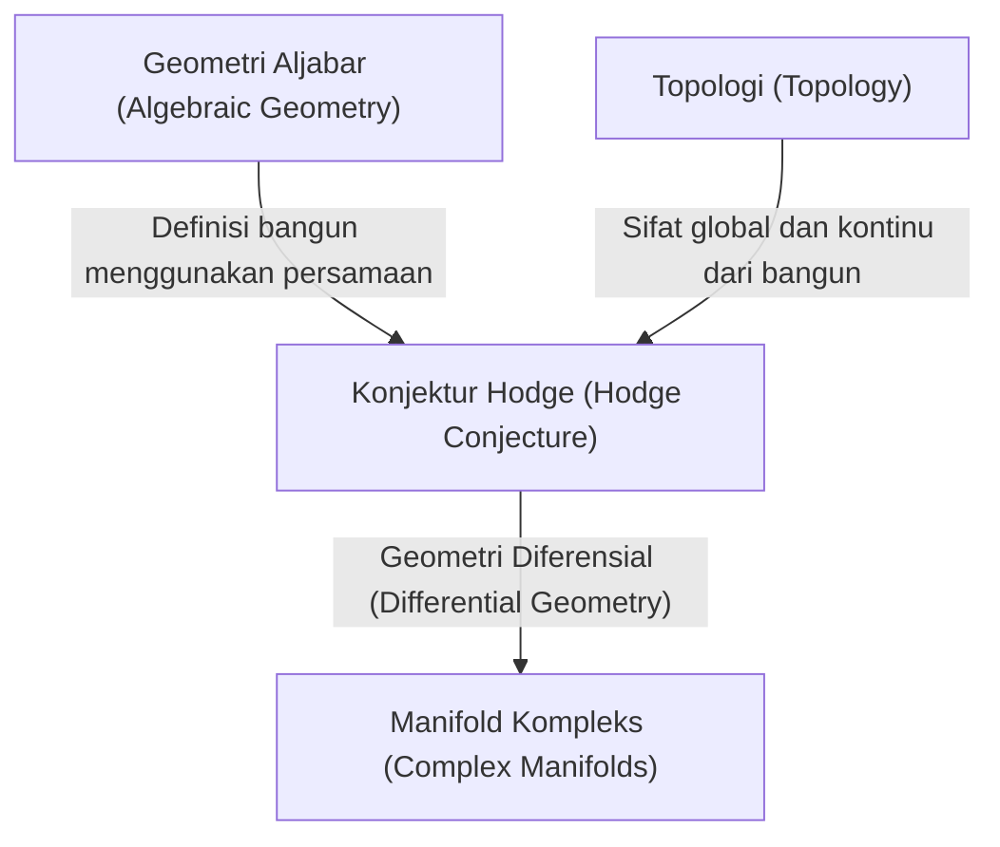
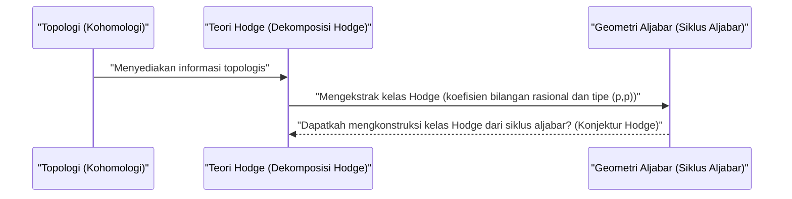

# Pendahuluan

Di dunia matematika, terdapat banyak misteri yang belum terpecahkan. Di antaranya yang sangat penting dan berdiri sebagai tembok besar matematika modern adalah **Masalah Hadiah Milenium** (Millennium Prize Problems). Diumumkan oleh Clay Mathematics Institute pada tahun 2000, tujuh masalah yang belum terpecahkan ini masing-masing memiliki hadiah sebesar 1 juta dolar, dan para ahli matematika jenius dari seluruh dunia sedang menantang diri mereka untuk memecahkannya. Dalam artikel ini, kita akan menggali lebih dalam salah satu dari Masalah Hadiah Milenium tersebut, yaitu **Konjektur Hodge** ([Hodge Conjecture](https://kenji.blog/id/p/hodge-conjecture/)), sebuah konjektur yang sangat indah yang menghubungkan geometri aljabar dan topologi.

Secara singkat, Konjektur Hodge adalah sebuah konjektur mengenai hubungan mendalam antara "bentuk geometris" dan "persamaan aljabar". Lebih tepatnya, ia mempertanyakan apakah pada varietas aljabar proyektif non-singular di atas lapangan bilangan kompleks, objek-objek dengan sifat topologis tertentu dapat diekspresikan oleh kombinasi dari subvarietas aljabar.

## 1. Persimpangan antara Geometri Aljabar dan Topologi

Untuk memahami Konjektur Hodge, pertama-tama kita perlu mengetahui hubungan antara dua bidang matematika: **Geometri Aljabar** (Algebraic Geometry) dan **Topologi** (Topology).

Geometri aljabar adalah bidang yang mempelajari bangun (varietas aljabar) yang didefinisikan sebagai himpunan nol bersama dari persamaan-persamaan polinomial. Misalnya, persamaan lingkaran x^2 + y^2 = 1 adalah salah satu varietas aljabar yang paling sederhana.

Di sisi lain, topologi adalah bidang yang mempelajari sifat-sifat yang tetap dipertahankan meskipun suatu bangun dideformasi secara kontinu. Seperti dalam perumpamaan terkenal "cangkir kopi dan donat memiliki bentuk yang sama secara topologis", bidang ini berfokus pada sifat-sifat global seperti jumlah lubang dan keterhubungan.

Konjektur Hodge berada di titik persimpangan antara dua bidang yang berbeda ini.

## 2. Perumusan Konjektur Hodge

Untuk menyatakan Konjektur Hodge secara akurat, kita perlu memperkenalkan beberapa konsep teknis.

### 2.1 Varietas Proyektif Kompleks

Panggungnya adalah **varietas aljabar proyektif non-singular di atas lapangan bilangan kompleks**. Mari kita sebut ini X.
Manifold kompleks adalah ruang yang secara lokal dapat dipandang sebagai ruang kompleks \mathbb{C}^n. Disebut varietas proyektif karena ia tertanam di dalam ruang proyektif \mathbb{P}^N(\mathbb{C}) sebagai himpunan nol bersama dari beberapa polinomial homogen. Non-singular berarti bahwa bangun tersebut tidak memiliki "titik singular" (singularitas) seperti titik tajam atau perpotongan dengan dirinya sendiri, melainkan sebuah bangun yang mulus.

### 2.2 Kohomologi de Rham dan Dekomposisi Hodge

Alat yang kuat untuk mempelajari topologi dari manifold X adalah **Kohomologi** (Cohomology). Secara khusus, grup kohomologi de Rham H^k(X, \mathbb{C}) dengan koefisien di lapangan bilangan riil atau kompleks, didefinisikan menggunakan bentuk-bentuk diferensial pada manifold.

William Hodge (W. V. D. Hodge) menunjukkan bahwa grup kohomologi kompleks ini dapat dipecah menjadi grup-grup yang lebih rinci yang mencerminkan struktur kompleks. Inilah yang disebut **Dekomposisi Hodge** (Hodge Decomposition).

 H^k(X, \mathbb{C}) = \bigoplus_{p+q=k} H^{p,q}(X) 

Di sini, H^{p,q}(X) merepresentasikan kelas bentuk diferensial yang terdiri dari produk wedge dari p diferensial holomorfik dan q diferensial anti-holomorfik.

### 2.3 Siklus Aljabar dan Kelas Hodge

Kombinasi linear formal dari varietas aljabar berdimensi lebih rendah (subvarietas) di dalam manifold X disebut **Siklus Aljabar** (Algebraic Cycle).

Siklus aljabar berdimensi k menentukan sebuah elemen dari grup kohomologi derajat 2k dari X melalui dualitas [Poincaré](https://kenji.blog/id/p/poincare/) ([Poincaré](https://kenji.blog/id/p/poincare/) Duality). Yang penting adalah fakta bahwa kelas kohomologi yang ditentukan dari subvarietas aljabar hanya muncul pada komponen tertentu dalam dekomposisi Hodge. Secara konkret, kelas kohomologi yang ditentukan oleh subvarietas aljabar dengan kodimensi p (dimensi keseluruhan dikurangi dimensi subvarietas) termasuk dalam komponen H^{p,p}(X).

Selain itu, karena siklus aljabar didefinisikan oleh persamaan-persamaan, koefisien-koefisiennya dapat dianggap sebagai bilangan rasional (atau bilangan bulat). Oleh karena itu, kelas kohomologi yang ditentukan dari siklus aljabar juga termasuk dalam grup kohomologi dengan koefisien rasional H^{2p}(X, \mathbb{Q}).

Kelas kohomologi yang memenuhi kedua syarat ini, yaitu

 \text{Hodge}^{p,p}(X) = H^{2p}(X, \mathbb{Q}) \cap H^{p,p}(X) 

elemen yang termasuk ke dalamnya disebut **Kelas Hodge** (Hodge Class).

## 3. Pernyataan Konjektur Hodge

Persiapan sudah selesai. Pernyataan dari Konjektur Hodge sangat sederhana, namun luar biasa kuat.

> **[Konjektur Hodge (Hodge Conjecture)](https://kenji.blog/p/hodge-conjecture/)**
> Sembarang kelas Hodge pada varietas aljabar proyektif non-singular X di atas lapangan bilangan kompleks dapat diekspresikan oleh kombinasi linear dengan koefisien bilangan rasional dari siklus-siklus aljabar.

Dengan kata lain, ini menyatakan bahwa "kelas kohomologi (kelas Hodge) yang terlihat bersifat geometri aljabar dari sudut pandang topologi dan analisis kompleks, sebenarnya berasal dari bangun yang dibuat dari persamaan aljabar (siklus aljabar)".

Ini adalah pertanyaan mengenai apakah kelas kohomologi, yang merupakan objek dari dunia topologi, dapat dikonstruksi dari persamaan polinomial, yang merupakan objek dari dunia geometri aljabar.

## 4. Perkembangan dan Kesulitan Konjektur Hodge

Konjektur Hodge diajukan oleh Hodge sendiri pada Kongres Matematikawan Internasional pada tahun 1950. Sejak saat itu, banyak matematikawan telah berjuang dengan masalah ini, namun belum ada penyelesaian yang utuh hingga saat ini.

### 4.1 Kasus yang Sudah Dipecahkan

Untuk beberapa kasus khusus, Konjektur Hodge telah terbukti benar.
- **Kasus p=1 (Teorema Lefschetz)**: Untuk siklus aljabar dengan kodimensi 1 (disebut pembagi atau divisor), telah dibuktikan oleh Solomon Lefschetz pada tahun 1920-an sebelum perumusan Hodge. Ini disebut **Teorema (1,1) Lefschetz** (Lefschetz (1,1)-theorem), yang juga dapat dikatakan sebagai asal mula dari Konjektur Hodge.
- **Hasil terkait manifold tertentu**: Misalnya, telah dikonfirmasi bahwa Konjektur Hodge berlaku untuk kelas manifold tertentu, seperti varietas [Abel](https://kenji.blog/id/p/abel/)ian dan sebagian dari permukaan K3.

### 4.2 Mengapa Ini Sulit?

Kesulitan dari Konjektur Hodge terletak pada sulitnya membuktikan eksistensi (keberadaan). Ketika sebuah kelas Hodge diberikan, kita harus menunjukkan bahwa siklus aljabar yang berkorespondensi dengannya itu **ada**. Namun, sementara kelas Hodge diberikan hanya sebagai data analitik dan topologis seperti integral dan bentuk diferensial, siklus aljabar dikonstruksi dari data aljabar yaitu persamaan polinomial.

Metode umum untuk merekonstruksi persamaan aljabar konkret dari data analitik masih belum ditemukan, bahkan dalam matematika modern.

## 5. Generalisasi Konjektur Hodge dan Masalah Terkait

Terdapat berbagai generalisasi dan konjektur terkait dari Konjektur Hodge.

- **Konjektur Hodge yang Digeneralisasi (Generalized [Hodge Conjecture](https://kenji.blog/id/p/hodge-conjecture/))**: Ini merupakan upaya untuk memperluas Konjektur Hodge ke dalam kerangka yang lebih umum (misalnya, ke manifold yang memiliki singularitas, atau manifold terbuka). Ini dirumuskan oleh [Alexander Grothendieck](https://kenji.blog/id/p/grothendieck/) dan ilmuwan lainnya, tetapi menemukan perumusan yang tepat itu sendiri merupakan tantangan yang sulit, karena berbagai contoh sangkalan telah ditemukan.
- **Konjektur Tate (Tate Conjecture)**: Dikenal sebagai padanan teoretis-bilangan dari Konjektur Hodge. Alih-alih manifold di atas lapangan bilangan kompleks, ini dirumuskan untuk manifold di atas lapangan hingga dengan menggunakan konsep Kohomologi Étale (Étale Cohomology). Ini juga merupakan masalah tak terpecahkan yang sangat sulit.

## 6. Kesimpulan dan Prospek Masa Depan

Konjektur Hodge bukanlah sekadar teka-teki, melainkan masalah penting yang menyentuh kedalaman matematika. Jika konjektur ini benar, maka akan terbukti adanya hubungan yang mendasar dan indah yang belum kita pahami antara topologi dan geometri aljabar.

Dengan daya tarik hadiah 1 juta dolar yang ditetapkan, matematikawan di seluruh dunia akan terus menantang masalah sulit ini di masa mendatang. Konstruksi teori matematika baru atau pendekatan dari bidang yang sama sekali tidak terduga, mungkin suatu hari nanti akan membuka pintu bagi Masalah Hadiah Milenium ini. Penyelesaian Konjektur Hodge memiliki potensi untuk membawa kemajuan revolusioner dalam matematika secara keseluruhan.

Kami berharap para pembaca juga setidaknya bisa memiliki sedikit ketertarikan pada dunia matematika yang mendalam ini.
## 7. Contoh Konkret untuk Memahami Konjektur Hodge Lebih Dalam

Mungkin sulit untuk memahami esensi sebenarnya hanya melalui definisi abstrak Konjektur Hodge. Di sini, meskipun sedikit lebih teknis, mari kita gali lebih dalam makna Konjektur Hodge melalui beberapa contoh konkret.

### 7.1 Torus dan Kurva Eliptik

Salah satu contoh yang paling sederhana dan mudah dipahami adalah manifold kompleks 1-dimensi, yaitu **Permukaan [Riemann](https://kenji.blog/id/p/riemann/)** ([Riemann](https://kenji.blog/id/p/riemann/) Surface). Di antaranya, torus (berbentuk donat) dengan genus (jumlah lubang) 1 dikenal sebagai **Kurva Eliptik** (Elliptic Curve) dalam geometri aljabar.

Dalam kasus kurva eliptik E, dimensi kompleksnya adalah 1 (dimensi riil 2). Ketika mempertimbangkan grup kohomologi, yang menarik adalah grup kohomologi berderajat 1 di tengah, H^1(E, \mathbb{C}), namun subjek dari Konjektur Hodge adalah grup kohomologi dengan dimensi keseluruhan yang genap. Oleh karena itu, pada kurva eliptik itu sendiri (dimensi kompleks 1), tidak ada pernyataan Konjektur Hodge non-trivial yang muncul.

Namun, mari kita pertimbangkan ruang hasil kali langsung X = E_1 \times E_2 dari kurva-kurva eliptik. Ini menghasilkan dimensi kompleks 2 (dimensi riil 4) dan menjadi panggung yang menarik. Kita dapat menerapkan Konjektur Hodge pada grup kohomologi derajat ke-2, H^2(X, \mathbb{Q}), dari ruang X ini.

Kelas Hodge pada X berkaitan dengan bentuk interseksi yang memenuhi kondisi-kondisi tertentu. Dalam kasus ini, siklus aljabar yang bersesuaian dengan kelas Hodge menjadi kurva-kurva di dalam X. Jika E_1 dan E_2 berada dalam hubungan khusus (misalnya, memiliki perkalian kompleks), telah dibuktikan bahwa banyak kurva non-trivial (siklus aljabar) ada di ruang hasil kali langsung, dan kurva-kurva tersebut menghasilkan kelas Hodge. Ini merupakan salah satu contoh nyata yang penting dari Konjektur Hodge.

### 7.2 Permukaan K3 dan Ruang Moduli

Yang lebih kompleks dan memainkan peran yang sangat penting dalam matematika modern adalah **Permukaan K3** (K3 Surface). Permukaan K3 adalah contoh paling sederhana dari manifold Calabi-Yau dengan dimensi kompleks 2 (dimensi riil 4), dan ia juga menjadi subjek penting dalam bidang fisika seperti Teori Dawai (String Theory).

Konjektur Hodge untuk Permukaan K3 telah dibuktikan. Namun, struktur Hodge dari permukaan K3 sangatlah kuat hingga dapat menentukan geometrinya (Teorema Torelli, Torelli Theorem), dan kebenaran Konjektur Hodge memberikan pemahaman yang mendalam tentang permukaan K3. Kelas Hodge pada permukaan K3 diwujudkan sepenuhnya sebagai kelas kurva-kurva aljabar yang ada pada permukaan tersebut.

Selain itu, dengan mempertimbangkan famili permukaan K3 (himpunan permukaan K3 yang didapatkan saat mengubah parameternya), kita sampai pada konsep **Ruang Moduli** (Moduli Space). Teori Hodge pada ruang moduli dan Konjektur Hodge dari masing-masing manifold terjalin erat dan membentuk garis depan dari geometri aljabar.

## 8. Keterkaitan dengan Kumpulan Masalah Tak Terpecahkan dalam Geometri Aljabar

Konjektur Hodge bukanlah masalah yang terisolasi, melainkan berhubungan erat dengan banyak konjektur matematis penting lainnya.

### 8.1 Konjektur Standar Grothendieck (Grothendieck's Standard Conjectures)

[Alexander Grothendieck](https://kenji.blog/id/p/grothendieck/) merumuskan serangkaian konjektur besar yang berkaitan dengan siklus aljabar pada varietas aljabar. Inilah **Konjektur Standar** (Standard Conjectures on Algebraic Cycles).

Konjektur standar mencakup teori perpotongan dari siklus aljabar dan generalisasi Teorema Lefschetz ke sembarang dimensi. Diyakini bahwa jika Konjektur Hodge benar, maka sebagian dari konjektur standar akan menyusul untuk manifold di atas lapangan bilangan kompleks. Sebaliknya, jika konjektur standar dipecahkan, ia akan menyediakan alat yang kuat bagi Konjektur Hodge. Ini semua adalah kepingan yang sangat penting dalam penyempurnaan "Teori Motif" (Theory of Motives), yang merupakan tujuan akhir dalam geometri aljabar.

### 8.2 Konjektur Milnor dan Teori-K Aljabar (Milnor Conjecture and Algebraic K-Theory)

Meskipun sedikit berbeda karakternya, Konjektur Milnor (Milnor Conjecture) yang dipecahkan oleh Vladimir Voevodsky, serta Konjektur Bloch-Kato (Bloch-Kato Conjecture) yang menggeneralisasinya, menghubungkan teori-K aljabar dan kohomologi [Galois](https://kenji.blog/id/p/galois/).

Karya Voevodsky membangun kerangka baru yang disebut "Kohomologi Motivik" (Motivic Cohomology), yang semakin memperkuat hubungan antara geometri aljabar dan topologi. Sudut pandang motivik ini menempatkan Konjektur Hodge dalam teori siklus aljabar yang lebih umum, menjadikannya pendekatan yang sangat penting dalam penelitian Konjektur Hodge modern.

## 9. Dari Sudut Pandang Topologi dan Analisis

Penting untuk memandang Konjektur Hodge tidak hanya dari geometri aljabar, tetapi juga dari sudut pandang topologi dan analisis.

### 9.1 Persilangan dengan Teori Singularitas

Ketika manifold diizinkan memiliki singularitas (Singularities), teori Hodge berkembang menjadi teori **Struktur Hodge Campuran** (Mixed Hodge Structure). Ini adalah teori indah yang dikembangkan oleh Pierre Deligne, dan juga memperkenalkan struktur hierarkis baru yang disebut "Bobot" (Weight) ke dalam kohomologi dari ruang yang bersingularitas.

Teori struktur Hodge campuran adalah alat yang ampuh untuk mendeskripsikan perubahan dalam kohomologi pada batas tempat manifold terdegenerasi (misalnya, proses sebuah permukaan mulus yang berangsur-angsur hancur menjadi sebuah permukaan bersingularitas). Dalam upaya untuk memperluas Konjektur Hodge, teori singularitas dan struktur Hodge campuran memainkan peran penting, dan telah menjadi esensial untuk menangkap fenomena geometris secara analitis.

### 9.2 Ruang Twistor dan Geometri Diferensial (Twistor Space and Differential Geometry)

Teori Twistor (Twistor Theory) yang diusulkan oleh Roger Penrose merupakan upaya untuk menerjemahkan geometri ruang-waktu ke dalam geometri analitik pada ruang proyektif kompleks. Ruang twistor menghubungkan geometri diferensial dan teori manifold kompleks secara kuat.

Konjektur Hodge didasarkan pada bentuk-bentuk diferensial pada manifold kompleks (dekomposisi Hodge), tetapi dari sudut pandang geometri diferensial, bentuk-bentuk ini dipahami sebagai bentuk-bentuk harmonik dari operator Laplace. Teorema kuat dari analisis yang disebut teori integral harmonik (harmonic integral theory) eksis di balik dekomposisi Hodge, dan beberapa peneliti berharap bahwa konstruksi geometri diferensial seperti ruang twistor akan menyediakan metode analitik baru untuk mengkonstruksi kelas Hodge di masa depan.

## 10. Prospek Masa Depan: Kapan Konjektur Hodge Akan Dipecahkan?

Sudah lebih dari 70 tahun sejak Konjektur Hodge pertama kali diajukan. Meskipun banyak hasil-hasil parsial dan teori-teori kuat yang terkait (seperti Kohomologi Motivik dan struktur Hodge campuran) telah dibangun, pembuktian sempurna untuk varietas proyektif non-singular yang umum belum juga tercapai.

Beberapa matematikawan curiga bahwa "Mungkin ada contoh sangkalan terhadap Konjektur Hodge". Jika contoh sangkalan ditemukan, hal itu akan mengejutkan dunia matematika, memaksa kita untuk merevisi secara mendasar pemahaman kita tentang hubungan antara topologi dan geometri aljabar.

Namun demikian, sebagian besar matematikawan percaya bahwa Konjektur Hodge adalah benar, dan mencari paradigma matematika baru untuk membuktikannya. Konjektur Hodge bersemayam di pusat bersatunya berbagai bidang yang beragam: geometri aljabar, topologi, analisis kompleks, hingga teori bilangan dan fisika matematis.

Tak seorang pun tahu kapan hari itu akan tiba di mana masalah ini dipecahkan. Akan tetapi, ide-ide matematika baru yang lahir dalam proses menantang Konjektur Hodge tidak diragukan lagi akan memperkaya pengetahuan umat manusia dan menjadi batu penjuru matematika generasi mendatang. Nilai yang lebih besar dari hadiah 1 juta dolar yang dipertaruhkan dalam Masalah Hadiah Milenium pasti ada di sana.
