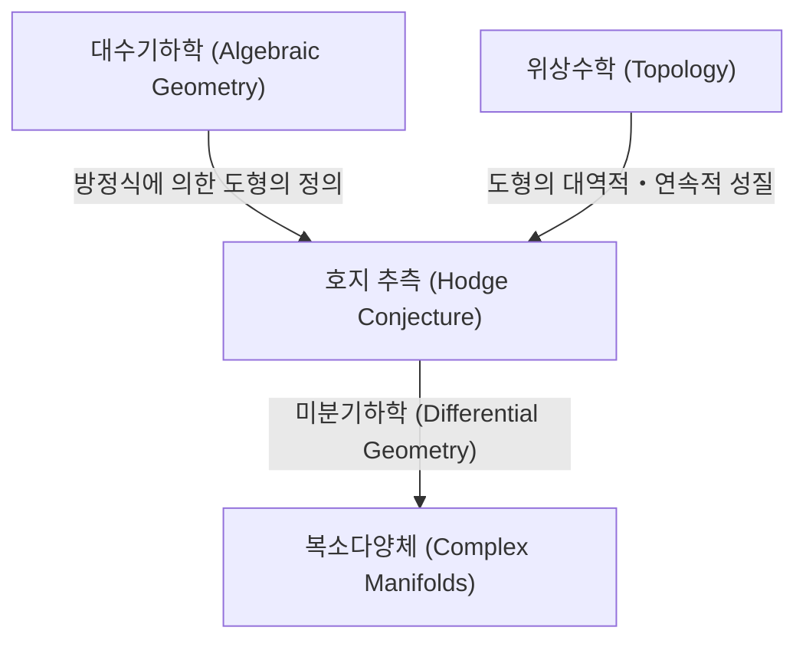
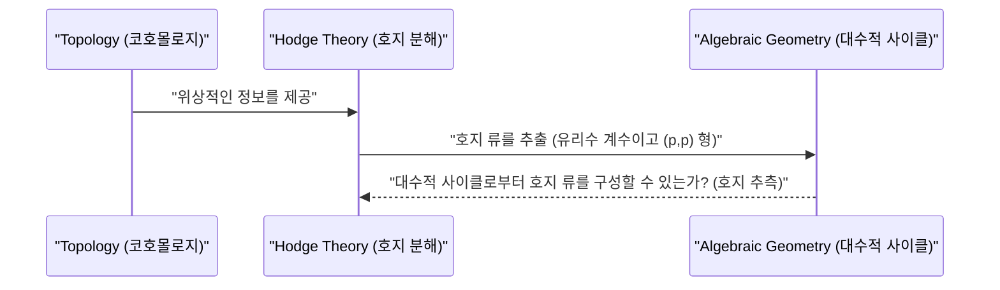

# 들어가며

수학의 세계에는 아직 해명되지 않은 많은 수수께끼가 존재합니다. 그 중에서도 특히 중요하며, 현대 수학의 거대한 벽으로 가로막고 있는 것이 **밀레니엄 현상 문제** (Millennium Prize Problems) 입니다. 2000년 클레이 수학연구소에서 발표한 7개의 미해결 문제는 각각 100만 달러의 상금이 걸려 있으며, 전 세계의 천재 수학자들이 그 해명에 도전하고 있습니다. 본 기사에서는 그 밀레니엄 현상 문제 중에서도 대수기하학과 위상수학 (토폴로지) 을 연결하는 매우 아름다운 추측인 **호지 추측** ([Hodge Conjecture](https://kenji.blog/ko/p/hodge-conjecture/)) 에 대해 깊이 파헤쳐 보겠습니다.

호지 추측은 한마디로 말하면 '기하학적인 형태'와 '대수적인 방정식' 사이의 깊은 관계성에 관한 추측입니다. 더 정확하게는, 복소수체 상의 비특이 사영 대수다양체에서, 특정한 위상적 성질을 가지는 대상이 대수적인 부분다양체의 조합으로 표현될 수 있는지를 묻는 것입니다.

## 1. 대수기하학과 위상수학의 교차점

호지 추측을 이해하기 위해서는 먼저 **대수기하학** (Algebraic Geometry) 과 **위상수학** (Topology) 이라는 두 수학 분야의 관계를 알아야 합니다.

대수기하학은 다항식 방정식의 공통 영점으로서 정의되는 도형 (대수다양체) 을 연구하는 분야입니다. 예를 들어, 원의 방정식 x^2 + y^2 = 1 은 가장 단순한 대수다양체 중 하나입니다.

반면, 위상수학은 도형을 연속적으로 변형시켜도 보존되는 성질을 연구하는 분야입니다. "커피잔과 도넛은 위상수학적으로 같은 형태를 하고 있다"라는 유명한 비유처럼, 구멍의 수나 연결성과 같은 대역적인 성질에 주목합니다.

호지 추측은 이 두 개의 다른 분야가 교차하는 지점에 존재합니다.

## 2. 호지 추측의 공식화

호지 추측을 정확하게 서술하기 위해서는 몇 가지 전문적인 개념을 도입해야 합니다.

### 2.1 복소 사영 다양체

무대가 되는 것은 **복소수체 상의 비특이 사영 대수다양체** 입니다. 이를 X라고 하겠습니다.
복소다양체란 국소적으로 복소공간 \mathbb{C}^n 과 간주될 수 있는 공간을 말합니다. 사영다양체라는 것은 그것이 사영공간 \mathbb{P}^N(\mathbb{C}) 안에 몇 개의 동차다항식의 공통 영점으로 매장되어 있음을 의미합니다. 비특이라는 것은 도형에 첨점이나 자기교차 등의 '특이점'이 없는 매끄러운 도형임을 의미합니다.

### 2.2 드람 코호몰로지와 호지 분해

다양체 X의 위상수학을 조사하는 강력한 도구가 **코호몰로지** (Cohomology) 입니다. 특히 실수체나 복소수체를 계수로 하는 드람 코호몰로지 군 H^k(X, \mathbb{C}) 는 다양체 상의 미분형식을 이용하여 정의됩니다.

윌리엄 호지 (W. V. D. Hodge) 는 이 복소 코호몰로지 군이 복소 구조를 반영한 더 세밀한 군으로 분해될 수 있음을 보여주었습니다. 이것이 **호지 분해** (Hodge Decomposition) 입니다.

 H^k(X, \mathbb{C}) = \bigoplus_{p+q=k} H^{p,q}(X) 

여기서, H^{p,q}(X) 는 p 개의 정칙미분과 q 개의 반정칙미분의 쐐기곱으로 이루어진 미분형식의 클래스를 나타냅니다.

### 2.3 대수적 사이클과 호지 류

다양체 X 안에 있는, 더 차원이 낮은 대수다양체 (부분다양체) 의 형식적인 선형 결합을 **대수적 사이클** (Algebraic Cycle) 이라고 부릅니다.

차원이 k인 대수적 사이클은 푸앵카레 쌍대성 ([Poincaré](https://kenji.blog/ko/p/poincare/) Duality) 에 의해 X 의 2k 차 코호몰로지 군의 원소를 결정합니다. 중요한 것은, 대수적인 부분다양체로부터 정해지는 코호몰로지 류는 호지 분해에서 특정 성분에만 나타난다는 사실입니다. 구체적으로, 여차원 (전체 차원에서 부분다양체의 차원을 뺀 것) 이 p 인 대수적 부분다양체가 정하는 코호몰로지 류는 H^{p,p}(X) 라는 성분에 속합니다.

게다가, 대수적 사이클은 방정식으로부터 정의되기 때문에, 그 계수는 유리수 (혹은 정수) 로 생각할 수 있습니다. 따라서 대수적 사이클에서 정해지는 코호몰로지 류는 유리 계수의 코호몰로지 군 H^{2p}(X, \mathbb{Q}) 에도 속하게 됩니다.

이 두 가지 조건을 만족하는 코호몰로지 류, 즉

 \text{Hodge}^{p,p}(X) = H^{2p}(X, \mathbb{Q}) \cap H^{p,p}(X) 

에 속하는 원소를 **호지 류** (Hodge Class) 라고 부릅니다.

## 3. 호지 추측의 주장

준비가 끝났습니다. 호지 추측의 주장은 매우 단순하면서도 놀랍도록 강력합니다.

> **[호지 추측 (Hodge Conjecture)](https://kenji.blog/p/hodge-conjecture/)**
> 복소수체 상의 비특이 사영 대수다양체 X 상의 임의의 호지 류는 대수적 사이클의 유리수 계수 선형 결합에 의해 표현된다.

바꿔 말하면, "위상수학과 복소해석의 관점에서 대수기하학적으로 보일 것 같은 코호몰로지 류 (호지 류) 는, 실제로 대수적인 방정식으로부터 만들어진 도형 (대수적 사이클) 에서 생겨나고 있다"는 것을 주장하고 있습니다.

위상수학 세계의 대상인 코호몰로지 류가, 대수기하학 세계의 대상인 다항식 방정식으로부터 구성될 수 있는가 하는 물음인 것입니다.

## 4. 호지 추측의 진전과 어려움

호지 추측은 1950년 세계 수학자 대회에서 호지 자신에 의해 제창되었습니다. 그 이후로 많은 수학자들이 이 문제에 몰두해 왔지만, 현재까지 완전한 해결에는 이르지 못하고 있습니다.

### 4.1 해결된 케이스

일부 특수한 경우에 대해서는 호지 추측이 옳다는 것이 증명되었습니다.
- **p=1 인 경우 (레프셰츠의 정리)**: 여차원이 1인 대수적 사이클 (인자라고 불립니다) 에 대해서는, 솔로몬 레프셰츠 (Solomon Lefschetz) 에 의해 호지의 공식화 이전인 1920년대에 이미 증명되어 있었습니다. 이것은 **레프셰츠의 (1,1) 정리** (Lefschetz (1,1)-theorem) 라고 불리며, 호지 추측의 기원이라고도 할 수 있습니다.
- **특정 다양체에 관한 결과**: 예를 들어, 아벨 다양체나 K3 곡면의 일부 등 특정 클래스의 다양체에 대해서는 호지 추측이 성립하는 것으로 확인되었습니다.

### 4.2 왜 어려운가?

호지 추측의 어려움은 존재 증명의 어려움에 있습니다. 어떤 호지 류가 주어졌을 때, 그에 대응하는 대수적 사이클이 **존재함** 을 보여야만 합니다. 하지만 호지 류는 어디까지나 적분이나 미분형식 같은 해석적・위상적 데이터로서 주어지는 반면, 대수적 사이클은 다항식 방정식이라는 대수적 데이터로부터 구성됩니다.

해석적인 데이터로부터 구체적인 대수 방정식을 재구성하는 일반적인 방법은 현대 수학에서도 아직 발견되지 않았습니다.

## 5. 호지 추측의 일반화와 관련된 문제

호지 추측에는 여러 일반화 및 관련된 추측이 존재합니다.

- **일반화된 호지 추측 (Generalized [Hodge Conjecture](https://kenji.blog/ko/p/hodge-conjecture/))**: 호지 추측을 더욱 일반적인 틀 (예를 들어, 특이점을 가지는 다양체나 열린 다양체 등) 로 확장하려는 시도입니다. 알렉산더 그로텐디크 ([Alexander Grothendieck](https://kenji.blog/ko/p/grothendieck/)) 등에 의해 공식화되었으나, 반례가 발견되는 등 적절한 공식화 자체가 어려운 과제가 되고 있습니다.
- **테이트 추측 (Tate Conjecture)**: 호지 추측의 정수론적 유사물로 알려진 것이 테이트 추측입니다. 복소수체 상의 다양체가 아니라 유한체 상의 다양체에 대해, 에탈 코호몰로지 (Étale Cohomology) 라는 개념을 사용하여 공식화됩니다. 이것 또한 극히 난해한 미해결 문제입니다.

## 6. 요약 및 향후 전망

호지 추측은 단순한 퍼즐이 아니라 수학의 심연에 닿아 있는 중요한 문제입니다. 이 추측이 참이라면, 위상수학과 대수기하학 사이에 우리가 아직 이해하지 못하고 있는 근본적이고 아름다운 연결고리가 존재하게 되는 것입니다.

상금 100만 달러라는 매력적인 상금이 설정되어 있는 만큼, 앞으로도 전 세계의 수학자들이 이 난제에 계속 도전할 것입니다. 새로운 수학적 이론의 구축이나 전혀 예상치 못한 분야로부터의 접근이 언젠가 이 밀레니엄 현상 문제의 문을 열어줄지도 모릅니다. 호지 추측의 해결은 수학 전체에 혁명적인 진보를 가져올 가능성을 품고 있습니다.

독자 여러분도 이 심오한 수학의 세계에 조금이나마 흥미를 가져주셨다면 기쁘겠습니다.

## 7. 호지 추측을 더 깊게 이해하기 위한 구체적인 예시

호지 추측의 추상적인 정의만으로는 그 실체를 파악하기 어려울지도 모릅니다. 여기서는 조금 전문적인 내용이 되겠지만, 몇 가지 구체적인 예시를 통해 호지 추측의 의미를 더욱 파헤쳐 보겠습니다.

### 7.1 원환면(토러스)과 타원 곡선

가장 단순하고 이해하기 쉬운 예시 중 하나가 1차원 복소다양체, 즉 **리만 곡면** ([Riemann](https://kenji.blog/ko/p/riemann/) Surface) 입니다. 그 중에서도 종수 (구멍의 수) 가 1인 원환면 (도넛 모양) 은 대수기하학적으로 **타원 곡선** (Elliptic Curve) 으로 알려져 있습니다.

타원 곡선 E 의 경우, 복소 차원은 1 (실수 차원은 2) 입니다. 코호몰로지 군을 생각해보면 흥미로운 것은 중간 차원인 1차 코호몰로지 군 H^1(E, \mathbb{C}) 입니다만, 호지 추측의 대상이 되는 것은 전체 차원이 짝수 차원인 코호몰로지 군입니다. 따라서 타원 곡선 자신 (복소 차원 1) 에 있어서는 비자명한 호지 추측의 진술은 나타나지 않습니다.

하지만 타원 곡선끼리의 직곱 공간 X = E_1 \times E_2 를 생각해 봅시다. 이는 복소 차원이 2 (실수 차원은 4) 가 되어 흥미로운 무대가 됩니다. 이 공간 X의 2차 코호몰로지 군 H^2(X, \mathbb{Q}) 에 호지 추측을 적용할 수 있습니다.

X 상의 호지 류는 특정 조건을 만족하는 교차 형식과 관련이 있습니다. 이 경우, 호지 류에 대응하는 대수적 사이클은 X 내의 곡선이 됩니다. 만약 E_1 과 E_2 가 특별한 관계 (예를 들어, 허수 곱셈을 가지는 등) 에 있다면, 직곱 공간 안에 비자명한 곡선 (대수 사이클) 이 다수 존재하고, 그것들이 호지 류를 생성한다는 것이 증명되어 있습니다. 이는 호지 추측의 중요한 실제 사례 중 하나입니다.

### 7.2 K3 곡면과 모듈라이 공간

보다 복잡하고, 현대 수학에서 극히 중요한 역할을 완수하고 있는 것이 **K3 곡면** (K3 Surface) 입니다. K3 곡면은 복소 차원이 2 (실수 차원 4) 인 칼라비-야우 다양체의 가장 단순한 예시이며, 끈 이론 (String Theory) 등 물리학에서도 중요한 대상이 되고 있습니다.

K3 곡면에 대한 호지 추측은 이미 증명되어 있습니다. 그러나 K3 곡면의 호지 구조는 그 기하학을 결정할 정도로 강력하며 (토렐리의 정리, Torelli Theorem), 호지 추측의 성립이 K3 곡면에 대한 깊은 이해를 가져다주고 있습니다. K3 곡면 상의 호지 류는 그 곡면 위에 존재하는 대수 곡선의 류로서 완전히 실현됩니다.

게다가 K3 곡면의 족 (매개변수를 움직였을 때 얻어지는 K3 곡면의 집합) 을 생각함으로써, **모듈라이 공간** (Moduli Space) 이라는 개념에 도달합니다. 모듈라이 공간 상의 호지 이론과 개별 다양체의 호지 추측은 밀접하게 얽혀 들어가며 대수기하학의 최전선을 형성하고 있습니다.

## 8. 대수기하학의 미해결 문제군과의 연결고리

호지 추측은 고립된 문제가 아니라, 다른 수 holistic 한 중요한 수학적 추측들과 깊게 결부되어 있습니다.

### 8.1 그로텐디크의 표준 추측 (Grothendieck's Standard Conjectures)

[알렉산더 그로텐디크](https://kenji.blog/ko/p/grothendieck/)는 대수다양체 상의 대수적 사이클에 관한 일련의 장대한 추측을 세웠습니다. 이것이 **표준 추측** (Standard Conjectures on Algebraic Cycles) 입니다.

표준 추측은 대수적 사이클의 교차 이론이나 레프셰츠 정리의 임의의 차원으로의 일반화를 포함하고 있습니다. 만약 호지 추측이 참이라면, 복소수체 상의 다양체에 대해서는 표준 추측의 일부가 따라올 것으로 여겨집니다. 반대로 표준 추측이 해결된다면 호지 추측에 강력한 수단을 제공하게 될 것입니다. 이들은 대수기하학의 궁극적 목표인 "모티브 이론" (Theory of Motives) 의 완성에 불가결한 조각입니다.

### 8.2 밀너 추측과 대수적 K-이론 (Milnor Conjecture and Algebraic K-Theory)

조금 결이 다르지만, 블라디미르 보에보츠키 (Vladimir Voevodsky) 에 의해 해결된 밀너 추측 (Milnor Conjecture) 이나, 그것을 일반화한 블로흐-카토 추측 (Bloch-Kato Conjecture) 은 대수적 K-이론과 갈루아 코호몰로지를 연결하는 것이었습니다.

보에보츠키의 작업은 "모티빅 코호몰로지" (Motivic Cohomology) 라는 새로운 틀을 구축하여 대수기하학과 위상수학의 연결을 더욱 공고히 했습니다. 이 모티빅한 관점은 호지 추측을 보다 일반적인 대수적 사이클 이론 안에 위치시키는 것이며, 현대의 호지 추측 연구에 있어 필수불가결한 접근법이 되고 있습니다.

## 9. 위상수학과 해석학의 관점에서

호지 추측을 대수기하학뿐만 아니라 위상수학이나 해석학의 관점에서 바라보는 것도 중요합니다.

### 9.1 특이점 이론와의 교차

다양체에 특이점 (Singularities) 을 허용할 경우, 호지 이론은 **혼합 호지 구조** (Mixed Hodge Structure) 라는 이론으로 발전합니다. 이는 피에르 들리뉴 (Pierre Deligne) 에 의해 구축된 아름다운 이론으로, 특이점을 가지는 공간의 코호몰로지에도 무게 (Weight) 라고 불리는 새로운 계층 구조를 도입합니다.

혼합 호지 구조 이론은 다양체가 퇴화해가는 극한 (예를 들어, 매끄러운 곡면이 서서히 찌그러져 특이점을 갖는 곡면이 되는 과정) 에서의 코호몰로지 변화를 기술하는 강력한 도구입니다. 호지 추측을 확장하려는 시도 속에서 이 특이점 이론이나 혼합 호지 구조는 중요한 역할을 하고 있으며, 기하학적 현상을 해석적으로 포착하는 데에 필수적인 것이 되었습니다.

### 9.2 트위스터 공간과 미분기하학 (Twistor Space and Differential Geometry)

로저 펜로즈 (Roger Penrose) 에 의해 제창된 트위스터 이론 (Twistor Theory) 은 시공간의 기하학을 복소 사영 공간 상의 해석기하학으로 번역하려는 시도입니다. 트위스터 공간은 미분기하학과 복소다양체론을 강력하게 결부시킵니다.

호지 추측은 복소다양체 상의 미분형식 (호지 분해) 에 기초하고 있지만, 미분기하학의 관점에서는 이들이 라플라스 작용소의 조화형식으로서 이해됩니다. 조화적분론이라는 해석학의 강력한 정리가 호지 분해의 배후에 존재하며, 트위스터 공간과 같은 미분기하학적 구성이 장래에 호지 류를 구성하기 위한 새로운 해석적 수법을 제공하지 않을까 기대하는 연구자들도 있습니다.

## 10. 미래를 향한 전망: 호지 추측은 언제 풀릴 것인가?

호지 추측이 제창된 지도 벌써 70년 이상이 지났습니다. 수 holistic 한 부분적인 결과들이나 관련된 강력한 이론 (모티빅 코호몰로지나 혼합 호지 구조 등) 이 구축되어 왔지만, 일반적인 비특이 사영 다양체에 대한 완전한 증명에는 이르지 못하고 있습니다.

일부 수학자들은 "호지 추측에 반례가 존재하지 않을까"라고 의심하고 있습니다. 만약 반례가 발견된다면 그것은 그것대로 수학계에 큰 충격을 줄 것이며, 위상수학과 대수기하학 사이의 관계에 대한 우리의 이해를 근본부터 수정할 것을 요구할 것입니다.

하지만 대부분의 수학자는 호지 추측이 참이라고 믿고 그 증명을 향한 새로운 수학의 패러다임을 모색하고 있습니다. 대수기하학, 위상수학, 복소해석, 나아가 정수론이나 수리물리학이라는 다양한 분야가 융합하는 중심점에 호지 추측이 자리 잡고 있습니다.

이 문제가 해결될 날이 언제 올지는 아무도 모릅니다. 하지만 호지 추측에 도전하는 과정에서 생겨나는 새로운 수학적 아이디어는 틀림없이 인류의 지성을 풍부하게 하고 차세대 수학의 주춧돌이 되어갈 것입니다. 밀레니엄 현상 문제에 걸린 100만 달러 이상의 가치가, 그곳에는 분명히 존재하고 있는 것입니다.
